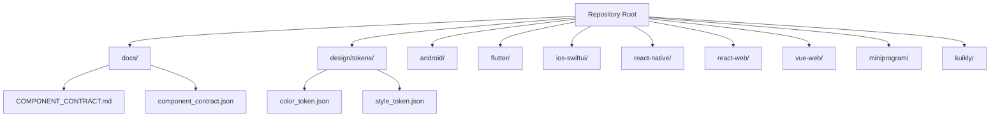
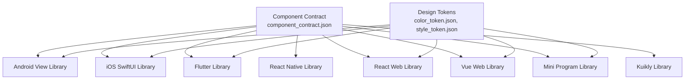
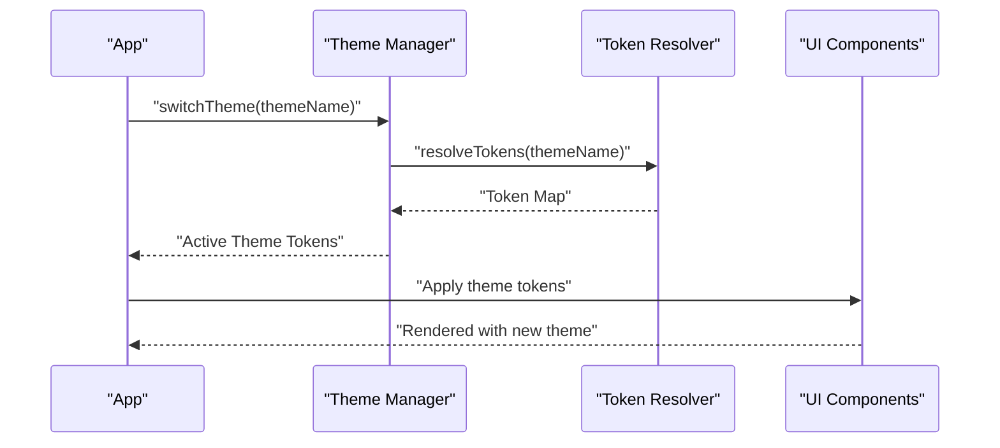
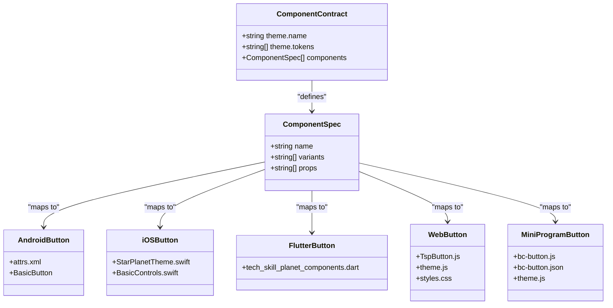
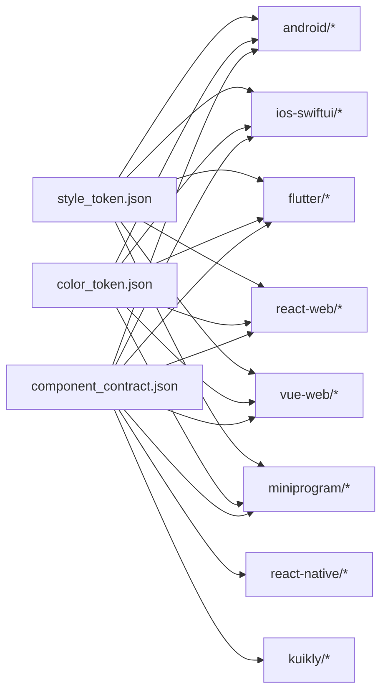

# API Reference

<cite>
**Referenced Files in This Document**
- [README.md](file://README.md)
- [COMPONENT_CONTRACT.md](file://docs/COMPONENT_CONTRACT.md)
- [component_contract.json](file://component_contract.json)
- [color_token.json](file://design/tokens/color_token.json)
- [style_token.json](file://design/tokens/style_token.json)
- [BasicThemeManager.java](file://android/library/src/main/java/com/techskillplanet/basiccontrols/theme/BasicThemeManager.java)
- [BasicTokenResolver.java](file://android/library/src/main/java/com/techskillplanet/basiccontrols/theme/BasicTokenResolver.java)
- [StarPlanetTheme.swift](file://ios-swiftui/library/Sources/TechSkillPlanetBasicControls/StarPlanetTheme.swift)
- [tech_skill_planet_components.dart](file://flutter/library/lib/tech_skill_planet_components.dart)
- [bc-button.js](file://miniprogram/library/components/bc-button/bc-button.js)
- [bc-button.json](file://miniprogram/library/components/bc-button/bc-button.json)
- [TspButton.js](file://react-native/library/src/starPlanet/components/TspButton.js)
- [TspButton.js](file://react-web/library/src/components/TspButton.js)
- [TspButton.js](file://vue-web/library/src/components/TspButton.js)
- [index.js](file://react-web/library/src/index.js)
- [theme.js](file://react-web/library/src/theme.js)
- [styles.css](file://react-web/library/src/styles.css)
- [index.js](file://vue-web/library/src/index.js)
- [theme.js](file://vue-web/library/src/theme.js)
- [styles.css](file://vue-web/library/src/styles.css)
- [theme.js](file://miniprogram/library/theme/theme.js)
- [i18n.js](file://miniprogram/library/i18n/i18n.js)
- [attrs.xml](file://android/library/src/main/res/values/attrs.xml)
- [strings.xml](file://android/library/src/main/res/values/strings.xml)
- [sample_strings.json](file://android/samples/src/main/assets/i18n/sample_strings.json)
</cite>

## Table of Contents
1. [Introduction](#introduction)
2. [Project Structure](#project-structure)
3. [Core Components](#core-components)
4. [Architecture Overview](#architecture-overview)
5. [Detailed Component Analysis](#detailed-component-analysis)
6. [Dependency Analysis](#dependency-analysis)
7. [Performance Considerations](#performance-considerations)
8. [Troubleshooting Guide](#troubleshooting-guide)
9. [Conclusion](#conclusion)
10. [Appendices](#appendices)

## Introduction
This API Reference documents the Planet Components cross-platform design system. It covers public interfaces across Android View, iOS SwiftUI, Flutter, React Native, React Web, Vue Web, WeChat Mini Program, and Kuikly platforms. The documentation includes component properties, methods, events, return values, theme management APIs, token access methods, dynamic theme switching capabilities, and cross-platform mappings derived from the component contract specification.

## Project Structure
Planet Components organizes platform implementations under dedicated folders, each containing a library and a runnable sample. Shared design tokens are centralized under design/tokens. The component contract defines standardized component names, variants, and props across platforms.

**Diagram sources**
- [README.md:11-22](file://README.md#L11-L22)
- [COMPONENT_CONTRACT.md](file://docs/COMPONENT_CONTRACT.md)
- [component_contract.json](file://component_contract.json)
- [color_token.json](file://design/tokens/color_token.json)
- [style_token.json](file://design/tokens/style_token.json)

**Section sources**
- [README.md:9-22](file://README.md#L9-L22)

## Core Components
This section summarizes the component contract and shared theme tokens that define the public API surface.

- Theme definition
  - Theme name: star_planet
  - Tokens: pageStart, pageEnd, textPrimary, textSecondary, textTertiary, surfaceRaised, borderDefault, brandPrimary, brandDark, success, warning, danger, selectedFill, activeFill

- Component catalog
  - Button: variants include primary, default, danger, text, link; props include text, variant, disabled, fullWidth, onTap
  - Additional components: Alert, Amount, Badge, BottomTab, Card, Chip, IconButton, KeyValueLabel, ListItem, Loading, Modal, Notification, OptionSheet, PinInput, Progress, Select, Stepper, StickyFooter, Switch, Tabs, TextLink, Toast, TopBar, Empty, Collapse, Divider, CodeBlock, TableView, LoadingDialog, RefreshLayout, PlanetLoading, Typewriter, I18n, EdgeToEdge, Drawable, and more

- Cross-platform mapping
  - Component names and variants are standardized via the component contract
  - Props like text, variant, disabled, fullWidth, onTap are consistently defined across platforms

**Section sources**
- [component_contract.json:1-18](file://component_contract.json#L1-L18)
- [component_contract.json:20-200](file://component_contract.json#L20-L200)
- [COMPONENT_CONTRACT.md](file://docs/COMPONENT_CONTRACT.md)

## Architecture Overview
The design system separates concerns into:
- Component implementations per platform
- Centralized theme tokens and resolution logic
- Shared component contract for API consistency
- Platform-specific packaging and distribution channels

**Diagram sources**
- [component_contract.json:1-200](file://component_contract.json#L1-L200)
- [color_token.json](file://design/tokens/color_token.json)
- [style_token.json](file://design/tokens/style_token.json)

## Detailed Component Analysis

### Button API
Standardized across platforms with consistent props and behavior.

- Properties
  - text: string
  - variant: enum among primary, default, danger, text, link
  - disabled: boolean
  - fullWidth: boolean
  - onTap: callback/event handler

- Methods and Events
  - Event: onTap invoked on press
  - No additional methods exposed in contract

- Return Values
  - No explicit return values documented in contract

- Platform-specific notes
  - Android: attributes defined in attrs.xml
  - iOS: SwiftUI component with variant mapping
  - Flutter: Dart component with variant mapping
  - Web frameworks: React/Vue wrappers around shared logic
  - Mini Program: component with JSON configuration and JS behavior
  - React Native: component with event prop

**Section sources**
- [component_contract.json:22-24](file://component_contract.json#L22-L24)
- [attrs.xml:1-200](file://android/library/src/main/res/values/attrs.xml#L1-L200)
- [bc-button.json](file://miniprogram/library/components/bc-button/bc-button.json)
- [bc-button.js](file://miniprogram/library/components/bc-button/bc-button.js)
- [TspButton.js](file://react-web/library/src/components/TspButton.js)
- [TspButton.js](file://vue-web/library/src/components/TspButton.js)
- [TspButton.js](file://react-native/library/src/starPlanet/components/TspButton.js)
- [tech_skill_planet_components.dart](file://flutter/library/lib/tech_skill_planet_components.dart)

### Theme Management APIs
Centralized theme token access and dynamic switching mechanisms.

- Token Access
  - Color tokens: brandPrimary, brandDark, success, warning, danger, pageStart, pageEnd, surfaceRaised, borderDefault, textPrimary, textSecondary, textTertiary, selectedFill, activeFill
  - Style tokens: spacing, typography, radii, shadows, transitions

- Android
  - Theme manager and token resolver classes provide token lookup and theme switching
  - Attributes and strings resources support localization and UI attributes

- iOS
  - StarPlanetTheme.swift exposes theme constants and variant mappings

- Flutter
  - Dart library exports theme-related APIs and constants

- Web
  - theme.js and styles.css define theme variables and overrides
  - Dynamic theme switching can be achieved by updating CSS variables or applying theme classes

- Mini Program
  - theme.js provides theme accessors and helpers

- Cross-platform mapping
  - Token names and categories are aligned via component_contract.json
  - Variant-to-token mapping ensures consistent visual outcomes

**Diagram sources**
- [BasicThemeManager.java](file://android/library/src/main/java/com/techskillplanet/basiccontrols/theme/BasicThemeManager.java)
- [BasicTokenResolver.java](file://android/library/src/main/java/com/techskillplanet/basiccontrols/theme/BasicTokenResolver.java)
- [StarPlanetTheme.swift](file://ios-swiftui/library/Sources/TechSkillPlanetBasicControls/StarPlanetTheme.swift)
- [tech_skill_planet_components.dart](file://flutter/library/lib/tech_skill_planet_components.dart)
- [theme.js](file://react-web/library/src/theme.js)
- [styles.css](file://react-web/library/src/styles.css)
- [theme.js](file://vue-web/library/src/theme.js)
- [styles.css](file://vue-web/library/src/styles.css)
- [theme.js](file://miniprogram/library/theme/theme.js)

**Section sources**
- [component_contract.json:1-18](file://component_contract.json#L1-L18)
- [color_token.json](file://design/tokens/color_token.json)
- [style_token.json](file://design/tokens/style_token.json)
- [BasicThemeManager.java](file://android/library/src/main/java/com/techskillplanet/basiccontrols/theme/BasicThemeManager.java)
- [BasicTokenResolver.java](file://android/library/src/main/java/com/techskillplanet/basiccontrols/theme/BasicTokenResolver.java)
- [StarPlanetTheme.swift](file://ios-swiftui/library/Sources/TechSkillPlanetBasicControls/StarPlanetTheme.swift)
- [tech_skill_planet_components.dart](file://flutter/library/lib/tech_skill_planet_components.dart)
- [theme.js](file://react-web/library/src/theme.js)
- [styles.css](file://react-web/library/src/styles.css)
- [theme.js](file://vue-web/library/src/theme.js)
- [styles.css](file://vue-web/library/src/styles.css)
- [theme.js](file://miniprogram/library/theme/theme.js)

### Cross-Platform API Mapping
The component contract defines a canonical API surface. Platform-specific implementations expose the same props and events while adapting to native conventions.

**Diagram sources**
- [component_contract.json:1-200](file://component_contract.json#L1-L200)
- [attrs.xml:1-200](file://android/library/src/main/res/values/attrs.xml#L1-L200)
- [StarPlanetTheme.swift](file://ios-swiftui/library/Sources/TechSkillPlanetBasicControls/StarPlanetTheme.swift)
- [tech_skill_planet_components.dart](file://flutter/library/lib/tech_skill_planet_components.dart)
- [TspButton.js](file://react-web/library/src/components/TspButton.js)
- [TspButton.js](file://vue-web/library/src/components/TspButton.js)
- [bc-button.js](file://miniprogram/library/components/bc-button/bc-button.js)
- [bc-button.json](file://miniprogram/library/components/bc-button/bc-button.json)

**Section sources**
- [component_contract.json:20-200](file://component_contract.json#L20-L200)
- [README.md:11-22](file://README.md#L11-L22)

### Platform-Specific Variations and Compatibility
- Android
  - Uses XML attributes and resource-based strings
  - Edge-to-edge and i18n helpers available
- iOS
  - SwiftUI-based implementation with theme integration
- Flutter
  - Dart-based component library with theme exports
- Web (React/Vue)
  - Wrapper components with CSS-in-JS or CSS variables
- Mini Program
  - Component-based with JSON configuration and theme helpers
- React Native
  - Native component wrappers with event props

**Section sources**
- [README.md:11-22](file://README.md#L11-L22)
- [attrs.xml:1-200](file://android/library/src/main/res/values/attrs.xml#L1-L200)
- [strings.xml](file://android/library/src/main/res/values/strings.xml)
- [sample_strings.json](file://android/samples/src/main/assets/i18n/sample_strings.json)
- [i18n.js](file://miniprogram/library/i18n/i18n.js)

## Dependency Analysis
The component contract acts as the single source of truth for component APIs. Libraries depend on shared tokens and contract definitions.

**Diagram sources**
- [component_contract.json:1-200](file://component_contract.json#L1-L200)
- [color_token.json](file://design/tokens/color_token.json)
- [style_token.json](file://design/tokens/style_token.json)

**Section sources**
- [component_contract.json:1-200](file://component_contract.json#L1-L200)

## Performance Considerations
- Prefer token-based theming to minimize layout thrashing during theme switches
- Batch prop updates in web frameworks to reduce re-renders
- Use platform-native event handlers efficiently (e.g., Android onClick, iOS @IBAction)
- Avoid unnecessary re-initialization of theme managers across platforms

## Troubleshooting Guide
- Theme not applied
  - Verify token names match component_contract.json
  - Confirm theme.js/css variables are correctly set in web platforms
  - Ensure Android theme manager is initialized and tokens resolved
- Props not working
  - Check component prop names against component_contract.json
  - Validate platform-specific attribute mappings (e.g., attrs.xml for Android)
- Mini Program component not rendering
  - Confirm component JSON configuration exists and is loaded
  - Verify theme.js helpers are included

**Section sources**
- [component_contract.json:1-200](file://component_contract.json#L1-L200)
- [attrs.xml:1-200](file://android/library/src/main/res/values/attrs.xml#L1-L200)
- [theme.js](file://react-web/library/src/theme.js)
- [styles.css](file://react-web/library/src/styles.css)
- [theme.js](file://vue-web/library/src/theme.js)
- [styles.css](file://vue-web/library/src/styles.css)
- [theme.js](file://miniprogram/library/theme/theme.js)

## Conclusion
Planet Components provides a unified component contract and shared theme tokens across platforms. By adhering to the documented APIs and leveraging platform-specific adapters, teams can maintain consistent UI behavior and theme management while respecting native conventions.

## Appendices

### Migration and Compatibility Matrix
- Version alignment
  - Align component names, variants, and props with component_contract.json
  - Maintain backward-compatible prop names where feasible
- Platform targets
  - Android: Gradle/Maven artifacts
  - iOS: Swift Package Manager
  - Flutter: pub.dev
  - Web: npm packages (React/Vue)
  - Mini Program: npm/miniprogram package
  - React Native: npm package

**Section sources**
- [README.md:11-22](file://README.md#L11-L22)
- [COMPONENT_CONTRACT.md](file://docs/COMPONENT_CONTRACT.md)