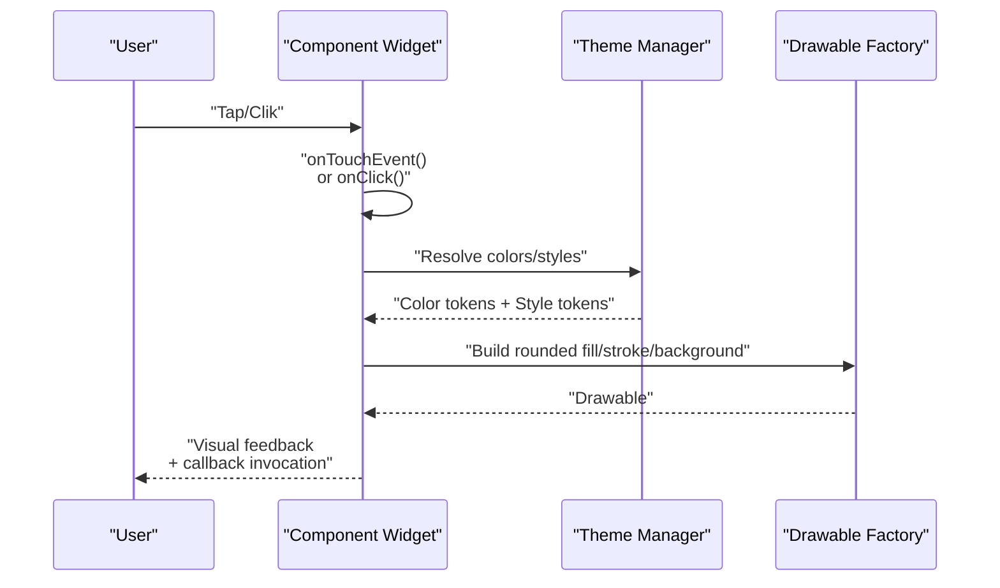
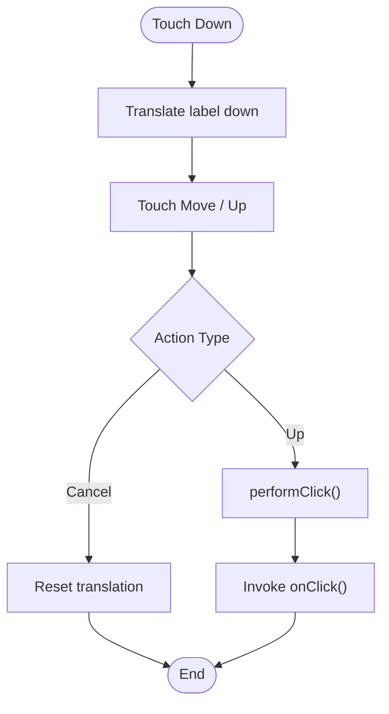
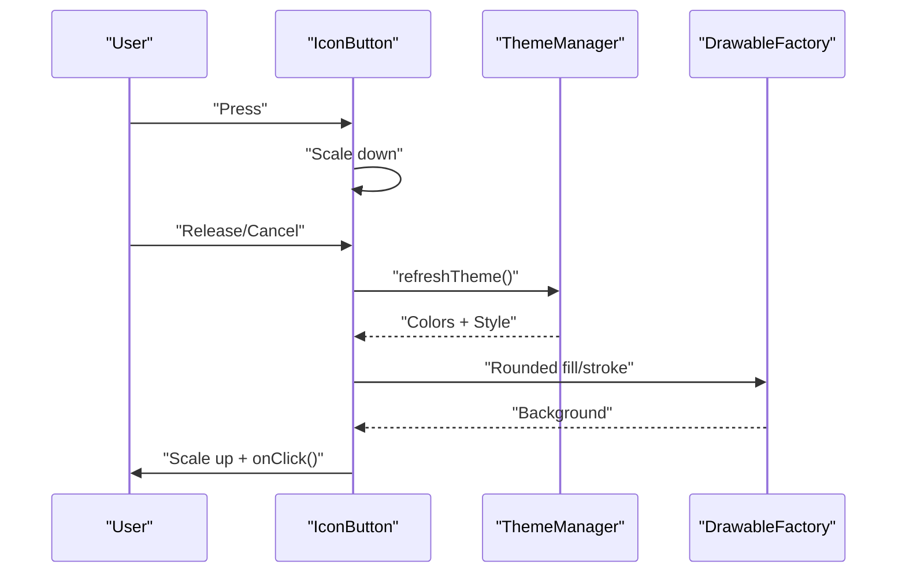
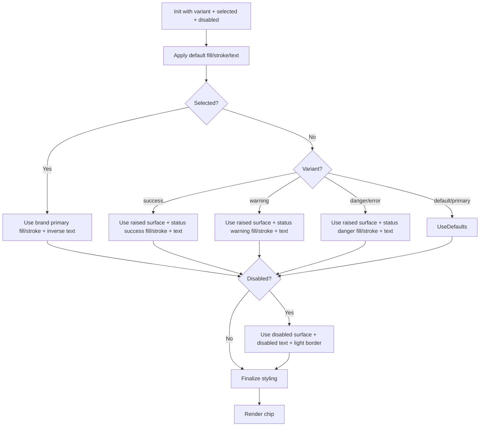
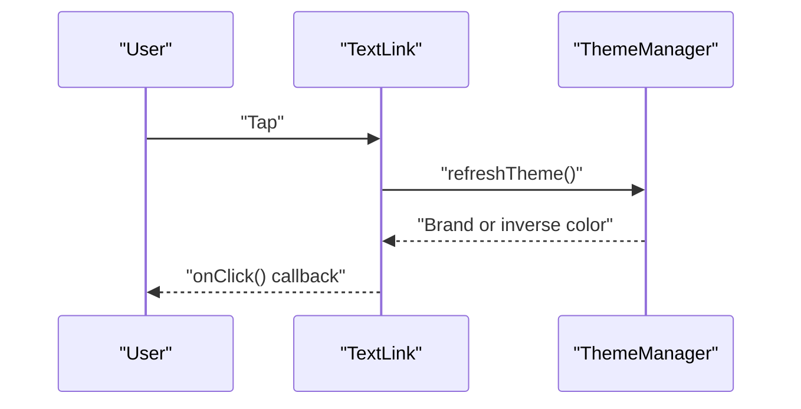
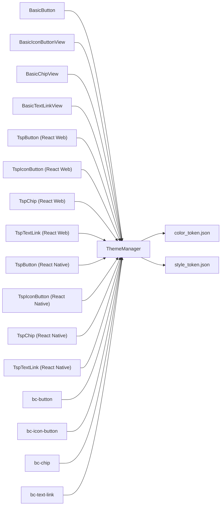

# Action Components

<cite>
**Referenced Files in This Document**
- [android BasicButton.java](file://android/library/src/main/java/com/techskillplanet/basiccontrols/widget/BasicButton.java)
- [android BasicIconButtonView.java](file://android/library/src/main/java/com/techskillplanet/basiccontrols/widget/BasicIconButtonView.java)
- [android BasicChipView.java](file://android/library/src/main/java/com/techskillplanet/basiccontrols/widget/BasicChipView.java)
- [android BasicTextLinkView.java](file://android/library/src/main/java/com/techskillplanet/basiccontrols/widget/BasicTextLinkView.java)
- [react-web TspButton.js](file://react-web/library/src/components/TspButton.js)
- [react-web TspIconButton.js](file://react-web/library/src/components/TspIconButton.js)
- [react-web TspChip.js](file://react-web/library/src/components/TspChip.js)
- [react-web TspTextLink.js](file://react-web/library/src/components/TspTextLink.js)
- [react-native TspButton.js](file://react-native/library/src/starPlanet/components/TspButton.js)
- [react-native TspIconButton.js](file://react-native/library/src/starPlanet/components/TspIconButton.js)
- [react-native TspChip.js](file://react-native/library/src/starPlanet/components/TspChip.js)
- [react-native TspTextLink.js](file://react-native/library/src/starPlanet/components/TspTextLink.js)
- [vue-web TspButton.js](file://vue-web/library/src/components/TspButton.js)
- [vue-web TspIconButton.js](file://vue-web/library/src/components/TspIconButton.js)
- [vue-web TspChip.js](file://vue-web/library/src/components/TspChip.js)
- [vue-web TspTextLink.js](file://vue-web/library/src/components/TspTextLink.js)
- [miniprogram bc-button.js](file://miniprogram/library/components/bc-button/bc-button.js)
- [miniprogram bc-icon-button.js](file://miniprogram/library/components/bc-icon-button/bc-icon-button.js)
- [miniprogram bc-chip.js](file://miniprogram/library/components/bc-chip/bc-chip.js)
- [miniprogram bc-text-link.js](file://miniprogram/library/components/bc-text-link/bc-text-link.js)
- [design tokens color_token.json](file://design/tokens/color_token.json)
- [design tokens style_token.json](file://design/tokens/style_token.json)
</cite>

## Table of Contents
1. [Introduction](#introduction)
2. [Project Structure](#project-structure)
3. [Core Components](#core-components)
4. [Architecture Overview](#architecture-overview)
5. [Detailed Component Analysis](#detailed-component-analysis)
6. [Dependency Analysis](#dependency-analysis)
7. [Performance Considerations](#performance-considerations)
8. [Troubleshooting Guide](#troubleshooting-guide)
9. [Conclusion](#conclusion)
10. [Appendices](#appendices)

## Introduction
This document provides comprehensive documentation for Action Components across platforms: Button, IconButton, Chip, and TextLink. It covers component properties, variants, events, styling via design tokens, interactive behaviors, accessibility considerations, and platform-specific implementations. It also includes usage guidance, composition patterns, and integration recommendations for building consistent, accessible, and visually coherent interactive user interfaces.

## Project Structure
The Action Components are implemented consistently across platforms with a unified contract:
- Android: native widgets under android
- Web frameworks: React Web, Vue Web
- Mobile frameworks: React Native
- Mini Program: WeChat Mini Program components
- Design tokens: centralized color and style definitions

```mermaid
graph TB
subgraph "Android"
AB["BasicButton"]
AI["BasicIconButtonView"]
AC["BasicChipView"]
AT["BasicTextLinkView"]
end
subgraph "Web"
RB["TspButton (React Web)"]
RI["TspIconButton (React Web)"]
RC["TspChip (React Web)"]
RT["TspTextLink (React Web)"]
VB["TspButton (Vue Web)"]
VI["TspIconButton (Vue Web)"]
VC["TspChip (Vue Web)"]
VT["TspTextLink (Vue Web)"]
end
subgraph "Mobile"
RNB["TspButton (React Native)"]
RNI["TspIconButton (React Native)"]
RNC["TspChip (React Native)"]
RNT["TspTextLink (React Native)"]
end
subgraph "Mini Program"
MPB["bc-button"]
MPI["bc-icon-button"]
MPC["bc-chip"]
MPT["bc-text-link"]
end
subgraph "Design Tokens"
CT["color_token.json"]
ST["style_token.json"]
end
AB --> CT
AB --> ST
AI --> CT
AI --> ST
AC --> CT
AC --> ST
AT --> CT
AT --> ST
RB --> CT
RB --> ST
RI --> CT
RI --> ST
RC --> CT
RC --> ST
RT --> CT
RT --> ST
VB --> CT
VB --> ST
VI --> CT
VI --> ST
VC --> CT
VC --> ST
VT --> CT
VT --> ST
RNB --> CT
RNB --> ST
RNI --> CT
RNI --> ST
RNC --> CT
RNC --> ST
RNT --> CT
RNT --> ST
MPB --> CT
MPB --> ST
MPI --> CT
MPI --> ST
MPC --> CT
MPC --> ST
MPT --> CT
MPT --> ST
```

**Diagram sources**
- [android BasicButton.java:30-171](file://android/library/src/main/java/com/techskillplanet/basiccontrols/widget/BasicButton.java#L30-L171)
- [android BasicIconButtonView.java:22-62](file://android/library/src/main/java/com/techskillplanet/basiccontrols/widget/BasicIconButtonView.java#L22-L62)
- [android BasicChipView.java:22-101](file://android/library/src/main/java/com/techskillplanet/basiccontrols/widget/BasicChipView.java#L22-L101)
- [android BasicTextLinkView.java:19-49](file://android/library/src/main/java/com/techskillplanet/basiccontrols/widget/BasicTextLinkView.java#L19-L49)
- [react-web TspButton.js](file://react-web/library/src/components/TspButton.js)
- [react-web TspIconButton.js](file://react-web/library/src/components/TspIconButton.js)
- [react-web TspChip.js](file://react-web/library/src/components/TspChip.js)
- [react-web TspTextLink.js](file://react-web/library/src/components/TspTextLink.js)
- [react-native TspButton.js](file://react-native/library/src/starPlanet/components/TspButton.js)
- [react-native TspIconButton.js](file://react-native/library/src/starPlanet/components/TspIconButton.js)
- [react-native TspChip.js](file://react-native/library/src/starPlanet/components/TspChip.js)
- [react-native TspTextLink.js](file://react-native/library/src/starPlanet/components/TspTextLink.js)
- [vue-web TspButton.js](file://vue-web/library/src/components/TspButton.js)
- [vue-web TspIconButton.js](file://vue-web/library/src/components/TspIconButton.js)
- [vue-web TspChip.js](file://vue-web/library/src/components/TspChip.js)
- [vue-web TspTextLink.js](file://vue-web/library/src/components/TspTextLink.js)
- [miniprogram bc-button.js](file://miniprogram/library/components/bc-button/bc-button.js)
- [miniprogram bc-icon-button.js](file://miniprogram/library/components/bc-icon-button/bc-icon-button.js)
- [miniprogram bc-chip.js](file://miniprogram/library/components/bc-chip/bc-chip.js)
- [miniprogram bc-text-link.js](file://miniprogram/library/components/bc-text-link/bc-text-link.js)
- [design tokens color_token.json](file://design/tokens/color_token.json)
- [design tokens style_token.json](file://design/tokens/style_token.json)

**Section sources**
- [android BasicButton.java:30-171](file://android/library/src/main/java/com/techskillplanet/basiccontrols/widget/BasicButton.java#L30-L171)
- [android BasicIconButtonView.java:22-62](file://android/library/src/main/java/com/techskillplanet/basiccontrols/widget/BasicIconButtonView.java#L22-L62)
- [android BasicChipView.java:22-101](file://android/library/src/main/java/com/techskillplanet/basiccontrols/widget/BasicChipView.java#L22-L101)
- [android BasicTextLinkView.java:19-49](file://android/library/src/main/java/com/techskillplanet/basiccontrols/widget/BasicTextLinkView.java#L19-L49)
- [design tokens color_token.json](file://design/tokens/color_token.json)
- [design tokens style_token.json](file://design/tokens/style_token.json)

## Core Components
This section summarizes the Action Components’ capabilities, properties, and variants across platforms.

- Button
  - Purpose: Prominent actions with raised island-style visuals and press feedback.
  - Variants: default, primary, danger, text, link.
  - Properties: variant, text, disabled, selection state.
  - Events: click.
  - Accessibility: focusable, clickable, disabled state updates semantics.
  - Platform specifics:
    - Android: layered shadow and label views, press translation Y, minimum width, raised shadow toggle.
    - Web/Mobile/Mini Program: similar variant-driven styling and interaction model.

- IconButton
  - Purpose: Compact action button with icon glyphs.
  - Variants: default, primary.
  - Properties: variant, icon text, disabled.
  - Events: click.
  - Accessibility: focusable, clickable, scaling feedback on press.
  - Platform specifics:
    - Android: TextView-based with rounded fill/stroke background and padding.
    - Web/Mobile/Mini Program: variant-driven color and sizing.

- Chip
  - Purpose: Lightweight tag-like selection/control element (filters, statuses).
  - Variants: default, primary, success, warning, danger/error.
  - Properties: variant, text, selected, disabled.
  - Events: click/toggle selection.
  - Accessibility: focusable, selection state reflected in visuals.
  - Platform specifics:
    - Android: TextView-based with pill shape, min-height, and variant-selected logic.
    - Web/Mobile/Mini Program: variant-driven colors and paddings.

- TextLink
  - Purpose: Inline navigational or action text.
  - Variants: default, inverse.
  - Properties: variant, text.
  - Events: click.
  - Accessibility: focusable, bold text, brand color for default.
  - Platform specifics:
    - Android: TextView-based with variant color and typography.
    - Web/Mobile/Mini Program: variant-driven color and font weight.

**Section sources**
- [android BasicButton.java:31-101](file://android/library/src/main/java/com/techskillplanet/basiccontrols/widget/BasicButton.java#L31-L101)
- [android BasicIconButtonView.java:23-46](file://android/library/src/main/java/com/techskillplanet/basiccontrols/widget/BasicIconButtonView.java#L23-L46)
- [android BasicChipView.java:23-65](file://android/library/src/main/java/com/techskillplanet/basiccontrols/widget/BasicChipView.java#L23-L65)
- [android BasicTextLinkView.java:20-41](file://android/library/src/main/java/com/techskillplanet/basiccontrols/widget/BasicTextLinkView.java#L20-L41)

## Architecture Overview
All Action Components follow a consistent pattern:
- Unified variant system mapped to design tokens.
- Event handling routed through platform-native click mechanisms.
- Theme-aware rendering via color and style token resolution.
- Cross-platform parity achieved through shared property names and behaviors.

**Diagram sources**
- [android BasicButton.java:174-194](file://android/library/src/main/java/com/techskillplanet/basiccontrols/widget/BasicButton.java#L174-L194)
- [android BasicIconButtonView.java:64-77](file://android/library/src/main/java/com/techskillplanet/basiccontrols/widget/BasicIconButtonView.java#L64-L77)
- [android BasicChipView.java:68-101](file://android/library/src/main/java/com/techskillplanet/basiccontrols/widget/BasicChipView.java#L68-L101)
- [android BasicTextLinkView.java:43-49](file://android/library/src/main/java/com/techskillplanet/basiccontrols/widget/BasicTextLinkView.java#L43-L49)

## Detailed Component Analysis

### Button
- Properties
  - variant: default | primary | danger | text | link
  - text: CharSequence
  - disabled: boolean
  - selected: boolean (no-op for Button)
- Events
  - onClick: invoked on release after press
- Interactions
  - Press-down: label translates downward for depth cue.
  - Release: triggers performClick and invokes registered listener.
  - Disabled: disables interaction and updates color/stroke.
- Styling
  - Variant mapping to background, text, and stroke via theme manager.
  - Pill-shaped rounded corners and radius from style tokens.
  - Optional raised island shadow controlled by style flag.
  - Minimum width and button height derived from style tokens.
- Accessibility
  - Focusable and clickable; disabled state reflects in visuals.
- Platform notes
  - Android: layered shadow and label views; intercepts touch to prevent child stealing; measures and lays out with optional lift.
  - Web/Mobile/Mini Program: variant-driven color and typography; click behavior consistent.

**Diagram sources**
- [android BasicButton.java:174-194](file://android/library/src/main/java/com/techskillplanet/basiccontrols/widget/BasicButton.java#L174-L194)

**Section sources**
- [android BasicButton.java:31-101](file://android/library/src/main/java/com/techskillplanet/basiccontrols/widget/BasicButton.java#L31-L101)
- [android BasicButton.java:125-171](file://android/library/src/main/java/com/techskillplanet/basiccontrols/widget/BasicButton.java#L125-L171)
- [android BasicButton.java:197-233](file://android/library/src/main/java/com/techskillplanet/basiccontrols/widget/BasicButton.java#L197-L233)
- [android BasicButton.java:236-253](file://android/library/src/main/java/com/techskillplanet/basiccontrols/widget/BasicButton.java#L236-L253)

### IconButton
- Properties
  - variant: default | primary
  - iconText: CharSequence (glyph or short text)
  - disabled: boolean
- Events
  - onClick
- Interactions
  - Press-down: scale down slightly for tactile feedback.
  - Release/Cancel: restore scale.
- Styling
  - Rounded fill/stroke background; pill radius; hairline border.
  - Inner padding from style tokens; text size from style tokens.
  - Color depends on variant (brand subtle vs raised surface).
- Accessibility
  - Focusable and clickable; disabled visuals updated.
- Platform notes
  - Android: TextView-based; reads attributes via BasicView styleable; applies theme on creation and refresh.

**Diagram sources**
- [android BasicIconButtonView.java:64-77](file://android/library/src/main/java/com/techskillplanet/basiccontrols/widget/BasicIconButtonView.java#L64-L77)
- [android BasicIconButtonView.java:52-62](file://android/library/src/main/java/com/techskillplanet/basiccontrols/widget/BasicIconButtonView.java#L52-L62)

**Section sources**
- [android BasicIconButtonView.java:23-46](file://android/library/src/main/java/com/techskillplanet/basiccontrols/widget/BasicIconButtonView.java#L23-L46)
- [android BasicIconButtonView.java:52-62](file://android/library/src/main/java/com/techskillplanet/basiccontrols/widget/BasicIconButtonView.java#L52-L62)
- [android BasicIconButtonView.java:64-77](file://android/library/src/main/java/com/techskillplanet/basiccontrols/widget/BasicIconButtonView.java#L64-L77)
- [android BasicIconButtonView.java:79-94](file://android/library/src/main/java/com/techskillplanet/basiccontrols/widget/BasicIconButtonView.java#L79-L94)

### Chip
- Properties
  - variant: default | primary | success | warning | danger | error
  - text: CharSequence
  - selected: boolean
  - disabled: boolean
- Events
  - onClick toggles selection (platform-dependent behavior)
- Interactions
  - Selected state: brand primary background with inverse text.
  - Variant overrides: success/warning/danger/error with status colors.
  - Disabled: surfaces disabled colors and light borders.
- Styling
  - Pill shape, min-height, horizontal padding from style tokens.
  - Text size small; secondary text color by default.
- Accessibility
  - Focusable; selection state reflected in visuals.
- Platform notes
  - Android: TextView-based; reads variant, text, selected, disabled from attributes; refreshTheme applies variant and selection logic.

**Diagram sources**
- [android BasicChipView.java:68-101](file://android/library/src/main/java/com/techskillplanet/basiccontrols/widget/BasicChipView.java#L68-L101)

**Section sources**
- [android BasicChipView.java:44-65](file://android/library/src/main/java/com/techskillplanet/basiccontrols/widget/BasicChipView.java#L44-L65)
- [android BasicChipView.java:68-101](file://android/library/src/main/java/com/techskillplanet/basiccontrols/widget/BasicChipView.java#L68-L101)
- [android BasicChipView.java:104-122](file://android/library/src/main/java/com/techskillplanet/basiccontrols/widget/BasicChipView.java#L104-L122)

### TextLink
- Properties
  - variant: default | inverse
  - text: CharSequence
- Events
  - onClick
- Interactions
  - Bold text, brand primary color for default; inverse text color for inverse variant.
- Styling
  - Text size medium; bold typeface; variant-driven color.
- Accessibility
  - Focusable; appropriate contrast per variant.
- Platform notes
  - Android: TextView-based; reads variant and text from attributes; refreshTheme applies colors and typography.

**Diagram sources**
- [android BasicTextLinkView.java:43-49](file://android/library/src/main/java/com/techskillplanet/basiccontrols/widget/BasicTextLinkView.java#L43-L49)

**Section sources**
- [android BasicTextLinkView.java:38-41](file://android/library/src/main/java/com/techskillplanet/basiccontrols/widget/BasicTextLinkView.java#L38-L41)
- [android BasicTextLinkView.java:43-49](file://android/library/src/main/java/com/techskillplanet/basiccontrols/widget/BasicTextLinkView.java#L43-L49)
- [android BasicTextLinkView.java:51-66](file://android/library/src/main/java/com/techskillplanet/basiccontrols/widget/BasicTextLinkView.java#L51-L66)

## Dependency Analysis
- Internal dependencies
  - All Android components depend on theme manager for colors and style tokens and on drawable factory for rounded backgrounds.
  - Web/Mobile/Mini Program components rely on shared theme and style systems (referenced via component files).
- External dependencies
  - Android: Android framework widgets and resources.
  - Web/Mobile: React/Vue runtime and platform-specific bridges.
  - Mini Program: WeChat Mini Program component lifecycle and template system.

**Diagram sources**
- [android BasicButton.java:125-171](file://android/library/src/main/java/com/techskillplanet/basiccontrols/widget/BasicButton.java#L125-L171)
- [android BasicIconButtonView.java:52-62](file://android/library/src/main/java/com/techskillplanet/basiccontrols/widget/BasicIconButtonView.java#L52-L62)
- [android BasicChipView.java:68-101](file://android/library/src/main/java/com/techskillplanet/basiccontrols/widget/BasicChipView.java#L68-L101)
- [android BasicTextLinkView.java:43-49](file://android/library/src/main/java/com/techskillplanet/basiccontrols/widget/BasicTextLinkView.java#L43-L49)
- [design tokens color_token.json](file://design/tokens/color_token.json)
- [design tokens style_token.json](file://design/tokens/style_token.json)

**Section sources**
- [android BasicButton.java:125-171](file://android/library/src/main/java/com/techskillplanet/basiccontrols/widget/BasicButton.java#L125-L171)
- [android BasicIconButtonView.java:52-62](file://android/library/src/main/java/com/techskillplanet/basiccontrols/widget/BasicIconButtonView.java#L52-L62)
- [android BasicChipView.java:68-101](file://android/library/src/main/java/com/techskillplanet/basiccontrols/widget/BasicChipView.java#L68-L101)
- [android BasicTextLinkView.java:43-49](file://android/library/src/main/java/com/techskillplanet/basiccontrols/widget/BasicTextLinkView.java#L43-L49)

## Performance Considerations
- Prefer variant-driven styling over dynamic inline styles to leverage theme caching and reduce reflows.
- Minimize nested layouts around interactive components to avoid layout thrashing during press animations.
- On mobile/web, batch DOM updates and avoid frequent re-layouts in tight loops.
- Use stable keys and memoization in frameworks to prevent unnecessary re-renders of interactive components.

## Troubleshooting Guide
- Button not responding
  - Ensure the component is enabled and clickable; verify that child views are not intercepting touches.
  - Confirm that the click listener is attached and not overridden by parent containers.
- Press feedback missing
  - Verify that touch interception and translation logic are active and not blocked by parent containers.
- Chip selection state not visible
  - Ensure selection state is applied before theme refresh and that variant does not override selection visuals.
- TextLink color incorrect
  - Confirm variant value and that theme refresh is called after variant change.
- Disabled state not applied
  - Ensure disabled flag is set and theme refresh is invoked; verify that disabled colors are present in tokens.

**Section sources**
- [android BasicButton.java:70-87](file://android/library/src/main/java/com/techskillplanet/basiccontrols/widget/BasicButton.java#L70-L87)
- [android BasicButton.java:114-118](file://android/library/src/main/java/com/techskillplanet/basiccontrols/widget/BasicButton.java#L114-L118)
- [android BasicChipView.java:55-65](file://android/library/src/main/java/com/techskillplanet/basiccontrols/widget/BasicChipView.java#L55-L65)
- [android BasicTextLinkView.java:38-41](file://android/library/src/main/java/com/techskillplanet/basiccontrols/widget/BasicTextLinkView.java#L38-L41)

## Conclusion
The Action Components provide a cohesive, cross-platform foundation for interactive UI elements. By adhering to the variant system and theme-driven styling, developers can achieve consistent behavior and appearance across Android, web frameworks, mobile frameworks, and Mini Program environments. Proper use of selection, disabled, and variant states ensures accessible and predictable user experiences.

## Appendices

### Property Reference Summary
- Button
  - variant: default | primary | danger | text | link
  - text: CharSequence
  - disabled: boolean
  - selected: boolean (no-op)
  - Events: onClick
- IconButton
  - variant: default | primary
  - iconText: CharSequence
  - disabled: boolean
  - Events: onClick
- Chip
  - variant: default | primary | success | warning | danger | error
  - text: CharSequence
  - selected: boolean
  - disabled: boolean
  - Events: onClick (toggle selection)
- TextLink
  - variant: default | inverse
  - text: CharSequence
  - Events: onClick

### Composition Patterns and Integration Guidelines
- Group related actions with consistent variants to maintain visual hierarchy.
- Use IconButton for compact actions where space is constrained; pair with Tooltip for clarity.
- Use Chip for multi-selection filters and status indicators; support keyboard navigation and ARIA roles where applicable.
- Use Button for primary actions; reserve primary and danger variants for important or destructive actions.
- Ensure sufficient touch target sizes and spacing; apply disabled states to prevent mis-taps.
- Integrate with form validation and submission flows; provide immediate feedback on action completion.