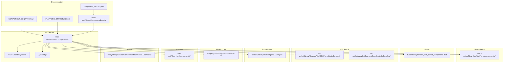
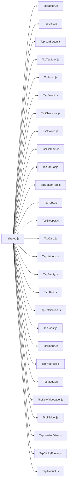

# Component Catalog

<cite>
**Referenced Files in This Document**
- [README.md](file://README.md)
- [COMPONENT_CONTRACT.md](file://docs/COMPONENT_CONTRACT.md)
- [PLATFORM_STRUCTURE.md](file://docs/PLATFORM_STRUCTURE.md)
- [componentDocs.js](file://react-web/shared/componentDocs.js)
- [component_contract.json](file://component_contract.json)
- [TspButton.js](file://react-web/library/src/components/TspButton.js)
- [TspChip.js](file://react-web/library/src/components/TspChip.js)
- [TspIconButton.js](file://react-web/library/src/components/TspIconButton.js)
- [TspTextLink.js](file://react-web/library/src/components/TspTextLink.js)
- [TspInput.js](file://react-web/library/src/components/TspInput.js)
- [TspSelect.js](file://react-web/library/src/components/TspSelect.js)
- [TspCheckbox.js](file://react-web/library/src/components/TspCheckbox.js)
- [TspSwitch.js](file://react-web/library/src/components/TspSwitch.js)
- [TspPinInput.js](file://react-web/library/src/components/TspPinInput.js)
- [TspTopBar.js](file://react-web/library/src/components/TspTopBar.js)
- [TspBottomTab.js](file://react-web/library/src/components/TspBottomTab.js)
- [TspTabs.js](file://react-web/library/src/components/TspTabs.js)
- [TspStepper.js](file://react-web/library/src/components/TspStepper.js)
- [TspCard.js](file://react-web/library/src/components/TspCard.js)
- [TspListItem.js](file://react-web/library/src/components/TspListItem.js)
- [TspEmpty.js](file://react-web/library/src/components/TspEmpty.js)
- [TspAlert.js](file://react-web/library/src/components/TspAlert.js)
- [TspNotification.js](file://react-web/library/src/components/TspNotification.js)
- [TspToast.js](file://react-web/library/src/components/TspToast.js)
- [TspBadge.js](file://react-web/library/src/components/TspBadge.js)
- [TspProgress.js](file://react-web/library/src/components/TspProgress.js)
- [TspModal.js](file://react-web/library/src/components/TspModal.js)
- [TspKeyValueLabel.js](file://react-web/library/src/components/TspKeyValueLabel.js)
- [TspDivider.js](file://react-web/library/src/components/TspDivider.js)
- [TspLoadingView.js](file://react-web/library/src/components/TspLoadingView.js)
- [TspStickyFooter.js](file://react-web/library/src/components/TspStickyFooter.js)
- [TspAmount.js](file://react-web/library/src/components/TspAmount.js)
- [TspOptionSheet.js](file://react-web/library/src/components/TspOptionSheet.js)
- [TspTypography.js](file://react-web/library/src/components/_shared.js)
- [TspButton.js](file://android/library/src/main/java/com/techskillplanet/basiccontrols/widget/BasicButton.java)
- [TspChipView.java](file://android/library/src/main/java/com/techskillplanet/basiccontrols/widget/BasicChipView.java)
- [TspIconButtonView.java](file://android/library/src/main/java/com/techskillplanet/basiccontrols/widget/BasicIconButtonView.java)
- [TspTextLinkView.java](file://android/library/src/main/java/com/techskillplanet/basiccontrols/widget/BasicTextLinkView.java)
- [TspInputView.java](file://android/library/src/main/java/com/techskillplanet/basiccontrols/widget/BasicInputView.java)
- [TspSelectView.java](file://android/library/src/main/java/com/techskillplanet/basiccontrols/widget/BasicSelectView.java)
- [TspCheckboxView.java](file://android/library/src/main/java/com/techskillplanet/basiccontrols/widget/BasicCheckboxView.java)
- [TspSwitchView.java](file://android/library/src/main/java/com/techskillplanet/basiccontrols/widget/BasicSwitchView.java)
- [TspPinInputView.java](file://android/library/src/main/java/com/techskillplanet/basiccontrols/widget/BasicPinInputView.java)
- [TspTopBarView.java](file://android/library/src/main/java/com/techskillplanet/basiccontrols/widget/BasicTopBarView.java)
- [TspBottomTabView.java](file://android/library/src/main/java/com/techskillplanet/basiccontrols/widget/BasicBottomTabView.java)
- [TspTabsView.java](file://android/library/src/main/java/com/techskillplanet/basiccontrols/widget/BasicTabsView.java)
- [TspStepperView.java](file://android/library/src/main/java/com/techskillplanet/basiccontrols/widget/BasicStepperView.java)
- [TspCardView.java](file://android/library/src/main/java/com/techskillplanet/basiccontrols/widget/BasicCardView.java)
- [TspListItemView.java](file://android/library/src/main/java/com/techskillplanet/basiccontrols/widget/BasicListItemView.java)
- [TspEmptyView.java](file://android/library/src/main/java/com/techskillplanet/basiccontrols/widget/BasicEmptyView.java)
- [TspAlertView.java](file://android/library/src/main/java/com/techskillplanet/basiccontrols/widget/BasicAlertView.java)
- [TspNotificationView.java](file://android/library/src/main/java/com/techskillplanet/basiccontrols/widget/BasicNotificationView.java)
- [TspToast.java](file://android/library/src/main/java/com/techskillplanet/basiccontrols/widget/BasicToast.java)
- [TspBadgeView.java](file://android/library/src/main/java/com/techskillplanet/basiccontrols/widget/BasicBadgeView.java)
- [TspProgressView.java](file://android/library/src/main/java/com/techskillplanet/basiccontrols/widget/BasicProgressView.java)
- [TspModalDialog.java](file://android/library/src/main/java/com/techskillplanet/basiccontrols/widget/BasicModalDialog.java)
- [TspKeyValueLabelView.java](file://android/library/src/main/java/com/techskillplanet/basiccontrols/widget/BasicKeyValueLabelView.java)
- [TspDividerView.java](file://android/library/src/main/java/com/techskillplanet/basiccontrols/widget/BasicDividerView.java)
- [TspLoadingView.java](file://android/library/src/main/java/com/techskillplanet/basiccontrols/widget/BasicLoadingView.java)
- [TspStickyFooterView.java](file://android/library/src/main/java/com/techskillplanet/basiccontrols/widget/BasicStickyFooterView.java)
- [TspAmountView.java](file://android/library/src/main/java/com/techskillplanet/basiccontrols/widget/BasicAmountView.java)
- [TspButton.js](file://miniprogram/library/components/bc-button/bc-button.js)
- [TspChip.js](file://miniprogram/library/components/bc-chip/bc-chip.js)
- [TspIconButton.js](file://miniprogram/library/components/bc-icon-button/bc-icon-button.js)
- [TspTextLink.js](file://miniprogram/library/components/bc-text-link/bc-text-link.js)
- [TspInput.js](file://miniprogram/library/components/bc-input/bc-input.js)
- [TspSelect.js](file://miniprogram/library/components/bc-select/bc-select.js)
- [TspCheckbox.js](file://miniprogram/library/components/bc-checkbox/bc-checkbox.js)
- [TspSwitch.js](file://miniprogram/library/components/bc-switch/bc-switch.js)
- [TspPinInput.js](file://miniprogram/library/components/bc-pin-input/bc-pin-input.js)
- [TspTopBar.js](file://miniprogram/library/components/bc-top-bar/bc-top-bar.js)
- [TspBottomTab.js](file://miniprogram/library/components/bc-bottom-tab/bc-bottom-tab.js)
- [TspTabs.js](file://miniprogram/library/components/bc-tabs/bc-tabs.js)
- [TspStepper.js](file://miniprogram/library/components/bc-stepper/bc-stepper.js)
- [TspCard.js](file://miniprogram/library/components/bc-card/bc-card.js)
- [TspListItem.js](file://miniprogram/library/components/bc-list-item/bc-list-item.js)
- [TspEmpty.js](file://miniprogram/library/components/bc-empty/bc-empty.js)
- [TspAlert.js](file://miniprogram/library/components/bc-alert/bc-alert.js)
- [TspNotification.js](file://miniprogram/library/components/bc-notification/bc-notification.js)
- [TspToast.js](file://miniprogram/library/components/bc-toast/bc-toast.js)
- [TspBadge.js](file://miniprogram/library/components/bc-badge/bc-badge.js)
- [TspProgress.js](file://miniprogram/library/components/bc-progress/bc-progress.js)
- [TspModal.js](file://miniprogram/library/components/bc-modal/bc-modal.js)
- [TspKeyValueLabel.js](file://miniprogram/library/components/bc-key-value-label/bc-key-value-label.js)
- [TspDivider.js](file://miniprogram/library/components/bc-divider/bc-divider.js)
- [TspLoadingView.js](file://miniprogram/library/components/bc-loading-view/bc-loading-view.js)
- [TspStickyFooter.js](file://miniprogram/library/components/bc-sticky-footer/bc-sticky-footer.js)
- [TspAmount.js](file://miniprogram/library/components/bc-amount/bc-amount.js)
- [TspButton.js](file://flutter/library/lib/tech_skill_planet_components.dart)
- [TspChipView.java](file://flutter/library/lib/tech_skill_planet_components.dart)
- [TspIconButtonView.java](file://flutter/library/lib/tech_skill_planet_components.dart)
- [TspTextLinkView.java](file://flutter/library/lib/tech_skill_planet_components.dart)
- [TspInputView.java](file://flutter/library/lib/tech_skill_planet_components.dart)
- [TspSelectView.java](file://flutter/library/lib/tech_skill_planet_components.dart)
- [TspCheckboxView.java](file://flutter/library/lib/tech_skill_planet_components.dart)
- [TspSwitchView.java](file://flutter/library/lib/tech_skill_planet_components.dart)
- [TspPinInputView.java](file://flutter/library/lib/tech_skill_planet_components.dart)
- [TspTopBarView.java](file://flutter/library/lib/tech_skill_planet_components.dart)
- [TspBottomTabView.java](file://flutter/library/lib/tech_skill_planet_components.dart)
- [TspTabsView.java](file://flutter/library/lib/tech_skill_planet_components.dart)
- [TspStepperView.java](file://flutter/library/lib/tech_skill_planet_components.dart)
- [TspCardView.java](file://flutter/library/lib/tech_skill_planet_components.dart)
- [TspListItemView.java](file://flutter/library/lib/tech_skill_planet_components.dart)
- [TspEmptyView.java](file://flutter/library/lib/tech_skill_planet_components.dart)
- [TspAlertView.java](file://flutter/library/lib/tech_skill_planet_components.dart)
- [TspNotificationView.java](file://flutter/library/lib/tech_skill_planet_components.dart)
- [TspToast.java](file://flutter/library/lib/tech_skill_planet_components.dart)
- [TspBadgeView.java](file://flutter/library/lib/tech_skill_planet_components.dart)
- [TspProgressView.java](file://flutter/library/lib/tech_skill_planet_components.dart)
- [TspModalDialog.java](file://flutter/library/lib/tech_skill_planet_components.dart)
- [TspKeyValueLabelView.java](file://flutter/library/lib/tech_skill_planet_components.dart)
- [TspDividerView.java](file://flutter/library/lib/tech_skill_planet_components.dart)
- [TspLoadingView.java](file://flutter/library/lib/tech_skill_planet_components.dart)
- [TspStickyFooterView.java](file://flutter/library/lib/tech_skill_planet_components.dart)
- [TspAmountView.java](file://flutter/library/lib/tech_skill_planet_components.dart)
- [BasicControls.swift](file://ios-swiftui/library/Sources/TechSkillPlanetBasicControls/BasicControls.swift)
- [StarPlanetTheme.swift](file://ios-swiftui/library/Sources/TechSkillPlanetBasicControls/StarPlanetTheme.swift)
- [BasicControlsSampleView.swift](file://ios-swiftui/samples/Sources/BasicControlsSamples/BasicControlsSampleView.swift)
- [TspButton.js](file://vue-web/library/src/components/TspButton.js)
- [TspChip.js](file://vue-web/library/src/components/TspChip.js)
- [TspIconButton.js](file://vue-web/library/src/components/TspIconButton.js)
- [TspTextLink.js](file://vue-web/library/src/components/TspTextLink.js)
- [TspInput.js](file://vue-web/library/src/components/TspInput.js)
- [TspSelect.js](file://vue-web/library/src/components/TspSelect.js)
- [TspCheckbox.js](file://vue-web/library/src/components/TspCheckbox.js)
- [TspSwitch.js](file://vue-web/library/src/components/TspSwitch.js)
- [TspPinInput.js](file://vue-web/library/src/components/TspPinInput.js)
- [TspTopBar.js](file://vue-web/library/src/components/TspTopBar.js)
- [TspBottomTab.js](file://vue-web/library/src/components/TspBottomTab.js)
- [TspTabs.js](file://vue-web/library/src/components/TspTabs.js)
- [TspStepper.js](file://vue-web/library/src/components/TspStepper.js)
- [TspCard.js](file://vue-web/library/src/components/TspCard.js)
- [TspListItem.js](file://vue-web/library/src/components/TspListItem.js)
- [TspEmpty.js](file://vue-web/library/src/components/TspEmpty.js)
- [TspAlert.js](file://vue-web/library/src/components/TspAlert.js)
- [TspNotification.js](file://vue-web/library/src/components/TspNotification.js)
- [TspToast.js](file://vue-web/library/src/components/TspToast.js)
- [TspBadge.js](file://vue-web/library/src/components/TspBadge.js)
- [TspProgress.js](file://vue-web/library/src/components/TspProgress.js)
- [TspModal.js](file://vue-web/library/src/components/TspModal.js)
- [TspKeyValueLabel.js](file://vue-web/library/src/components/TspKeyValueLabel.js)
- [TspDivider.js](file://vue-web/library/src/components/TspDivider.js)
- [TspLoadingView.js](file://vue-web/library/src/components/TspLoadingView.js)
- [TspStickyFooter.js](file://vue-web/library/src/components/TspStickyFooter.js)
- [TspAmount.js](file://vue-web/library/src/components/TspAmount.js)
</cite>

## Table of Contents
1. [Introduction](#introduction)
2. [Project Structure](#project-structure)
3. [Core Components](#core-components)
4. [Architecture Overview](#architecture-overview)
5. [Detailed Component Analysis](#detailed-component-analysis)
6. [Dependency Analysis](#dependency-analysis)
7. [Performance Considerations](#performance-considerations)
8. [Troubleshooting Guide](#troubleshooting-guide)
9. [Conclusion](#conclusion)
10. [Appendices](#appendices)

## Introduction
Planet Components is a cross-platform UI component library designed to deliver consistent design and behavior across React Web, React Native, Flutter, iOS SwiftUI, Android View, MiniProgram, Vue Web, and Kuikly. It enforces a component contract and platform structure to ensure uniform APIs, styling tokens, and integration patterns. This catalog documents all UI components grouped by functional categories, their properties, variants, events, styling options, and platform-specific implementations. It also includes usage guidance, composition patterns, and integration notes.

## Project Structure
The repository organizes components by platform under dedicated libraries and samples. The central contract and platform structure are defined in documentation and JSON contracts. The React Web library includes a shared documentation registry that defines categories, component metadata, and platform coverage.



**Diagram sources**
- [COMPONENT_CONTRACT.md](file://docs/COMPONENT_CONTRACT.md)
- [PLATFORM_STRUCTURE.md](file://docs/PLATFORM_STRUCTURE.md)
- [componentDocs.js](file://react-web/shared/componentDocs.js)
- [TspButton.js](file://react-web/library/src/components/TspButton.js)
- [TspButton.js](file://android/library/src/main/java/com/techskillplanet/basiccontrols/widget/BasicButton.java)
- [TspButton.js](file://flutter/library/lib/tech_skill_planet_components.dart)
- [BasicControls.swift](file://ios-swiftui/library/Sources/TechSkillPlanetBasicControls/BasicControls.swift)

**Section sources**
- [README.md](file://README.md)
- [COMPONENT_CONTRACT.md](file://docs/COMPONENT_CONTRACT.md)
- [PLATFORM_STRUCTURE.md](file://docs/PLATFORM_STRUCTURE.md)
- [componentDocs.js](file://react-web/shared/componentDocs.js)

## Core Components
This section summarizes the component catalog by functional categories and highlights platform coverage. The React Web shared registry enumerates categories and component metadata, while platform-specific implementations mirror the same contracts.

- Action Components: Button, IconButton, Chip, TextLink
- Form Components: Input, Select, Checkbox, Switch, PinInput
- Navigation Components: TopBar, BottomTab, Tabs, Stepper
- Surface Components: Card, ListItem, Empty
- Feedback Components: Alert, Notification, Toast, Badge, Progress, Modal
- Utility Components: KeyValueLabel, Divider, LoadingView, StickyFooter, Amount

Each component exposes a consistent set of props, variants, and events across platforms, with platform-specific styling and rendering details.

**Section sources**
- [componentDocs.js](file://react-web/shared/componentDocs.js)

## Architecture Overview
Planet Components follows a contract-driven architecture:
- Contract defines component capabilities, variants, and events.
- Platform libraries implement the contract using native UI frameworks.
- Shared documentation and tests ensure parity across platforms.
- Theming and tokens unify appearance and behavior.

```mermaid
sequenceDiagram
participant Dev as "Developer"
participant Registry as "componentDocs.js"
participant RW as "React Web Component"
participant RN as "React Native Component"
participant FL as "Flutter Component"
participant IOS as "iOS SwiftUI Component"
participant AND as "Android View Component"
participant MP as "MiniProgram Component"
participant VW as "Vue Web Component"
Dev->>Registry : Read component metadata
Dev->>RW : Import and use component
Dev->>RN : Import and use component
Dev->>FL : Import and use component
Dev->>IOS : Import and use component
Dev->>AND : Import and use component
Dev->>MP : Import and use component
Dev->>VW : Import and use component
Registry-->>RW : Props, variants, events
Registry-->>RN : Props, variants, events
Registry-->>FL : Props, variants, events
Registry-->>IOS : Props, variants, events
Registry-->>AND : Props, variants, events
Registry-->>MP : Props, variants, events
Registry-->>VW : Props, variants, events
```

**Diagram sources**
- [componentDocs.js](file://react-web/shared/componentDocs.js)
- [TspButton.js](file://react-web/library/src/components/TspButton.js)
- [TspButton.js](file://android/library/src/main/java/com/techskillplanet/basiccontrols/widget/BasicButton.java)
- [TspButton.js](file://flutter/library/lib/tech_skill_planet_components.dart)
- [BasicControls.swift](file://ios-swiftui/library/Sources/TechSkillPlanetBasicControls/BasicControls.swift)

## Detailed Component Analysis

### Action Components

#### Button
- Purpose: Primary action button supporting multiple visual variants and states.
- Props (React Web): text, variant, disabled, fullWidth, theme, onTap, children.
- Variants: primary, default, danger, text, link.
- Events: onTap callback receives no arguments.
- Platform coverage: React Web, React Native, Flutter, iOS SwiftUI, Android View, MiniProgram, Kuikly.
- Notes: fullWidth defaults to true; children override text when provided.

Usage example path:
- [TspButton usage in React Web README](file://react-web/library/README.md)

Platform implementations:
- Android View: [BasicButton.java](file://android/library/src/main/java/com/techskillplanet/basiccontrols/widget/BasicButton.java)
- Flutter: [tech_skill_planet_components.dart](file://flutter/library/lib/tech_skill_planet_components.dart)
- iOS SwiftUI: [BasicControls.swift](file://ios-swiftui/library/Sources/TechSkillPlanetBasicControls/BasicControls.swift)
- MiniProgram: [bc-button.js](file://miniprogram/library/components/bc-button/bc-button.js)
- Vue Web: [TspButton.js](file://vue-web/library/src/components/TspButton.js)

**Section sources**
- [componentDocs.js](file://react-web/shared/componentDocs.js)
- [TspButton.js](file://react-web/library/src/components/TspButton.js)
- [TspButton.js](file://android/library/src/main/java/com/techskillplanet/basiccontrols/widget/BasicButton.java)
- [TspButton.js](file://flutter/library/lib/tech_skill_planet_components.dart)
- [BasicControls.swift](file://ios-swiftui/library/Sources/TechSkillPlanetBasicControls/BasicControls.swift)
- [TspButton.js](file://miniprogram/library/components/bc-button/bc-button.js)
- [TspButton.js](file://vue-web/library/src/components/TspButton.js)

#### IconButton
- Purpose: Icon-only button for toolbars and quick actions.
- Props (React Web): icon, selected, disabled, variant, theme, onTap.
- Variants: default, primary.
- Events: onTap callback receives no arguments.
- Platform coverage: Same as Button.

Usage example path:
- [TspIconButton usage in React Web README](file://react-web/library/README.md)

Platform implementations:
- Android View: [BasicIconButtonView.java](file://android/library/src/main/java/com/techskillplanet/basiccontrols/widget/BasicIconButtonView.java)
- Flutter: [tech_skill_planet_components.dart](file://flutter/library/lib/tech_skill_planet_components.dart)
- iOS SwiftUI: [BasicControls.swift](file://ios-swiftui/library/Sources/TechSkillPlanetBasicControls/BasicControls.swift)
- MiniProgram: [bc-icon-button.js](file://miniprogram/library/components/bc-icon-button/bc-icon-button.js)
- Vue Web: [TspIconButton.js](file://vue-web/library/src/components/TspIconButton.js)

**Section sources**
- [componentDocs.js](file://react-web/shared/componentDocs.js)
- [TspIconButton.js](file://react-web/library/src/components/TspIconButton.js)
- [TspIconButtonView.java](file://android/library/src/main/java/com/techskillplanet/basiccontrols/widget/BasicIconButtonView.java)
- [TspIconButtonView.java](file://flutter/library/lib/tech_skill_planet_components.dart)
- [BasicControls.swift](file://ios-swiftui/library/Sources/TechSkillPlanetBasicControls/BasicControls.swift)
- [TspIconButton.js](file://miniprogram/library/components/bc-icon-button/bc-icon-button.js)
- [TspIconButton.js](file://vue-web/library/src/components/TspIconButton.js)

#### Chip
- Purpose: Selectable tag for filtering and lightweight selection.
- Props (React Web): text, variant, selected, disabled, theme, onTap.
- Variants: default.
- Events: onTap callback receives no arguments.
- Platform coverage: Same as Button.

Usage example path:
- [TspChip usage in React Web README](file://react-web/library/README.md)

Platform implementations:
- Android View: [BasicChipView.java](file://android/library/src/main/java/com/techskillplanet/basiccontrols/widget/BasicChipView.java)
- Flutter: [tech_skill_planet_components.dart](file://flutter/library/lib/tech_skill_planet_components.dart)
- iOS SwiftUI: [BasicControls.swift](file://ios-swiftui/library/Sources/TechSkillPlanetBasicControls/BasicControls.swift)
- MiniProgram: [bc-chip.js](file://miniprogram/library/components/bc-chip/bc-chip.js)
- Vue Web: [TspChip.js](file://vue-web/library/src/components/TspChip.js)

**Section sources**
- [componentDocs.js](file://react-web/shared/componentDocs.js)
- [TspChip.js](file://react-web/library/src/components/TspChip.js)
- [TspChipView.java](file://android/library/src/main/java/com/techskillplanet/basiccontrols/widget/BasicChipView.java)
- [TspChipView.java](file://flutter/library/lib/tech_skill_planet_components.dart)
- [BasicControls.swift](file://ios-swiftui/library/Sources/TechSkillPlanetBasicControls/BasicControls.swift)
- [TspChip.js](file://miniprogram/library/components/bc-chip/bc-chip.js)
- [TspChip.js](file://vue-web/library/src/components/TspChip.js)

#### TextLink
- Purpose: Text link for secondary navigation and light actions.
- Props (React Web): text, inverse, theme, onTap.
- Variants: default, inverse.
- Events: onTap callback receives no arguments.
- Platform coverage: Same as Button.

Usage example path:
- [TspTextLink usage in React Web README](file://react-web/library/README.md)

Platform implementations:
- Android View: [BasicTextLinkView.java](file://android/library/src/main/java/com/techskillplanet/basiccontrols/widget/BasicTextLinkView.java)
- Flutter: [tech_skill_planet_components.dart](file://flutter/library/lib/tech_skill_planet_components.dart)
- iOS SwiftUI: [BasicControls.swift](file://ios-swiftui/library/Sources/TechSkillPlanetBasicControls/BasicControls.swift)
- MiniProgram: [bc-text-link.js](file://miniprogram/library/components/bc-text-link/bc-text-link.js)
- Vue Web: [TspTextLink.js](file://vue-web/library/src/components/TspTextLink.js)

**Section sources**
- [componentDocs.js](file://react-web/shared/componentDocs.js)
- [TspTextLink.js](file://react-web/library/src/components/TspTextLink.js)
- [TspTextLinkView.java](file://android/library/src/main/java/com/techskillplanet/basiccontrols/widget/BasicTextLinkView.java)
- [TspTextLinkView.java](file://flutter/library/lib/tech_skill_planet_components.dart)
- [BasicControls.swift](file://ios-swiftui/library/Sources/TechSkillPlanetBasicControls/BasicControls.swift)
- [TspTextLink.js](file://miniprogram/library/components/bc-text-link/bc-text-link.js)
- [TspTextLink.js](file://vue-web/library/src/components/TspTextLink.js)

### Form Components

#### Input
- Purpose: Single-line text input with variants and validation states.
- Props (React Web): value, placeholder, variant, disabled, theme, onChange.
- Variants: default, error.
- Events: onChange(value) invoked on input change.
- Platform coverage: React Web, React Native, Flutter, iOS SwiftUI, Android View, MiniProgram, Vue Web.

Usage example path:
- [TspInput usage in React Web README](file://react-web/library/README.md)

Platform implementations:
- Android View: [BasicInputView.java](file://android/library/src/main/java/com/techskillplanet/basiccontrols/widget/BasicInputView.java)
- Flutter: [tech_skill_planet_components.dart](file://flutter/library/lib/tech_skill_planet_components.dart)
- iOS SwiftUI: [BasicControls.swift](file://ios-swiftui/library/Sources/TechSkillPlanetBasicControls/BasicControls.swift)
- MiniProgram: [bc-input.js](file://miniprogram/library/components/bc-input/bc-input.js)
- Vue Web: [TspInput.js](file://vue-web/library/src/components/TspInput.js)

**Section sources**
- [componentDocs.js](file://react-web/shared/componentDocs.js)
- [TspInput.js](file://react-web/library/src/components/TspInput.js)
- [TspInputView.java](file://android/library/src/main/java/com/techskillplanet/basiccontrols/widget/BasicInputView.java)
- [TspInputView.java](file://flutter/library/lib/tech_skill_planet_components.dart)
- [BasicControls.swift](file://ios-swiftui/library/Sources/TechSkillPlanetBasicControls/BasicControls.swift)
- [TspInput.js](file://miniprogram/library/components/bc-input/bc-input.js)
- [TspInput.js](file://vue-web/library/src/components/TspInput.js)

#### Select
- Purpose: Dropdown selector that opens an option sheet.
- Props (React Web): options (array), selectedIndex, disabled, theme, onSelect(index, option).
- Behavior: Opens TspOptionSheet; onSelect fires with index and option.
- Platform coverage: React Web, React Native, Flutter, iOS SwiftUI, Android View, MiniProgram, Vue Web.

Usage example path:
- [TspSelect usage in React Web README](file://react-web/library/README.md)

Platform implementations:
- Android View: [BasicSelectView.java](file://android/library/src/main/java/com/techskillplanet/basiccontrols/widget/BasicSelectView.java)
- Flutter: [tech_skill_planet_components.dart](file://flutter/library/lib/tech_skill_planet_components.dart)
- iOS SwiftUI: [BasicControls.swift](file://ios-swiftui/library/Sources/TechSkillPlanetBasicControls/BasicControls.swift)
- MiniProgram: [bc-select.js](file://miniprogram/library/components/bc-select/bc-select.js)
- Vue Web: [TspSelect.js](file://vue-web/library/src/components/TspSelect.js)

**Section sources**
- [componentDocs.js](file://react-web/shared/componentDocs.js)
- [TspSelect.js](file://react-web/library/src/components/TspSelect.js)
- [TspSelectView.java](file://android/library/src/main/java/com/techskillplanet/basiccontrols/widget/BasicSelectView.java)
- [TspSelectView.java](file://flutter/library/lib/tech_skill_planet_components.dart)
- [BasicControls.swift](file://ios-swiftui/library/Sources/TechSkillPlanetBasicControls/BasicControls.swift)
- [TspSelect.js](file://miniprogram/library/components/bc-select/bc-select.js)
- [TspSelect.js](file://vue-web/library/src/components/TspSelect.js)

#### Checkbox
- Purpose: Two-state selection control.
- Props (React Web): checked, disabled, theme, onChange(newChecked).
- Events: onChange(boolean) invoked on toggle.
- Platform coverage: React Web, React Native, Flutter, iOS SwiftUI, Android View, MiniProgram, Vue Web.

Usage example path:
- [TspCheckbox usage in React Web README](file://react-web/library/README.md)

Platform implementations:
- Android View: [BasicCheckboxView.java](file://android/library/src/main/java/com/techskillplanet/basiccontrols/widget/BasicCheckboxView.java)
- Flutter: [tech_skill_planet_components.dart](file://flutter/library/lib/tech_skill_planet_components.dart)
- iOS SwiftUI: [BasicControls.swift](file://ios-swiftui/library/Sources/TechSkillPlanetBasicControls/BasicControls.swift)
- MiniProgram: [bc-checkbox.js](file://miniprogram/library/components/bc-checkbox/bc-checkbox.js)
- Vue Web: [TspCheckbox.js](file://vue-web/library/src/components/TspCheckbox.js)

**Section sources**
- [componentDocs.js](file://react-web/shared/componentDocs.js)
- [TspCheckbox.js](file://react-web/library/src/components/TspCheckbox.js)
- [TspCheckboxView.java](file://android/library/src/main/java/com/techskillplanet/basiccontrols/widget/BasicCheckboxView.java)
- [TspCheckboxView.java](file://flutter/library/lib/tech_skill_planet_components.dart)
- [BasicControls.swift](file://ios-swiftui/library/Sources/TechSkillPlanetBasicControls/BasicControls.swift)
- [TspCheckbox.js](file://miniprogram/library/components/bc-checkbox/bc-checkbox.js)
- [TspCheckbox.js](file://vue-web/library/src/components/TspCheckbox.js)

#### Switch
- Purpose: Toggle switch with optional loading and labeled text.
- Props (React Web): text, checked, checkedText, uncheckedText, loading, disabled, theme, onChange(newChecked).
- Events: onChange(boolean) invoked on toggle.
- Platform coverage: React Web, React Native, Flutter, iOS SwiftUI, Android View, MiniProgram, Vue Web.

Usage example path:
- [TspSwitch usage in React Web README](file://react-web/library/README.md)

Platform implementations:
- Android View: [BasicSwitchView.java](file://android/library/src/main/java/com/techskillplanet/basiccontrols/widget/BasicSwitchView.java)
- Flutter: [tech_skill_planet_components.dart](file://flutter/library/lib/tech_skill_planet_components.dart)
- iOS SwiftUI: [BasicControls.swift](file://ios-swiftui/library/Sources/TechSkillPlanetBasicControls/BasicControls.swift)
- MiniProgram: [bc-switch.js](file://miniprogram/library/components/bc-switch/bc-switch.js)
- Vue Web: [TspSwitch.js](file://vue-web/library/src/components/TspSwitch.js)

**Section sources**
- [componentDocs.js](file://react-web/shared/componentDocs.js)
- [TspSwitch.js](file://react-web/library/src/components/TspSwitch.js)
- [TspSwitchView.java](file://android/library/src/main/java/com/techskillplanet/basiccontrols/widget/BasicSwitchView.java)
- [TspSwitchView.java](file://flutter/library/lib/tech_skill_planet_components.dart)
- [BasicControls.swift](file://ios-swiftui/library/Sources/TechSkillPlanetBasicControls/BasicControls.swift)
- [TspSwitch.js](file://miniprogram/library/components/bc-switch/bc-switch.js)
- [TspSwitch.js](file://vue-web/library/src/components/TspSwitch.js)

#### PinInput
- Purpose: PIN/verification code input with masked digits and completion callback.
- Props (React Web): value, cellCount (4–6), secure, theme, onChange(value), onComplete(value).
- Events: onChange(string) on each input; onComplete(string) when all cells filled.
- Platform coverage: React Web, React Native, Flutter, iOS SwiftUI, Android View, MiniProgram, Vue Web.

Usage example path:
- [TspPinInput usage in React Web README](file://react-web/library/README.md)

Platform implementations:
- Android View: [BasicPinInputView.java](file://android/library/src/main/java/com/techskillplanet/basiccontrols/widget/BasicPinInputView.java)
- Flutter: [tech_skill_planet_components.dart](file://flutter/library/lib/tech_skill_planet_components.dart)
- iOS SwiftUI: [BasicControls.swift](file://ios-swiftui/library/Sources/TechSkillPlanetBasicControls/BasicControls.swift)
- MiniProgram: [bc-pin-input.js](file://miniprogram/library/components/bc-pin-input/bc-pin-input.js)
- Vue Web: [TspPinInput.js](file://vue-web/library/src/components/TspPinInput.js)

**Section sources**
- [componentDocs.js](file://react-web/shared/componentDocs.js)
- [TspPinInput.js](file://react-web/library/src/components/TspPinInput.js)
- [TspPinInputView.java](file://android/library/src/main/java/com/techskillplanet/basiccontrols/widget/BasicPinInputView.java)
- [TspPinInputView.java](file://flutter/library/lib/tech_skill_planet_components.dart)
- [BasicControls.swift](file://ios-swiftui/library/Sources/TechSkillPlanetBasicControls/BasicControls.swift)
- [TspPinInput.js](file://miniprogram/library/components/bc-pin-input/bc-pin-input.js)
- [TspPinInput.js](file://vue-web/library/src/components/TspPinInput.js)

### Navigation Components

#### TopBar
- Purpose: Top navigation bar with title and optional back action.
- Props (React Web): title, showBack, backgroundColor, theme, onBack.
- Platform coverage: React Web, React Native, Flutter, iOS SwiftUI, Android View, MiniProgram, Vue Web.

Usage example path:
- [TspTopBar usage in React Web README](file://react-web/library/README.md)

Platform implementations:
- Android View: [BasicTopBarView.java](file://android/library/src/main/java/com/techskillplanet/basiccontrols/widget/BasicTopBarView.java)
- Flutter: [tech_skill_planet_components.dart](file://flutter/library/lib/tech_skill_planet_components.dart)
- iOS SwiftUI: [BasicControls.swift](file://ios-swiftui/library/Sources/TechSkillPlanetBasicControls/BasicControls.swift)
- MiniProgram: [bc-top-bar.js](file://miniprogram/library/components/bc-top-bar/bc-top-bar.js)
- Vue Web: [TspTopBar.js](file://vue-web/library/src/components/TspTopBar.js)

**Section sources**
- [componentDocs.js](file://react-web/shared/componentDocs.js)
- [TspTopBar.js](file://react-web/library/src/components/TspTopBar.js)
- [TspTopBarView.java](file://android/library/src/main/java/com/techskillplanet/basiccontrols/widget/BasicTopBarView.java)
- [TspTopBarView.java](file://flutter/library/lib/tech_skill_planet_components.dart)
- [BasicControls.swift](file://ios-swiftui/library/Sources/TechSkillPlanetBasicControls/BasicControls.swift)
- [TspTopBar.js](file://miniprogram/library/components/bc-top-bar/bc-top-bar.js)
- [TspTopBar.js](file://vue-web/library/src/components/TspTopBar.js)

#### BottomTab
- Purpose: Bottom tab bar for primary navigation.
- Props (React Web): tabs (array of items), selectedIndex, disabled, theme, onSelect(index, item).
- Events: onSelect(index, item) invoked on tab selection.
- Platform coverage: React Web, React Native, Flutter, iOS SwiftUI, Android View, MiniProgram, Vue Web.

Usage example path:
- [TspBottomTab usage in React Web README](file://react-web/library/README.md)

Platform implementations:
- Android View: [BasicBottomTabView.java](file://android/library/src/main/java/com/techskillplanet/basiccontrols/widget/BasicBottomTabView.java)
- Flutter: [tech_skill_planet_components.dart](file://flutter/library/lib/tech_skill_planet_components.dart)
- iOS SwiftUI: [BasicControls.swift](file://ios-swiftui/library/Sources/TechSkillPlanetBasicControls/BasicControls.swift)
- MiniProgram: [bc-bottom-tab.js](file://miniprogram/library/components/bc-bottom-tab/bc-bottom-tab.js)
- Vue Web: [TspBottomTab.js](file://vue-web/library/src/components/TspBottomTab.js)

**Section sources**
- [componentDocs.js](file://react-web/shared/componentDocs.js)
- [TspBottomTab.js](file://react-web/library/src/components/TspBottomTab.js)
- [TspBottomTabView.java](file://android/library/src/main/java/com/techskillplanet/basiccontrols/widget/BasicBottomTabView.java)
- [TspBottomTabView.java](file://flutter/library/lib/tech_skill_planet_components.dart)
- [BasicControls.swift](file://ios-swiftui/library/Sources/TechSkillPlanetBasicControls/BasicControls.swift)
- [TspBottomTab.js](file://miniprogram/library/components/bc-bottom-tab/bc-bottom-tab.js)
- [TspBottomTab.js](file://vue-web/library/src/components/TspBottomTab.js)

#### Tabs
- Purpose: Horizontal tab strip for content segmentation.
- Props (React Web): tabs, selectedIndex, disabled, theme, onSelect(index, tab).
- Events: onSelect(index, tab) invoked on tab selection.
- Platform coverage: React Web, React Native, Flutter, iOS SwiftUI, Android View, MiniProgram, Vue Web.

Usage example path:
- [TspTabs usage in React Web README](file://react-web/library/README.md)

Platform implementations:
- Android View: [BasicTabsView.java](file://android/library/src/main/java/com/techskillplanet/basiccontrols/widget/BasicTabsView.java)
- Flutter: [tech_skill_planet_components.dart](file://flutter/library/lib/tech_skill_planet_components.dart)
- iOS SwiftUI: [BasicControls.swift](file://ios-swiftui/library/Sources/TechSkillPlanetBasicControls/BasicControls.swift)
- MiniProgram: [bc-tabs.js](file://miniprogram/library/components/bc-tabs/bc-tabs.js)
- Vue Web: [TspTabs.js](file://vue-web/library/src/components/TspTabs.js)

**Section sources**
- [componentDocs.js](file://react-web/shared/componentDocs.js)
- [TspTabs.js](file://react-web/library/src/components/TspTabs.js)
- [TspTabsView.java](file://android/library/src/main/java/com/techskillplanet/basiccontrols/widget/BasicTabsView.java)
- [TspTabsView.java](file://flutter/library/lib/tech_skill_planet_components.dart)
- [BasicControls.swift](file://ios-swiftui/library/Sources/TechSkillPlanetBasicControls/BasicControls.swift)
- [TspTabs.js](file://miniprogram/library/components/bc-tabs/bc-tabs.js)
- [TspTabs.js](file://vue-web/library/src/components/TspTabs.js)

#### Stepper
- Purpose: Numeric stepper for increment/decrement with min/max and step control.
- Props (React Web): value, min, max, step, disabled, theme, onChange(newValue).
- Events: onChange(number) invoked on change.
- Platform coverage: React Web, React Native, Flutter, iOS SwiftUI, Android View, MiniProgram, Vue Web.

Usage example path:
- [TspStepper usage in React Web README](file://react-web/library/README.md)

Platform implementations:
- Android View: [BasicStepperView.java](file://android/library/src/main/java/com/techskillplanet/basiccontrols/widget/BasicStepperView.java)
- Flutter: [tech_skill_planet_components.dart](file://flutter/library/lib/tech_skill_planet_components.dart)
- iOS SwiftUI: [BasicControls.swift](file://ios-swiftui/library/Sources/TechSkillPlanetBasicControls/BasicControls.swift)
- MiniProgram: [bc-stepper.js](file://miniprogram/library/components/bc-stepper/bc-stepper.js)
- Vue Web: [TspStepper.js](file://vue-web/library/src/components/TspStepper.js)

**Section sources**
- [componentDocs.js](file://react-web/shared/componentDocs.js)
- [TspStepper.js](file://react-web/library/src/components/TspStepper.js)
- [TspStepperView.java](file://android/library/src/main/java/com/techskillplanet/basiccontrols/widget/BasicStepperView.java)
- [TspStepperView.java](file://flutter/library/lib/tech_skill_planet_components.dart)
- [BasicControls.swift](file://ios-swiftui/library/Sources/TechSkillPlanetBasicControls/BasicControls.swift)
- [TspStepper.js](file://miniprogram/library/components/bc-stepper/bc-stepper.js)
- [TspStepper.js](file://vue-web/library/src/components/TspStepper.js)

### Surface Components

#### Card
- Purpose: Content container for grouping related UI elements.
- Props (React Web): children, selected, disabled, theme.
- Events: None (presentation-focused).
- Platform coverage: React Web, React Native, Flutter, iOS SwiftUI, Android View, MiniProgram, Vue Web.

Usage example path:
- [TspCard usage in React Web README](file://react-web/library/README.md)

Platform implementations:
- Android View: [BasicCardView.java](file://android/library/src/main/java/com/techskillplanet/basiccontrols/widget/BasicCardView.java)
- Flutter: [tech_skill_planet_components.dart](file://flutter/library/lib/tech_skill_planet_components.dart)
- iOS SwiftUI: [BasicControls.swift](file://ios-swiftui/library/Sources/TechSkillPlanetBasicControls/BasicControls.swift)
- MiniProgram: [bc-card.js](file://miniprogram/library/components/bc-card/bc-card.js)
- Vue Web: [TspCard.js](file://vue-web/library/src/components/TspCard.js)

**Section sources**
- [componentDocs.js](file://react-web/shared/componentDocs.js)
- [TspCard.js](file://react-web/library/src/components/TspCard.js)
- [TspCardView.java](file://android/library/src/main/java/com/techskillplanet/basiccontrols/widget/BasicCardView.java)
- [TspCardView.java](file://flutter/library/lib/tech_skill_planet_components.dart)
- [BasicControls.swift](file://ios-swiftui/library/Sources/TechSkillPlanetBasicControls/BasicControls.swift)
- [TspCard.js](file://miniprogram/library/components/bc-card/bc-card.js)
- [TspCard.js](file://vue-web/library/src/components/TspCard.js)

#### ListItem
- Purpose: List item with support for description, trailing content, selection, and disabled state.
- Props (React Web): title, description, trailing, selected, disabled, theme.
- Events: None (presentation-focused).
- Platform coverage: React Web, React Native, Flutter, iOS SwiftUI, Android View, MiniProgram, Vue Web.

Usage example path:
- [TspListItem usage in React Web README](file://react-web/library/README.md)

Platform implementations:
- Android View: [BasicListItemView.java](file://android/library/src/main/java/com/techskillplanet/basiccontrols/widget/BasicListItemView.java)
- Flutter: [tech_skill_planet_components.dart](file://flutter/library/lib/tech_skill_planet_components.dart)
- iOS SwiftUI: [BasicControls.swift](file://ios-swiftui/library/Sources/TechSkillPlanetBasicControls/BasicControls.swift)
- MiniProgram: [bc-list-item.js](file://miniprogram/library/components/bc-list-item/bc-list-item.js)
- Vue Web: [TspListItem.js](file://vue-web/library/src/components/TspListItem.js)

**Section sources**
- [componentDocs.js](file://react-web/shared/componentDocs.js)
- [TspListItem.js](file://react-web/library/src/components/TspListItem.js)
- [TspListItemView.java](file://android/library/src/main/java/com/techskillplanet/basiccontrols/widget/BasicListItemView.java)
- [TspListItemView.java](file://flutter/library/lib/tech_skill_planet_components.dart)
- [BasicControls.swift](file://ios-swiftui/library/Sources/TechSkillPlanetBasicControls/BasicControls.swift)
- [TspListItem.js](file://miniprogram/library/components/bc-list-item/bc-list-item.js)
- [TspListItem.js](file://vue-web/library/src/components/TspListItem.js)

#### Empty
- Purpose: Empty state presentation with optional action.
- Props (React Web): title, description, action, theme.
- Events: None (presentation-focused).
- Platform coverage: React Web, React Native, Flutter, iOS SwiftUI, Android View, MiniProgram, Vue Web.

Usage example path:
- [TspEmpty usage in React Web README](file://react-web/library/README.md)

Platform implementations:
- Android View: [BasicEmptyView.java](file://android/library/src/main/java/com/techskillplanet/basiccontrols/widget/BasicEmptyView.java)
- Flutter: [tech_skill_planet_components.dart](file://flutter/library/lib/tech_skill_planet_components.dart)
- iOS SwiftUI: [BasicControls.swift](file://ios-swiftui/library/Sources/TechSkillPlanetBasicControls/BasicControls.swift)
- MiniProgram: [bc-empty.js](file://miniprogram/library/components/bc-empty/bc-empty.js)
- Vue Web: [TspEmpty.js](file://vue-web/library/src/components/TspEmpty.js)

**Section sources**
- [componentDocs.js](file://react-web/shared/componentDocs.js)
- [TspEmpty.js](file://react-web/library/src/components/TspEmpty.js)
- [TspEmptyView.java](file://android/library/src/main/java/com/techskillplanet/basiccontrols/widget/BasicEmptyView.java)
- [TspEmptyView.java](file://flutter/library/lib/tech_skill_planet_components.dart)
- [BasicControls.swift](file://ios-swiftui/library/Sources/TechSkillPlanetBasicControls/BasicControls.swift)
- [TspEmpty.js](file://miniprogram/library/components/bc-empty/bc-empty.js)
- [TspEmpty.js](file://vue-web/library/src/components/TspEmpty.js)

### Feedback Components

#### Alert
- Purpose: Inline alert for contextual feedback (success, warning, error, info).
- Props (React Web): type, title, description, theme.
- Variants: success, warning, error, info.
- Events: None (presentation-focused).
- Platform coverage: React Web, React Native, Flutter, iOS SwiftUI, Android View, MiniProgram, Vue Web.

Usage example path:
- [TspAlert usage in React Web README](file://react-web/library/README.md)

Platform implementations:
- Android View: [BasicAlertView.java](file://android/library/src/main/java/com/techskillplanet/basiccontrols/widget/BasicAlertView.java)
- Flutter: [tech_skill_planet_components.dart](file://flutter/library/lib/tech_skill_planet_components.dart)
- iOS SwiftUI: [BasicControls.swift](file://ios-swiftui/library/Sources/TechSkillPlanetBasicControls/BasicControls.swift)
- MiniProgram: [bc-alert.js](file://miniprogram/library/components/bc-alert/bc-alert.js)
- Vue Web: [TspAlert.js](file://vue-web/library/src/components/TspAlert.js)

**Section sources**
- [componentDocs.js](file://react-web/shared/componentDocs.js)
- [TspAlert.js](file://react-web/library/src/components/TspAlert.js)
- [TspAlertView.java](file://android/library/src/main/java/com/techskillplanet/basiccontrols/widget/BasicAlertView.java)
- [TspAlertView.java](file://flutter/library/lib/tech_skill_planet_components.dart)
- [BasicControls.swift](file://ios-swiftui/library/Sources/TechSkillPlanetBasicControls/BasicControls.swift)
- [TspAlert.js](file://miniprogram/library/components/bc-alert/bc-alert.js)
- [TspAlert.js](file://vue-web/library/src/components/TspAlert.js)

#### Notification
- Purpose: Notification card for highlighting current tasks or reminders.
- Props (React Web): title, description, icon, theme.
- Events: None (presentation-focused).
- Platform coverage: React Web, React Native, Flutter, iOS SwiftUI, Android View, MiniProgram, Vue Web.

Usage example path:
- [TspNotification usage in React Web README](file://react-web/library/README.md)

Platform implementations:
- Android View: [BasicNotificationView.java](file://android/library/src/main/java/com/techskillplanet/basiccontrols/widget/BasicNotificationView.java)
- Flutter: [tech_skill_planet_components.dart](file://flutter/library/lib/tech_skill_planet_components.dart)
- iOS SwiftUI: [BasicControls.swift](file://ios-swiftui/library/Sources/TechSkillPlanetBasicControls/BasicControls.swift)
- MiniProgram: [bc-notification.js](file://miniprogram/library/components/bc-notification/bc-notification.js)
- Vue Web: [TspNotification.js](file://vue-web/library/src/components/TspNotification.js)

**Section sources**
- [componentDocs.js](file://react-web/shared/componentDocs.js)
- [TspNotification.js](file://react-web/library/src/components/TspNotification.js)
- [TspNotificationView.java](file://android/library/src/main/java/com/techskillplanet/basiccontrols/widget/BasicNotificationView.java)
- [TspNotificationView.java](file://flutter/library/lib/tech_skill_planet_components.dart)
- [BasicControls.swift](file://ios-swiftui/library/Sources/TechSkillPlanetBasicControls/BasicControls.swift)
- [TspNotification.js](file://miniprogram/library/components/bc-notification/bc-notification.js)
- [TspNotification.js](file://vue-web/library/src/components/TspNotification.js)

#### Toast
- Purpose: Lightweight transient notification.
- Props (React Web): message, type, duration, theme.
- Variants: success, warning, error, info.
- Events: None (presentation-focused).
- Platform coverage: React Web, React Native, Flutter, iOS SwiftUI, Android View, MiniProgram, Vue Web.

Usage example path:
- [TspToast usage in React Web README](file://react-web/library/README.md)

Platform implementations:
- Android View: [BasicToast.java](file://android/library/src/main/java/com/techskillplanet/basiccontrols/widget/BasicToast.java)
- Flutter: [tech_skill_planet_components.dart](file://flutter/library/lib/tech_skill_planet_components.dart)
- iOS SwiftUI: [BasicControls.swift](file://ios-swiftui/library/Sources/TechSkillPlanetBasicControls/BasicControls.swift)
- MiniProgram: [bc-toast.js](file://miniprogram/library/components/bc-toast/bc-toast.js)
- Vue Web: [TspToast.js](file://vue-web/library/src/components/TspToast.js)

**Section sources**
- [componentDocs.js](file://react-web/shared/componentDocs.js)
- [TspToast.js](file://react-web/library/src/components/TspToast.js)
- [TspToast.java](file://android/library/src/main/java/com/techskillplanet/basiccontrols/widget/BasicToast.java)
- [TspToast.java](file://flutter/library/lib/tech_skill_planet_components.dart)
- [BasicControls.swift](file://ios-swiftui/library/Sources/TechSkillPlanetBasicControls/BasicControls.swift)
- [TspToast.js](file://miniprogram/library/components/bc-toast/bc-toast.js)
- [TspToast.js](file://vue-web/library/src/components/TspToast.js)

#### Badge
- Purpose: Short status badge for counts, states, or risk levels.
- Props (React Web): text, type, theme.
- Variants: default, success, warning, error.
- Events: None (presentation-focused).
- Platform coverage: React Web, React Native, Flutter, iOS SwiftUI, Android View, MiniProgram, Vue Web.

Usage example path:
- [TspBadge usage in React Web README](file://react-web/library/README.md)

Platform implementations:
- Android View: [BasicBadgeView.java](file://android/library/src/main/java/com/techskillplanet/basiccontrols/widget/BasicBadgeView.java)
- Flutter: [tech_skill_planet_components.dart](file://flutter/library/lib/tech_skill_planet_components.dart)
- iOS SwiftUI: [BasicControls.swift](file://ios-swiftui/library/Sources/TechSkillPlanetBasicControls/BasicControls.swift)
- MiniProgram: [bc-badge.js](file://miniprogram/library/components/bc-badge/bc-badge.js)
- Vue Web: [TspBadge.js](file://vue-web/library/src/components/TspBadge.js)

**Section sources**
- [componentDocs.js](file://react-web/shared/componentDocs.js)
- [TspBadge.js](file://react-web/library/src/components/TspBadge.js)
- [TspBadgeView.java](file://android/library/src/main/java/com/techskillplanet/basiccontrols/widget/BasicBadgeView.java)
- [TspBadgeView.java](file://flutter/library/lib/tech_skill_planet_components.dart)
- [BasicControls.swift](file://ios-swiftui/library/Sources/TechSkillPlanetBasicControls/BasicControls.swift)
- [TspBadge.js](file://miniprogram/library/components/bc-badge/bc-badge.js)
- [TspBadge.js](file://vue-web/library/src/components/TspBadge.js)

#### Progress
- Purpose: Progress indicator with color variants.
- Props (React Web): percent, type, theme.
- Variants: default, success, warning, error.
- Events: None (presentation-focused).
- Platform coverage: React Web, React Native, Flutter, iOS SwiftUI, Android View, MiniProgram, Vue Web.

Usage example path:
- [TspProgress usage in React Web README](file://react-web/library/README.md)

Platform implementations:
- Android View: [BasicProgressView.java](file://android/library/src/main/java/com/techskillplanet/basiccontrols/widget/BasicProgressView.java)
- Flutter: [tech_skill_planet_components.dart](file://flutter/library/lib/tech_skill_planet_components.dart)
- iOS SwiftUI: [BasicControls.swift](file://ios-swiftui/library/Sources/TechSkillPlanetBasicControls/BasicControls.swift)
- MiniProgram: [bc-progress.js](file://miniprogram/library/components/bc-progress/bc-progress.js)
- Vue Web: [TspProgress.js](file://vue-web/library/src/components/TspProgress.js)

**Section sources**
- [componentDocs.js](file://react-web/shared/componentDocs.js)
- [TspProgress.js](file://react-web/library/src/components/TspProgress.js)
- [TspProgressView.java](file://android/library/src/main/java/com/techskillplanet/basiccontrols/widget/BasicProgressView.java)
- [TspProgressView.java](file://flutter/library/lib/tech_skill_planet_components.dart)
- [BasicControls.swift](file://ios-swiftui/library/Sources/TechSkillPlanetBasicControls/BasicControls.swift)
- [TspProgress.js](file://miniprogram/library/components/bc-progress/bc-progress.js)
- [TspProgress.js](file://vue-web/library/src/components/TspProgress.js)

#### Modal
- Purpose: Confirmation dialog with actions.
- Props (React Web): title, description, confirmText, cancelText, visible, theme, onConfirm, onCancel.
- Events: onConfirm(), onCancel().
- Platform coverage: React Web, React Native, Flutter, iOS SwiftUI, Android View, MiniProgram, Vue Web.

Usage example path:
- [TspModal usage in React Web README](file://react-web/library/README.md)

Platform implementations:
- Android View: [BasicModalDialog.java](file://android/library/src/main/java/com/techskillplanet/basiccontrols/widget/BasicModalDialog.java)
- Flutter: [tech_skill_planet_components.dart](file://flutter/library/lib/tech_skill_planet_components.dart)
- iOS SwiftUI: [BasicControls.swift](file://ios-swiftui/library/Sources/TechSkillPlanetBasicControls/BasicControls.swift)
- MiniProgram: [bc-modal.js](file://miniprogram/library/components/bc-modal/bc-modal.js)
- Vue Web: [TspModal.js](file://vue-web/library/src/components/TspModal.js)

**Section sources**
- [componentDocs.js](file://react-web/shared/componentDocs.js)
- [TspModal.js](file://react-web/library/src/components/TspModal.js)
- [TspModalDialog.java](file://android/library/src/main/java/com/techskillplanet/basiccontrols/widget/BasicModalDialog.java)
- [TspModalDialog.java](file://flutter/library/lib/tech_skill_planet_components.dart)
- [BasicControls.swift](file://ios-swiftui/library/Sources/TechSkillPlanetBasicControls/BasicControls.swift)
- [TspModal.js](file://miniprogram/library/components/bc-modal/bc-modal.js)
- [TspModal.js](file://vue-web/library/src/components/TspModal.js)

### Utility Components

#### KeyValueLabel
- Purpose: Label-value pair for displaying structured data.
- Props (React Web): label, value, theme.
- Events: None (presentation-focused).
- Platform coverage: React Web, React Native, Flutter, iOS SwiftUI, Android View, MiniProgram, Vue Web.

Usage example path:
- [TspKeyValueLabel usage in React Web README](file://react-web/library/README.md)

Platform implementations:
- Android View: [BasicKeyValueLabelView.java](file://android/library/src/main/java/com/techskillplanet/basiccontrols/widget/BasicKeyValueLabelView.java)
- Flutter: [tech_skill_planet_components.dart](file://flutter/library/lib/tech_skill_planet_components.dart)
- iOS SwiftUI: [BasicControls.swift](file://ios-swiftui/library/Sources/TechSkillPlanetBasicControls/BasicControls.swift)
- MiniProgram: [bc-key-value-label.js](file://miniprogram/library/components/bc-key-value-label/bc-key-value-label.js)
- Vue Web: [TspKeyValueLabel.js](file://vue-web/library/src/components/TspKeyValueLabel.js)

**Section sources**
- [componentDocs.js](file://react-web/shared/componentDocs.js)
- [TspKeyValueLabel.js](file://react-web/library/src/components/TspKeyValueLabel.js)
- [TspKeyValueLabelView.java](file://android/library/src/main/java/com/techskillplanet/basiccontrols/widget/BasicKeyValueLabelView.java)
- [TspKeyValueLabelView.java](file://flutter/library/lib/tech_skill_planet_components.dart)
- [BasicControls.swift](file://ios-swiftui/library/Sources/TechSkillPlanetBasicControls/BasicControls.swift)
- [TspKeyValueLabel.js](file://miniprogram/library/components/bc-key-value-label/bc-key-value-label.js)
- [TspKeyValueLabel.js](file://vue-web/library/src/components/TspKeyValueLabel.js)

#### Divider
- Purpose: Visual separator between sections.
- Props (React Web): theme.
- Events: None (presentation-focused).
- Platform coverage: React Web, React Native, Flutter, iOS SwiftUI, Android View, MiniProgram, Vue Web.

Usage example path:
- [TspDivider usage in React Web README](file://react-web/library/README.md)

Platform implementations:
- Android View: [BasicDividerView.java](file://android/library/src/main/java/com/techskillplanet/basiccontrols/widget/BasicDividerView.java)
- Flutter: [tech_skill_planet_components.dart](file://flutter/library/lib/tech_skill_planet_components.dart)
- iOS SwiftUI: [BasicControls.swift](file://ios-swiftui/library/Sources/TechSkillPlanetBasicControls/BasicControls.swift)
- MiniProgram: [bc-divider.js](file://miniprogram/library/components/bc-divider/bc-divider.js)
- Vue Web: [TspDivider.js](file://vue-web/library/src/components/TspDivider.js)

**Section sources**
- [componentDocs.js](file://react-web/shared/componentDocs.js)
- [TspDivider.js](file://react-web/library/src/components/TspDivider.js)
- [TspDividerView.java](file://android/library/src/main/java/com/techskillplanet/basiccontrols/widget/BasicDividerView.java)
- [TspDividerView.java](file://flutter/library/lib/tech_skill_planet_components.dart)
- [BasicControls.swift](file://ios-swiftui/library/Sources/TechSkillPlanetBasicControls/BasicControls.swift)
- [TspDivider.js](file://miniprogram/library/components/bc-divider/bc-divider.js)
- [TspDivider.js](file://vue-web/library/src/components/TspDivider.js)

#### LoadingView
- Purpose: Loading indicator for async operations.
- Props (React Web): theme.
- Events: None (presentation-focused).
- Platform coverage: React Web, React Native, Flutter, iOS SwiftUI, Android View, MiniProgram, Vue Web.

Usage example path:
- [TspLoadingView usage in React Web README](file://react-web/library/README.md)

Platform implementations:
- Android View: [BasicLoadingView.java](file://android/library/src/main/java/com/techskillplanet/basiccontrols/widget/BasicLoadingView.java)
- Flutter: [tech_skill_planet_components.dart](file://flutter/library/lib/tech_skill_planet_components.dart)
- iOS SwiftUI: [BasicControls.swift](file://ios-swiftui/library/Sources/TechSkillPlanetBasicControls/BasicControls.swift)
- MiniProgram: [bc-loading-view.js](file://miniprogram/library/components/bc-loading-view/bc-loading-view.js)
- Vue Web: [TspLoadingView.js](file://vue-web/library/src/components/TspLoadingView.js)

**Section sources**
- [componentDocs.js](file://react-web/shared/componentDocs.js)
- [TspLoadingView.js](file://react-web/library/src/components/TspLoadingView.js)
- [TspLoadingView.java](file://android/library/src/main/java/com/techskillplanet/basiccontrols/widget/BasicLoadingView.java)
- [TspLoadingView.java](file://flutter/library/lib/tech_skill_planet_components.dart)
- [BasicControls.swift](file://ios-swiftui/library/Sources/TechSkillPlanetBasicControls/BasicControls.swift)
- [TspLoadingView.js](file://miniprogram/library/components/bc-loading-view/bc-loading-view.js)
- [TspLoadingView.js](file://vue-web/library/src/components/TspLoadingView.js)

#### StickyFooter
- Purpose: Sticky footer for persistent actions at page bottom.
- Props (React Web): children, theme.
- Events: None (layout-focused).
- Platform coverage: React Web, React Native, Flutter, iOS SwiftUI, Android View, MiniProgram, Vue Web.

Usage example path:
- [TspStickyFooter usage in React Web README](file://react-web/library/README.md)

Platform implementations:
- Android View: [BasicStickyFooterView.java](file://android/library/src/main/java/com/techskillplanet/basiccontrols/widget/BasicStickyFooterView.java)
- Flutter: [tech_skill_planet_components.dart](file://flutter/library/lib/tech_skill_planet_components.dart)
- iOS SwiftUI: [BasicControls.swift](file://ios-swiftui/library/Sources/TechSkillPlanetBasicControls/BasicControls.swift)
- MiniProgram: [bc-sticky-footer.js](file://miniprogram/library/components/bc-sticky-footer/bc-sticky-footer.js)
- Vue Web: [TspStickyFooter.js](file://vue-web/library/src/components/TspStickyFooter.js)

**Section sources**
- [componentDocs.js](file://react-web/shared/componentDocs.js)
- [TspStickyFooter.js](file://react-web/library/src/components/TspStickyFooter.js)
- [TspStickyFooterView.java](file://android/library/src/main/java/com/techskillplanet/basiccontrols/widget/BasicStickyFooterView.java)
- [TspStickyFooterView.java](file://flutter/library/lib/tech_skill_planet_components.dart)
- [BasicControls.swift](file://ios-swiftui/library/Sources/TechSkillPlanetBasicControls/BasicControls.swift)
- [TspStickyFooter.js](file://miniprogram/library/components/bc-sticky-footer/bc-sticky-footer.js)
- [TspStickyFooter.js](file://vue-web/library/src/components/TspStickyFooter.js)

#### Amount
- Purpose: Monetary amount display with currency formatting.
- Props (React Web): amount, currency, theme.
- Events: None (presentation-focused).
- Platform coverage: React Web, React Native, Flutter, iOS SwiftUI, Android View, MiniProgram, Vue Web.

Usage example path:
- [TspAmount usage in React Web README](file://react-web/library/README.md)

Platform implementations:
- Android View: [BasicAmountView.java](file://android/library/src/main/java/com/techskillplanet/basiccontrols/widget/BasicAmountView.java)
- Flutter: [tech_skill_planet_components.dart](file://flutter/library/lib/tech_skill_planet_components.dart)
- iOS SwiftUI: [BasicControls.swift](file://ios-swiftui/library/Sources/TechSkillPlanetBasicControls/BasicControls.swift)
- MiniProgram: [bc-amount.js](file://miniprogram/library/components/bc-amount/bc-amount.js)
- Vue Web: [TspAmount.js](file://vue-web/library/src/components/TspAmount.js)

**Section sources**
- [componentDocs.js](file://react-web/shared/componentDocs.js)
- [TspAmount.js](file://react-web/library/src/components/TspAmount.js)
- [TspAmountView.java](file://android/library/src/main/java/com/techskillplanet/basiccontrols/widget/BasicAmountView.java)
- [TspAmountView.java](file://flutter/library/lib/tech_skill_planet_components.dart)
- [BasicControls.swift](file://ios-swiftui/library/Sources/TechSkillPlanetBasicControls/BasicControls.swift)
- [TspAmount.js](file://miniprogram/library/components/bc-amount/bc-amount.js)
- [TspAmount.js](file://vue-web/library/src/components/TspAmount.js)

## Dependency Analysis
The React Web library composes components using a shared theme and helper utilities. Many components rely on a shared theme object and helper functions for styling and event handling.



**Diagram sources**
- [TspTypography.js](file://react-web/library/src/components/_shared.js)
- [TspButton.js](file://react-web/library/src/components/TspButton.js)
- [TspChip.js](file://react-web/library/src/components/TspChip.js)
- [TspIconButton.js](file://react-web/library/src/components/TspIconButton.js)
- [TspTextLink.js](file://react-web/library/src/components/TspTextLink.js)
- [TspInput.js](file://react-web/library/src/components/TspInput.js)
- [TspSelect.js](file://react-web/library/src/components/TspSelect.js)
- [TspCheckbox.js](file://react-web/library/src/components/TspCheckbox.js)
- [TspSwitch.js](file://react-web/library/src/components/TspSwitch.js)
- [TspPinInput.js](file://react-web/library/src/components/TspPinInput.js)
- [TspTopBar.js](file://react-web/library/src/components/TspTopBar.js)
- [TspBottomTab.js](file://react-web/library/src/components/TspBottomTab.js)
- [TspTabs.js](file://react-web/library/src/components/TspTabs.js)
- [TspStepper.js](file://react-web/library/src/components/TspStepper.js)
- [TspCard.js](file://react-web/library/src/components/TspCard.js)
- [TspListItem.js](file://react-web/library/src/components/TspListItem.js)
- [TspEmpty.js](file://react-web/library/src/components/TspEmpty.js)
- [TspAlert.js](file://react-web/library/src/components/TspAlert.js)
- [TspNotification.js](file://react-web/library/src/components/TspNotification.js)
- [TspToast.js](file://react-web/library/src/components/TspToast.js)
- [TspBadge.js](file://react-web/library/src/components/TspBadge.js)
- [TspProgress.js](file://react-web/library/src/components/TspProgress.js)
- [TspModal.js](file://react-web/library/src/components/TspModal.js)
- [TspKeyValueLabel.js](file://react-web/library/src/components/TspKeyValueLabel.js)
- [TspDivider.js](file://react-web/library/src/components/TspDivider.js)
- [TspLoadingView.js](file://react-web/library/src/components/TspLoadingView.js)
- [TspStickyFooter.js](file://react-web/library/src/components/TspStickyFooter.js)
- [TspAmount.js](file://react-web/library/src/components/TspAmount.js)

**Section sources**
- [TspTypography.js](file://react-web/library/src/components/_shared.js)

## Performance Considerations
- Prefer minimal re-renders by passing stable prop references where applicable.
- Use disabled and loading states to prevent unnecessary interactions.
- For lists and grids, virtualize long lists and avoid heavy computations in render.
- Leverage platform-specific optimizations (e.g., native scrolling, hardware acceleration).
- Keep themes and tokens centralized to reduce style recalculation overhead.

## Troubleshooting Guide
Common issues and resolutions:
- Component not visible on MiniProgram: Ensure the component JSON declares `"component": true` and the WXML/WXSS files are present.
- Select not opening on React Web: Verify TspOptionSheet visibility and that onSelect handlers update state correctly.
- PinInput not masking securely: Confirm secure flag and numeric input mode are enabled.
- Theme not applied: Ensure theme object is passed consistently across components and CSS variables are defined.

**Section sources**
- [TspPinInput.js](file://react-web/library/src/components/TspPinInput.js)
- [TspSelect.js](file://react-web/library/src/components/TspSelect.js)

## Conclusion
Planet Components provides a unified, contract-driven set of UI primitives across platforms. By adhering to documented props, variants, and events, teams can maintain consistent UX and simplify cross-platform development. Use the component catalog to select appropriate components, compose them effectively, and integrate them with platform-specific features and styling.

## Appendices

### Component Categories and Platforms
- Categories: Actions, Surfaces, Feedback, Inputs, Navigation, Data.
- Platforms: React Web, React Native, Flutter, iOS SwiftUI, Android View, MiniProgram, Vue Web, Kuikly.

**Section sources**
- [componentDocs.js](file://react-web/shared/componentDocs.js)