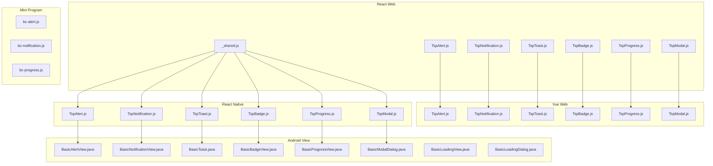
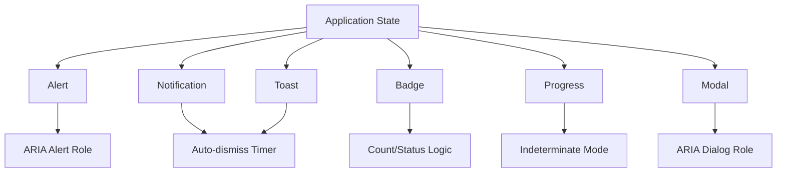
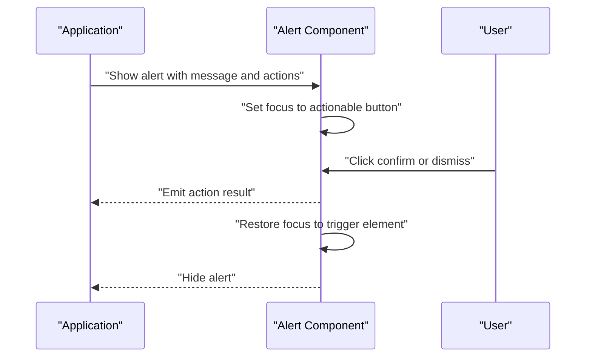
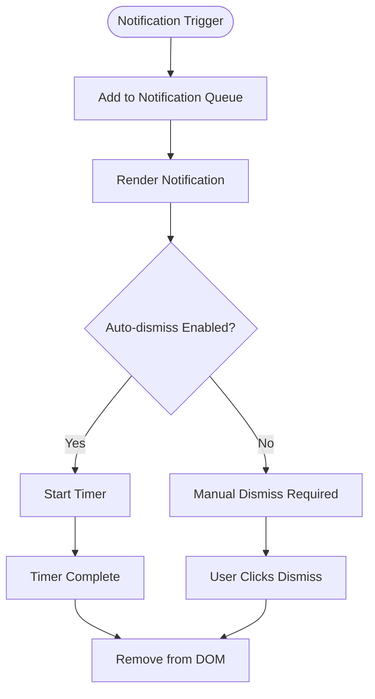
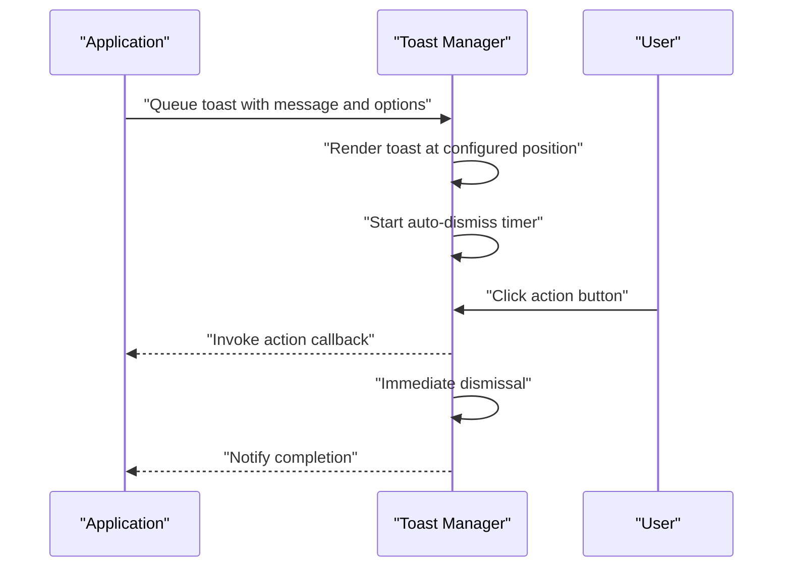
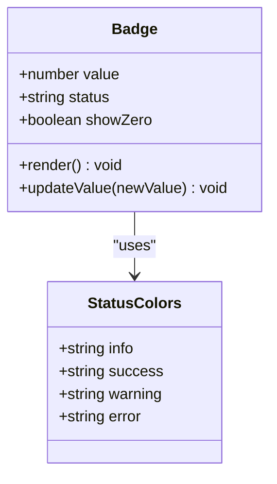
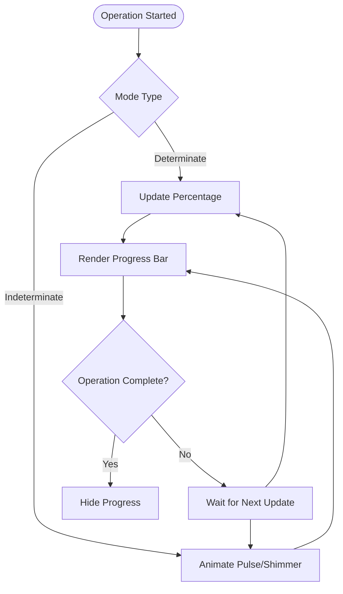
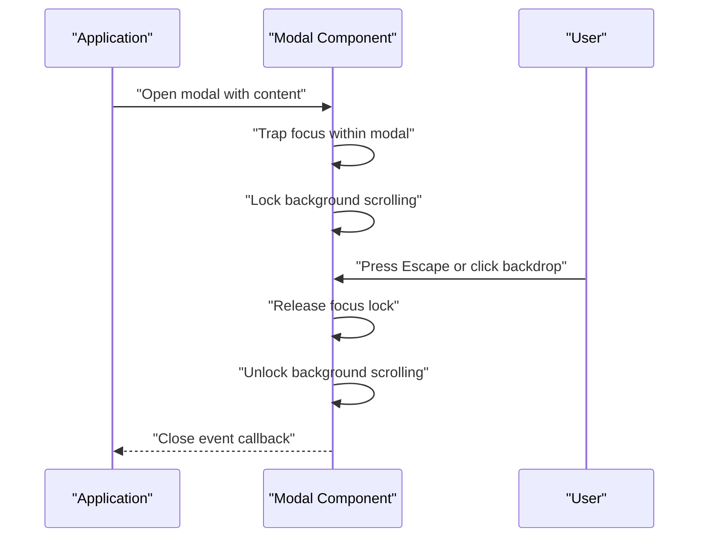
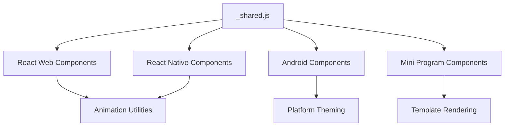

# Feedback Components

<cite>
**Referenced Files in This Document**
- [TspAlert.js](file://react-web/library/src/components/TspAlert.js)
- [TspNotification.js](file://react-web/library/src/components/TspNotification.js)
- [TspToast.js](file://react-web/library/src/components/TspToast.js)
- [TspBadge.js](file://react-web/library/src/components/TspBadge.js)
- [TspProgress.js](file://react-web/library/src/components/TspProgress.js)
- [TspModal.js](file://react-web/library/src/components/TspModal.js)
- [_shared.js](file://react-web/library/src/components/_shared.js)
- [bc-alert.js](file://miniprogram/library/components/bc-alert/bc-alert.js)
- [bc-notification.js](file://miniprogram/library/components/bc-notification/bc-notification.js)
- [bc-progress.js](file://miniprogram/library/components/bc-progress/bc-progress.js)
- [BasicAlertView.java](file://android/library/src/main/java/com/techskillplanet/basiccontrols/widget/BasicAlertView.java)
- [BasicNotificationView.java](file://android/library/src/main/java/com/techskillplanet/basiccontrols/widget/BasicNotificationView.java)
- [BasicToast.java](file://android/library/src/main/java/com/techskillplanet/basiccontrols/widget/BasicToast.java)
- [BasicBadgeView.java](file://android/library/src/main/java/com/techskillplanet/basiccontrols/widget/BasicBadgeView.java)
- [BasicProgressView.java](file://android/library/src/main/java/com/techskillplanet/basiccontrols/widget/BasicProgressView.java)
- [BasicModalDialog.java](file://android/library/src/main/java/com/techskillplanet/basiccontrols/widget/BasicModalDialog.java)
- [BasicLoadingView.java](file://android/library/src/main/java/com/techskillplanet/basiccontrols/widget/BasicLoadingView.java)
- [BasicLoadingDialog.java](file://android/library/src/main/java/com/techskillplanet/basiccontrols/widget/BasicLoadingDialog.java)
- [TspAlert.js](file://react-native/library/src/starPlanet/components/TspAlert.js)
- [TspNotification.js](file://react-native/library/src/starPlanet/components/TspNotification.js)
- [TspToast.js](file://react-native/library/src/starPlanet/components/TspToast.js)
- [TspBadge.js](file://react-native/library/src/starPlanet/components/TspBadge.js)
- [TspProgress.js](file://react-native/library/src/starPlanet/components/TspProgress.js)
- [TspModal.js](file://react-native/library/src/starPlanet/components/TspModal.js)
- [TspAlert.js](file://vue-web/library/src/components/TspAlert.js)
- [TspNotification.js](file://vue-web/library/src/components/TspNotification.js)
- [TspToast.js](file://vue-web/library/src/components/TspToast.js)
- [TspBadge.js](file://vue-web/library/src/components/TspBadge.js)
- [TspProgress.js](file://vue-web/library/src/components/TspProgress.js)
- [TspModal.js](file://vue-web/library/src/components/TspModal.js)
</cite>

## Table of Contents
1. [Introduction](#introduction)
2. [Project Structure](#project-structure)
3. [Core Components](#core-components)
4. [Architecture Overview](#architecture-overview)
5. [Detailed Component Analysis](#detailed-component-analysis)
6. [Dependency Analysis](#dependency-analysis)
7. [Performance Considerations](#performance-considerations)
8. [Accessibility Features](#accessibility-features)
9. [Integration Patterns](#integration-patterns)
10. [Troubleshooting Guide](#troubleshooting-guide)
11. [Conclusion](#conclusion)

## Introduction
This document provides comprehensive documentation for Feedback Components across the Planet Components ecosystem. It covers Alert, Notification, Toast, Badge, Progress, and Modal components, detailing user feedback patterns, state management, timing considerations, and accessibility features. The guide explains different types of feedback mechanisms, animation behaviors, and integration with application state, including examples of notification systems, loading states, and modal workflows.

## Project Structure
The feedback components are implemented consistently across React Web, Vue Web, React Native, Android View, and Mini Program platforms. Each platform maintains its own implementation while adhering to shared design tokens and behavioral patterns.

**Diagram sources**
- [TspAlert.js](file://react-web/library/src/components/TspAlert.js)
- [TspNotification.js](file://react-web/library/src/components/TspNotification.js)
- [TspToast.js](file://react-web/library/src/components/TspToast.js)
- [TspBadge.js](file://react-web/library/src/components/TspBadge.js)
- [TspProgress.js](file://react-web/library/src/components/TspProgress.js)
- [TspModal.js](file://react-web/library/src/components/TspModal.js)
- [_shared.js](file://react-web/library/src/components/_shared.js)
- [TspAlert.js](file://react-native/library/src/starPlanet/components/TspAlert.js)
- [TspNotification.js](file://react-native/library/src/starPlanet/components/TspNotification.js)
- [TspToast.js](file://react-native/library/src/starPlanet/components/TspToast.js)
- [TspBadge.js](file://react-native/library/src/starPlanet/components/TspBadge.js)
- [TspProgress.js](file://react-native/library/src/starPlanet/components/TspProgress.js)
- [TspModal.js](file://react-native/library/src/starPlanet/components/TspModal.js)
- [BasicAlertView.java](file://android/library/src/main/java/com/techskillplanet/basiccontrols/widget/BasicAlertView.java)
- [BasicNotificationView.java](file://android/library/src/main/java/com/techskillplanet/basiccontrols/widget/BasicNotificationView.java)
- [BasicToast.java](file://android/library/src/main/java/com/techskillplanet/basiccontrols/widget/BasicToast.java)
- [BasicBadgeView.java](file://android/library/src/main/java/com/techskillplanet/basiccontrols/widget/BasicBadgeView.java)
- [BasicProgressView.java](file://android/library/src/main/java/com/techskillplanet/basiccontrols/widget/BasicProgressView.java)
- [BasicModalDialog.java](file://android/library/src/main/java/com/techskillplanet/basiccontrols/widget/BasicModalDialog.java)
- [BasicLoadingView.java](file://android/library/src/main/java/com/techskillplanet/basiccontrols/widget/BasicLoadingView.java)
- [BasicLoadingDialog.java](file://android/library/src/main/java/com/techskillplanet/basiccontrols/widget/BasicLoadingDialog.java)
- [TspAlert.js](file://vue-web/library/src/components/TspAlert.js)
- [TspNotification.js](file://vue-web/library/src/components/TspNotification.js)
- [TspToast.js](file://vue-web/library/src/components/TspToast.js)
- [TspBadge.js](file://vue-web/library/src/components/TspBadge.js)
- [TspProgress.js](file://vue-web/library/src/components/TspProgress.js)
- [TspModal.js](file://vue-web/library/src/components/TspModal.js)

**Section sources**
- [TspAlert.js](file://react-web/library/src/components/TspAlert.js)
- [TspNotification.js](file://react-web/library/src/components/TspNotification.js)
- [TspToast.js](file://react-web/library/src/components/TspToast.js)
- [TspBadge.js](file://react-web/library/src/components/TspBadge.js)
- [TspProgress.js](file://react-web/library/src/components/TspProgress.js)
- [TspModal.js](file://react-web/library/src/components/TspModal.js)
- [_shared.js](file://react-web/library/src/components/_shared.js)

## Core Components
This section outlines the six primary feedback components and their roles:

- Alert: Presents important messages and prompts user action, often blocking interaction until resolved.
- Notification: Communicates system or user-triggered events, typically non-blocking and dismissible.
- Toast: Provides brief, contextual feedback after actions, usually auto-dismissing.
- Badge: Indicates counts, statuses, or states with concise visual markers.
- Progress: Visualizes the completion state of ongoing operations.
- Modal: Displays content in an overlay, requiring explicit dismissal to restore focus.

Each component follows consistent state management patterns and integrates with platform-specific accessibility and animation capabilities.

**Section sources**
- [TspAlert.js](file://react-web/library/src/components/TspAlert.js)
- [TspNotification.js](file://react-web/library/src/components/TspNotification.js)
- [TspToast.js](file://react-web/library/src/components/TspToast.js)
- [TspBadge.js](file://react-web/library/src/components/TspBadge.js)
- [TspProgress.js](file://react-web/library/src/components/TspProgress.js)
- [TspModal.js](file://react-web/library/src/components/TspModal.js)

## Architecture Overview
The feedback components share a unified architecture across platforms, emphasizing:
- Centralized state management via props/events or platform-specific hooks
- Consistent animation and transition behaviors
- Accessibility compliance with ARIA roles and keyboard navigation
- Responsive design aligned with platform design systems

[No sources needed since this diagram shows conceptual workflow, not actual code structure]

## Detailed Component Analysis

### Alert Component
Purpose: Conveys urgent messages and requires explicit user acknowledgment.

Key behaviors:
- Blocking interaction until dismissed
- Configurable severity levels and actions
- Focus management to trap keyboard navigation
- ARIA alert role for screen readers

State management:
- Controlled via props for visibility and message content
- Event callbacks for user actions (confirm/dismiss)
- Optional timeout for auto-dismiss

Accessibility:
- Proper ARIA role assignment
- Keyboard navigation support
- Focus restoration after dismissal

**Diagram sources**
- [TspAlert.js](file://react-web/library/src/components/TspAlert.js)
- [TspAlert.js](file://react-native/library/src/starPlanet/components/TspAlert.js)
- [BasicAlertView.java](file://android/library/src/main/java/com/techskillplanet/basiccontrols/widget/BasicAlertView.java)

**Section sources**
- [TspAlert.js](file://react-web/library/src/components/TspAlert.js)
- [TspAlert.js](file://react-native/library/src/starPlanet/components/TspAlert.js)
- [BasicAlertView.java](file://android/library/src/main/java/com/techskillplanet/basiccontrols/widget/BasicAlertView.java)

### Notification Component
Purpose: Displays system or user-triggered notifications that can be dismissed.

Key behaviors:
- Non-blocking presentation
- Auto-dismiss timer with optional pause on hover/focus
- Multiple notification stacking and queue management
- Platform-specific permission handling (where applicable)

State management:
- Visibility toggled via props or global state
- Dismiss events propagate to parent components
- Optional persistent mode for critical alerts

Accessibility:
- ARIA live region integration
- Screen reader announcements
- Keyboard navigation for dismissal controls

**Diagram sources**
- [TspNotification.js](file://react-web/library/src/components/TspNotification.js)
- [TspNotification.js](file://react-native/library/src/starPlanet/components/TspNotification.js)
- [BasicNotificationView.java](file://android/library/src/main/java/com/techskillplanet/basiccontrols/widget/BasicNotificationView.java)
- [bc-notification.js](file://miniprogram/library/components/bc-notification/bc-notification.js)

**Section sources**
- [TspNotification.js](file://react-web/library/src/components/TspNotification.js)
- [TspNotification.js](file://react-native/library/src/starPlanet/components/TspNotification.js)
- [BasicNotificationView.java](file://android/library/src/main/java/com/techskillplanet/basiccontrols/widget/BasicNotificationView.java)
- [bc-notification.js](file://miniprogram/library/components/bc-notification/bc-notification.js)

### Toast Component
Purpose: Provides brief, contextual feedback after user actions.

Key behaviors:
- Auto-dismiss after configurable duration
- Positioning options (top, bottom, center)
- Actionable buttons within toast content
- Prevents overlapping with other toasts

State management:
- Single-instance rendering with message queue
- Duration controlled by prop or global defaults
- Callbacks for action clicks and auto-dismiss

Animation:
- Smooth entrance/exit transitions
- Stacking animations for multiple toasts

**Diagram sources**
- [TspToast.js](file://react-web/library/src/components/TspToast.js)
- [TspToast.js](file://react-native/library/src/starPlanet/components/TspToast.js)
- [BasicToast.java](file://android/library/src/main/java/com/techskillplanet/basiccontrols/widget/BasicToast.java)

**Section sources**
- [TspToast.js](file://react-web/library/src/components/TspToast.js)
- [TspToast.js](file://react-native/library/src/starPlanet/components/TspToast.js)
- [BasicToast.java](file://android/library/src/main/java/com/techskillplanet/basiccontrols/widget/BasicToast.java)

### Badge Component
Purpose: Displays counts, indicators, or status signals.

Key behaviors:
- Compact numeric or textual indicators
- Color-coded status representation
- Overlay positioning on parent elements
- Dynamic updates based on state changes

State management:
- Numeric or string value updates
- Threshold-based coloring and labeling
- Conditional visibility based on conditions

Accessibility:
- Screen reader announcements for count changes
- Visual contrast maintained against backgrounds

**Diagram sources**
- [TspBadge.js](file://react-web/library/src/components/TspBadge.js)
- [TspBadge.js](file://react-native/library/src/starPlanet/components/TspBadge.js)
- [BasicBadgeView.java](file://android/library/src/main/java/com/techskillplanet/basiccontrols/widget/BasicBadgeView.java)

**Section sources**
- [TspBadge.js](file://react-web/library/src/components/TspBadge.js)
- [TspBadge.js](file://react-native/library/src/starPlanet/components/TspBadge.js)
- [BasicBadgeView.java](file://android/library/src/main/java/com/techskillplanet/basiccontrols/widget/BasicBadgeView.java)

### Progress Component
Purpose: Visualizes the progress of ongoing operations.

Key behaviors:
- Determinate progress with percentage values
- Indeterminate mode for unknown durations
- Loading states integrated with long-running tasks
- Themed appearance aligned with platform design systems

State management:
- Percentage value updates from parent components
- Mode switching between determinate and indeterminate
- Disabled states during invalid operations

Animation:
- Smooth progress bar transitions
- Pulse or shimmer effects for indeterminate states

**Diagram sources**
- [TspProgress.js](file://react-web/library/src/components/TspProgress.js)
- [TspProgress.js](file://react-native/library/src/starPlanet/components/TspProgress.js)
- [BasicProgressView.java](file://android/library/src/main/java/com/techskillplanet/basiccontrols/widget/BasicProgressView.java)
- [bc-progress.js](file://miniprogram/library/components/bc-progress/bc-progress.js)

**Section sources**
- [TspProgress.js](file://react-web/library/src/components/TspProgress.js)
- [TspProgress.js](file://react-native/library/src/starPlanet/components/TspProgress.js)
- [BasicProgressView.java](file://android/library/src/main/java/com/techskillplanet/basiccontrols/widget/BasicProgressView.java)
- [bc-progress.js](file://miniprogram/library/components/bc-progress/bc-progress.js)

### Modal Component
Purpose: Displays content in an overlay requiring explicit dismissal.

Key behaviors:
- Fullscreen or centered content presentation
- Backdrop click and escape key handling
- Focus trapping and restoration
- Scroll locking to prevent background interaction

State management:
- Open/close state controlled by parent components
- Nested modal support with z-index management
- Animation transitions for entrance/exit

Accessibility:
- ARIA dialog role and labelled-by associations
- Keyboard navigation within modal content
- Focus restoration to trigger element on close

**Diagram sources**
- [TspModal.js](file://react-web/library/src/components/TspModal.js)
- [TspModal.js](file://react-native/library/src/starPlanet/components/TspModal.js)
- [BasicModalDialog.java](file://android/library/src/main/java/com/techskillplanet/basiccontrols/widget/BasicModalDialog.java)

**Section sources**
- [TspModal.js](file://react-web/library/src/components/TspModal.js)
- [TspModal.js](file://react-native/library/src/starPlanet/components/TspModal.js)
- [BasicModalDialog.java](file://android/library/src/main/java/com/techskillplanet/basiccontrols/widget/BasicModalDialog.java)

## Dependency Analysis
The feedback components depend on shared utilities and platform-specific implementations:

**Diagram sources**
- [_shared.js](file://react-web/library/src/components/_shared.js)
- [TspAlert.js](file://react-web/library/src/components/TspAlert.js)
- [TspNotification.js](file://react-web/library/src/components/TspNotification.js)
- [TspToast.js](file://react-web/library/src/components/TspToast.js)
- [TspBadge.js](file://react-web/library/src/components/TspBadge.js)
- [TspProgress.js](file://react-web/library/src/components/TspProgress.js)
- [TspModal.js](file://react-web/library/src/components/TspModal.js)

**Section sources**
- [_shared.js](file://react-web/library/src/components/_shared.js)

## Performance Considerations
- Minimize re-renders by using memoization and controlled components
- Debounce rapid state updates for progress and badge components
- Use virtualized lists for notification queues to handle large volumes
- Optimize animations with hardware acceleration where supported
- Lazy-load heavy modal content to improve initial render performance

## Accessibility Features
- ARIA roles: alert, dialog, live regions for dynamic content
- Keyboard navigation: focus traps, tab sequences, and escape handling
- Screen reader support: announcements for state changes and new notifications
- Color contrast: maintain WCAG AA standards for all components
- Resize handling: responsive layouts adapt to viewport changes

## Integration Patterns
Common integration scenarios:
- Notification systems: centralized dispatch with priority queuing
- Loading states: progress bars synchronized with API requests
- Modal workflows: wizard-style multi-step forms with validation
- Badge counters: real-time updates from WebSocket or polling
- Toast actions: undo operations and quick fixes

Example patterns:
- Global notification manager with event bus
- Context providers for modal and alert state
- Hook-based progress tracking for async operations
- Compose badge components with clickable actions

**Section sources**
- [TspNotification.js](file://react-web/library/src/components/TspNotification.js)
- [TspProgress.js](file://react-web/library/src/components/TspProgress.js)
- [TspModal.js](file://react-web/library/src/components/TspModal.js)
- [TspBadge.js](file://react-web/library/src/components/TspBadge.js)
- [TspToast.js](file://react-web/library/src/components/TspToast.js)

## Troubleshooting Guide
Common issues and resolutions:
- Focus not trapped in modals: verify focus management hooks and ensure proper cleanup
- Notifications not dismissing: check timer logic and queue state synchronization
- Progress bar not updating: validate percentage calculations and state propagation
- Badges not visible: confirm overlay positioning and z-index stacking
- Toast overlap: implement queue management and spacing calculations
- Alert not accessible: verify ARIA attributes and keyboard event handlers

Debugging tips:
- Use browser devtools to inspect ARIA roles and focus states
- Monitor component lifecycle events for proper cleanup
- Test with screen readers and keyboard-only navigation
- Validate color contrast ratios with accessibility testing tools

**Section sources**
- [TspAlert.js](file://react-web/library/src/components/TspAlert.js)
- [TspNotification.js](file://react-web/library/src/components/TspNotification.js)
- [TspToast.js](file://react-web/library/src/components/TspToast.js)
- [TspBadge.js](file://react-web/library/src/components/TspBadge.js)
- [TspProgress.js](file://react-web/library/src/components/TspProgress.js)
- [TspModal.js](file://react-web/library/src/components/TspModal.js)

## Conclusion
The Feedback Components provide a cohesive set of user interface elements designed to communicate state, guide user actions, and enhance accessibility across platforms. By following the documented patterns for state management, timing considerations, and accessibility features, developers can implement reliable and user-friendly feedback systems that integrate seamlessly with application workflows.