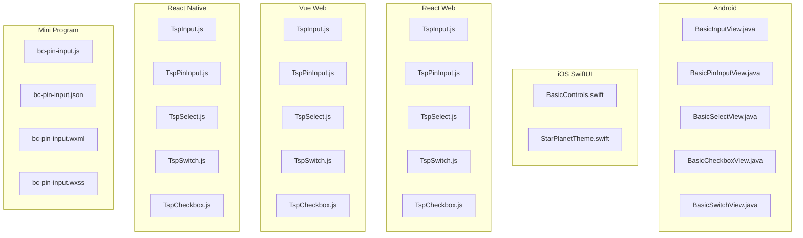
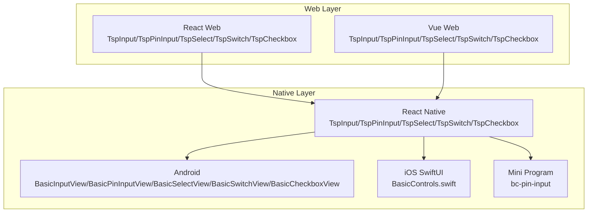
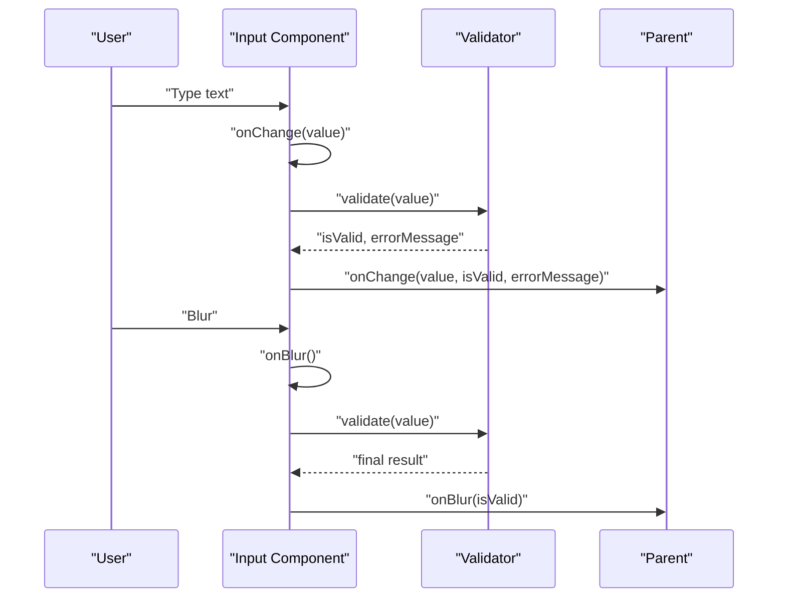
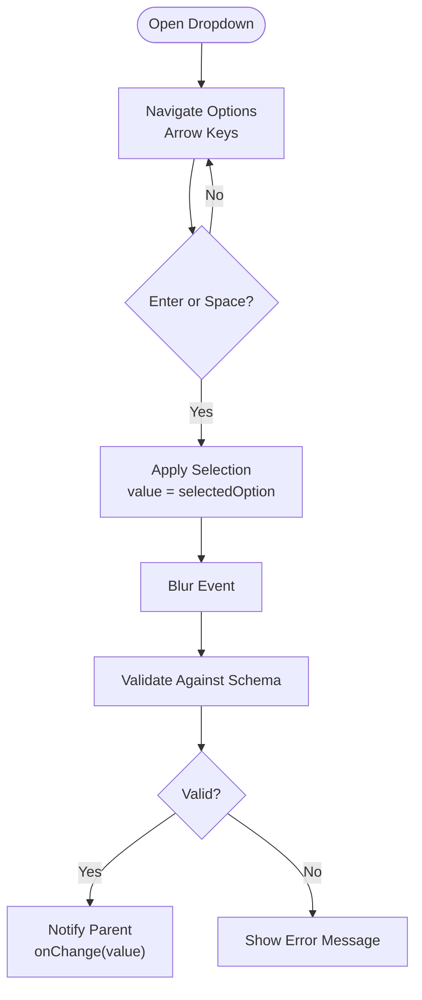
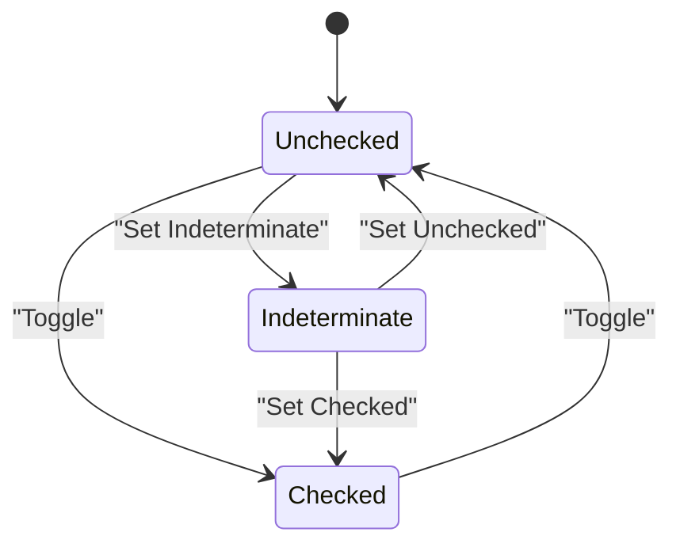
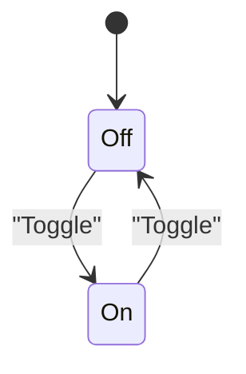
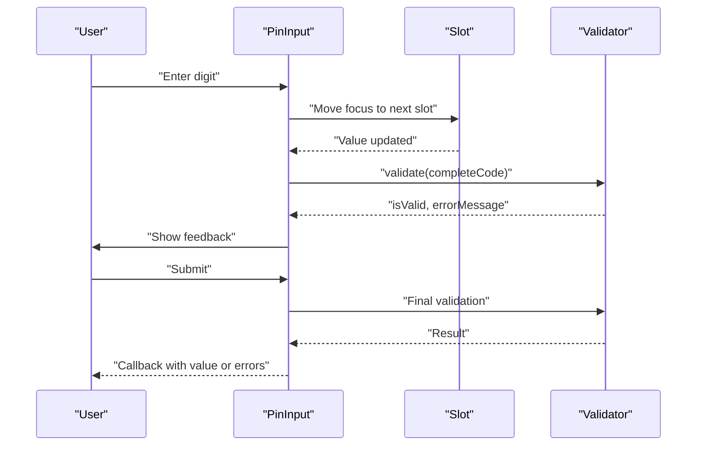
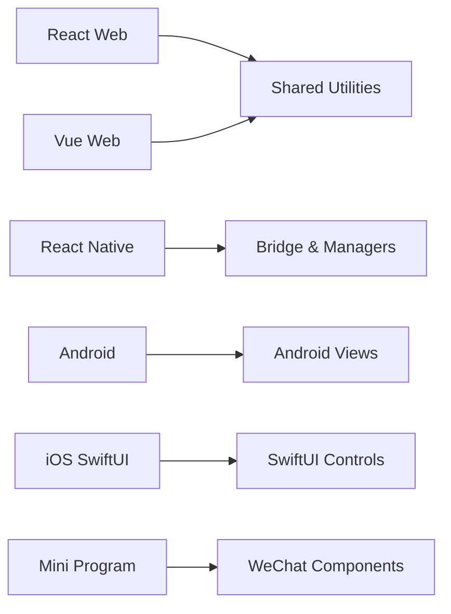

# Form Components

<cite>
**Referenced Files in This Document**
- [BasicInputView.java](file://android/library/src/main/java/com/techskillplanet/basiccontrols/widget/BasicInputView.java)
- [BasicPinInputView.java](file://android/library/src/main/java/com/techskillplanet/basiccontrols/widget/BasicPinInputView.java)
- [BasicSelectView.java](file://android/library/src/main/java/com/techskillplanet/basiccontrols/widget/BasicSelectView.java)
- [BasicCheckboxView.java](file://android/library/src/main/java/com/techskillplanet/basiccontrols/widget/BasicCheckboxView.java)
- [BasicSwitchView.java](file://android/library/src/main/java/com/techskillplanet/basiccontrols/widget/BasicSwitchView.java)
- [TspInput.js](file://react-web/library/src/components/TspInput.js)
- [TspPinInput.js](file://react-web/library/src/components/TspPinInput.js)
- [TspSelect.js](file://react-web/library/src/components/TspSelect.js)
- [TspSwitch.js](file://react-web/library/src/components/TspSwitch.js)
- [TspCheckbox.js](file://react-web/library/src/components/TspCheckbox.js)
- [TspInput.js](file://vue-web/library/src/components/TspInput.js)
- [TspPinInput.js](file://vue-web/library/src/components/TspPinInput.js)
- [TspSelect.js](file://vue-web/library/src/components/TspSelect.js)
- [TspSwitch.js](file://vue-web/library/src/components/TspSwitch.js)
- [TspCheckbox.js](file://vue-web/library/src/components/TspCheckbox.js)
- [TspInput.js](file://react-native/library/src/starPlanet/components/TspInput.js)
- [TspPinInput.js](file://react-native/library/src/starPlanet/components/TspPinInput.js)
- [TspSelect.js](file://react-native/library/src/starPlanet/components/TspSelect.js)
- [TspSwitch.js](file://react-native/library/src/starPlanet/components/TspSwitch.js)
- [TspCheckbox.js](file://react-native/library/src/starPlanet/components/TspCheckbox.js)
- [bc-pin-input.js](file://miniprogram/library/components/bc-pin-input/bc-pin-input.js)
- [bc-pin-input.json](file://miniprogram/library/components/bc-pin-input/bc-pin-input.json)
- [bc-pin-input.wxml](file://miniprogram/library/components/bc-pin-input/bc-pin-input.wxml)
- [bc-pin-input.wxss](file://miniprogram/library/components/bc-pin-input/bc-pin-input.wxss)
- [BasicControls.swift](file://ios-swiftui/library/Sources/TechSkillPlanetBasicControls/BasicControls.swift)
- [StarPlanetTheme.swift](file://ios-swiftui/library/Sources/TechSkillPlanetBasicControls/StarPlanetTheme.swift)
</cite>

## Table of Contents
1. [Introduction](#introduction)
2. [Project Structure](#project-structure)
3. [Core Components](#core-components)
4. [Architecture Overview](#architecture-overview)
5. [Detailed Component Analysis](#detailed-component-analysis)
6. [Dependency Analysis](#dependency-analysis)
7. [Performance Considerations](#performance-considerations)
8. [Troubleshooting Guide](#troubleshooting-guide)
9. [Conclusion](#conclusion)

## Introduction
This document provides comprehensive documentation for Form Components across multiple platforms, focusing on Input, Select, Checkbox, Switch, and PinInput. It explains validation patterns, input handling, state management, accessibility, platform-specific implementations, keyboard handling, and security considerations for sensitive inputs like PIN codes. It also covers integration patterns with form libraries and practical examples for each platform.

## Project Structure
The repository provides form components across Android, iOS/SwiftUI, React Web, Vue Web, React Native, and Mini Program ecosystems. Each platform exposes similar component families with consistent capabilities and APIs.

**Diagram sources**
- [BasicInputView.java](file://android/library/src/main/java/com/techskillplanet/basiccontrols/widget/BasicInputView.java)
- [BasicPinInputView.java](file://android/library/src/main/java/com/techskillplanet/basiccontrols/widget/BasicPinInputView.java)
- [BasicSelectView.java](file://android/library/src/main/java/com/techskillplanet/basiccontrols/widget/BasicSelectView.java)
- [BasicCheckboxView.java](file://android/library/src/main/java/com/techskillplanet/basiccontrols/widget/BasicCheckboxView.java)
- [BasicSwitchView.java](file://android/library/src/main/java/com/techskillplanet/basiccontrols/widget/BasicSwitchView.java)
- [TspInput.js](file://react-web/library/src/components/TspInput.js)
- [TspPinInput.js](file://react-web/library/src/components/TspPinInput.js)
- [TspSelect.js](file://react-web/library/src/components/TspSelect.js)
- [TspSwitch.js](file://react-web/library/src/components/TspSwitch.js)
- [TspCheckbox.js](file://react-web/library/src/components/TspCheckbox.js)
- [TspInput.js](file://vue-web/library/src/components/TspInput.js)
- [TspPinInput.js](file://vue-web/library/src/components/TspPinInput.js)
- [TspSelect.js](file://vue-web/library/src/components/TspSelect.js)
- [TspSwitch.js](file://vue-web/library/src/components/TspSwitch.js)
- [TspCheckbox.js](file://vue-web/library/src/components/TspCheckbox.js)
- [TspInput.js](file://react-native/library/src/starPlanet/components/TspInput.js)
- [TspPinInput.js](file://react-native/library/src/starPlanet/components/TspPinInput.js)
- [TspSelect.js](file://react-native/library/src/starPlanet/components/TspSelect.js)
- [TspSwitch.js](file://react-native/library/src/starPlanet/components/TspSwitch.js)
- [TspCheckbox.js](file://react-native/library/src/starPlanet/components/TspCheckbox.js)
- [bc-pin-input.js](file://miniprogram/library/components/bc-pin-input/bc-pin-input.js)
- [bc-pin-input.json](file://miniprogram/library/components/bc-pin-input/bc-pin-input.json)
- [bc-pin-input.wxml](file://miniprogram/library/components/bc-pin-input/bc-pin-input.wxml)
- [bc-pin-input.wxss](file://miniprogram/library/components/bc-pin-input/bc-pin-input.wxss)

**Section sources**
- [BasicInputView.java](file://android/library/src/main/java/com/techskillplanet/basiccontrols/widget/BasicInputView.java)
- [TspInput.js](file://react-web/library/src/components/TspInput.js)
- [TspInput.js](file://vue-web/library/src/components/TspInput.js)
- [TspInput.js](file://react-native/library/src/starPlanet/components/TspInput.js)
- [bc-pin-input.js](file://miniprogram/library/components/bc-pin-input/bc-pin-input.js)

## Core Components
This section outlines the primary form components and their responsibilities:
- Input: Text input with validation, placeholder, label, and state management.
- Select: Dropdown selection with options and controlled value binding.
- Checkbox: Two-state selection with label and indeterminate support.
- Switch: On/off toggle with label and state synchronization.
- PinInput: Digit-only secure input for PINs with masking and character alignment.

Validation patterns:
- Required field validation with error messaging.
- Pattern-based validation (e.g., numeric, email).
- Length constraints and custom validators.
- Real-time feedback and submission-time aggregation.

State management:
- Controlled components with props for value and onChange handlers.
- Uncontrolled variants for simple scenarios.
- Form library integration via standard event handlers and refs.

Accessibility:
- Proper labeling, ARIA attributes, focus management, and keyboard navigation.
- Screen reader announcements for validation messages.
- High contrast and focus indicators.

Platform-specific considerations:
- Android: TextInput behaviors, IME actions, and hardware keyboard handling.
- iOS: Secure text entry modes, autocorrection/autocapitalization, and keyboard types.
- Web: Event normalization, focus traps, and browser-specific quirks.
- React Native: Bridge events, native text input managers, and platform differences.
- Mini Program: WXML templates, JSON configuration, and component lifecycle.

Security for sensitive inputs:
- Masking and obfuscation for PinInput.
- Disabling autofill and browser suggestions.
- Preventing copy/paste for PIN fields.
- Enforcing digit-only input.

Integration with form libraries:
- React Hook Form, Formik, and similar libraries via standard onChange/onBlur handlers.
- Validation schema mapping and error propagation.
- Reset and reinitialize component state from form state.

**Section sources**
- [BasicInputView.java](file://android/library/src/main/java/com/techskillplanet/basiccontrols/widget/BasicInputView.java)
- [BasicPinInputView.java](file://android/library/src/main/java/com/techskillplanet/basiccontrols/widget/BasicPinInputView.java)
- [TspInput.js](file://react-web/library/src/components/TspInput.js)
- [TspPinInput.js](file://react-web/library/src/components/TspPinInput.js)
- [TspSelect.js](file://react-web/library/src/components/TspSelect.js)
- [TspSwitch.js](file://react-web/library/src/components/TspSwitch.js)
- [TspCheckbox.js](file://react-web/library/src/components/TspCheckbox.js)
- [TspInput.js](file://vue-web/library/src/components/TspInput.js)
- [TspPinInput.js](file://vue-web/library/src/components/TspPinInput.js)
- [TspSelect.js](file://vue-web/library/src/components/TspSelect.js)
- [TspSwitch.js](file://vue-web/library/src/components/TspSwitch.js)
- [TspCheckbox.js](file://vue-web/library/src/components/TspCheckbox.js)
- [TspInput.js](file://react-native/library/src/starPlanet/components/TspInput.js)
- [TspPinInput.js](file://react-native/library/src/starPlanet/components/TspPinInput.js)
- [TspSelect.js](file://react-native/library/src/starPlanet/components/TspSelect.js)
- [TspSwitch.js](file://react-native/library/src/starPlanet/components/TspSwitch.js)
- [TspCheckbox.js](file://react-native/library/src/starPlanet/components/TspCheckbox.js)
- [bc-pin-input.js](file://miniprogram/library/components/bc-pin-input/bc-pin-input.js)

## Architecture Overview
The form components share a consistent contract across platforms:
- Props define behavior (value, onChange, onBlur, error, disabled, required).
- Events propagate user interactions to parent components.
- Validation integrates with external libraries through standardized handlers.
- Accessibility attributes are applied consistently.

**Diagram sources**
- [TspInput.js](file://react-web/library/src/components/TspInput.js)
- [TspPinInput.js](file://react-web/library/src/components/TspPinInput.js)
- [TspSelect.js](file://react-web/library/src/components/TspSelect.js)
- [TspSwitch.js](file://react-web/library/src/components/TspSwitch.js)
- [TspCheckbox.js](file://react-web/library/src/components/TspCheckbox.js)
- [TspInput.js](file://vue-web/library/src/components/TspInput.js)
- [TspPinInput.js](file://vue-web/library/src/components/TspPinInput.js)
- [TspSelect.js](file://vue-web/library/src/components/TspSelect.js)
- [TspSwitch.js](file://vue-web/library/src/components/TspSwitch.js)
- [TspCheckbox.js](file://vue-web/library/src/components/TspCheckbox.js)
- [TspInput.js](file://react-native/library/src/starPlanet/components/TspInput.js)
- [TspPinInput.js](file://react-native/library/src/starPlanet/components/TspPinInput.js)
- [TspSelect.js](file://react-native/library/src/starPlanet/components/TspSelect.js)
- [TspSwitch.js](file://react-native/library/src/starPlanet/components/TspSwitch.js)
- [TspCheckbox.js](file://react-native/library/src/starPlanet/components/TspCheckbox.js)
- [BasicInputView.java](file://android/library/src/main/java/com/techskillplanet/basiccontrols/widget/BasicInputView.java)
- [BasicPinInputView.java](file://android/library/src/main/java/com/techskillplanet/basiccontrols/widget/BasicPinInputView.java)
- [BasicSelectView.java](file://android/library/src/main/java/com/techskillplanet/basiccontrols/widget/BasicSelectView.java)
- [BasicSwitchView.java](file://android/library/src/main/java/com/techskillplanet/basiccontrols/widget/BasicSwitchView.java)
- [BasicCheckboxView.java](file://android/library/src/main/java/com/techskillplanet/basiccontrols/widget/BasicCheckboxView.java)
- [BasicControls.swift](file://ios-swiftui/library/Sources/TechSkillPlanetBasicControls/BasicControls.swift)
- [bc-pin-input.js](file://miniprogram/library/components/bc-pin-input/bc-pin-input.js)

## Detailed Component Analysis

### Input
Responsibilities:
- Single-line text editing with optional label and helper/error text.
- Controlled value updates via onChange and onBlur callbacks.
- Validation integration and error state rendering.

Platform specifics:
- Android: TextInput configuration, IME actions, and soft keyboard behavior.
- Web: Synthetic events, focus management, and browser compatibility.
- React Native: Native text input manager and bridge events.
- Mini Program: WXML input element with JSON configuration.

Validation examples:
- Required field: value.length > 0.
- Pattern-based: numeric, email, phone number.
- Length constraints: min/max length checks.

Accessibility:
- Associate label via aria-labelledby or aria-label.
- Announce validation messages with aria-live regions.
- Manage focus after validation errors.

**Diagram sources**
- [BasicInputView.java](file://android/library/src/main/java/com/techskillplanet/basiccontrols/widget/BasicInputView.java)
- [TspInput.js](file://react-web/library/src/components/TspInput.js)
- [TspInput.js](file://vue-web/library/src/components/TspInput.js)
- [TspInput.js](file://react-native/library/src/starPlanet/components/TspInput.js)

**Section sources**
- [BasicInputView.java](file://android/library/src/main/java/com/techskillplanet/basiccontrols/widget/BasicInputView.java)
- [TspInput.js](file://react-web/library/src/components/TspInput.js)
- [TspInput.js](file://vue-web/library/src/components/TspInput.js)
- [TspInput.js](file://react-native/library/src/starPlanet/components/TspInput.js)

### Select
Responsibilities:
- Dropdown selection with option list and controlled value binding.
- Keyboard navigation and screen reader support.

Platform specifics:
- Android: Spinner/Popup implementation and selection callbacks.
- Web: Select element with option children and change events.
- React Native: Picker or custom dropdown overlay.
- Mini Program: Picker component with mode and range.

Validation and accessibility:
- Ensure selected option exists in options list.
- Provide accessible names for options.
- Manage focus after selection.

**Diagram sources**
- [BasicSelectView.java](file://android/library/src/main/java/com/techskillplanet/basiccontrols/widget/BasicSelectView.java)
- [TspSelect.js](file://react-web/library/src/components/TspSelect.js)
- [TspSelect.js](file://vue-web/library/src/components/TspSelect.js)
- [TspSelect.js](file://react-native/library/src/starPlanet/components/TspSelect.js)

**Section sources**
- [BasicSelectView.java](file://android/library/src/main/java/com/techskillplanet/basiccontrols/widget/BasicSelectView.java)
- [TspSelect.js](file://react-web/library/src/components/TspSelect.js)
- [TspSelect.js](file://vue-web/library/src/components/TspSelect.js)
- [TspSelect.js](file://react-native/library/src/starPlanet/components/TspSelect.js)

### Checkbox
Responsibilities:
- Two-state selection with optional indeterminate state.
- Label association and click/toggle behavior.

Platform specifics:
- Android: Compound button with state persistence.
- Web: Input type checkbox with controlled state.
- React Native: Native checkbox or custom indicator.
- Mini Program: Checkbox component with bindChange.

Accessibility:
- Label clickable area and keyboard activation.
- Screen reader announcements for checked/unchecked states.

**Diagram sources**
- [BasicCheckboxView.java](file://android/library/src/main/java/com/techskillplanet/basiccontrols/widget/BasicCheckboxView.java)
- [TspCheckbox.js](file://react-web/library/src/components/TspCheckbox.js)
- [TspCheckbox.js](file://vue-web/library/src/components/TspCheckbox.js)
- [TspCheckbox.js](file://react-native/library/src/starPlanet/components/TspCheckbox.js)

**Section sources**
- [BasicCheckboxView.java](file://android/library/src/main/java/com/techskillplanet/basiccontrols/widget/BasicCheckboxView.java)
- [TspCheckbox.js](file://react-web/library/src/components/TspCheckbox.js)
- [TspCheckbox.js](file://vue-web/library/src/components/TspCheckbox.js)
- [TspCheckbox.js](file://react-native/library/src/starPlanet/components/TspCheckbox.js)

### Switch
Responsibilities:
- On/off toggle with immediate state change feedback.
- Optional label and disabled state.

Platform specifics:
- Android: Compound button with animated thumb.
- Web: Toggle switch with controlled checked state.
- React Native: Native switch or custom animated toggle.
- Mini Program: Switch component with bindchange.

Accessibility:
- Keyboard activation and ARIA attributes for on/off states.

**Diagram sources**
- [BasicSwitchView.java](file://android/library/src/main/java/com/techskillplanet/basiccontrols/widget/BasicSwitchView.java)
- [TspSwitch.js](file://react-web/library/src/components/TspSwitch.js)
- [TspSwitch.js](file://vue-web/library/src/components/TspSwitch.js)
- [TspSwitch.js](file://react-native/library/src/starPlanet/components/TspSwitch.js)

**Section sources**
- [BasicSwitchView.java](file://android/library/src/main/java/com/techskillplanet/basiccontrols/widget/BasicSwitchView.java)
- [TspSwitch.js](file://react-web/library/src/components/TspSwitch.js)
- [TspSwitch.js](file://vue-web/library/src/components/TspSwitch.js)
- [TspSwitch.js](file://react-native/library/src/starPlanet/components/TspSwitch.js)

### PinInput
Responsibilities:
- Digit-only input for PINs with masked display.
- Character alignment and auto-focus between slots.
- Security measures against autofill and copy/paste.

Platform specifics:
- Android: Custom EditText with input filters and transformation.
- Web: Input type password with pattern restrictions and masking.
- React Native: Native secure text entry with numeric keyboard.
- Mini Program: Input with type="number" and maxlength.

Validation and security:
- Enforce digit-only input.
- Disable browser autocomplete and suggestions.
- Optionally mask characters during input.
- Validate length and presence on submit.

**Diagram sources**
- [BasicPinInputView.java](file://android/library/src/main/java/com/techskillplanet/basiccontrols/widget/BasicPinInputView.java)
- [TspPinInput.js](file://react-web/library/src/components/TspPinInput.js)
- [TspPinInput.js](file://vue-web/library/src/components/TspPinInput.js)
- [TspPinInput.js](file://react-native/library/src/starPlanet/components/TspPinInput.js)
- [bc-pin-input.js](file://miniprogram/library/components/bc-pin-input/bc-pin-input.js)

**Section sources**
- [BasicPinInputView.java](file://android/library/src/main/java/com/techskillplanet/basiccontrols/widget/BasicPinInputView.java)
- [TspPinInput.js](file://react-web/library/src/components/TspPinInput.js)
- [TspPinInput.js](file://vue-web/library/src/components/TspPinInput.js)
- [TspPinInput.js](file://react-native/library/src/starPlanet/components/TspPinInput.js)
- [bc-pin-input.js](file://miniprogram/library/components/bc-pin-input/bc-pin-input.js)

## Dependency Analysis
Cross-platform dependencies and relationships:
- Web components depend on shared utilities and theme systems.
- React Native components rely on platform bridges and native managers.
- Android components integrate with Android View system and resources.
- Mini Program components are self-contained with JSON/WXML/WXSS.

**Diagram sources**
- [TspInput.js](file://react-web/library/src/components/TspInput.js)
- [TspPinInput.js](file://react-web/library/src/components/TspPinInput.js)
- [TspSelect.js](file://react-web/library/src/components/TspSelect.js)
- [TspSwitch.js](file://react-web/library/src/components/TspSwitch.js)
- [TspCheckbox.js](file://react-web/library/src/components/TspCheckbox.js)
- [TspInput.js](file://vue-web/library/src/components/TspInput.js)
- [TspPinInput.js](file://vue-web/library/src/components/TspPinInput.js)
- [TspSelect.js](file://vue-web/library/src/components/TspSelect.js)
- [TspSwitch.js](file://vue-web/library/src/components/TspSwitch.js)
- [TspCheckbox.js](file://vue-web/library/src/components/TspCheckbox.js)
- [TspInput.js](file://react-native/library/src/starPlanet/components/TspInput.js)
- [TspPinInput.js](file://react-native/library/src/starPlanet/components/TspPinInput.js)
- [TspSelect.js](file://react-native/library/src/starPlanet/components/TspSelect.js)
- [TspSwitch.js](file://react-native/library/src/starPlanet/components/TspSwitch.js)
- [TspCheckbox.js](file://react-native/library/src/starPlanet/components/TspCheckbox.js)
- [BasicInputView.java](file://android/library/src/main/java/com/techskillplanet/basiccontrols/widget/BasicInputView.java)
- [BasicPinInputView.java](file://android/library/src/main/java/com/techskillplanet/basiccontrols/widget/BasicPinInputView.java)
- [BasicSelectView.java](file://android/library/src/main/java/com/techskillplanet/basiccontrols/widget/BasicSelectView.java)
- [BasicSwitchView.java](file://android/library/src/main/java/com/techskillplanet/basiccontrols/widget/BasicSwitchView.java)
- [BasicCheckboxView.java](file://android/library/src/main/java/com/techskillplanet/basiccontrols/widget/BasicCheckboxView.java)
- [BasicControls.swift](file://ios-swiftui/library/Sources/TechSkillPlanetBasicControls/BasicControls.swift)
- [bc-pin-input.js](file://miniprogram/library/components/bc-pin-input/bc-pin-input.js)

**Section sources**
- [TspInput.js](file://react-web/library/src/components/TspInput.js)
- [TspPinInput.js](file://react-web/library/src/components/TspPinInput.js)
- [TspSelect.js](file://react-web/library/src/components/TspSelect.js)
- [TspSwitch.js](file://react-web/library/src/components/TspSwitch.js)
- [TspCheckbox.js](file://react-web/library/src/components/TspCheckbox.js)
- [TspInput.js](file://vue-web/library/src/components/TspInput.js)
- [TspPinInput.js](file://vue-web/library/src/components/TspPinInput.js)
- [TspSelect.js](file://vue-web/library/src/components/TspSelect.js)
- [TspSwitch.js](file://vue-web/library/src/components/TspSwitch.js)
- [TspCheckbox.js](file://vue-web/library/src/components/TspCheckbox.js)
- [TspInput.js](file://react-native/library/src/starPlanet/components/TspInput.js)
- [TspPinInput.js](file://react-native/library/src/starPlanet/components/TspPinInput.js)
- [TspSelect.js](file://react-native/library/src/starPlanet/components/TspSelect.js)
- [TspSwitch.js](file://react-native/library/src/starPlanet/components/TspSwitch.js)
- [TspCheckbox.js](file://react-native/library/src/starPlanet/components/TspCheckbox.js)
- [BasicInputView.java](file://android/library/src/main/java/com/techskillplanet/basiccontrols/widget/BasicInputView.java)
- [BasicPinInputView.java](file://android/library/src/main/java/com/techskillplanet/basiccontrols/widget/BasicPinInputView.java)
- [BasicSelectView.java](file://android/library/src/main/java/com/techskillplanet/basiccontrols/widget/BasicSelectView.java)
- [BasicSwitchView.java](file://android/library/src/main/java/com/techskillplanet/basiccontrols/widget/BasicSwitchView.java)
- [BasicCheckboxView.java](file://android/library/src/main/java/com/techskillplanet/basiccontrols/widget/BasicCheckboxView.java)
- [BasicControls.swift](file://ios-swiftui/library/Sources/TechSkillPlanetBasicControls/BasicControls.swift)
- [bc-pin-input.js](file://miniprogram/library/components/bc-pin-input/bc-pin-input.js)

## Performance Considerations
- Debounce validation for real-time feedback to avoid excessive re-renders.
- Virtualize long option lists in Select to reduce DOM overhead.
- Memoize computed values and validators to prevent unnecessary recalculations.
- Batch state updates when multiple fields change simultaneously.
- Minimize layout thrashing by avoiding synchronous reads and writes to DOM.

## Troubleshooting Guide
Common issues and resolutions:
- Validation not triggering: Ensure onChange/onBlur handlers are wired and validators return proper booleans and messages.
- Focus jumps unexpectedly: Verify tab indices and preventDefault usage in keyboard handlers.
- Accessibility labels missing: Confirm aria-labelledby/aria-label and screen reader announcements are set.
- Platform-specific bugs:
  - Android: Soft keyboard behavior differs; test IME actions and input filters.
  - iOS: Secure text entry toggles; ensure correct keyboard type and autocorrection settings.
  - Web: Browser-specific event behavior; normalize events and test across browsers.
  - React Native: Bridge latency; defer heavy computations off the main thread.
  - Mini Program: Component lifecycle timing; initialize state in attached lifecycle.

**Section sources**
- [BasicInputView.java](file://android/library/src/main/java/com/techskillplanet/basiccontrols/widget/BasicInputView.java)
- [BasicPinInputView.java](file://android/library/src/main/java/com/techskillplanet/basiccontrols/widget/BasicPinInputView.java)
- [BasicSelectView.java](file://android/library/src/main/java/com/techskillplanet/basiccontrols/widget/BasicSelectView.java)
- [BasicSwitchView.java](file://android/library/src/main/java/com/techskillplanet/basiccontrols/widget/BasicSwitchView.java)
- [BasicCheckboxView.java](file://android/library/src/main/java/com/techskillplanet/basiccontrols/widget/BasicCheckboxView.java)
- [TspInput.js](file://react-web/library/src/components/TspInput.js)
- [TspPinInput.js](file://react-web/library/src/components/TspPinInput.js)
- [TspSelect.js](file://react-web/library/src/components/TspSelect.js)
- [TspSwitch.js](file://react-web/library/src/components/TspSwitch.js)
- [TspCheckbox.js](file://react-web/library/src/components/TspCheckbox.js)
- [TspInput.js](file://vue-web/library/src/components/TspInput.js)
- [TspPinInput.js](file://vue-web/library/src/components/TspPinInput.js)
- [TspSelect.js](file://vue-web/library/src/components/TspSelect.js)
- [TspSwitch.js](file://vue-web/library/src/components/TspSwitch.js)
- [TspCheckbox.js](file://vue-web/library/src/components/TspCheckbox.js)
- [TspInput.js](file://react-native/library/src/starPlanet/components/TspInput.js)
- [TspPinInput.js](file://react-native/library/src/starPlanet/components/TspPinInput.js)
- [TspSelect.js](file://react-native/library/src/starPlanet/components/TspSelect.js)
- [TspSwitch.js](file://react-native/library/src/starPlanet/components/TspSwitch.js)
- [TspCheckbox.js](file://react-native/library/src/starPlanet/components/TspCheckbox.js)
- [bc-pin-input.js](file://miniprogram/library/components/bc-pin-input/bc-pin-input.js)

## Conclusion
The Form Components across platforms adhere to consistent contracts while accommodating platform-specific behaviors. By leveraging controlled components, robust validation patterns, and strong accessibility practices, applications can deliver reliable and inclusive forms. Security considerations for sensitive inputs like PINs are addressed through masking, input restrictions, and disabling autofill. Integration with form libraries is straightforward via standard event handlers and ref-based APIs.