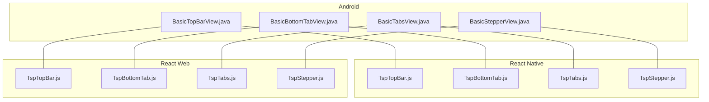
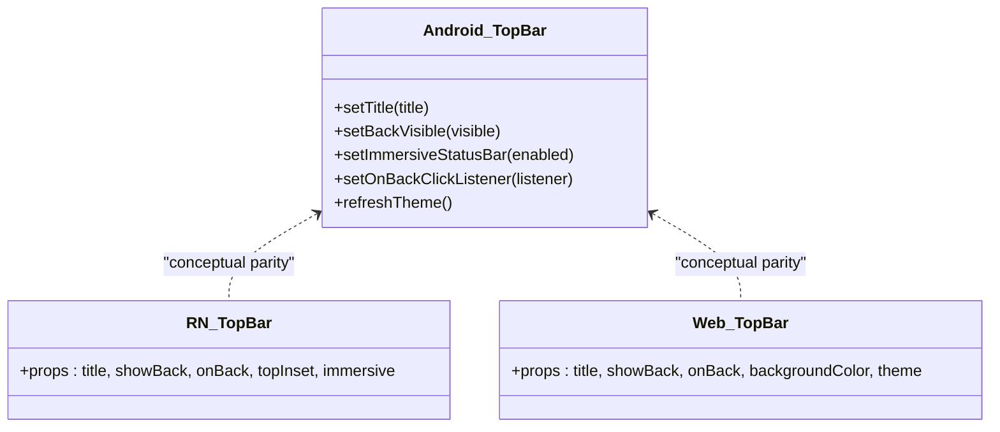
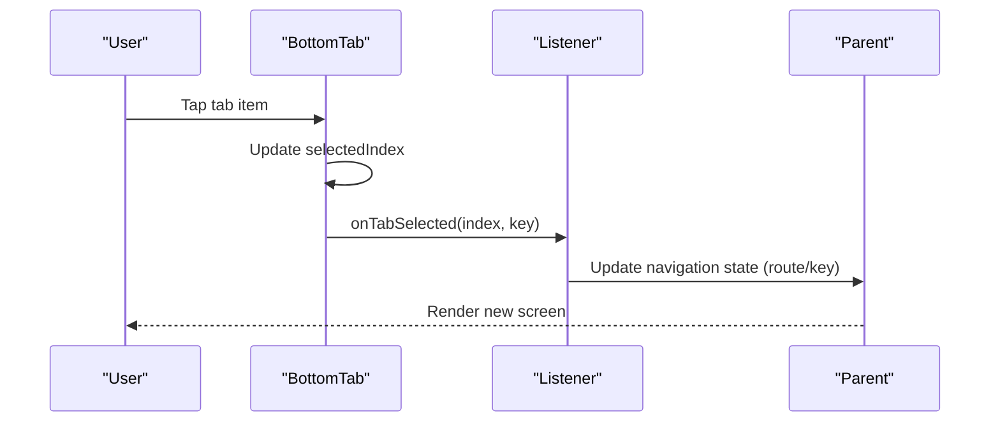
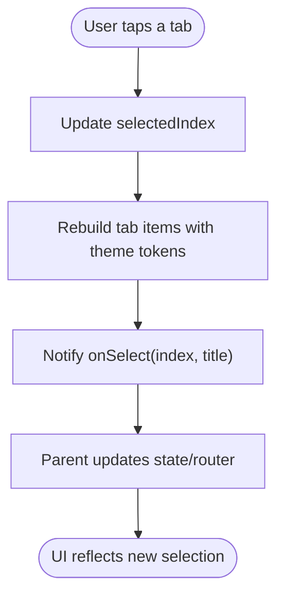
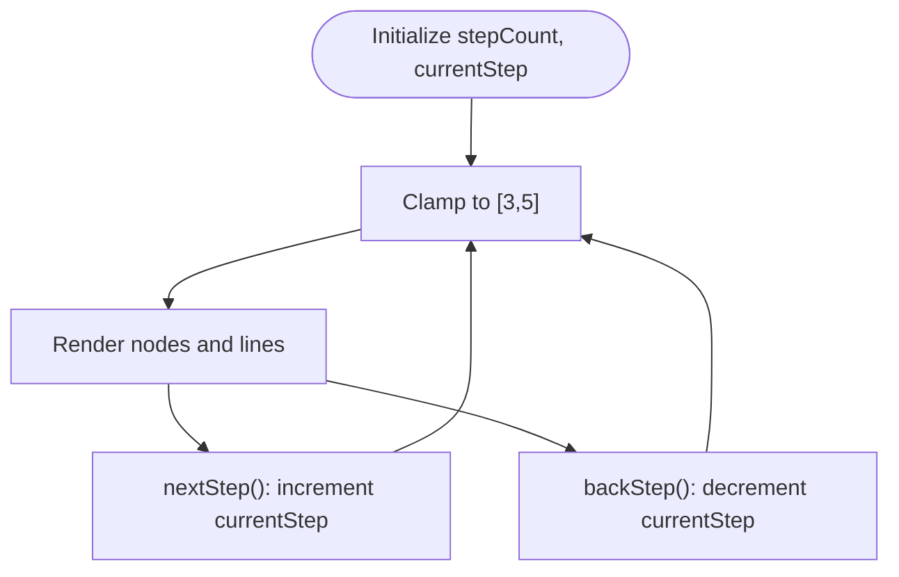
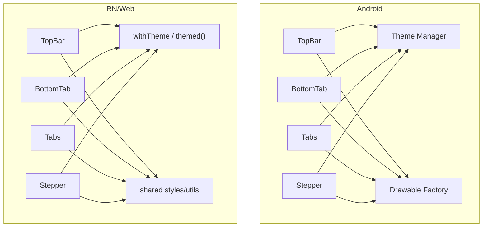
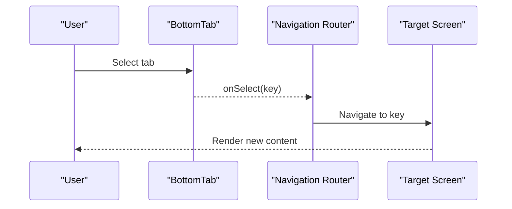

# Navigation Components

<cite>
**Referenced Files in This Document**
- [BasicTopBarView.java](file://android/library/src/main/java/com/techskillplanet/basiccontrols/widget/BasicTopBarView.java)
- [BasicBottomTabView.java](file://android/library/src/main/java/com/techskillplanet/basiccontrols/widget/BasicBottomTabView.java)
- [BasicTabsView.java](file://android/library/src/main/java/com/techskillplanet/basiccontrols/widget/BasicTabsView.java)
- [BasicStepperView.java](file://android/library/src/main/java/com/techskillplanet/basiccontrols/widget/BasicStepperView.java)
- [TspTopBar.js](file://react-native/library/src/starPlanet/components/TspTopBar.js)
- [TspBottomTab.js](file://react-native/library/src/starPlanet/components/TspBottomTab.js)
- [TspTabs.js](file://react-native/library/src/starPlanet/components/TspTabs.js)
- [TspStepper.js](file://react-native/library/src/starPlanet/components/TspStepper.js)
- [TspTopBar.js](file://react-web/library/src/components/TspTopBar.js)
- [TspBottomTab.js](file://react-web/library/src/components/TspBottomTab.js)
- [TspTabs.js](file://react-web/library/src/components/TspTabs.js)
- [TspStepper.js](file://react-web/library/src/components/TspStepper.js)
</cite>

## Table of Contents
1. [Introduction](#introduction)
2. [Project Structure](#project-structure)
3. [Core Components](#core-components)
4. [Architecture Overview](#architecture-overview)
5. [Detailed Component Analysis](#detailed-component-analysis)
6. [Dependency Analysis](#dependency-analysis)
7. [Performance Considerations](#performance-considerations)
8. [Accessibility and Interaction Patterns](#accessibility-and-interaction-patterns)
9. [Routing Integration and Navigation Patterns](#routing-integration-and-navigation-patterns)
10. [Platform-Specific Implementations](#platform-specific-implementations)
11. [Troubleshooting Guide](#troubleshooting-guide)
12. [Conclusion](#conclusion)

## Introduction
This document describes the Navigation Components in the Planet Components suite: TopBar, BottomTab, Tabs, and Stepper. It explains how these components behave across Android, React Native, and Web platforms, how they manage state, integrate with navigation libraries, and support common navigation patterns. It also covers accessibility, interaction models, and best practices for mobile and desktop experiences.

## Project Structure
The Navigation Components are implemented consistently across three platforms:
- Android: native widgets under the Android View library
- React Native: functional components under the RN library
- React Web: functional components under the React Web library



**Diagram sources**
- [BasicTopBarView.java:1-214](file://android/library/src/main/java/com/techskillplanet/basiccontrols/widget/BasicTopBarView.java#L1-L214)
- [BasicBottomTabView.java:1-170](file://android/library/src/main/java/com/techskillplanet/basiccontrols/widget/BasicBottomTabView.java#L1-L170)
- [BasicTabsView.java:1-197](file://android/library/src/main/java/com/techskillplanet/basiccontrols/widget/BasicTabsView.java#L1-L197)
- [BasicStepperView.java:1-82](file://android/library/src/main/java/com/techskillplanet/basiccontrols/widget/BasicStepperView.java#L1-L82)
- [TspTopBar.js:1-34](file://react-native/library/src/starPlanet/components/TspTopBar.js#L1-L34)
- [TspBottomTab.js:1-10](file://react-native/library/src/starPlanet/components/TspBottomTab.js#L1-L10)
- [TspTabs.js:1-10](file://react-native/library/src/starPlanet/components/TspTabs.js#L1-L10)
- [TspStepper.js:1-12](file://react-native/library/src/starPlanet/components/TspStepper.js#L1-L12)
- [TspTopBar.js:1-25](file://react-web/library/src/components/TspTopBar.js#L1-L25)
- [TspBottomTab.js:1-33](file://react-web/library/src/components/TspBottomTab.js#L1-L33)
- [TspTabs.js:1-34](file://react-web/library/src/components/TspTabs.js#L1-L34)
- [TspStepper.js:1-32](file://react-web/library/src/components/TspStepper.js#L1-L32)

**Section sources**
- [BasicTopBarView.java:1-214](file://android/library/src/main/java/com/techskillplanet/basiccontrols/widget/BasicTopBarView.java#L1-L214)
- [BasicBottomTabView.java:1-170](file://android/library/src/main/java/com/techskillplanet/basiccontrols/widget/BasicBottomTabView.java#L1-L170)
- [BasicTabsView.java:1-197](file://android/library/src/main/java/com/techskillplanet/basiccontrols/widget/BasicTabsView.java#L1-L197)
- [BasicStepperView.java:1-82](file://android/library/src/main/java/com/techskillplanet/basiccontrols/widget/BasicStepperView.java#L1-L82)
- [TspTopBar.js:1-34](file://react-native/library/src/starPlanet/components/TspTopBar.js#L1-L34)
- [TspBottomTab.js:1-10](file://react-native/library/src/starPlanet/components/TspBottomTab.js#L1-L10)
- [TspTabs.js:1-10](file://react-native/library/src/starPlanet/components/TspTabs.js#L1-L10)
- [TspStepper.js:1-12](file://react-native/library/src/starPlanet/components/TspStepper.js#L1-L12)
- [TspTopBar.js:1-25](file://react-web/library/src/components/TspTopBar.js#L1-L25)
- [TspBottomTab.js:1-33](file://react-web/library/src/components/TspBottomTab.js#L1-L33)
- [TspTabs.js:1-34](file://react-web/library/src/components/TspTabs.js#L1-L34)
- [TspStepper.js:1-32](file://react-web/library/src/components/TspStepper.js#L1-L32)

## Core Components
- TopBar: fixed header with title and optional back action; supports immersive status bar behavior on Android and top inset on RN/Web.
- BottomTab: primary navigation bar with 3–5 labeled tabs; emits selection events with key and metadata.
- Tabs: inline segmented control for in-page content switching; horizontally scrollable on Android; flat list on RN/Web.
- Stepper: step progress indicator for guided flows (3–5 steps); supports forward/backward transitions.

Each component exposes a small, consistent API across platforms:
- State setters (e.g., select tab, set current step)
- Event callbacks (selection, back press)
- Theming via theme tokens

**Section sources**
- [BasicTopBarView.java:103-140](file://android/library/src/main/java/com/techskillplanet/basiccontrols/widget/BasicTopBarView.java#L103-L140)
- [BasicBottomTabView.java:48-63](file://android/library/src/main/java/com/techskillplanet/basiccontrols/widget/BasicBottomTabView.java#L48-L63)
- [BasicTabsView.java:72-127](file://android/library/src/main/java/com/techskillplanet/basiccontrols/widget/BasicTabsView.java#L72-L127)
- [BasicStepperView.java:39-51](file://android/library/src/main/java/com/techskillplanet/basiccontrols/widget/BasicStepperView.java#L39-L51)
- [TspTopBar.js:5-12](file://react-native/library/src/starPlanet/components/TspTopBar.js#L5-L12)
- [TspBottomTab.js:5-7](file://react-native/library/src/starPlanet/components/TspBottomTab.js#L5-L7)
- [TspTabs.js:5-7](file://react-native/library/src/starPlanet/components/TspTabs.js#L5-L7)
- [TspStepper.js:5-8](file://react-native/library/src/starPlanet/components/TspStepper.js#L5-L8)
- [TspTopBar.js:17-24](file://react-web/library/src/components/TspTopBar.js#L17-L24)
- [TspBottomTab.js:16-32](file://react-web/library/src/components/TspBottomTab.js#L16-L32)
- [TspTabs.js:16-33](file://react-web/library/src/components/TspTabs.js#L16-L33)
- [TspStepper.js:15-31](file://react-web/library/src/components/TspStepper.js#L15-L31)

## Architecture Overview
The components follow a unifying pattern:
- Props/state define content and selection
- Event handlers notify parent to update route/state
- Theme tokens drive visual appearance
- Platform adapters handle platform specifics (window insets, scroll behavior, DOM roles)

```mermaid
graph LR
Parent["Parent Container<br/>State & Router"] --> TopBar["TopBar"]
Parent --> BottomTab["BottomTab"]
Parent --> Tabs["Tabs"]
Parent --> Stepper["Stepper"]
TopBar --> |onBack| Parent
BottomTab --> |onSelect(key, tab)| Parent
Tabs --> |onSelect(index, title)| Parent
Stepper --> |next/back| Parent
TopBar --> Theme["Theme Tokens"]
BottomTab --> Theme
Tabs --> Theme
Stepper --> Theme
```

[No sources needed since this diagram shows conceptual workflow, not actual code structure]

## Detailed Component Analysis

### TopBar
- Android: measures and lays out a back area, title area, and spacer; supports immersive status bar by applying window insets and adjusting layout height.
- React Native: renders a top bar with optional back button and dynamic top padding based on immersive mode and top inset.
- React Web: renders a semantic header with optional back button and aria labeling.



**Diagram sources**
- [BasicTopBarView.java:103-140](file://android/library/src/main/java/com/techskillplanet/basiccontrols/widget/BasicTopBarView.java#L103-L140)
- [TspTopBar.js:5-12](file://react-native/library/src/starPlanet/components/TspTopBar.js#L5-L12)
- [TspTopBar.js:17-24](file://react-web/library/src/components/TspTopBar.js#L17-L24)

**Section sources**
- [BasicTopBarView.java:68-101](file://android/library/src/main/java/com/techskillplanet/basiccontrols/widget/BasicTopBarView.java#L68-L101)
- [BasicTopBarView.java:166-204](file://android/library/src/main/java/com/techskillplanet/basiccontrols/widget/BasicTopBarView.java#L166-L204)
- [TspTopBar.js:13-33](file://react-native/library/src/starPlanet/components/TspTopBar.js#L13-L33)
- [TspTopBar.js:17-24](file://react-web/library/src/components/TspTopBar.js#L17-L24)

### BottomTab
- Android: tab model with key/icon/text; selection triggers re-render and fires listener with index/key.
- React Native: maps tabs to pressable items; selection updates active key and applies theme.
- React Web: renders buttons with ARIA roles and selection state.



**Diagram sources**
- [BasicBottomTabView.java:95-103](file://android/library/src/main/java/com/techskillplanet/basiccontrols/widget/BasicBottomTabView.java#L95-L103)
- [TspBottomTab.js](file://react-native/library/src/starPlanet/components/TspBottomTab.js#L7)
- [TspBottomTab.js:26-27](file://react-web/library/src/components/TspBottomTab.js#L26-L27)

**Section sources**
- [BasicBottomTabView.java:24-76](file://android/library/src/main/java/com/techskillplanet/basiccontrols/widget/BasicBottomTabView.java#L24-L76)
- [BasicBottomTabView.java:125-146](file://android/library/src/main/java/com/techskillplanet/basiccontrols/widget/BasicBottomTabView.java#L125-L146)
- [TspBottomTab.js:5-7](file://react-native/library/src/starPlanet/components/TspBottomTab.js#L5-L7)
- [TspBottomTab.js:16-32](file://react-web/library/src/components/TspBottomTab.js#L16-L32)

### Tabs
- Android: HorizontalScrollView hosting a LinearLayout; supports disabled state and variant protocol; selection updates and notifies listener.
- React Native: ScrollView with horizontal scrolling and selected item background.
- React Web: Flat list with ARIA attributes for tablist/tab semantics.



**Diagram sources**
- [BasicTabsView.java:118-127](file://android/library/src/main/java/com/techskillplanet/basiccontrols/widget/BasicTabsView.java#L118-L127)
- [BasicTabsView.java:149-176](file://android/library/src/main/java/com/techskillplanet/basiccontrols/widget/BasicTabsView.java#L149-L176)
- [TspTabs.js:5-7](file://react-native/library/src/starPlanet/components/TspTabs.js#L5-L7)
- [TspTabs.js:16-33](file://react-web/library/src/components/TspTabs.js#L16-L33)

**Section sources**
- [BasicTabsView.java:30-70](file://android/library/src/main/java/com/techskillplanet/basiccontrols/widget/BasicTabsView.java#L30-L70)
- [BasicTabsView.java:129-147](file://android/library/src/main/java/com/techskillplanet/basiccontrols/widget/BasicTabsView.java#L129-L147)
- [TspTabs.js:5-7](file://react-native/library/src/starPlanet/components/TspTabs.js#L5-L7)
- [TspTabs.js:16-33](file://react-web/library/src/components/TspTabs.js#L16-L33)

### Stepper
- Android: draws nodes and connecting lines; clamps steps to 3–5; supports next/back transitions.
- React Native/Web: renders step nodes and lines; clamps counts and current step; uses theme tokens for colors.



**Diagram sources**
- [BasicStepperView.java:39-51](file://android/library/src/main/java/com/techskillplanet/basiccontrols/widget/BasicStepperView.java#L39-L51)
- [BasicStepperView.java:53-80](file://android/library/src/main/java/com/techskillplanet/basiccontrols/widget/BasicStepperView.java#L53-L80)
- [TspStepper.js:7-10](file://react-native/library/src/starPlanet/components/TspStepper.js#L7-L10)
- [TspStepper.js:15-31](file://react-web/library/src/components/TspStepper.js#L15-L31)

**Section sources**
- [BasicStepperView.java:20-37](file://android/library/src/main/java/com/techskillplanet/basiccontrols/widget/BasicStepperView.java#L20-L37)
- [BasicStepperView.java:39-51](file://android/library/src/main/java/com/techskillplanet/basiccontrols/widget/BasicStepperView.java#L39-L51)
- [TspStepper.js:5-10](file://react-native/library/src/starPlanet/components/TspStepper.js#L5-L10)
- [TspStepper.js:15-31](file://react-web/library/src/components/TspStepper.js#L15-L31)

## Dependency Analysis
- Android components depend on theme manager and drawable factory for consistent visuals and rounded fills/strokes.
- RN/Web components depend on a shared theme adapter and style constants to align with native visuals.
- All components expose minimal event APIs to decouple from specific routers while enabling integration with any navigation solution.



**Diagram sources**
- [BasicTopBarView.java:141-155](file://android/library/src/main/java/com/techskillplanet/basiccontrols/widget/BasicTopBarView.java#L141-L155)
- [BasicBottomTabView.java:132-144](file://android/library/src/main/java/com/techskillplanet/basiccontrols/widget/BasicBottomTabView.java#L132-L144)
- [BasicTabsView.java:136-141](file://android/library/src/main/java/com/techskillplanet/basiccontrols/widget/BasicTabsView.java#L136-L141)
- [BasicStepperView.java:67-71](file://android/library/src/main/java/com/techskillplanet/basiccontrols/widget/BasicStepperView.java#L67-L71)
- [TspTopBar.js](file://react-native/library/src/starPlanet/components/TspTopBar.js#L3)
- [TspBottomTab.js](file://react-native/library/src/starPlanet/components/TspBottomTab.js#L3)
- [TspTabs.js](file://react-native/library/src/starPlanet/components/TspTabs.js#L3)
- [TspStepper.js](file://react-native/library/src/starPlanet/components/TspStepper.js#L3)

**Section sources**
- [BasicTopBarView.java:141-155](file://android/library/src/main/java/com/techskillplanet/basiccontrols/widget/BasicTopBarView.java#L141-L155)
- [BasicBottomTabView.java:132-144](file://android/library/src/main/java/com/techskillplanet/basiccontrols/widget/BasicBottomTabView.java#L132-L144)
- [BasicTabsView.java:136-141](file://android/library/src/main/java/com/techskillplanet/basiccontrols/widget/BasicTabsView.java#L136-L141)
- [BasicStepperView.java:67-71](file://android/library/src/main/java/com/techskillplanet/basiccontrols/widget/BasicStepperView.java#L67-L71)
- [TspTopBar.js](file://react-native/library/src/starPlanet/components/TspTopBar.js#L3)
- [TspBottomTab.js](file://react-native/library/src/starPlanet/components/TspBottomTab.js#L3)
- [TspTabs.js](file://react-native/library/src/starPlanet/components/TspTabs.js#L3)
- [TspStepper.js](file://react-native/library/src/starPlanet/components/TspStepper.js#L3)

## Performance Considerations
- Android: Views are lightweight; avoid frequent rebuilds by batching state updates and using stable keys for tabs.
- RN: Prefer memoization for tab lists and avoid unnecessary re-renders by passing stable callbacks and keys.
- Web: Use efficient rendering for long tab lists; consider virtualization for very large sets.

[No sources needed since this section provides general guidance]

## Accessibility and Interaction Patterns
- Android: Uses focusable/clickable children; selection reflected via background and text color changes.
- RN/Web: Buttons include ARIA roles and states; ensure keyboard navigation and screen reader announcements.
- General: Provide clear affordances for selection, maintain sufficient contrast, and support touch targets ≥ 44dp on mobile.

**Section sources**
- [BasicBottomTabView.java:93-103](file://android/library/src/main/java/com/techskillplanet/basiccontrols/widget/BasicBottomTabView.java#L93-L103)
- [TspBottomTab.js:26-27](file://react-web/library/src/components/TspBottomTab.js#L26-L27)
- [TspTabs.js:26-27](file://react-web/library/src/components/TspTabs.js#L26-L27)

## Routing Integration and Navigation Patterns
Common integration patterns:
- BottomTab-driven routing: parent listens for tab selection and navigates to the associated route/key.
- TopBar back action: parent handles back navigation or exits flow.
- Tabs-driven filters: parent updates filtered content based on selected index.
- Stepper as flow controller: parent advances or retreats step based on next/back actions.



**Diagram sources**
- [BasicBottomTabView.java:100-102](file://android/library/src/main/java/com/techskillplanet/basiccontrols/widget/BasicBottomTabView.java#L100-L102)
- [TspBottomTab.js](file://react-native/library/src/starPlanet/components/TspBottomTab.js#L7)

**Section sources**
- [BasicBottomTabView.java:61-63](file://android/library/src/main/java/com/techskillplanet/basiccontrols/widget/BasicBottomTabView.java#L61-L63)
- [TspBottomTab.js:5-7](file://react-native/library/src/starPlanet/components/TspBottomTab.js#L5-L7)

## Platform-Specific Implementations
- Android
  - Window insets and immersive status bar handled via view lifecycle and insets listener.
  - Measured and laid out manually to accommodate status bar inset and fixed content height.
  - Uses theme tokens and drawable factory for consistent visuals.
- React Native
  - Uses top inset and immersive flag to adjust paddingTop; relies on theme adapter for colors.
  - Flat list rendering for Tabs and BottomTab; ScrollView for horizontal scrolling.
- React Web
  - Semantic HTML elements with ARIA roles; themed via style objects and theme provider.

**Section sources**
- [BasicTopBarView.java:68-101](file://android/library/src/main/java/com/techskillplanet/basiccontrols/widget/BasicTopBarView.java#L68-L101)
- [BasicTopBarView.java:166-204](file://android/library/src/main/java/com/techskillplanet/basiccontrols/widget/BasicTopBarView.java#L166-L204)
- [TspTopBar.js:13-33](file://react-native/library/src/starPlanet/components/TspTopBar.js#L13-L33)
- [TspTabs.js:16-33](file://react-web/library/src/components/TspTabs.js#L16-L33)
- [TspBottomTab.js:16-32](file://react-web/library/src/components/TspBottomTab.js#L16-L32)

## Troubleshooting Guide
- Selection not updating
  - Verify parent is listening to selection callbacks and updating state/router accordingly.
  - Ensure keys are unique and stable for BottomTab.
- Immersive status bar not applied
  - Confirm immersive flag is enabled and top inset is passed on RN/Web.
  - On Android, ensure the view is attached and insets are applied.
- Disabled state not visible
  - Check disabled prop and theme tokens for disabled colors.
- Stepper out of bounds
  - Ensure stepCount is clamped to [3,5] and currentStep is within range.

**Section sources**
- [BasicTabsView.java:111-115](file://android/library/src/main/java/com/techskillplanet/basiccontrols/widget/BasicTabsView.java#L111-L115)
- [BasicStepperView.java:39-51](file://android/library/src/main/java/com/techskillplanet/basiccontrols/widget/BasicStepperView.java#L39-L51)
- [TspStepper.js:7-10](file://react-native/library/src/starPlanet/components/TspStepper.js#L7-L10)

## Conclusion
The Navigation Components provide a cohesive, cross-platform foundation for top-level navigation, in-page segmentation, and guided flows. Their consistent APIs, strong theming, and platform-aware implementations enable predictable user experiences across mobile and web. Integrate them with your router by wiring selection callbacks to route updates, and apply platform-specific insets and accessibility attributes as needed.