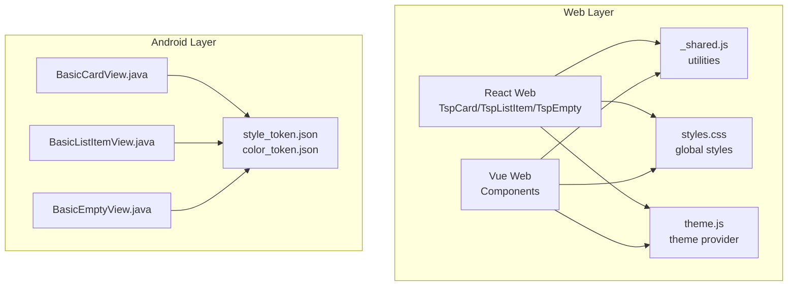
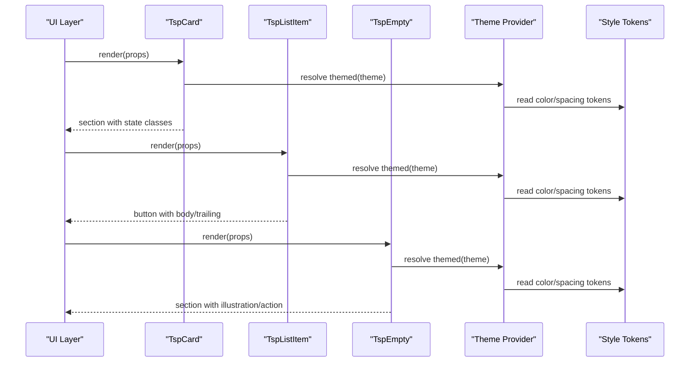
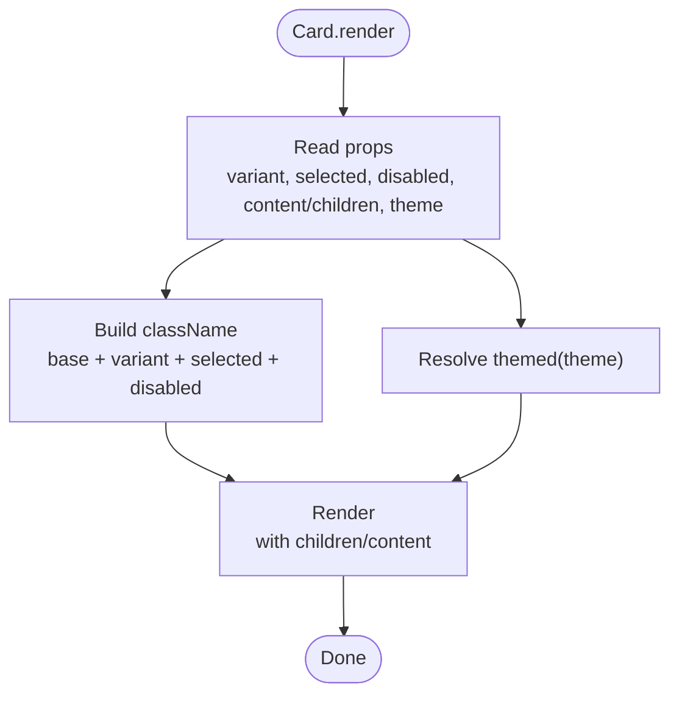
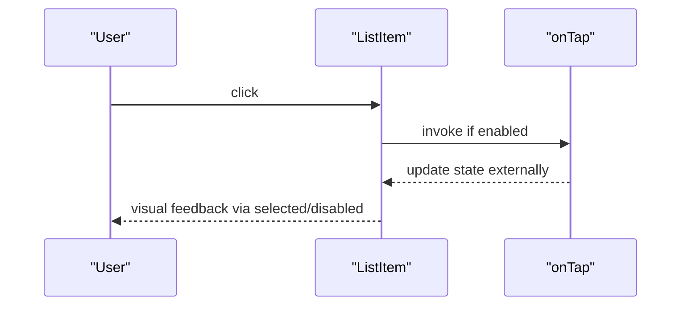
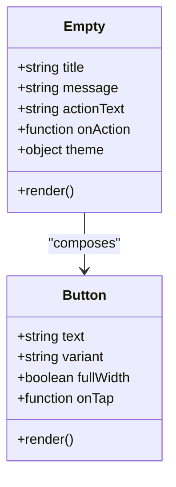
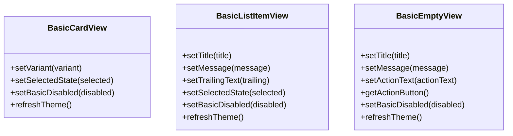
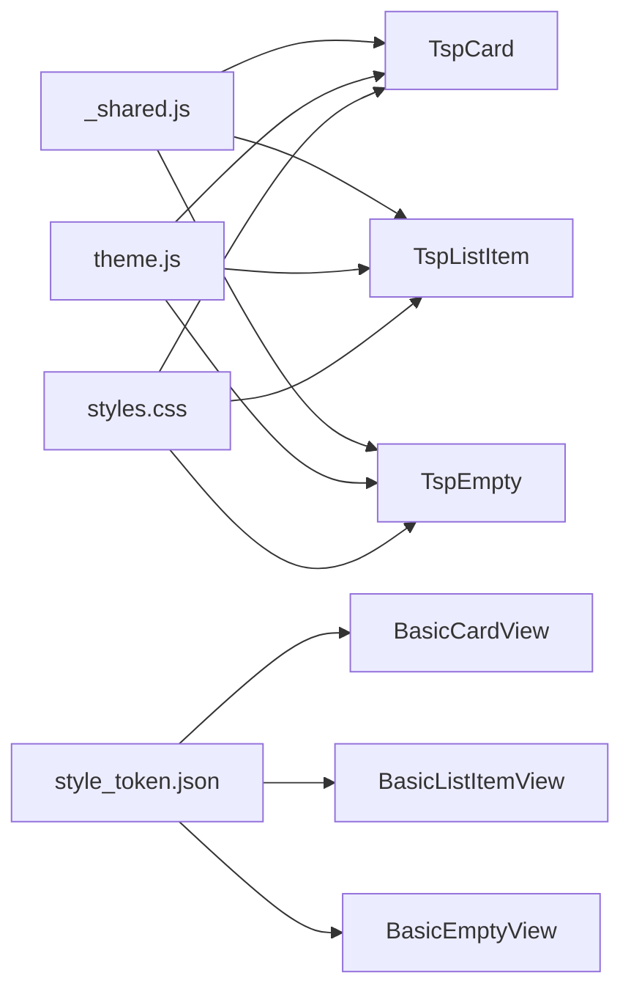

# Surface Components

<cite>
**Referenced Files in This Document**
- [TspCard.js](file://react-web/library/src/components/TspCard.js)
- [TspListItem.js](file://react-web/library/src/components/TspListItem.js)
- [TspEmpty.js](file://react-web/library/src/components/TspEmpty.js)
- [BasicCardView.java](file://android/library/src/main/java/com/techskillplanet/basiccontrols/widget/BasicCardView.java)
- [BasicListItemView.java](file://android/library/src/main/java/com/techskillplanet/basiccontrols/widget/BasicListItemView.java)
- [BasicEmptyView.java](file://android/library/src/main/java/com/techskillplanet/basiccontrols/widget/BasicEmptyView.java)
- [_shared.js](file://react-web/library/src/components/_shared.js)
- [styles.css](file://react-web/library/src/styles.css)
- [theme.js](file://react-web/library/src/theme.js)
</cite>

## Table of Contents
1. [Introduction](#introduction)
2. [Project Structure](#project-structure)
3. [Core Components](#core-components)
4. [Architecture Overview](#architecture-overview)
5. [Detailed Component Analysis](#detailed-component-analysis)
6. [Dependency Analysis](#dependency-analysis)
7. [Performance Considerations](#performance-considerations)
8. [Accessibility and Semantic Markup](#accessibility-and-semantic-markup)
9. [Responsive Design Considerations](#responsive-design-considerations)
10. [Integration with Data Display Components](#integration-with-data-display-components)
11. [Troubleshooting Guide](#troubleshooting-guide)
12. [Conclusion](#conclusion)

## Introduction
This document provides comprehensive documentation for Surface Components focused on Card, ListItem, and Empty across the multi-platform codebase. It explains layout patterns, content organization, visual hierarchy, styling options, spacing configurations, responsive design considerations, and accessibility. It also covers integration patterns with data display components and offers troubleshooting guidance.

## Project Structure
The Surface Components are implemented consistently across platforms:
- Web (React and Vue): Functional components with shared utilities and theme integration
- Android (Java): View-based widgets with theme-aware drawing and layout
- Cross-platform tokens: Color and style tokens define spacing, typography, and visual states

**Diagram sources**
- [TspCard.js:1-28](file://react-web/library/src/components/TspCard.js#L1-L28)
- [TspListItem.js:1-27](file://react-web/library/src/components/TspListItem.js#L1-L27)
- [TspEmpty.js:1-28](file://react-web/library/src/components/TspEmpty.js#L1-L28)
- [BasicCardView.java:1-104](file://android/library/src/main/java/com/techskillplanet/basiccontrols/widget/BasicCardView.java#L1-L104)
- [BasicListItemView.java:1-145](file://android/library/src/main/java/com/techskillplanet/basiccontrols/widget/BasicListItemView.java#L1-L145)
- [BasicEmptyView.java:1-155](file://android/library/src/main/java/com/techskillplanet/basiccontrols/widget/BasicEmptyView.java#L1-L155)

**Section sources**
- [TspCard.js:1-28](file://react-web/library/src/components/TspCard.js#L1-L28)
- [TspListItem.js:1-27](file://react-web/library/src/components/TspListItem.js#L1-L27)
- [TspEmpty.js:1-28](file://react-web/library/src/components/TspEmpty.js#L1-L28)
- [BasicCardView.java:1-104](file://android/library/src/main/java/com/techskillplanet/basiccontrols/widget/BasicCardView.java#L1-L104)
- [BasicListItemView.java:1-145](file://android/library/src/main/java/com/techskillplanet/basiccontrols/widget/BasicListItemView.java#L1-L145)
- [BasicEmptyView.java:1-155](file://android/library/src/main/java/com/techskillplanet/basiccontrols/widget/BasicEmptyView.java#L1-L155)

## Core Components
This section summarizes the primary responsibilities and capabilities of each component.

- Card
  - Purpose: Content container with raised surface and optional selection/disabled states
  - Key props: variant, selected, disabled, content/children, theme
  - Rendering: section element with theme-driven styles and state classes
- ListItem
  - Purpose: List row with title, optional message, and trailing element
  - Key props: title, message, trailing, selected, disabled, onTap
  - Rendering: button element with body and trailing segments
- Empty
  - Purpose: Empty state placeholder with illustration, title, message, and optional action
  - Key props: title, message, actionText, onAction, theme
  - Rendering: section with illustration mark, title, message, and action button

**Section sources**
- [TspCard.js:3-27](file://react-web/library/src/components/TspCard.js#L3-L27)
- [TspListItem.js:3-26](file://react-web/library/src/components/TspListItem.js#L3-L26)
- [TspEmpty.js:4-27](file://react-web/library/src/components/TspEmpty.js#L4-L27)

## Architecture Overview
The components follow a consistent pattern:
- Props define content and state
- Theme integration applies colors, spacing, and typography
- Platform-specific rendering adapts to web DOM or Android views
- Shared utilities and tokens ensure cross-platform consistency

**Diagram sources**
- [TspCard.js:18-27](file://react-web/library/src/components/TspCard.js#L18-L27)
- [TspListItem.js:19-26](file://react-web/library/src/components/TspListItem.js#L19-L26)
- [TspEmpty.js:18-27](file://react-web/library/src/components/TspEmpty.js#L18-L27)
- [theme.js](file://react-web/library/src/theme.js)
- [styles.css](file://react-web/library/src/styles.css)

## Detailed Component Analysis

### Card Component
Card provides a raised surface container with optional selection and disabled states. It supports a variant field for future extension and integrates with the theme system for colors and spacing.

Key behaviors:
- State classes: selected, disabled
- Content: accepts either children or a content prop
- Theme integration: themed styles applied via theme provider

**Diagram sources**
- [TspCard.js:18-27](file://react-web/library/src/components/TspCard.js#L18-L27)

**Section sources**
- [TspCard.js:3-27](file://react-web/library/src/components/TspCard.js#L3-L27)
- [_shared.js](file://react-web/library/src/components/_shared.js)

### ListItem Component
ListItem renders a button-like row with a title, optional message, and trailing element. It supports selected and disabled states and exposes an onTap handler.

Key behaviors:
- Structure: body (title + optional message) and trailing segment
- Interaction: enabled/disabled button with onClick handler
- Theming: resolves colors and typography from theme

**Diagram sources**
- [TspListItem.js:19-26](file://react-web/library/src/components/TspListItem.js#L19-L26)

**Section sources**
- [TspListItem.js:3-26](file://react-web/library/src/components/TspListItem.js#L3-L26)
- [_shared.js](file://react-web/library/src/components/_shared.js)

### Empty Component
Empty displays an empty-state illustration, title, message, and an optional action button. It integrates with the theme system and composes a Button component for actions.

Key behaviors:
- Illustration: brand-consistent mark
- Optional action: renders a primary Button when actionText is provided
- Theming: applies theme colors and spacing

**Diagram sources**
- [TspEmpty.js:18-27](file://react-web/library/src/components/TspEmpty.js#L18-L27)

**Section sources**
- [TspEmpty.js:4-27](file://react-web/library/src/components/TspEmpty.js#L4-L27)
- [_shared.js](file://react-web/library/src/components/_shared.js)

### Android Surface Components
On Android, the components are implemented as Views with theme-aware drawing and layout.

- BasicCardView
  - Extends FrameLayout
  - Variant and selection influence background fill and stroke
  - Padding and radius from style tokens
- BasicListItemView
  - Extends LinearLayout with horizontal orientation
  - Title and message with bold title and secondary message
  - Trailing text aligned right
- BasicEmptyView
  - Extends LinearLayout with vertical orientation and center gravity
  - Brand illustration, centered title/message
  - Action button configured as primary

**Diagram sources**
- [BasicCardView.java:20-104](file://android/library/src/main/java/com/techskillplanet/basiccontrols/widget/BasicCardView.java#L20-L104)
- [BasicListItemView.java:24-145](file://android/library/src/main/java/com/techskillplanet/basiccontrols/widget/BasicListItemView.java#L24-L145)
- [BasicEmptyView.java:24-155](file://android/library/src/main/java/com/techskillplanet/basiccontrols/widget/BasicEmptyView.java#L24-L155)

**Section sources**
- [BasicCardView.java:14-104](file://android/library/src/main/java/com/techskillplanet/basiccontrols/widget/BasicCardView.java#L14-L104)
- [BasicListItemView.java:18-145](file://android/library/src/main/java/com/techskillplanet/basiccontrols/widget/BasicListItemView.java#L18-L145)
- [BasicEmptyView.java:18-155](file://android/library/src/main/java/com/techskillplanet/basiccontrols/widget/BasicEmptyView.java#L18-L155)

## Dependency Analysis
Cross-platform dependencies and relationships:
- Web components depend on shared utilities and theme provider
- Android components depend on theme manager and drawable factory
- Style tokens underpin spacing, radii, and typography

**Diagram sources**
- [TspCard.js:1-28](file://react-web/library/src/components/TspCard.js#L1-L28)
- [TspListItem.js:1-27](file://react-web/library/src/components/TspListItem.js#L1-L27)
- [TspEmpty.js:1-28](file://react-web/library/src/components/TspEmpty.js#L1-L28)
- [theme.js](file://react-web/library/src/theme.js)
- [styles.css](file://react-web/library/src/styles.css)
- [BasicCardView.java:66-84](file://android/library/src/main/java/com/techskillplanet/basiccontrols/widget/BasicCardView.java#L66-L84)
- [BasicListItemView.java:99-121](file://android/library/src/main/java/com/techskillplanet/basiccontrols/widget/BasicListItemView.java#L99-L121)
- [BasicEmptyView.java:107-129](file://android/library/src/main/java/com/techskillplanet/basiccontrols/widget/BasicEmptyView.java#L107-L129)

**Section sources**
- [TspCard.js:1-28](file://react-web/library/src/components/TspCard.js#L1-L28)
- [TspListItem.js:1-27](file://react-web/library/src/components/TspListItem.js#L1-L27)
- [TspEmpty.js:1-28](file://react-web/library/src/components/TspEmpty.js#L1-L28)
- [theme.js](file://react-web/library/src/theme.js)
- [styles.css](file://react-web/library/src/styles.css)
- [BasicCardView.java:66-84](file://android/library/src/main/java/com/techskillplanet/basiccontrols/widget/BasicCardView.java#L66-L84)
- [BasicListItemView.java:99-121](file://android/library/src/main/java/com/techskillplanet/basiccontrols/widget/BasicListItemView.java#L99-L121)
- [BasicEmptyView.java:107-129](file://android/library/src/main/java/com/techskillplanet/basiccontrols/widget/BasicEmptyView.java#L107-L129)

## Performance Considerations
- Prefer minimal re-renders by passing stable prop references where applicable
- Use variant and state flags judiciously to avoid unnecessary style recalculations
- On Android, rely on theme refresh batching to minimize layout passes
- Keep content lightweight inside Card and ListItem containers to maintain smooth scrolling

## Accessibility and Semantic Markup
Recommendations for screen reader support and semantics:
- Card
  - Use section with appropriate aria roles if used as a grouping container
  - Ensure focus order is logical when Card wraps interactive elements
- ListItem
  - As a button, ensure title and message are concise and descriptive
  - Provide meaningful onTap handlers; announce state changes (selected/disabled)
- Empty
  - Use strong/title for the headline and paragraph for the message
  - Ensure action button has accessible text and clear purpose

Best practices:
- Provide explicit labels for interactive elements
- Announce state changes (e.g., selection) to assistive technologies
- Ensure sufficient color contrast per theme tokens
- Test keyboard navigation and focus indicators

## Responsive Design Considerations
Guidance for responsive layouts:
- Use theme-provided spacing tokens for padding and margins
- Maintain readable typography scales across breakpoints
- On mobile, consider full-width buttons and adjusted paddings
- On desktop, preserve comfortable touch targets while optimizing density

## Integration with Data Display Components
Patterns for integrating Surface Components with lists and grids:
- Use ListItem as a row in data tables or settings screens
- Wrap data rows in Card for emphasis or grouping
- Use Empty to indicate no results after filtering or loading states
- Compose multiple Surface Components to create complex layouts (e.g., grouped cards with list items)

## Troubleshooting Guide
Common issues and resolutions:
- Disabled state not applying
  - Verify disabled prop is passed and theme tokens reflect disabled colors
- Selected state not visible
  - Confirm selected class or selection logic is active and theme highlights are configured
- Spacing inconsistencies
  - Ensure style tokens are loaded and theme provider is initialized
- Android rendering anomalies
  - Check theme manager initialization and drawable factory parameters

**Section sources**
- [TspCard.js:18-27](file://react-web/library/src/components/TspCard.js#L18-L27)
- [TspListItem.js:19-26](file://react-web/library/src/components/TspListItem.js#L19-L26)
- [TspEmpty.js:18-27](file://react-web/library/src/components/TspEmpty.js#L18-L27)
- [BasicCardView.java:65-85](file://android/library/src/main/java/com/techskillplanet/basiccontrols/widget/BasicCardView.java#L65-L85)
- [BasicListItemView.java:98-121](file://android/library/src/main/java/com/techskillplanet/basiccontrols/widget/BasicListItemView.java#L98-L121)
- [BasicEmptyView.java:104-129](file://android/library/src/main/java/com/techskillplanet/basiccontrols/widget/BasicEmptyView.java#L104-L129)

## Conclusion
Surface Components (Card, ListItem, and Empty) provide consistent, theme-driven containers across platforms. They emphasize clear visual hierarchy, accessible semantics, and responsive spacing. By leveraging shared utilities and style tokens, teams can compose complex layouts while maintaining design system fidelity.