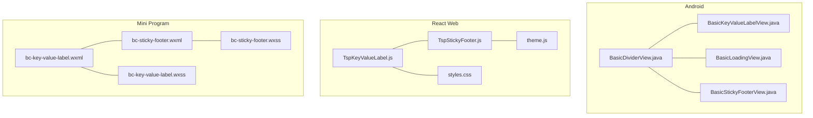
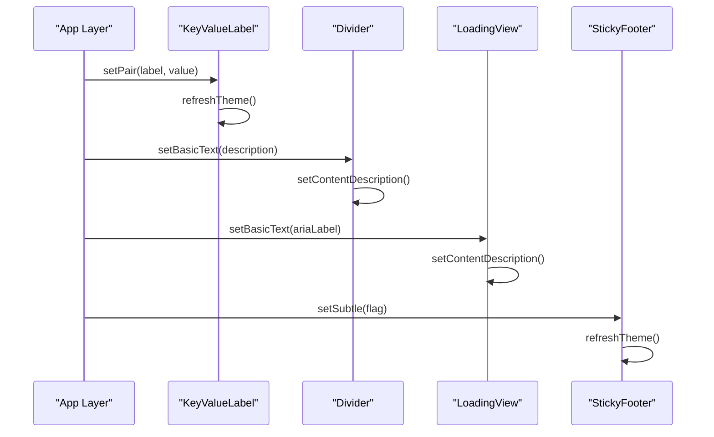
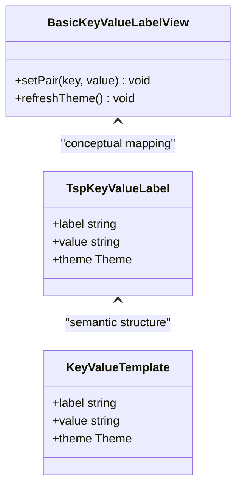
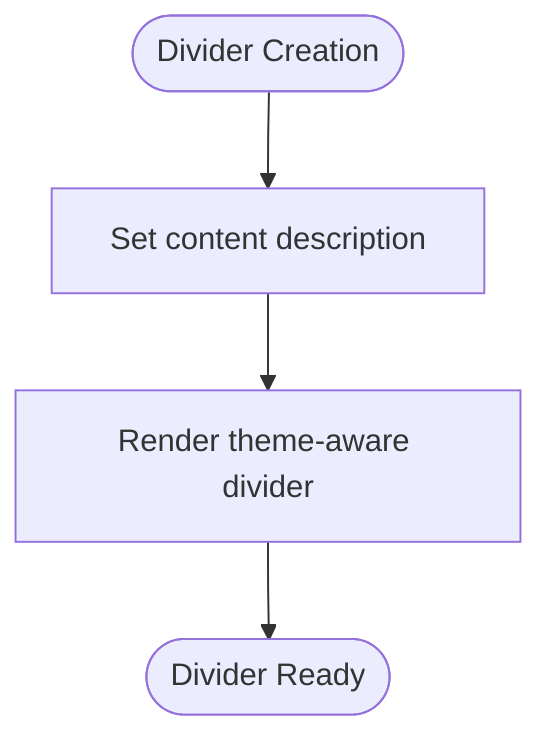
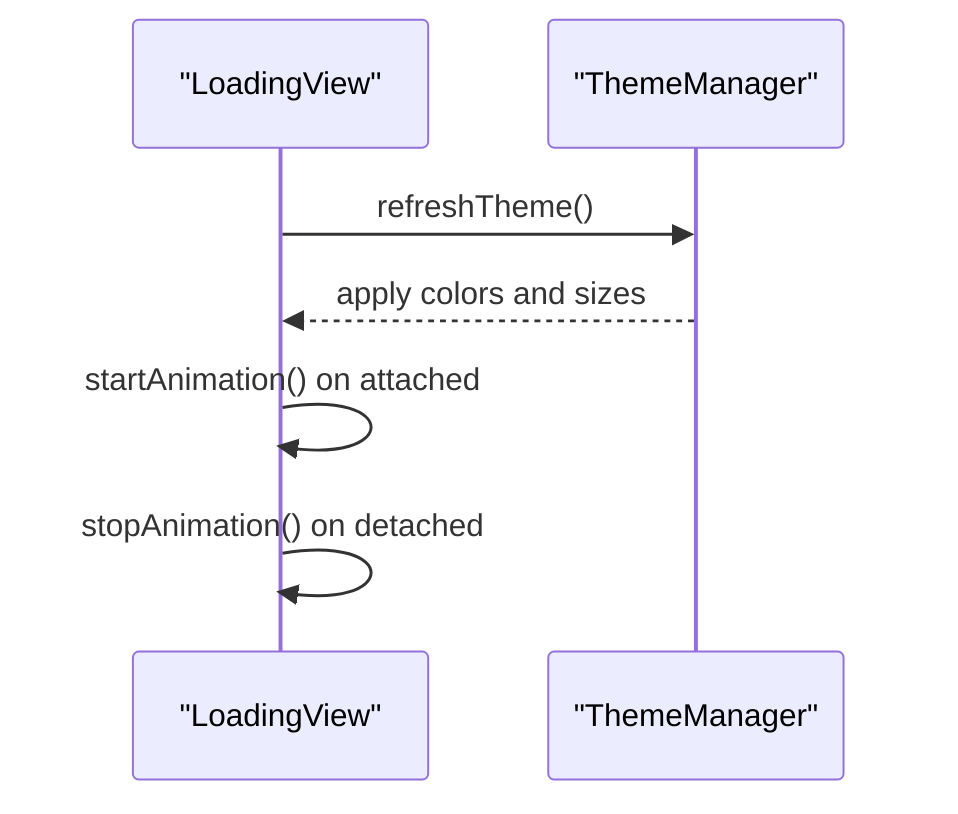
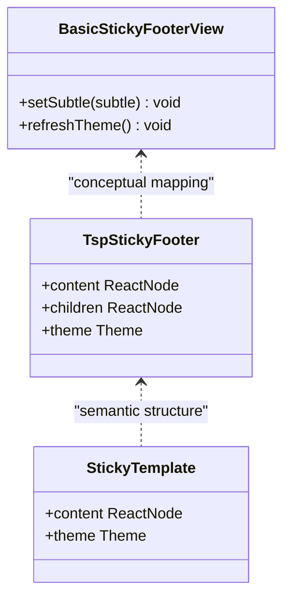
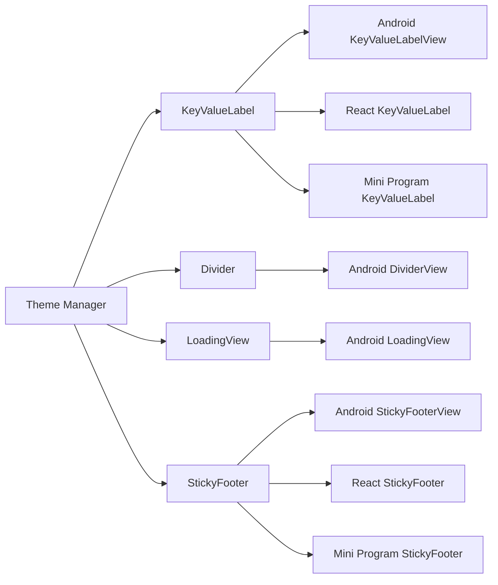

# Utility Components

<cite>
**Referenced Files in This Document**
- [BasicDividerView.java](file://android/library/src/main/java/com/techskillplanet/basiccontrols/widget/BasicDividerView.java)
- [BasicKeyValueLabelView.java](file://android/library/src/main/java/com/techskillplanet/basiccontrols/widget/BasicKeyValueLabelView.java)
- [BasicLoadingView.java](file://android/library/src/main/java/com/techskillplanet/basiccontrols/widget/BasicLoadingView.java)
- [BasicStickyFooterView.java](file://android/library/src/main/java/com/techskillplanet/basiccontrols/widget/BasicStickyFooterView.java)
- [bc-key-value-label.wxml](file://miniprogram/library/components/bc-key-value-label/bc-key-value-label.wxml)
- [bc-sticky-footer.wxml](file://miniprogram/library/components/bc-sticky-footer/bc-sticky-footer.wxml)
- [TspKeyValueLabel.js](file://react-web/library/src/components/TspKeyValueLabel.js)
- [TspStickyFooter.js](file://react-web/library/src/components/TspStickyFooter.js)
- [BasicControlsSample.js](file://react-web/samples/BasicControlsSample.js)
- [bc-key-value-label.wxss](file://miniprogram/library/components/bc-key-value-label/bc-key-value-label.wxss)
- [bc-sticky-footer.wxss](file://miniprogram/library/components/bc-sticky-footer/bc-sticky-footer.wxss)
- [styles.css](file://react-web/library/src/styles.css)
- [theme.js](file://react-web/library/src/theme.js)
- [BasicPlanetLoadingView.java](file://android/library/src/main/java/com/techskillplanet/basiccontrols/widget/BasicPlanetLoadingView.java)
- [BasicRefreshLayout.java](file://android/library/src/main/java/com/techskillplanet/basiccontrols/widget/BasicRefreshLayout.java)
</cite>

## Table of Contents
1. [Introduction](#introduction)
2. [Project Structure](#project-structure)
3. [Core Components](#core-components)
4. [Architecture Overview](#architecture-overview)
5. [Detailed Component Analysis](#detailed-component-analysis)
6. [Dependency Analysis](#dependency-analysis)
7. [Performance Considerations](#performance-considerations)
8. [Troubleshooting Guide](#troubleshooting-guide)
9. [Conclusion](#conclusion)
10. [Appendices](#appendices)

## Introduction
This document provides comprehensive documentation for Utility Components focused on layout and content organization: KeyValueLabel, Divider, LoadingView, and StickyFooter. These components are designed to be lightweight, theme-aware, and cross-platform consistent across Android, React Web, Vue Web, React Native, iOS SwiftUI, Mini Program, and Kuikly environments. They emphasize:
- Styling flexibility via theme tokens and platform-specific styling
- Content formatting options for labels and values
- Positioning strategies for sticky footers and dividers
- Accessibility through semantic markup and content descriptions
- Responsive design considerations for various screen sizes

## Project Structure
Utility components are implemented consistently across platforms while leveraging each platform’s native capabilities:
- Android: Custom Views extending standard widgets with theme-aware rendering
- React Web: Functional components with theme injection and semantic HTML
- Mini Program: WXML templates with CSS custom properties for theming
- iOS SwiftUI: Lightweight wrappers aligning with platform conventions
- React Native: Cross-platform component definitions with platform-specific variants
- Vue Web: Similar to React Web with Vue component patterns
- Kuikly: Shared logic across JavaScript targets

**Diagram sources**
- [BasicDividerView.java:11-44](file://android/library/src/main/java/com/techskillplanet/basiccontrols/widget/BasicDividerView.java#L11-L44)
- [BasicKeyValueLabelView.java:17-60](file://android/library/src/main/java/com/techskillplanet/basiccontrols/widget/BasicKeyValueLabelView.java#L17-L60)
- [BasicLoadingView.java:40-87](file://android/library/src/main/java/com/techskillplanet/basiccontrols/widget/BasicLoadingView.java#L40-L87)
- [BasicStickyFooterView.java:14-37](file://android/library/src/main/java/com/techskillplanet/basiccontrols/widget/BasicStickyFooterView.java#L14-L37)
- [TspKeyValueLabel.js:3-17](file://react-web/library/src/components/TspKeyValueLabel.js#L3-L17)
- [TspStickyFooter.js:3-17](file://react-web/library/src/components/TspStickyFooter.js#L3-L17)
- [bc-key-value-label.wxml:1-4](file://miniprogram/library/components/bc-key-value-label/bc-key-value-label.wxml#L1-L4)
- [bc-sticky-footer.wxml:1-4](file://miniprogram/library/components/bc-sticky-footer/bc-sticky-footer.wxml#L1-L4)
- [bc-key-value-label.wxss](file://miniprogram/library/components/bc-key-value-label/bc-key-value-label.wxss)
- [bc-sticky-footer.wxss](file://miniprogram/library/components/bc-sticky-footer/bc-sticky-footer.wxss)
- [styles.css](file://react-web/library/src/styles.css)
- [theme.js](file://react-web/library/src/theme.js)

**Section sources**
- [BasicDividerView.java:11-44](file://android/library/src/main/java/com/techskillplanet/basiccontrols/widget/BasicDividerView.java#L11-L44)
- [BasicKeyValueLabelView.java:17-60](file://android/library/src/main/java/com/techskillplanet/basiccontrols/widget/BasicKeyValueLabelView.java#L17-L60)
- [BasicLoadingView.java:40-87](file://android/library/src/main/java/com/techskillplanet/basiccontrols/widget/BasicLoadingView.java#L40-L87)
- [BasicStickyFooterView.java:14-37](file://android/library/src/main/java/com/techskillplanet/basiccontrols/widget/BasicStickyFooterView.java#L14-L37)
- [TspKeyValueLabel.js:3-17](file://react-web/library/src/components/TspKeyValueLabel.js#L3-L17)
- [TspStickyFooter.js:3-17](file://react-web/library/src/components/TspStickyFooter.js#L3-L17)
- [bc-key-value-label.wxml:1-4](file://miniprogram/library/components/bc-key-value-label/bc-key-value-label.wxml#L1-L4)
- [bc-sticky-footer.wxml:1-4](file://miniprogram/library/components/bc-sticky-footer/bc-sticky-footer.wxml#L1-L4)

## Core Components
This section introduces the four utility components and their roles:
- KeyValueLabel: Displays a label and a bold value side by side with theme-aware typography and spacing
- Divider: A lightweight horizontal separator with semantic content description support
- LoadingView: An animated indicator suitable for spinners and progress cues
- StickyFooter: A fixed-position container for primary page actions at the viewport bottom

Each component adheres to a unified component protocol across platforms, supporting theme refresh, optional variant handling, and accessibility attributes.

**Section sources**
- [BasicKeyValueLabelView.java:17-60](file://android/library/src/main/java/com/techskillplanet/basiccontrols/widget/BasicKeyValueLabelView.java#L17-L60)
- [BasicDividerView.java:11-44](file://android/library/src/main/java/com/techskillplanet/basiccontrols/widget/BasicDividerView.java#L11-L44)
- [BasicLoadingView.java:40-87](file://android/library/src/main/java/com/techskillplanet/basiccontrols/widget/BasicLoadingView.java#L40-L87)
- [BasicStickyFooterView.java:14-37](file://android/library/src/main/java/com/techskillplanet/basiccontrols/widget/BasicStickyFooterView.java#L14-L37)
- [TspKeyValueLabel.js:3-17](file://react-web/library/src/components/TspKeyValueLabel.js#L3-L17)
- [TspStickyFooter.js:3-17](file://react-web/library/src/components/TspStickyFooter.js#L3-L17)
- [bc-key-value-label.wxml:1-4](file://miniprogram/library/components/bc-key-value-label/bc-key-value-label.wxml#L1-L4)
- [bc-sticky-footer.wxml:1-4](file://miniprogram/library/components/bc-sticky-footer/bc-sticky-footer.wxml#L1-L4)

## Architecture Overview
The utility components follow a consistent pattern:
- Props-driven configuration for content and styling
- Theme-aware rendering via platform-specific theme managers
- Accessibility-first attributes (content descriptions, semantic roles)
- Platform-specific rendering optimized for native performance

**Diagram sources**
- [BasicKeyValueLabelView.java:45-60](file://android/library/src/main/java/com/techskillplanet/basiccontrols/widget/BasicKeyValueLabelView.java#L45-L60)
- [BasicDividerView.java:36-39](file://android/library/src/main/java/com/techskillplanet/basiccontrols/widget/BasicDividerView.java#L36-L39)
- [BasicLoadingView.java:45-48](file://android/library/src/main/java/com/techskillplanet/basiccontrols/widget/BasicLoadingView.java#L45-L48)
- [BasicStickyFooterView.java:34-37](file://android/library/src/main/java/com/techskillplanet/basiccontrols/widget/BasicStickyFooterView.java#L34-L37)
- [TspKeyValueLabel.js:15-17](file://react-web/library/src/components/TspKeyValueLabel.js#L15-L17)
- [TspStickyFooter.js:15-17](file://react-web/library/src/components/TspStickyFooter.js#L15-L17)

## Detailed Component Analysis

### KeyValueLabel
KeyValueLabel presents a key-value pair with distinct typography for label and value, ensuring readability and alignment. It supports:
- Content formatting: label text and bold value text
- Styling flexibility: theme-aware colors and font sizes
- Spacing: uniform vertical padding derived from theme tokens
- Accessibility: semantic HTML structure for screen readers

Implementation highlights:
- Android: LinearLayout containing two TextViews with proportional width for the label and fixed width for the value
- React Web: Semantic div with span for label and strong for value
- Mini Program: WXML with CSS custom properties for theming

**Diagram sources**
- [BasicKeyValueLabelView.java:17-60](file://android/library/src/main/java/com/techskillplanet/basiccontrols/widget/BasicKeyValueLabelView.java#L17-L60)
- [TspKeyValueLabel.js:3-17](file://react-web/library/src/components/TspKeyValueLabel.js#L3-L17)
- [bc-key-value-label.wxml:1-4](file://miniprogram/library/components/bc-key-value-label/bc-key-value-label.wxml#L1-L4)

**Section sources**
- [BasicKeyValueLabelView.java:17-60](file://android/library/src/main/java/com/techskillplanet/basiccontrols/widget/BasicKeyValueLabelView.java#L17-L60)
- [TspKeyValueLabel.js:3-17](file://react-web/library/src/components/TspKeyValueLabel.js#L3-L17)
- [bc-key-value-label.wxml:1-4](file://miniprogram/library/components/bc-key-value-label/bc-key-value-label.wxml#L1-L4)
- [bc-key-value-label.wxss](file://miniprogram/library/components/bc-key-value-label/bc-key-value-label.wxss)

### Divider
Divider provides a lightweight horizontal separator with semantic support:
- Content description for accessibility
- Unified component protocol with variant and selection state placeholders
- Theme-aware rendering via theme manager

**Diagram sources**
- [BasicDividerView.java:36-39](file://android/library/src/main/java/com/techskillplanet/basiccontrols/widget/BasicDividerView.java#L36-L39)

**Section sources**
- [BasicDividerView.java:11-44](file://android/library/src/main/java/com/techskillplanet/basiccontrols/widget/BasicDividerView.java#L11-L44)

### LoadingView
LoadingView offers an animated indicator suitable for loading states:
- Theme refresh capability
- Accessibility support via content description
- Disabled state handling
- Automatic animation lifecycle tied to attach/detach

**Diagram sources**
- [BasicLoadingView.java:62-87](file://android/library/src/main/java/com/techskillplanet/basiccontrols/widget/BasicLoadingView.java#L62-L87)
- [BasicPlanetLoadingView.java](file://android/library/src/main/java/com/techskillplanet/basiccontrols/widget/BasicPlanetLoadingView.java)
- [BasicRefreshLayout.java:239-292](file://android/library/src/main/java/com/techskillplanet/basiccontrols/widget/BasicRefreshLayout.java#L239-L292)

**Section sources**
- [BasicLoadingView.java:40-87](file://android/library/src/main/java/com/techskillplanet/basiccontrols/widget/BasicLoadingView.java#L40-L87)
- [BasicPlanetLoadingView.java](file://android/library/src/main/java/com/techskillplanet/basiccontrols/widget/BasicPlanetLoadingView.java)
- [BasicRefreshLayout.java:239-292](file://android/library/src/main/java/com/techskillplanet/basiccontrols/widget/BasicRefreshLayout.java#L239-L292)

### StickyFooter
StickyFooter provides a fixed bottom container for primary actions:
- Subtle mode toggle for visual weight
- Theme-aware rendering
- Semantic footer element in web platforms

**Diagram sources**
- [BasicStickyFooterView.java:14-37](file://android/library/src/main/java/com/techskillplanet/basiccontrols/widget/BasicStickyFooterView.java#L14-L37)
- [TspStickyFooter.js:3-17](file://react-web/library/src/components/TspStickyFooter.js#L3-L17)
- [bc-sticky-footer.wxml:1-4](file://miniprogram/library/components/bc-sticky-footer/bc-sticky-footer.wxml#L1-L4)

**Section sources**
- [BasicStickyFooterView.java:14-37](file://android/library/src/main/java/com/techskillplanet/basiccontrols/widget/BasicStickyFooterView.java#L14-L37)
- [TspStickyFooter.js:3-17](file://react-web/library/src/components/TspStickyFooter.js#L3-L17)
- [bc-sticky-footer.wxml:1-4](file://miniprogram/library/components/bc-sticky-footer/bc-sticky-footer.wxml#L1-L4)
- [bc-sticky-footer.wxss](file://miniprogram/library/components/bc-sticky-footer/bc-sticky-footer.wxss)

## Dependency Analysis
Utility components depend on:
- Theme managers for color and style tokens
- Platform-specific drawing/layout systems
- Accessibility APIs for content descriptions

**Diagram sources**
- [BasicKeyValueLabelView.java:50-60](file://android/library/src/main/java/com/techskillplanet/basiccontrols/widget/BasicKeyValueLabelView.java#L50-L60)
- [BasicDividerView.java](file://android/library/src/main/java/com/techskillplanet/basiccontrols/widget/BasicDividerView.java)
- [BasicLoadingView.java:62-65](file://android/library/src/main/java/com/techskillplanet/basiccontrols/widget/BasicLoadingView.java#L62-L65)
- [BasicStickyFooterView.java:31-32](file://android/library/src/main/java/com/techskillplanet/basiccontrols/widget/BasicStickyFooterView.java#L31-L32)
- [TspKeyValueLabel.js:15-17](file://react-web/library/src/components/TspKeyValueLabel.js#L15-L17)
- [TspStickyFooter.js:15-17](file://react-web/library/src/components/TspStickyFooter.js#L15-L17)
- [bc-key-value-label.wxml:1](file://miniprogram/library/components/bc-key-value-label/bc-key-value-label.wxml#L1)
- [bc-sticky-footer.wxml:1](file://miniprogram/library/components/bc-sticky-footer/bc-sticky-footer.wxml#L1)

**Section sources**
- [BasicKeyValueLabelView.java:50-60](file://android/library/src/main/java/com/techskillplanet/basiccontrols/widget/BasicKeyValueLabelView.java#L50-L60)
- [BasicDividerView.java:11-44](file://android/library/src/main/java/com/techskillplanet/basiccontrols/widget/BasicDividerView.java#L11-L44)
- [BasicLoadingView.java:62-65](file://android/library/src/main/java/com/techskillplanet/basiccontrols/widget/BasicLoadingView.java#L62-L65)
- [BasicStickyFooterView.java:31-32](file://android/library/src/main/java/com/techskillplanet/basiccontrols/widget/BasicStickyFooterView.java#L31-L32)
- [TspKeyValueLabel.js:15-17](file://react-web/library/src/components/TspKeyValueLabel.js#L15-L17)
- [TspStickyFooter.js:15-17](file://react-web/library/src/components/TspStickyFooter.js#L15-L17)
- [bc-key-value-label.wxml:1](file://miniprogram/library/components/bc-key-value-label/bc-key-value-label.wxml#L1)
- [bc-sticky-footer.wxml:1](file://miniprogram/library/components/bc-sticky-footer/bc-sticky-footer.wxml#L1)

## Performance Considerations
- Prefer lightweight rendering: avoid unnecessary reflows by batching theme updates
- Use platform-specific measurement and layout: Android views implement onMeasure for predictable sizing
- Leverage automatic animation lifecycle: start animations when attached, stop when detached
- Minimize DOM churn: React components should memoize theme-derived styles
- Use CSS custom properties in Mini Program for efficient theme switching

## Troubleshooting Guide
Common issues and resolutions:
- Theme not applied: Ensure theme refresh is invoked after theme changes
  - Android: call refreshTheme() on components
  - Web: inject theme via theme provider and ensure style recomputation
  - Mini Program: verify CSS custom properties are bound to theme values
- Accessibility failures:
  - Provide content descriptions for non-text elements (Divider)
  - Use aria-labels for LoadingView indicators
- Layout overflow:
  - KeyValueLabel: ensure parent container allows horizontal overflow for label/value pairing
  - StickyFooter: avoid fixed positioning conflicts with scrollable content

**Section sources**
- [BasicLoadingView.java:45-48](file://android/library/src/main/java/com/techskillplanet/basiccontrols/widget/BasicLoadingView.java#L45-L48)
- [BasicDividerView.java:36-39](file://android/library/src/main/java/com/techskillplanet/basiccontrols/widget/BasicDividerView.java#L36-L39)
- [TspKeyValueLabel.js:15-17](file://react-web/library/src/components/TspKeyValueLabel.js#L15-L17)
- [TspStickyFooter.js:15-17](file://react-web/library/src/components/TspStickyFooter.js#L15-L17)

## Conclusion
The Utility Components—KeyValueLabel, Divider, LoadingView, and StickyFooter—are foundational building blocks for layout and content organization. Their cross-platform implementations maintain visual consistency and accessibility while offering flexible styling and responsive behavior. Integrating these components into larger layouts ensures a cohesive user experience across devices and platforms.

## Appendices
- Example usage patterns:
  - KeyValueLabel: display metrics, pricing, or status information
  - Divider: separate sections in forms, lists, or code blocks
  - LoadingView: indicate asynchronous operations with accessible labels
  - StickyFooter: anchor primary actions at the bottom of the viewport

- Integration tips:
  - Combine StickyFooter with form submission buttons for mobile-first UX
  - Use KeyValueLabel within lists and cards to present concise data pairs
  - Pair Divider with StickyFooter to visually separate content from actions

- Accessibility checklist:
  - Provide meaningful content descriptions for decorative separators
  - Ensure loading indicators have accessible labels for assistive technologies
  - Maintain sufficient color contrast for label/value pairs
  - Test keyboard navigation and focus order around StickyFooter actions

**Section sources**
- [BasicControlsSample.js:83](file://react-web/samples/BasicControlsSample.js#L83)