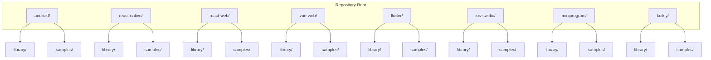
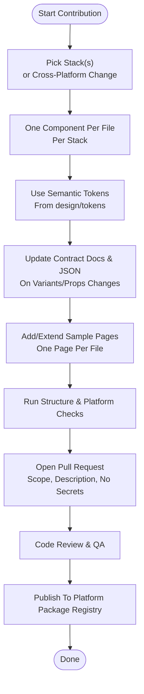
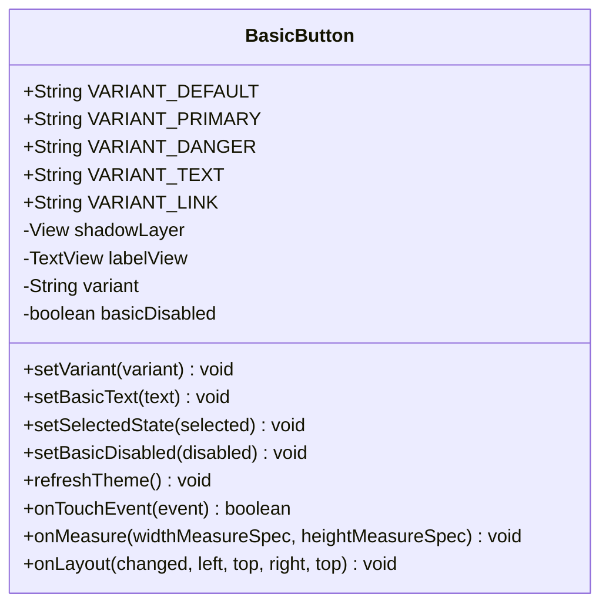
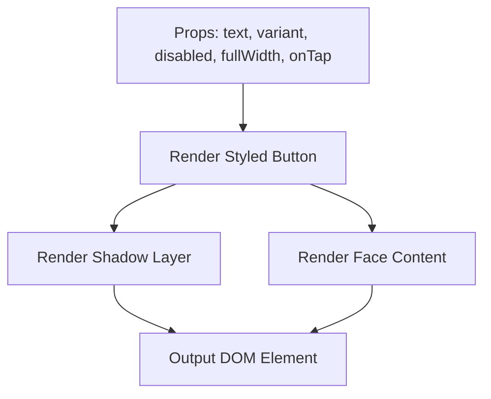
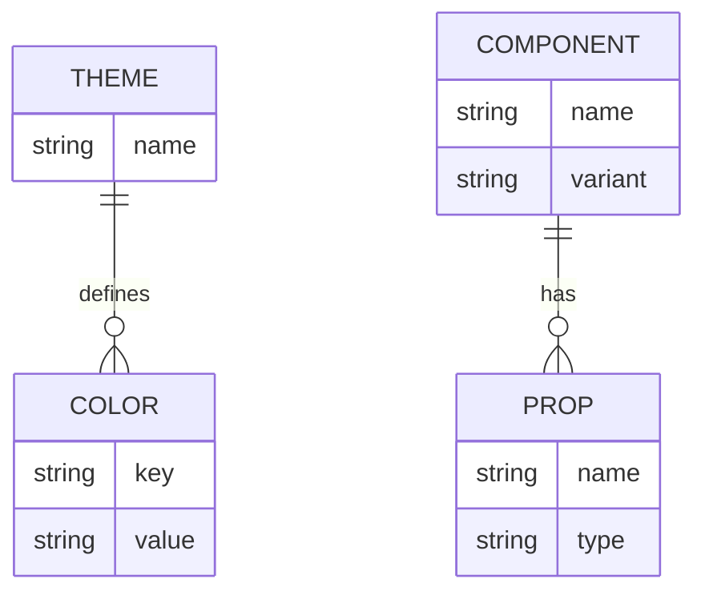
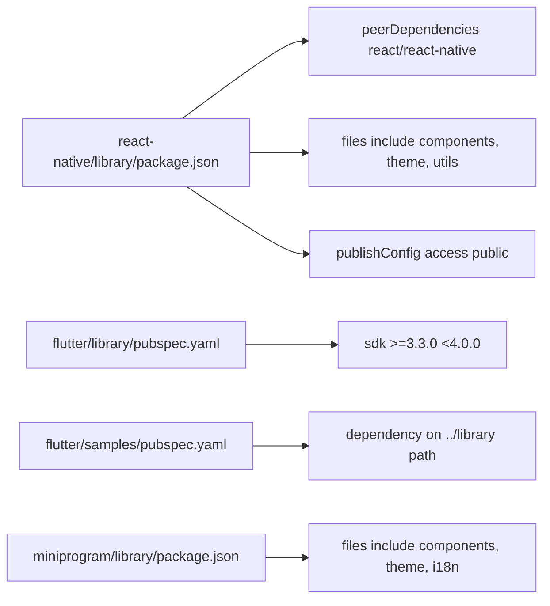

# Contributing Guide

<cite>
**Referenced Files in This Document**
- [CONTRIBUTING.md](file://CONTRIBUTING.md)
- [README.md](file://README.md)
- [AGENTS.md](file://AGENTS.md)
- [docs/PLATFORM_STRUCTURE.md](file://docs/PLATFORM_STRUCTURE.md)
- [docs/COMPONENT_CONTRACT.md](file://docs/COMPONENT_CONTRACT.md)
- [tools/check-structure.cjs](file://tools/check-structure.cjs)
- [android/library/src/main/java/com/techskillplanet/basiccontrols/widget/BasicButton.java](file://android/library/src/main/java/com/techskillplanet/basiccontrols/widget/BasicButton.java)
- [react-web/library/src/components/TspButton.js](file://react-web/library/src/components/TspButton.js)
- [flutter/library/pubspec.yaml](file://flutter/library/pubspec.yaml)
- [react-native/library/package.json](file://react-native/library/package.json)
- [react-web/library/tests/setup.js](file://react-web/library/tests/setup.js)
- [react-web/library/vitest.config.js](file://react-web/library/vitest.config.js)
- [flutter/samples/pubspec.yaml](file://flutter/samples/pubspec.yaml)
- [miniprogram/library/package.json](file://miniprogram/library/package.json)
- [PUBLISHING.md](file://PUBLISHING.md)
</cite>

## Table of Contents
1. [Introduction](#introduction)
2. [Project Structure](#project-structure)
3. [Core Components](#core-components)
4. [Architecture Overview](#architecture-overview)
5. [Detailed Component Analysis](#detailed-component-analysis)
6. [Dependency Analysis](#dependency-analysis)
7. [Performance Considerations](#performance-considerations)
8. [Troubleshooting Guide](#troubleshooting-guide)
9. [Conclusion](#conclusion)
10. [Appendices](#appendices)

## Introduction
This guide explains how to contribute effectively to Planet Components. It consolidates development setup, code standards, contribution workflow, engineering rules, and publishing practices across all platforms. It also documents the component contract system, testing and QA expectations, and troubleshooting steps for common contribution issues.

## Project Structure
Planet Components organizes each platform as a first-level directory containing:
- library: independent, publishable package source
- samples: runnable sample project that depends on the local library

This layout ensures consistent packaging, testing, and distribution across Android View, React Native, React Web, Vue Web, Flutter, iOS SwiftUI, WeChat Mini Program, and Kuikly.

**Diagram sources**
- [README.md:10-22](file://README.md#L10-L22)

**Section sources**
- [README.md:5-24](file://README.md#L5-L24)
- [docs/PLATFORM_STRUCTURE.md:35-41](file://docs/PLATFORM_STRUCTURE.md#L35-L41)

## Core Components
This section summarizes the engineering rules and contribution workflow that apply across all platforms.

- One component per source file: enforce modularity and maintainability.
- One sample page per file: keep demos self-contained and navigable.
- Barrel/index files: export only public APIs; avoid embedding component logic.
- Shared tokens: consume semantic tokens from design/tokens; do not hardcode values.
- Cross-stack consistency: align naming, props, variants, and behavior via the component contract.
- Samples must depend on the local library, not duplicate implementation code.
- Platform constraints: adhere to each stack’s technology and packaging constraints.

**Section sources**
- [AGENTS.md:12-22](file://AGENTS.md#L12-L22)
- [docs/PLATFORM_STRUCTURE.md:5-11](file://docs/PLATFORM_STRUCTURE.md#L5-L11)
- [docs/COMPONENT_CONTRACT.md:1-68](file://docs/COMPONENT_CONTRACT.md#L1-L68)
- [CONTRIBUTING.md:29-44](file://CONTRIBUTING.md#L29-L44)

## Architecture Overview
The contribution workflow connects component development, contract updates, sample coverage, verification, and publishing.

**Diagram sources**
- [CONTRIBUTING.md:29-87](file://CONTRIBUTING.md#L29-L87)
- [docs/COMPONENT_CONTRACT.md:1-68](file://docs/COMPONENT_CONTRACT.md#L1-L68)
- [README.md:48-68](file://README.md#L48-L68)

## Detailed Component Analysis
This section explains platform-specific conventions and examples that illustrate the component contract and development patterns.

### Android View Example: BasicButton
Android View enforces one Java class per component. The BasicButton demonstrates:
- Variant constants and variant setter
- Disabled state handling
- Theme-aware drawing via typed theme/runtime objects
- Touch handling and press feedback
- XML attribute support for unified props

**Diagram sources**
- [android/library/src/main/java/com/techskillplanet/basiccontrols/widget/BasicButton.java:30-254](file://android/library/src/main/java/com/techskillplanet/basiccontrols/widget/BasicButton.java#L30-L254)

**Section sources**
- [android/library/src/main/java/com/techskillplanet/basiccontrols/widget/BasicButton.java:20-254](file://android/library/src/main/java/com/techskillplanet/basiccontrols/widget/BasicButton.java#L20-L254)

### React Web Example: TspButton
React Web components demonstrate:
- Small, consistent public API with props like text, variant, disabled, fullWidth, and onTap
- Theme integration via CSS variables
- Shadow and face structure for raised island styling

**Diagram sources**
- [react-web/library/src/components/TspButton.js:19-47](file://react-web/library/src/components/TspButton.js#L19-L47)

**Section sources**
- [react-web/library/src/components/TspButton.js:1-48](file://react-web/library/src/components/TspButton.js#L1-L48)

### Cross-Platform Contract Alignment
Components must align across platforms in naming, props, variants, and semantics. The component contract defines:
- Shared theme name and semantic color palette
- Component set, required variants, and core props
- Sample coverage requirements for states and realistic usage

**Diagram sources**
- [docs/COMPONENT_CONTRACT.md:1-68](file://docs/COMPONENT_CONTRACT.md#L1-L68)

**Section sources**
- [docs/COMPONENT_CONTRACT.md:26-67](file://docs/COMPONENT_CONTRACT.md#L26-L67)

## Dependency Analysis
This section outlines how platform packages are configured and how samples depend on local libraries.

- Flutter library declares SDK and dev dependencies; samples depend on the local library via path.
- React Native library exposes main entry and files for publishing; peerDependencies specify supported frameworks.
- Miniprogram library sets miniprogram component directory and files for publishing.

**Diagram sources**
- [react-native/library/package.json:1-25](file://react-native/library/package.json#L1-L25)
- [flutter/library/pubspec.yaml:1-22](file://flutter/library/pubspec.yaml#L1-L22)
- [flutter/samples/pubspec.yaml:1-21](file://flutter/samples/pubspec.yaml#L1-L21)
- [miniprogram/library/package.json:1-14](file://miniprogram/library/package.json#L1-L14)

**Section sources**
- [react-native/library/package.json:1-25](file://react-native/library/package.json#L1-L25)
- [flutter/library/pubspec.yaml:1-22](file://flutter/library/pubspec.yaml#L1-L22)
- [flutter/samples/pubspec.yaml:8-12](file://flutter/samples/pubspec.yaml#L8-L12)
- [miniprogram/library/package.json:1-14](file://miniprogram/library/package.json#L1-L14)

## Performance Considerations
- Keep component APIs minimal and consistent to reduce cross-platform maintenance overhead.
- Prefer theme-driven styling over hardcoded values to improve scalability and reduce diffs across platforms.
- Use barrel/index exports only for public APIs to minimize bundle bloat and clarify boundaries.
- Run dry-run packaging and platform-specific builds to catch regressions early.

## Troubleshooting Guide
Common contribution issues and resolutions:

- Structure validation failures
  - Cause: Missing or misnamed files, incorrect directory layout, or missing router files.
  - Fix: Run the structure checker and align with platform layout rules; ensure one-component-one-file and one-page-one-file conventions.
  - Reference: [tools/check-structure.cjs:16-34](file://tools/check-structure.cjs#L16-L34), [docs/PLATFORM_STRUCTURE.md:43-49](file://docs/PLATFORM_STRUCTURE.md#L43-L49)

- Platform-specific build or lint failures
  - React Native library dry-pack failure: verify main entry and files list; confirm peerDependencies match environment.
    - Reference: [react-native/library/package.json:5-12](file://react-native/library/package.json#L5-L12)
  - Flutter analyze failures: ensure SDK constraints and dependency on local library in samples.
    - Reference: [flutter/library/pubspec.yaml:8-10](file://flutter/library/pubspec.yaml#L8-L10), [flutter/samples/pubspec.yaml:11-12](file://flutter/samples/pubspec.yaml#L11-L12)
  - Miniprogram symlink requirement: ensure samples/planet-components is a symlink as expected.
    - Reference: [README.md:66](file://README.md#L66)

- Contract mismatch or missing sample coverage
  - Symptom: PR reviewers request additional variants/states in samples.
  - Fix: Add or update sample pages to cover default, disabled, selected/checked, and state-specific variants per component contract.
  - Reference: [docs/COMPONENT_CONTRACT.md:58-67](file://docs/COMPONENT_CONTRACT.md#L58-L67)

- Testing environment issues
  - React Web Vitest setup: ensure jsdom environment and setup file are present.
    - Reference: [react-web/library/vitest.config.js:3-10](file://react-web/library/vitest.config.js#L3-L10), [react-web/library/tests/setup.js:1-2](file://react-web/library/tests/setup.js#L1-L2)

**Section sources**
- [tools/check-structure.cjs:16-34](file://tools/check-structure.cjs#L16-L34)
- [docs/PLATFORM_STRUCTURE.md:43-49](file://docs/PLATFORM_STRUCTURE.md#L43-L49)
- [react-native/library/package.json:5-12](file://react-native/library/package.json#L5-L12)
- [flutter/library/pubspec.yaml:8-10](file://flutter/library/pubspec.yaml#L8-L10)
- [flutter/samples/pubspec.yaml:11-12](file://flutter/samples/pubspec.yaml#L11-L12)
- [README.md:66](file://README.md#L66)
- [docs/COMPONENT_CONTRACT.md:58-67](file://docs/COMPONENT_CONTRACT.md#L58-L67)
- [react-web/library/vitest.config.js:3-10](file://react-web/library/vitest.config.js#L3-L10)
- [react-web/library/tests/setup.js:1-2](file://react-web/library/tests/setup.js#L1-L2)

## Conclusion
Contributions to Planet Components should focus on one stack or one cross-cutting concern, maintain strict one-component-per-file and one-sample-page-per-file conventions, and keep the component contract and shared tokens synchronized. Follow the verification and publishing workflows to ensure high-quality releases across all platforms.

## Appendices

### A. Contribution Workflow Checklist
- Scope PRs appropriately; describe changes and checks performed.
- Update component contract docs and JSON when adding variants or props.
- Add or extend sample pages with realistic usage scenarios.
- Run structure and platform-specific checks before submitting.
- Avoid committing secrets or generated noise.

**Section sources**
- [CONTRIBUTING.md:81-87](file://CONTRIBUTING.md#L81-L87)

### B. Publishing Workflow
- Confirm sample runs locally.
- Run platform-specific build/dry-run commands.
- Verify local library dependency in samples.
- Exclude build caches and ensure metadata points to the repository.

**Section sources**
- [PUBLISHING.md:16-23](file://PUBLISHING.md#L16-L23)

### C. Quality Assurance and Testing
- React Web: configure Vitest with jsdom and setup file for DOM assertions.
- Flutter: run analyzer on both library and samples.
- Android View: assemble library and samples.
- Others: follow platform-specific commands in the root README.

**Section sources**
- [react-web/library/vitest.config.js:3-10](file://react-web/library/vitest.config.js#L3-L10)
- [react-web/library/tests/setup.js:1-2](file://react-web/library/tests/setup.js#L1-L2)
- [README.md:54-68](file://README.md#L54-L68)