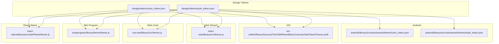
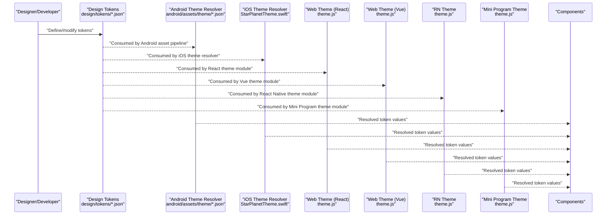
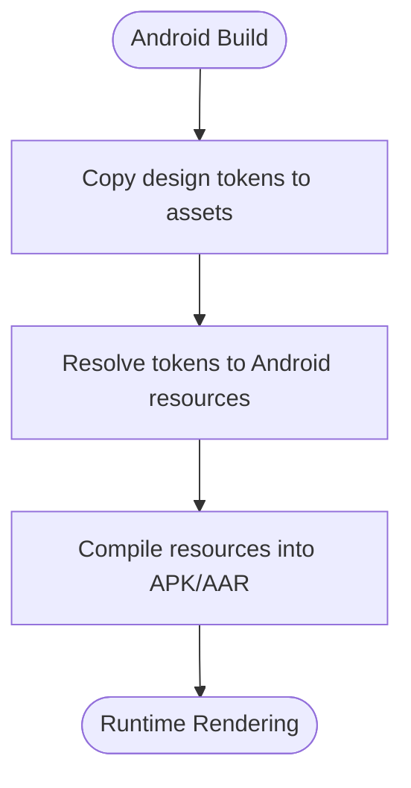
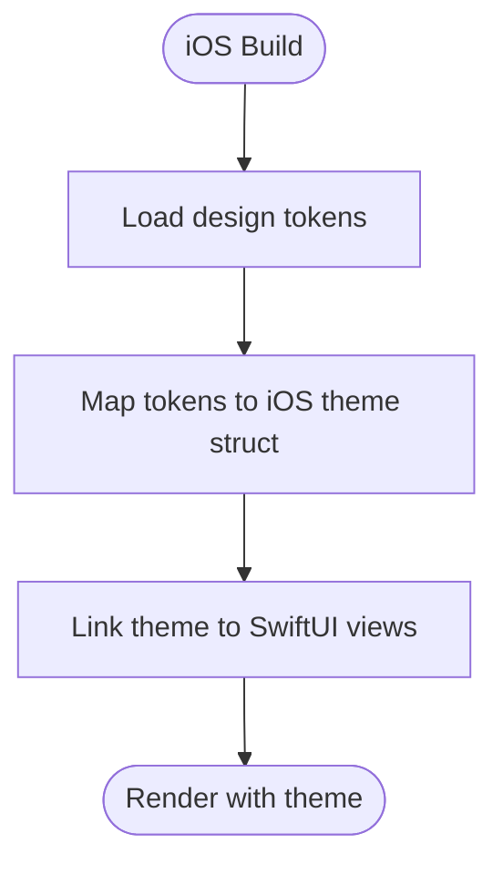
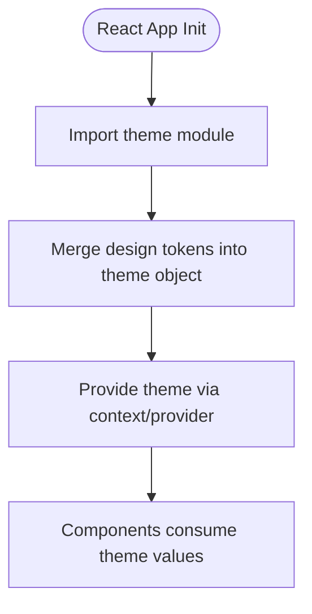
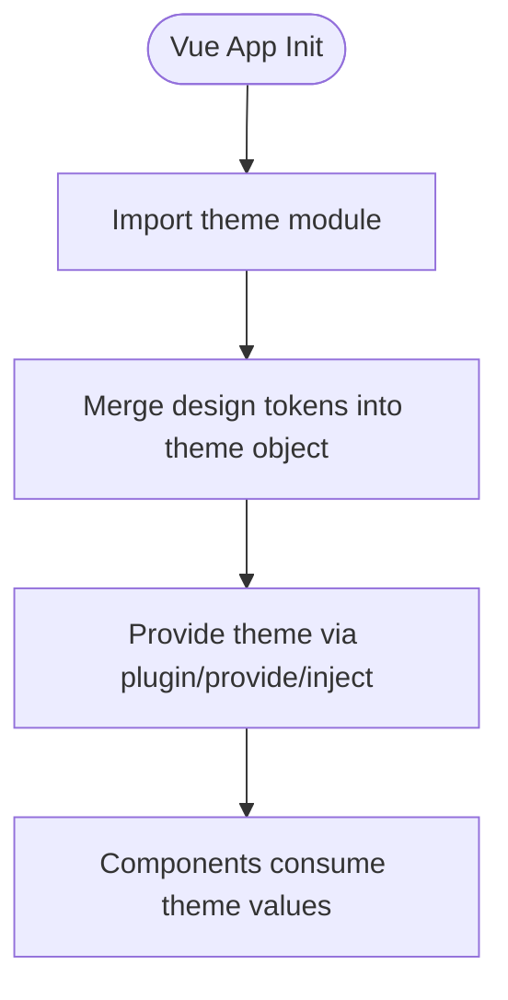
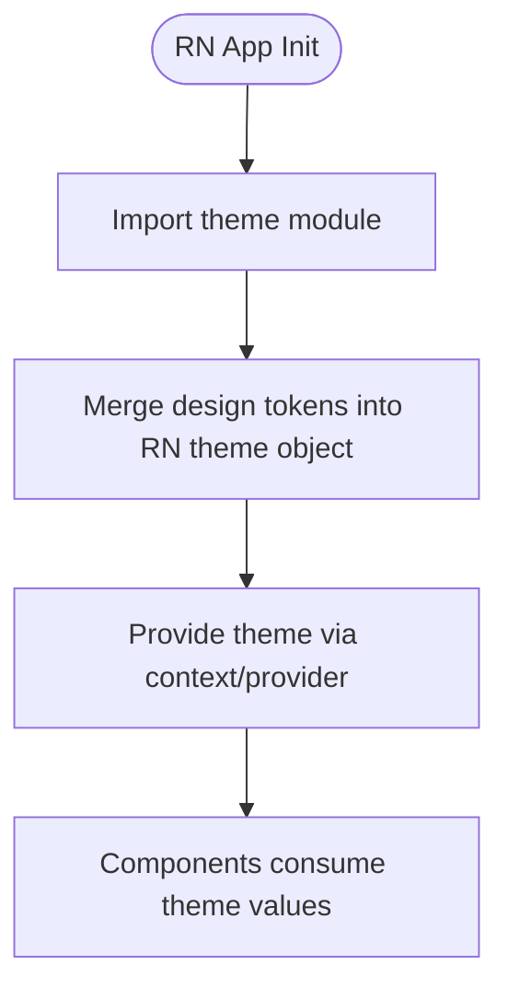
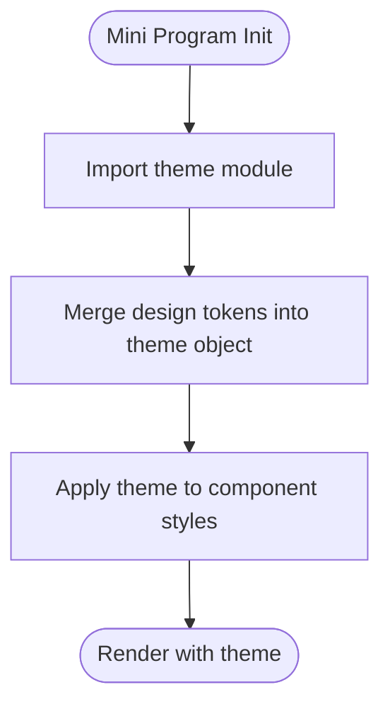
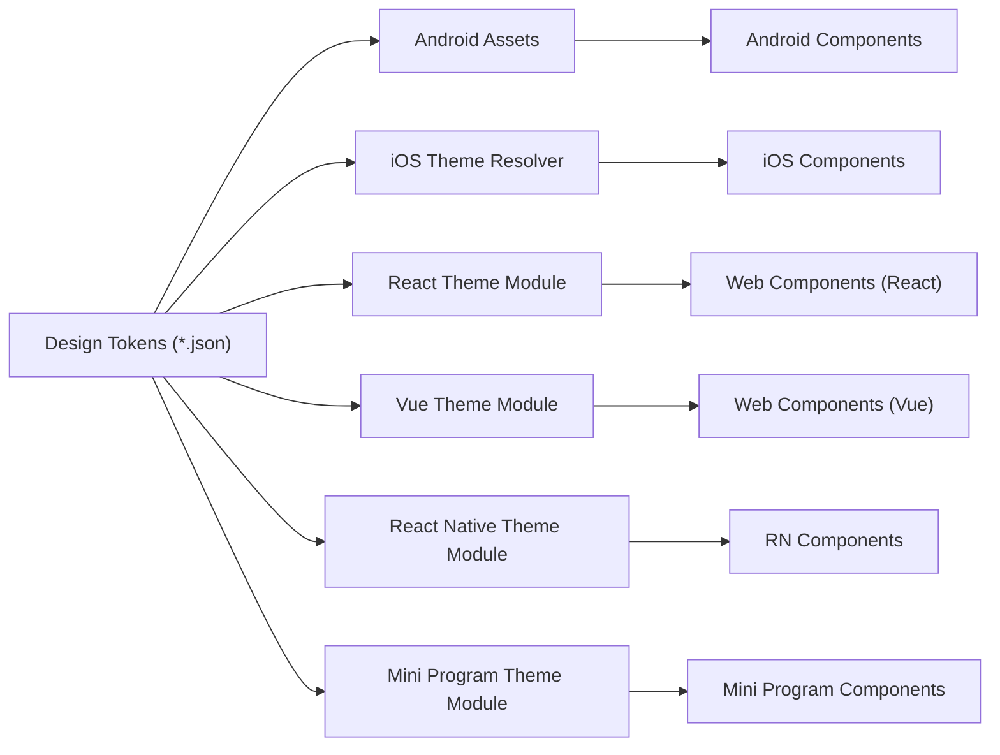

# Custom Themes

<cite>
**Referenced Files in This Document**
- [color_token.json](file://design/tokens/color_token.json)
- [style_token.json](file://design/tokens/style_token.json)
- [color_token.json](file://android/library/src/main/assets/theme/color_token.json)
- [style_token.json](file://android/library/src/main/assets/theme/style_token.json)
- [StarPlanetTheme.swift](file://ios-swiftui/library/Sources/TechSkillPlanetBasicControls/StarPlanetTheme.swift)
- [theme.js](file://react-web/library/src/theme.js)
- [theme.js](file://vue-web/library/src/theme.js)
- [theme.js](file://miniprogram/library/theme/theme.js)
- [theme.js](file://react-native/library/src/starPlanet/theme.js)
</cite>

## Table of Contents
1. [Introduction](#introduction)
2. [Project Structure](#project-structure)
3. [Core Components](#core-components)
4. [Architecture Overview](#architecture-overview)
5. [Detailed Component Analysis](#detailed-component-analysis)
6. [Dependency Analysis](#dependency-analysis)
7. [Performance Considerations](#performance-considerations)
8. [Troubleshooting Guide](#troubleshooting-guide)
9. [Conclusion](#conclusion)
10. [Appendices](#appendices)

## Introduction
This document explains how to develop custom themes across Planet Components platforms. It covers the theme creation workflow from token definition to component integration, including creating brand-specific themes, modifying existing token configurations, and implementing theme variations. It also provides step-by-step guides, validation and testing strategies, and deployment considerations for maintaining design consistency across Android, iOS, React Web, Vue Web, React Native, Mini Program, and Flutter environments.

## Project Structure
Planet Components centralizes design tokens under a shared design system and exposes platform-specific theme integrations. Tokens define brand colors and style attributes, while each platform consumes these tokens to render UI consistently.

**Diagram sources**
- [color_token.json](file://design/tokens/color_token.json)
- [style_token.json](file://design/tokens/style_token.json)
- [color_token.json](file://android/library/src/main/assets/theme/color_token.json)
- [style_token.json](file://android/library/src/main/assets/theme/style_token.json)
- [StarPlanetTheme.swift](file://ios-swiftui/library/Sources/TechSkillPlanetBasicControls/StarPlanetTheme.swift)
- [theme.js](file://react-web/library/src/theme.js)
- [theme.js](file://vue-web/library/src/theme.js)
- [theme.js](file://miniprogram/library/theme/theme.js)
- [theme.js](file://react-native/library/src/starPlanet/theme.js)

**Section sources**
- [color_token.json](file://design/tokens/color_token.json)
- [style_token.json](file://design/tokens/style_token.json)
- [color_token.json](file://android/library/src/main/assets/theme/color_token.json)
- [style_token.json](file://android/library/src/main/assets/theme/style_token.json)
- [StarPlanetTheme.swift](file://ios-swiftui/library/Sources/TechSkillPlanetBasicControls/StarPlanetTheme.swift)
- [theme.js](file://react-web/library/src/theme.js)
- [theme.js](file://vue-web/library/src/theme.js)
- [theme.js](file://miniprogram/library/theme/theme.js)
- [theme.js](file://react-native/library/src/starPlanet/theme.js)

## Core Components
- Design tokens: Centralized JSON definitions for color and style attributes consumed by all platforms.
- Platform theme modules: Thin adapters that map tokens to platform-specific rendering (Android resources, Swift structs, JavaScript theme objects).
- Component libraries: UI components consume resolved theme values to render consistent visuals.

Key responsibilities:
- Token maintainers update design/tokens/* to reflect brand changes.
- Platform teams keep platform assets synchronized with design tokens.
- Component teams read theme values via platform theme modules.

**Section sources**
- [color_token.json](file://design/tokens/color_token.json)
- [style_token.json](file://design/tokens/style_token.json)
- [theme.js](file://react-web/library/src/theme.js)
- [theme.js](file://vue-web/library/src/theme.js)
- [theme.js](file://miniprogram/library/theme/theme.js)
- [theme.js](file://react-native/library/src/starPlanet/theme.js)
- [StarPlanetTheme.swift](file://ios-swiftui/library/Sources/TechSkillPlanetBasicControls/StarPlanetTheme.swift)

## Architecture Overview
The theme architecture follows a unidirectional data flow: tokens define brand identity; platform theme modules resolve tokens into runtime values; components render using those values.

**Diagram sources**
- [color_token.json](file://design/tokens/color_token.json)
- [style_token.json](file://design/tokens/style_token.json)
- [color_token.json](file://android/library/src/main/assets/theme/color_token.json)
- [style_token.json](file://android/library/src/main/assets/theme/style_token.json)
- [StarPlanetTheme.swift](file://ios-swiftui/library/Sources/TechSkillPlanetBasicControls/StarPlanetTheme.swift)
- [theme.js](file://react-web/library/src/theme.js)
- [theme.js](file://vue-web/library/src/theme.js)
- [theme.js](file://miniprogram/library/theme/theme.js)
- [theme.js](file://react-native/library/src/starPlanet/theme.js)

## Detailed Component Analysis

### Android Theme Integration
Android resolves tokens via JSON assets and maps them into resources. The platform reads color_token.json and style_token.json from android/library/src/main/assets/theme and uses them to configure UI rendering.

**Diagram sources**
- [color_token.json](file://android/library/src/main/assets/theme/color_token.json)
- [style_token.json](file://android/library/src/main/assets/theme/style_token.json)

**Section sources**
- [color_token.json](file://android/library/src/main/assets/theme/color_token.json)
- [style_token.json](file://android/library/src/main/assets/theme/style_token.json)

### iOS Theme Integration
iOS exposes a theme resolver that consumes design tokens and produces platform-specific values for SwiftUI components.

**Diagram sources**
- [StarPlanetTheme.swift](file://ios-swiftui/library/Sources/TechSkillPlanetBasicControls/StarPlanetTheme.swift)

**Section sources**
- [StarPlanetTheme.swift](file://ios-swiftui/library/Sources/TechSkillPlanetBasicControls/StarPlanetTheme.swift)

### Web (React) Theme Integration
React theme module reads design tokens and exposes a theme object for component consumption.

**Diagram sources**
- [theme.js](file://react-web/library/src/theme.js)

**Section sources**
- [theme.js](file://react-web/library/src/theme.js)

### Web (Vue) Theme Integration
Vue theme module mirrors React’s approach, exposing a theme object for component usage.

**Diagram sources**
- [theme.js](file://vue-web/library/src/theme.js)

**Section sources**
- [theme.js](file://vue-web/library/src/theme.js)

### React Native Theme Integration
React Native theme module integrates tokens into the native environment for cross-platform consistency.

**Diagram sources**
- [theme.js](file://react-native/library/src/starPlanet/theme.js)

**Section sources**
- [theme.js](file://react-native/library/src/starPlanet/theme.js)

### Mini Program Theme Integration
Mini Program theme module adapts tokens for web-like environments within the Mini Program runtime.

**Diagram sources**
- [theme.js](file://miniprogram/library/theme/theme.js)

**Section sources**
- [theme.js](file://miniprogram/library/theme/theme.js)

## Dependency Analysis
Theme dependencies flow from design tokens to platform theme modules and finally to components. The following diagram shows the directional dependencies across platforms.

**Diagram sources**
- [color_token.json](file://design/tokens/color_token.json)
- [style_token.json](file://design/tokens/style_token.json)
- [color_token.json](file://android/library/src/main/assets/theme/color_token.json)
- [style_token.json](file://android/library/src/main/assets/theme/style_token.json)
- [StarPlanetTheme.swift](file://ios-swiftui/library/Sources/TechSkillPlanetBasicControls/StarPlanetTheme.swift)
- [theme.js](file://react-web/library/src/theme.js)
- [theme.js](file://vue-web/library/src/theme.js)
- [theme.js](file://miniprogram/library/theme/theme.js)
- [theme.js](file://react-native/library/src/starPlanet/theme.js)

**Section sources**
- [color_token.json](file://design/tokens/color_token.json)
- [style_token.json](file://design/tokens/style_token.json)
- [color_token.json](file://android/library/src/main/assets/theme/color_token.json)
- [style_token.json](file://android/library/src/main/assets/theme/style_token.json)
- [StarPlanetTheme.swift](file://ios-swiftui/library/Sources/TechSkillPlanetBasicControls/StarPlanetTheme.swift)
- [theme.js](file://react-web/library/src/theme.js)
- [theme.js](file://vue-web/library/src/theme.js)
- [theme.js](file://miniprogram/library/theme/theme.js)
- [theme.js](file://react-native/library/src/starPlanet/theme.js)

## Performance Considerations
- Keep token sets minimal and hierarchical to reduce recomputation and memory footprint.
- Prefer lazy initialization of theme objects to avoid unnecessary work during cold starts.
- Cache resolved values per platform to prevent repeated token resolution.
- Minimize theme churn by batching updates to tokens and re-applying themes only when necessary.

## Troubleshooting Guide
Common issues and resolutions:
- Mismatched tokens: Ensure design/tokens/*.json matches platform assets. If a token is missing on Android, confirm it exists in android/library/src/main/assets/theme/*.json.
- Inconsistent brand colors: Verify that brand tokens are updated in design/tokens/color_token.json and propagated to platform-specific assets.
- Theme not applied: Confirm the platform theme module imports and merges tokens correctly and that components consume the theme provider/context.
- Runtime errors on Mini Program: Validate that the theme module exports expected keys and that component styles reference those keys.

Validation checklist:
- Run platform builds after updating tokens to catch asset mismatches.
- Snapshot or visual regression tests to detect unintended theme regressions.
- Manual QA across devices/browsers to confirm consistency.

**Section sources**
- [color_token.json](file://design/tokens/color_token.json)
- [style_token.json](file://design/tokens/style_token.json)
- [color_token.json](file://android/library/src/main/assets/theme/color_token.json)
- [style_token.json](file://android/library/src/main/assets/theme/style_token.json)
- [theme.js](file://react-web/library/src/theme.js)
- [theme.js](file://vue-web/library/src/theme.js)
- [theme.js](file://miniprogram/library/theme/theme.js)
- [theme.js](file://react-native/library/src/starPlanet/theme.js)
- [StarPlanetTheme.swift](file://ios-swiftui/library/Sources/TechSkillPlanetBasicControls/StarPlanetTheme.swift)

## Conclusion
Planet Components provides a scalable, token-driven theme system. By centralizing tokens and adapting them per platform, teams can implement brand-specific themes efficiently while maintaining design consistency. Follow the workflows outlined here to add new themes, modify tokens, validate changes, and deploy updates safely.

## Appendices

### Step-by-Step: Add a New Brand Theme
1. Define or update brand tokens in design/tokens/*.json.
2. Sync tokens to platform assets:
   - Android: Place updated tokens in android/library/src/main/assets/theme/*.json.
   - iOS: Update the iOS theme resolver to consume the new tokens.
   - Web (React): Update the React theme module to merge new tokens.
   - Web (Vue): Update the Vue theme module to merge new tokens.
   - React Native: Update the RN theme module to merge new tokens.
   - Mini Program: Update the Mini Program theme module to merge new tokens.
3. Integrate theme into components via platform providers/context.
4. Validate on target platforms and run regression tests.
5. Deploy with appropriate versioning and rollback plans.

### Step-by-Step: Modify Existing Token Configurations
1. Identify the token(s) to change in design/tokens/*.json.
2. Update values and commit to the design system.
3. Rebuild and redeploy platform assets where applicable.
4. Verify theme application across components.
5. Capture screenshots or run automated visual tests.

### Step-by-Step: Implement Theme Variations (e.g., Dark/Light)
1. Extend design/tokens/*.json with variant groups (e.g., light/dark palettes).
2. Update platform theme modules to select variants at runtime or build-time.
3. Wire variant selection into component rendering logic.
4. Test across devices and orientations.
5. Document variant behavior and fallbacks.

### Deployment Considerations
- Version tokens alongside platform releases.
- Use feature flags or gradual rollouts for theme changes.
- Monitor visual regressions post-deployment.
- Maintain backward compatibility for deprecated tokens during migration windows.