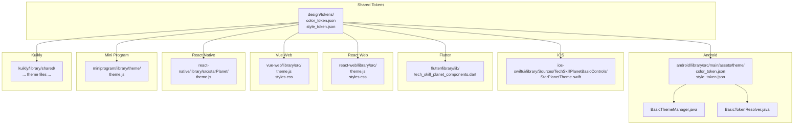
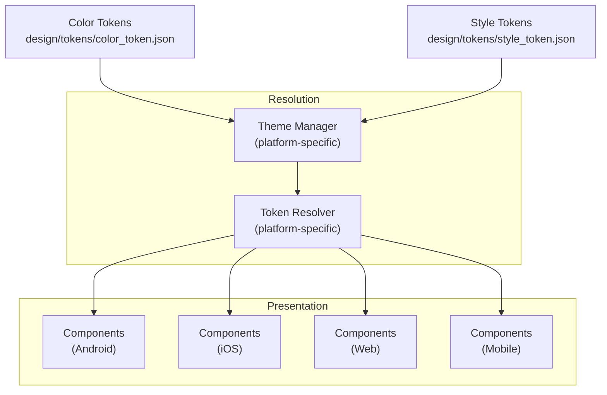
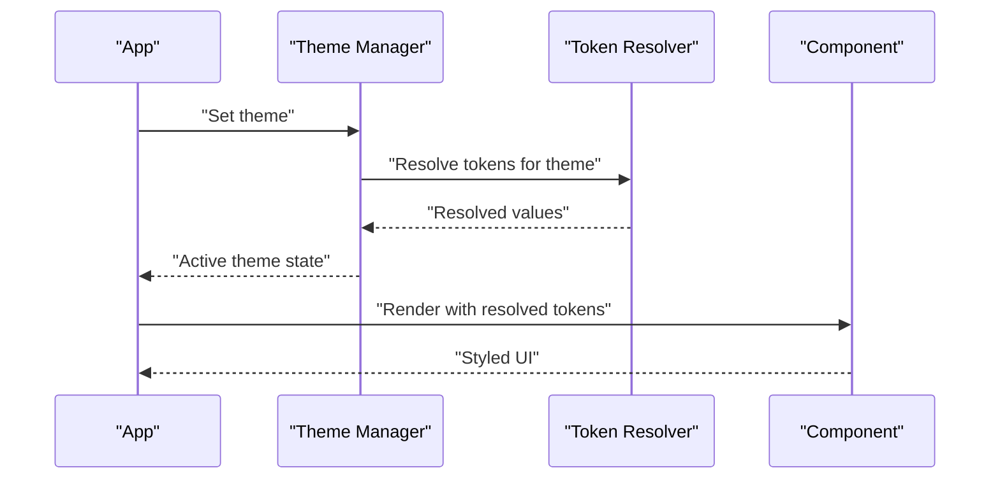
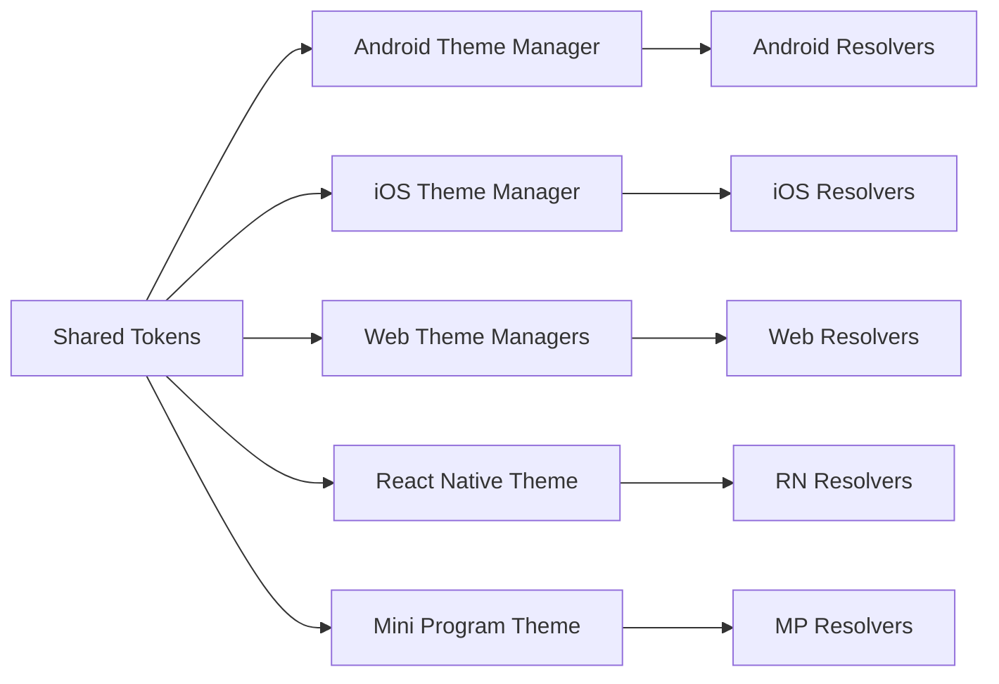
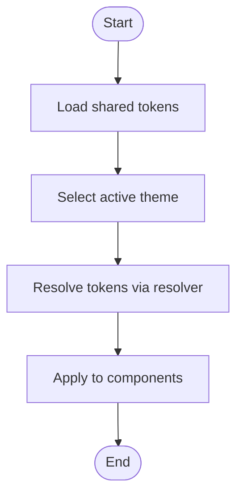
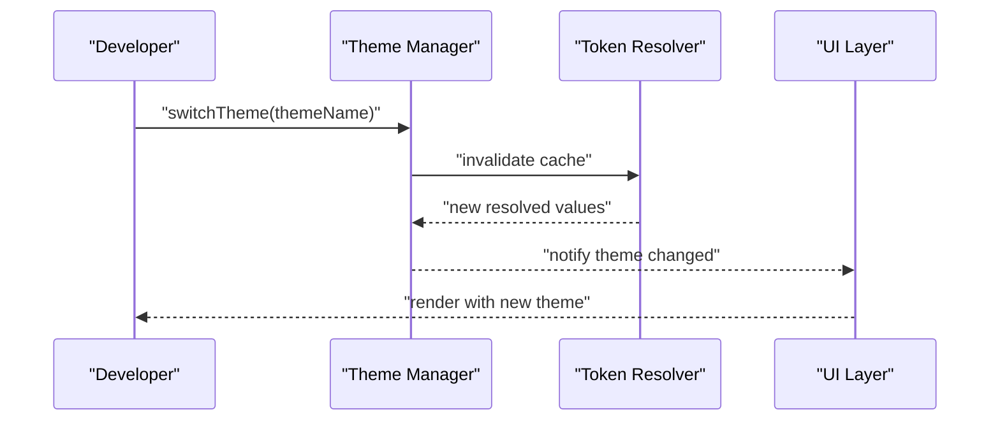

# Design System

<cite>
**Referenced Files in This Document**
- [color_token.json](file://design/tokens/color_token.json)
- [style_token.json](file://design/tokens/style_token.json)
- [color_token.json](file://android/library/src/main/assets/theme/color_token.json)
- [style_token.json](file://android/library/src/main/assets/theme/style_token.json)
- [BasicThemeManager.java](file://android/library/src/main/java/com/techskillplanet/basiccontrols/theme/BasicThemeManager.java)
- [BasicTokenResolver.java](file://android/library/src/main/java/com/techskillplanet/basiccontrols/theme/BasicTokenResolver.java)
- [StarPlanetTheme.swift](file://ios-swiftui/library/Sources/TechSkillPlanetBasicControls/StarPlanetTheme.swift)
- [theme.js](file://miniprogram/library/theme/theme.js)
- [theme.js](file://react-native/library/src/starPlanet/theme.js)
- [theme.js](file://react-web/library/src/theme.js)
- [styles.css](file://react-web/library/src/styles.css)
- [theme.js](file://vue-web/library/src/theme.js)
- [styles.css](file://vue-web/library/src/styles.css)
- [README.md](file://android/library/README.md)
- [README.md](file://flutter/README.md)
- [README.md](file://ios-swiftui/library/README.md)
- [README.md](file://kuikly/README.md)
- [README.md](file://miniprogram/library/README.md)
- [README.md](file://react-native/library/README.md)
- [README.md](file://react-web/library/README.md)
- [README.md](file://vue-web/library/README.md)
</cite>

## Table of Contents
1. [Introduction](#introduction)
2. [Project Structure](#project-structure)
3. [Core Components](#core-components)
4. [Architecture Overview](#architecture-overview)
5. [Detailed Component Analysis](#detailed-component-analysis)
6. [Dependency Analysis](#dependency-analysis)
7. [Performance Considerations](#performance-considerations)
8. [Troubleshooting Guide](#troubleshooting-guide)
9. [Conclusion](#conclusion)
10. [Appendices](#appendices)

## Introduction
Planet Components provides a cross-platform design system that defines a unified set of design tokens and theme management across Android, iOS, Flutter, React Web, Vue Web, React Native, Mini Program, and Kuikly environments. The system centers on two primary token categories:
- Color tokens: semantic color roles mapped to concrete hex values per theme.
- Style tokens: typography, spacing, border radius, elevation, and motion tokens.

These tokens are resolved at runtime via platform-specific theme managers and resolvers to ensure consistent UI appearance and behavior across devices and form factors. The design system supports three main themes—Sky Planet, Star Planet Night, and Mint Planet—each with distinct token configurations. It also enables creating custom themes, modifying tokens, and implementing brand-specific designs while maintaining accessibility and responsive design patterns.

## Project Structure
The design system is organized by platform with shared design tokens located under the design/tokens directory and platform-specific implementations under each platform’s library folder. The Android implementation includes Java-based theme management and token resolution, while other platforms implement theme logic in JavaScript, Swift, or CSS.

**Diagram sources**
- [color_token.json](file://design/tokens/color_token.json)
- [style_token.json](file://design/tokens/style_token.json)
- [color_token.json](file://android/library/src/main/assets/theme/color_token.json)
- [style_token.json](file://android/library/src/main/assets/theme/style_token.json)
- [BasicThemeManager.java](file://android/library/src/main/java/com/techskillplanet/basiccontrols/theme/BasicThemeManager.java)
- [BasicTokenResolver.java](file://android/library/src/main/java/com/techskillplanet/basiccontrols/theme/BasicTokenResolver.java)
- [StarPlanetTheme.swift](file://ios-swiftui/library/Sources/TechSkillPlanetBasicControls/StarPlanetTheme.swift)
- [theme.js](file://react-web/library/src/theme.js)
- [styles.css](file://react-web/library/src/styles.css)
- [theme.js](file://vue-web/library/src/theme.js)
- [styles.css](file://vue-web/library/src/styles.css)
- [theme.js](file://react-native/library/src/starPlanet/theme.js)
- [theme.js](file://miniprogram/library/theme/theme.js)

**Section sources**
- [README.md](file://android/library/README.md)
- [README.md](file://flutter/README.md)
- [README.md](file://ios-swiftui/library/README.md)
- [README.md](file://kuikly/README.md)
- [README.md](file://miniprogram/library/README.md)
- [README.md](file://react-native/library/README.md)
- [README.md](file://react-web/library/README.md)
- [README.md](file://vue-web/library/README.md)

## Core Components
- Shared design tokens: Centralized JSON definitions for color and style tokens consumed by all platforms.
- Platform theme managers: Runtime systems that select and resolve tokens for a given theme and platform.
- Token resolvers: Utilities that translate logical token names into concrete values for rendering.
- Component styling: Components consume resolved tokens to apply colors, typography, spacing, and motion consistently.

Key responsibilities:
- Define semantic color roles and style scales in shared token files.
- Resolve tokens per platform using theme managers and resolvers.
- Apply tokens to component props and CSS/JS styles.
- Support dynamic theme switching and brand customization.

**Section sources**
- [color_token.json](file://design/tokens/color_token.json)
- [style_token.json](file://design/tokens/style_token.json)
- [BasicThemeManager.java](file://android/library/src/main/java/com/techskillplanet/basiccontrols/theme/BasicThemeManager.java)
- [BasicTokenResolver.java](file://android/library/src/main/java/com/techskillplanet/basiccontrols/theme/BasicTokenResolver.java)

## Architecture Overview
The design system follows a layered architecture:
- Token layer: JSON-based tokens define semantics and scales.
- Resolution layer: Theme manager selects a theme; resolver maps logical names to concrete values.
- Presentation layer: Components render using resolved tokens.

**Diagram sources**
- [color_token.json](file://design/tokens/color_token.json)
- [style_token.json](file://design/tokens/style_token.json)
- [BasicThemeManager.java](file://android/library/src/main/java/com/techskillplanet/basiccontrols/theme/BasicThemeManager.java)
- [BasicTokenResolver.java](file://android/library/src/main/java/com/techskillplanet/basiccontrols/theme/BasicTokenResolver.java)

## Detailed Component Analysis

### Design Token Architecture
- Color tokens: Semantic roles such as background, surface, primary, secondary, error, and text roles mapped to hex values per theme.
- Style tokens: Typography scale (font sizes, weights, line heights), spacing scale, border radius scale, elevation levels, and motion durations.

Implementation highlights:
- Shared tokens are stored in JSON for portability across platforms.
- Platform-specific assets mirror shared tokens for native builds.
- Style tokens commonly include typography, spacing, radii, elevation, and transitions.

Practical usage:
- Components read resolved values for background, border, text color, padding, margin, font size, and shadow/elevation.
- Tokens enable consistent design language across diverse UI surfaces.

**Section sources**
- [color_token.json](file://design/tokens/color_token.json)
- [style_token.json](file://design/tokens/style_token.json)
- [color_token.json](file://android/library/src/main/assets/theme/color_token.json)
- [style_token.json](file://android/library/src/main/assets/theme/style_token.json)

### Theme Management System
The theme management system varies by platform but follows a consistent pattern:
- Theme selection: Choose a theme (e.g., Sky Planet, Star Planet Night, Mint Planet).
- Token resolution: Map logical token names to concrete values for the selected theme.
- Component styling: Apply resolved tokens to component props and styles.

Platform-specific implementations:
- Android: Java-based theme manager and token resolver coordinate token loading and resolution.
- iOS: Swift-based theme definition integrates with SwiftUI views.
- Web (React/Vue): JavaScript theme files and CSS variables define and apply tokens.
- React Native: Star Planet theme configuration for RN components.
- Mini Program: JavaScript-based theme for WeChat Mini Program components.
- Flutter/Kuikly: Platform libraries that consume tokens and expose themed components.

Dynamic theme switching:
- Platforms expose APIs to switch themes at runtime.
- Token resolvers update values without re-rendering entire component trees.
- Components subscribe to theme changes and re-evaluate styles.

**Section sources**
- [BasicThemeManager.java](file://android/library/src/main/java/com/techskillplanet/basiccontrols/theme/BasicThemeManager.java)
- [BasicTokenResolver.java](file://android/library/src/main/java/com/techskillplanet/basiccontrols/theme/BasicTokenResolver.java)
- [StarPlanetTheme.swift](file://ios-swiftui/library/Sources/TechSkillPlanetBasicControls/StarPlanetTheme.swift)
- [theme.js](file://react-web/library/src/theme.js)
- [styles.css](file://react-web/library/src/styles.css)
- [theme.js](file://vue-web/library/src/theme.js)
- [styles.css](file://vue-web/library/src/styles.css)
- [theme.js](file://react-native/library/src/starPlanet/theme.js)
- [theme.js](file://miniprogram/library/theme/theme.js)

### Three Main Themes and Token Configurations
The system ships with three predefined themes, each with distinct color and style token configurations:

1) Sky Planet
- Color palette optimized for light backgrounds and high contrast text.
- Surface tones support card-like surfaces and elevated content.
- Primary and secondary roles emphasize actionable elements and accents.

2) Star Planet Night
- Dark theme with deep backgrounds and lighter text for reduced eye strain.
- Surface tones designed for panels and modals in dark contexts.
- Emphasizes muted and vibrant accents for interactive states.

3) Mint Planet
- Fresh, light theme with mint-toned accents.
- Balanced contrast for readability with soft surface tones.

Guidelines for theme selection:
- Choose Sky Planet for light-mode-first experiences.
- Choose Star Planet Night for dark-mode-first or low-light contexts.
- Choose Mint Planet for brand identity requiring a fresh, light aesthetic.

Note: Specific token values are defined in the shared token files and mirrored in platform assets.

**Section sources**
- [color_token.json](file://design/tokens/color_token.json)
- [style_token.json](file://design/tokens/style_token.json)
- [color_token.json](file://android/library/src/main/assets/theme/color_token.json)
- [style_token.json](file://android/library/src/main/assets/theme/style_token.json)

### Creating Custom Themes and Brand-Specific Designs
Steps to create a new theme:
1) Extend or duplicate the shared token files to define new semantic roles or override existing ones.
2) Add a new theme identifier in the platform theme manager.
3) Wire the theme manager to load the appropriate token set for the new theme.
4) Ensure token resolver maps new logical names to concrete values.
5) Update component styling to consume the new theme’s resolved tokens.

Modifying existing tokens:
- Adjust semantic roles in shared token files to change brand colors or tone.
- Keep typography and spacing scales aligned with the style token definitions.
- Validate across platforms to maintain consistency.

Brand-specific considerations:
- Align primary and secondary roles with brand guidelines.
- Preserve accessibility contrast ratios across light and dark variants.
- Test responsive breakpoints and motion preferences.

**Section sources**
- [color_token.json](file://design/tokens/color_token.json)
- [style_token.json](file://design/tokens/style_token.json)
- [BasicThemeManager.java](file://android/library/src/main/java/com/techskillplanet/basiccontrols/theme/BasicThemeManager.java)
- [BasicTokenResolver.java](file://android/library/src/main/java/com/techskillplanet/basiccontrols/theme/BasicTokenResolver.java)

### Relationship Between Design Tokens and Component Styling
Components consume resolved tokens to ensure consistent styling:
- Color tokens: applied to background, border, icon, and text color properties.
- Style tokens: applied to typography (size, weight, line height), spacing (padding/margin), border radius, elevation/shadow, and motion (transitions/duration).

Token resolution flow:
- Theme manager selects the active theme.
- Token resolver translates logical names into concrete values.
- Components read current values and apply them to DOM/CSS/Views.

**Diagram sources**
- [BasicThemeManager.java](file://android/library/src/main/java/com/techskillplanet/basiccontrols/theme/BasicThemeManager.java)
- [BasicTokenResolver.java](file://android/library/src/main/java/com/techskillplanet/basiccontrols/theme/BasicTokenResolver.java)

### Practical Examples of Theme Customization and Dynamic Switching
- Android: Use the theme manager to switch themes at runtime; token resolver updates values for all components.
- iOS: Update theme state in SwiftUI; views re-evaluate tokens and redraw accordingly.
- Web: Toggle CSS variables or theme state; components re-read values and re-render.
- React Native: Switch theme via star planet theme configuration; components update styles.
- Mini Program: Change theme configuration and refresh component styles.

Dynamic switching benefits:
- Instant theme updates without rebuilding the app.
- Consistent token resolution across all components.
- Reduced maintenance by centralizing token definitions.

**Section sources**
- [BasicThemeManager.java](file://android/library/src/main/java/com/techskillplanet/basiccontrols/theme/BasicThemeManager.java)
- [BasicTokenResolver.java](file://android/library/src/main/java/com/techskillplanet/basiccontrols/theme/BasicTokenResolver.java)
- [StarPlanetTheme.swift](file://ios-swiftui/library/Sources/TechSkillPlanetBasicControls/StarPlanetTheme.swift)
- [theme.js](file://react-web/library/src/theme.js)
- [styles.css](file://react-web/library/src/styles.css)
- [theme.js](file://vue-web/library/src/theme.js)
- [styles.css](file://vue-web/library/src/styles.css)
- [theme.js](file://react-native/library/src/starPlanet/theme.js)
- [theme.js](file://miniprogram/library/theme/theme.js)

### Accessibility Considerations
- Contrast ratios: Ensure foreground/background pairs meet WCAG guidelines across all themes.
- Text scaling: Use scalable typography tokens to support dynamic type.
- Motion preferences: Respect reduced motion settings by tuning motion tokens.
- Keyboard navigation: Maintain focus indicators with sufficient contrast against themed backgrounds.
- Color warnings: Avoid conveying meaning solely through color; pair with icons or text.

Responsive design patterns:
- Use spacing tokens to adapt layouts across breakpoints.
- Scale typography tokens for mobile, tablet, and desktop.
- Apply elevation tokens thoughtfully to avoid overwhelming small screens.

[No sources needed since this section provides general guidance]

## Dependency Analysis
The design system exhibits low coupling and high cohesion:
- Shared tokens decouple presentation from logic.
- Platform theme managers encapsulate platform-specific behavior.
- Token resolvers isolate token mapping concerns.
- Components depend only on resolved values, minimizing ripple effects.

**Diagram sources**
- [color_token.json](file://design/tokens/color_token.json)
- [style_token.json](file://design/tokens/style_token.json)
- [BasicThemeManager.java](file://android/library/src/main/java/com/techskillplanet/basiccontrols/theme/BasicThemeManager.java)
- [BasicTokenResolver.java](file://android/library/src/main/java/com/techskillplanet/basiccontrols/theme/BasicTokenResolver.java)
- [StarPlanetTheme.swift](file://ios-swiftui/library/Sources/TechSkillPlanetBasicControls/StarPlanetTheme.swift)
- [theme.js](file://react-web/library/src/theme.js)
- [styles.css](file://react-web/library/src/styles.css)
- [theme.js](file://vue-web/library/src/theme.js)
- [styles.css](file://vue-web/library/src/styles.css)
- [theme.js](file://react-native/library/src/starPlanet/theme.js)
- [theme.js](file://miniprogram/library/theme/theme.js)

**Section sources**
- [color_token.json](file://design/tokens/color_token.json)
- [style_token.json](file://design/tokens/style_token.json)
- [BasicThemeManager.java](file://android/library/src/main/java/com/techskillplanet/basiccontrols/theme/BasicThemeManager.java)
- [BasicTokenResolver.java](file://android/library/src/main/java/com/techskillplanet/basiccontrols/theme/BasicTokenResolver.java)

## Performance Considerations
- Minimize theme switches: Batch UI updates after theme changes to reduce reflows.
- Prefer CSS variables on web: Enable efficient runtime theme toggling without recalculating styles.
- Cache resolved tokens: Avoid repeated resolution work during frequent theme updates.
- Lazy-load theme assets: Defer loading heavy assets until needed.
- Use scalable tokens: Typography and spacing scales improve responsiveness and reduce layout thrashing.

[No sources needed since this section provides general guidance]

## Troubleshooting Guide
Common issues and resolutions:
- Mismatched tokens: Ensure shared token files and platform assets are synchronized.
- Theme not applying: Verify theme manager initialization and token resolver wiring.
- Inconsistent colors: Confirm semantic role mappings and contrast checks across themes.
- Layout shifts: Validate spacing and typography token usage; avoid abrupt value changes.
- Motion jank: Reduce animation duration or disable motion for affected components.

**Section sources**
- [color_token.json](file://design/tokens/color_token.json)
- [style_token.json](file://design/tokens/style_token.json)
- [BasicThemeManager.java](file://android/library/src/main/java/com/techskillplanet/basiccontrols/theme/BasicThemeManager.java)
- [BasicTokenResolver.java](file://android/library/src/main/java/com/techskillplanet/basiccontrols/theme/BasicTokenResolver.java)

## Conclusion
Planet Components delivers a robust, cross-platform design system centered on shared design tokens and platform-specific theme management. By structuring color and style tokens semantically, the system ensures consistent, accessible, and responsive UIs across Android, iOS, Flutter, React Web, Vue Web, React Native, Mini Program, and Kuikly. Teams can confidently customize themes, modify tokens, and implement brand-specific designs while leveraging dynamic theme switching and strong accessibility foundations.

[No sources needed since this section summarizes without analyzing specific files]

## Appendices

### Appendix A: Token Resolution Flow (Android)

**Diagram sources**
- [color_token.json](file://design/tokens/color_token.json)
- [style_token.json](file://design/tokens/style_token.json)
- [BasicThemeManager.java](file://android/library/src/main/java/com/techskillplanet/basiccontrols/theme/BasicThemeManager.java)
- [BasicTokenResolver.java](file://android/library/src/main/java/com/techskillplanet/basiccontrols/theme/BasicTokenResolver.java)

### Appendix B: Theme Switching API (Conceptual)

[No sources needed since this diagram shows conceptual workflow, not actual code structure]