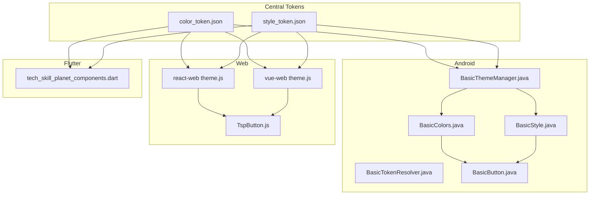
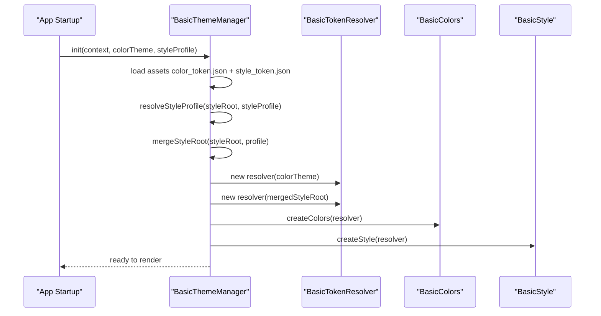
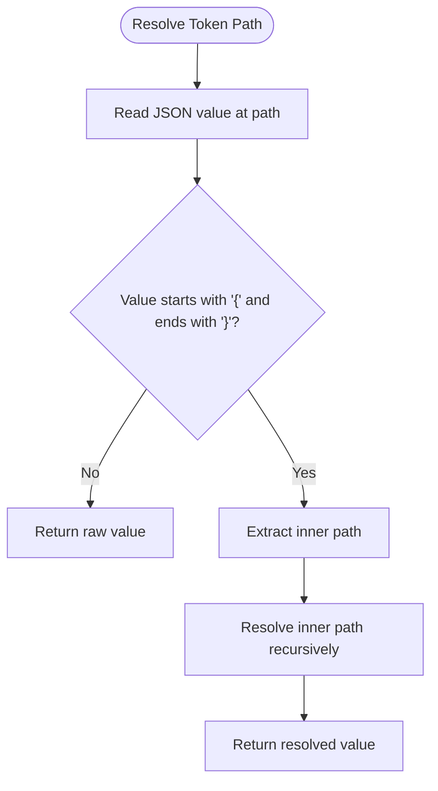
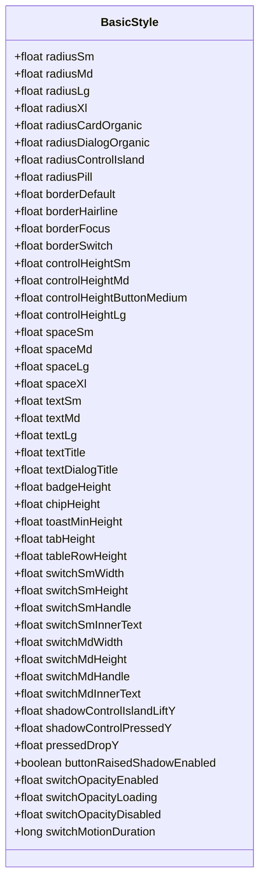
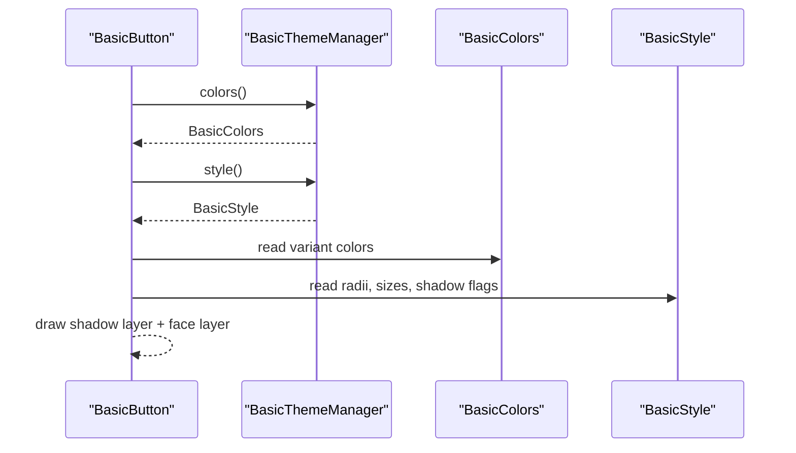
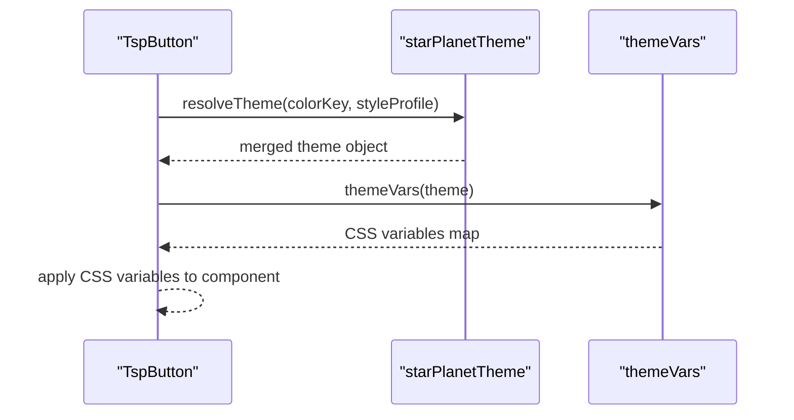
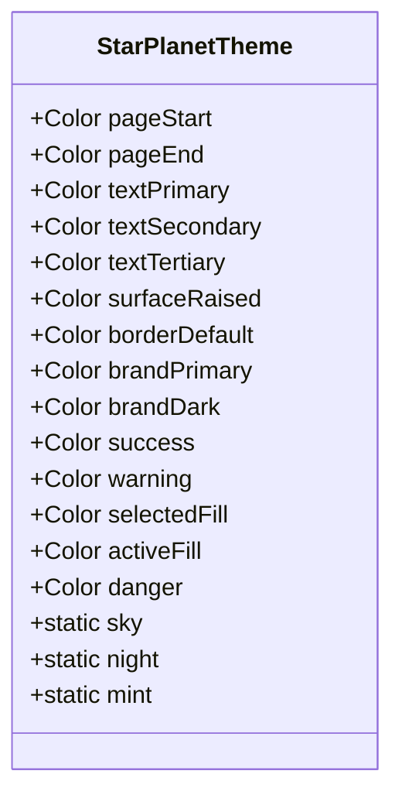
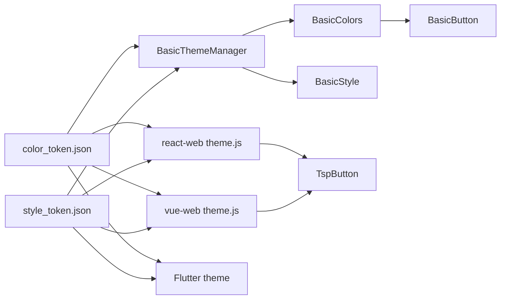

# Design Tokens

<cite>
**Referenced Files in This Document**
- [color_token.json](file://design/tokens/color_token.json)
- [style_token.json](file://design/tokens/style_token.json)
- [color_token.json](file://android/library/src/main/assets/theme/color_token.json)
- [style_token.json](file://android/library/src/main/assets/theme/style_token.json)
- [BasicTokenResolver.java](file://android/library/src/main/java/com/techskillplanet/basiccontrols/theme/BasicTokenResolver.java)
- [BasicThemeManager.java](file://android/library/src/main/java/com/techskillplanet/basiccontrols/theme/BasicThemeManager.java)
- [BasicColors.java](file://android/library/src/main/java/com/techskillplanet/basiccontrols/theme/BasicColors.java)
- [BasicStyle.java](file://android/library/src/main/java/com/techskillplanet/basiccontrols/theme/BasicStyle.java)
- [BasicButton.java](file://android/library/src/main/java/com/techskillplanet/basiccontrols/widget/BasicButton.java)
- [theme.js](file://react-web/library/src/theme.js)
- [TspButton.js](file://react-web/library/src/components/TspButton.js)
- [theme.js](file://vue-web/library/src/theme.js)
- [tech_skill_planet_components.dart](file://flutter/library/lib/tech_skill_planet_components.dart)
</cite>

## Table of Contents
1. [Introduction](#introduction)
2. [Project Structure](#project-structure)
3. [Core Components](#core-components)
4. [Architecture Overview](#architecture-overview)
5. [Detailed Component Analysis](#detailed-component-analysis)
6. [Dependency Analysis](#dependency-analysis)
7. [Performance Considerations](#performance-considerations)
8. [Troubleshooting Guide](#troubleshooting-guide)
9. [Conclusion](#conclusion)
10. [Appendices](#appendices)

## Introduction
This document explains the Planet Components design token system that powers consistent theming across platforms. It covers:
- Color tokens: semantic naming, primitive palettes, and theme variants
- Style tokens: typography, spacing, radii, borders, sizes, shadows, motion, and opacity
- JSON schema and structure of token definitions
- Platform usage: Android (Java), Web (React/Vue), and Flutter
- Guidelines for consistency, inheritance, and platform-specific adaptations

## Project Structure
The token system is defined centrally and consumed by platform libraries:
- Central token definitions live under design/tokens and are mirrored in Android assets
- Platform implementations resolve tokens into runtime values and apply them to components
- Themes are swappable via theme keys and style profiles

**Diagram sources**
- [color_token.json:1-406](file://design/tokens/color_token.json#L1-L406)
- [style_token.json:1-392](file://design/tokens/style_token.json#L1-L392)
- [BasicThemeManager.java:64-82](file://android/library/src/main/java/com/techskillplanet/basiccontrols/theme/BasicThemeManager.java#L64-L82)
- [BasicTokenResolver.java:24-38](file://android/library/src/main/java/com/techskillplanet/basiccontrols/theme/BasicTokenResolver.java#L24-L38)
- [BasicColors.java:9-213](file://android/library/src/main/java/com/techskillplanet/basiccontrols/theme/BasicColors.java#L9-L213)
- [BasicStyle.java:9-205](file://android/library/src/main/java/com/techskillplanet/basiccontrols/theme/BasicStyle.java#L9-L205)
- [BasicButton.java:125-171](file://android/library/src/main/java/com/techskillplanet/basiccontrols/widget/BasicButton.java#L125-L171)
- [theme.js:1-131](file://react-web/library/src/theme.js#L1-L131)
- [TspButton.js:19-48](file://react-web/library/src/components/TspButton.js#L19-L48)
- [theme.js:1-131](file://vue-web/library/src/theme.js#L1-L131)
- [tech_skill_planet_components.dart:3-59](file://flutter/library/lib/tech_skill_planet_components.dart#L3-L59)

**Section sources**
- [color_token.json:1-406](file://design/tokens/color_token.json#L1-L406)
- [style_token.json:1-392](file://design/tokens/style_token.json#L1-L392)
- [color_token.json:1-406](file://android/library/src/main/assets/theme/color_token.json#L1-L406)
- [style_token.json:1-392](file://android/library/src/main/assets/theme/style_token.json#L1-L392)

## Core Components
- Color tokens: primitive and semantic layers with three built-in themes (day, night, mint)
- Style tokens: fonts, spacing, radii, borders, sizes, paddings, gaps, shadows, motion, opacity, and shape profiles
- Android resolver: parses JSON, resolves references, converts units, and exposes typed values
- Web theme: provides theme presets and CSS variable mapping
- Flutter theme: defines strongly-typed theme instances and component styling

**Section sources**
- [color_token.json:13-404](file://design/tokens/color_token.json#L13-L404)
- [style_token.json:13-391](file://design/tokens/style_token.json#L13-L391)
- [BasicTokenResolver.java:45-69](file://android/library/src/main/java/com/techskillplanet/basiccontrols/theme/BasicTokenResolver.java#L45-L69)
- [theme.js:1-131](file://react-web/library/src/theme.js#L1-L131)
- [tech_skill_planet_components.dart:3-59](file://flutter/library/lib/tech_skill_planet_components.dart#L3-L59)

## Architecture Overview
The token architecture separates concerns:
- Definitions: JSON documents encode primitives and semantics
- Resolution: Platform-specific resolvers convert tokens to runtime values
- Application: Components consume typed values for rendering

**Diagram sources**
- [BasicThemeManager.java:64-82](file://android/library/src/main/java/com/techskillplanet/basiccontrols/theme/BasicThemeManager.java#L64-L82)
- [BasicTokenResolver.java:24-38](file://android/library/src/main/java/com/techskillplanet/basiccontrols/theme/BasicTokenResolver.java#L24-L38)
- [BasicColors.java:144-195](file://android/library/src/main/java/com/techskillplanet/basiccontrols/theme/BasicColors.java#L144-L195)
- [BasicStyle.java:243-292](file://android/library/src/main/java/com/techskillplanet/basiccontrols/theme/BasicStyle.java#L243-L292)

## Detailed Component Analysis

### Color Token System
- Primitive palette: sky, cloud, sun, aurora, coral, ink, neutral
- Semantic mapping: brand, status, text, background, border, control.*
- Theme variants: sky_planet_day, star_planet_night, mint_planet_day
- Reference resolution: semantic tokens can reference primitive tokens via brace syntax

**Diagram sources**
- [BasicTokenResolver.java:151-161](file://android/library/src/main/java/com/techskillplanet/basiccontrols/theme/BasicTokenResolver.java#L151-L161)

**Section sources**
- [color_token.json:13-404](file://design/tokens/color_token.json#L13-L404)
- [color_token.json:13-404](file://android/library/src/main/assets/theme/color_token.json#L13-L404)
- [BasicTokenResolver.java:45-49](file://android/library/src/main/java/com/techskillplanet/basiccontrols/theme/BasicTokenResolver.java#L45-L49)
- [BasicTokenResolver.java:151-161](file://android/library/src/main/java/com/techskillplanet/basiccontrols/theme/BasicTokenResolver.java#L151-L161)

### Style Token System
- Typography: family, weight, size, lineHeight, letterSpacing
- Spacing: global space scale and per-component paddings/gaps
- Radii: global radius scale and organic shapes
- Borders: widths and styles
- Sizes: control heights, icons, form controls, modals, navigation, tables, avatars, etc.
- Shadows: layered elevations with color tokens or literal colors
- Motion: durations, easing curves, interaction offsets, switch animation
- Opacity: per-state opacities for switches
- Shape profiles: island-style shape rules and modal shape hints

**Diagram sources**
- [BasicStyle.java:9-205](file://android/library/src/main/java/com/techskillplanet/basiccontrols/theme/BasicStyle.java#L9-L205)

**Section sources**
- [style_token.json:13-391](file://design/tokens/style_token.json#L13-L391)
- [style_token.json:13-391](file://android/library/src/main/assets/theme/style_token.json#L13-L391)
- [BasicStyle.java:109-203](file://android/library/src/main/java/com/techskillplanet/basiccontrols/theme/BasicStyle.java#L109-L203)

### Android Implementation
- BasicThemeManager loads assets, merges style profiles, and constructs BasicColors and BasicStyle
- BasicTokenResolver handles JSON path reads, reference resolution, and unit conversions
- BasicButton consumes BasicColors and BasicStyle to render island-style buttons with raised shadow support

**Diagram sources**
- [BasicButton.java:125-171](file://android/library/src/main/java/com/techskillplanet/basiccontrols/widget/BasicButton.java#L125-L171)
- [BasicThemeManager.java:107-124](file://android/library/src/main/java/com/techskillplanet/basiccontrols/theme/BasicThemeManager.java#L107-L124)
- [BasicColors.java:67-112](file://android/library/src/main/java/com/techskillplanet/basiccontrols/theme/BasicColors.java#L67-L112)
- [BasicStyle.java:92-99](file://android/library/src/main/java/com/techskillplanet/basiccontrols/theme/BasicStyle.java#L92-L99)

**Section sources**
- [BasicThemeManager.java:64-82](file://android/library/src/main/java/com/techskillplanet/basiccontrols/theme/BasicThemeManager.java#L64-L82)
- [BasicTokenResolver.java:57-69](file://android/library/src/main/java/com/techskillplanet/basiccontrols/theme/BasicTokenResolver.java#L57-L69)
- [BasicButton.java:125-171](file://android/library/src/main/java/com/techskillplanet/basiccontrols/widget/BasicButton.java#L125-L171)

### Web Implementation (React and Vue)
- Theme presets define color palettes and style profiles
- Components receive theme objects and compute CSS variables
- Buttons and other components read theme fields to apply colors, radii, and motion

**Diagram sources**
- [theme.js:96-106](file://react-web/library/src/theme.js#L96-L106)
- [theme.js:108-130](file://react-web/library/src/theme.js#L108-L130)
- [TspButton.js:29-46](file://react-web/library/src/components/TspButton.js#L29-L46)

**Section sources**
- [theme.js:1-131](file://react-web/library/src/theme.js#L1-L131)
- [TspButton.js:19-48](file://react-web/library/src/components/TspButton.js#L19-L48)
- [theme.js:1-131](file://vue-web/library/src/theme.js#L1-L131)

### Flutter Implementation
- StarPlanetTheme defines named themes (sky, night, mint)
- Components read theme fields for colors, radii, and sizing
- Example: TspButton uses theme brandPrimary, surfaceRaised, and borderDefault

**Diagram sources**
- [tech_skill_planet_components.dart:3-59](file://flutter/library/lib/tech_skill_planet_components.dart#L3-L59)

**Section sources**
- [tech_skill_planet_components.dart:3-59](file://flutter/library/lib/tech_skill_planet_components.dart#L3-L59)

## Dependency Analysis
- Android depends on centralized JSON tokens and resolves them into typed values
- Web components depend on theme factories and CSS variable mapping
- Flutter components depend on predefined theme instances
- Style profiles can override base tokens, enabling “raised” vs “flat” island styles

**Diagram sources**
- [BasicThemeManager.java:64-82](file://android/library/src/main/java/com/techskillplanet/basiccontrols/theme/BasicThemeManager.java#L64-L82)
- [BasicColors.java:144-195](file://android/library/src/main/java/com/techskillplanet/basiccontrols/theme/BasicColors.java#L144-L195)
- [BasicStyle.java:243-292](file://android/library/src/main/java/com/techskillplanet/basiccontrols/theme/BasicStyle.java#L243-L292)
- [theme.js:96-106](file://react-web/library/src/theme.js#L96-L106)
- [TspButton.js:29-46](file://react-web/library/src/components/TspButton.js#L29-L46)
- [theme.js:96-106](file://vue-web/library/src/theme.js#L96-L106)
- [tech_skill_planet_components.dart:3-59](file://flutter/library/lib/tech_skill_planet_components.dart#L3-L59)

**Section sources**
- [BasicThemeManager.java:198-240](file://android/library/src/main/java/com/techskillplanet/basiccontrols/theme/BasicThemeManager.java#L198-L240)
- [style_token.json:361-391](file://design/tokens/style_token.json#L361-L391)

## Performance Considerations
- Pre-resolution: Android resolves tokens once during initialization and caches typed values
- Unit conversion: dp/sp are converted to px at init time to avoid repeated work
- Reference resolution: recursive brace parsing is linear in depth and path length
- CSS variables: Web computes a single variable map per theme application
- Flutter: theme instances are static and reused across widgets

[No sources needed since this section provides general guidance]

## Troubleshooting Guide
Common issues and resolutions:
- Token not found: Verify the JSON path exists under the active theme and profile
- Wrong token type: Ensure numeric paths return numbers and color paths return hex strings
- Incorrect color format: Android expects #RRGGBBAA; ensure alpha order matches
- Missing initialization: Android requires BasicThemeManager.init(context) before rendering
- Style profile mismatch: Confirm the requested style profile exists in style_token.json themes

**Section sources**
- [BasicTokenResolver.java:87-93](file://android/library/src/main/java/com/techskillplanet/basiccontrols/theme/BasicTokenResolver.java#L87-L93)
- [BasicTokenResolver.java:170-190](file://android/library/src/main/java/com/techskillplanet/basiccontrols/theme/BasicTokenResolver.java#L170-L190)
- [BasicThemeManager.java:108-124](file://android/library/src/main/java/com/techskillplanet/basiccontrols/theme/BasicThemeManager.java#L108-L124)

## Conclusion
Planet Components’ design tokens provide a robust, cross-platform theming system:
- Centralized definitions with semantic mapping and primitive palettes
- Strong resolution and caching on Android
- Flexible theme presets and CSS variable mapping on Web
- Static theme instances on Flutter
- Extensible style profiles and platform-specific adaptations

## Appendices

### JSON Schema and Naming Conventions
- Color tokens include metadata for theme switching and naming guidance
- Style tokens include metadata for units and naming guidance
- Both define themes and nested semantic/primitive structures

**Section sources**
- [color_token.json:2-12](file://design/tokens/color_token.json#L2-L12)
- [style_token.json:2-12](file://design/tokens/style_token.json#L2-L12)

### Platform-Specific Adaptations
- Android: JSON assets, unit conversions, and layered drawing for island shadows
- Web: theme factories and CSS variables for dynamic theming
- Flutter: static theme classes and direct color usage

**Section sources**
- [BasicThemeManager.java:21-24](file://android/library/src/main/java/com/techskillplanet/basiccontrols/theme/BasicThemeManager.java#L21-L24)
- [theme.js:87-94](file://react-web/library/src/theme.js#L87-L94)
- [tech_skill_planet_components.dart:3-59](file://flutter/library/lib/tech_skill_planet_components.dart#L3-L59)