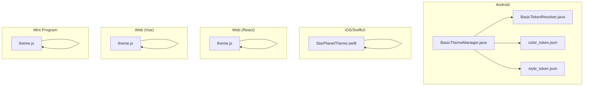
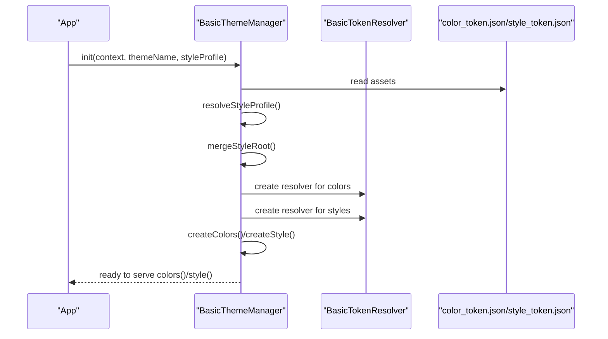
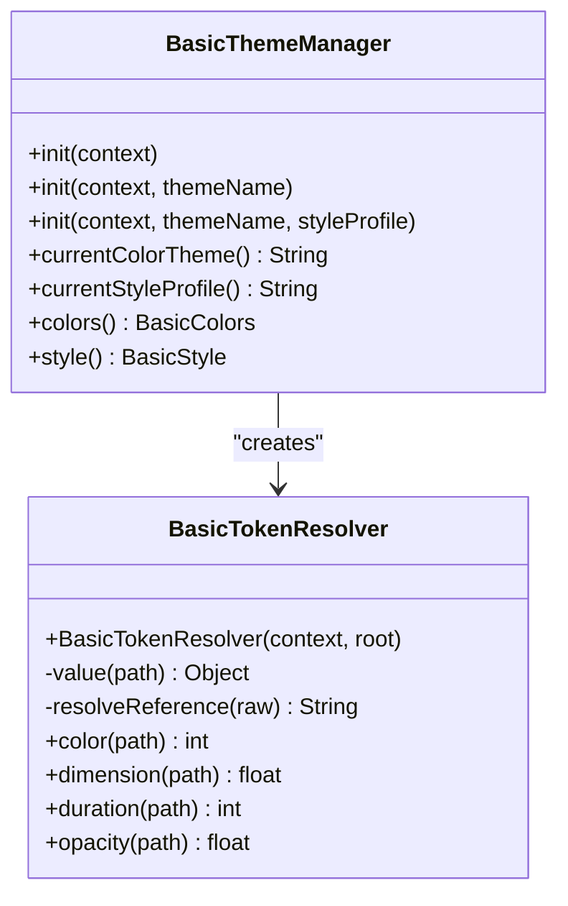
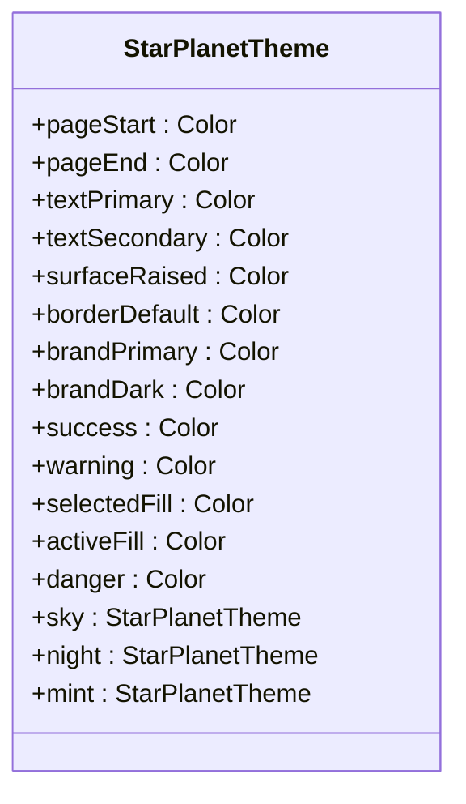
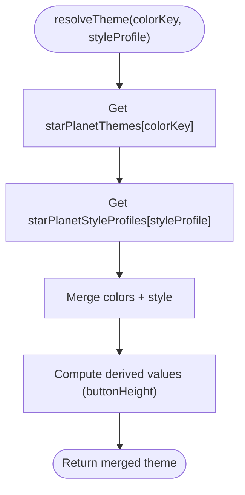
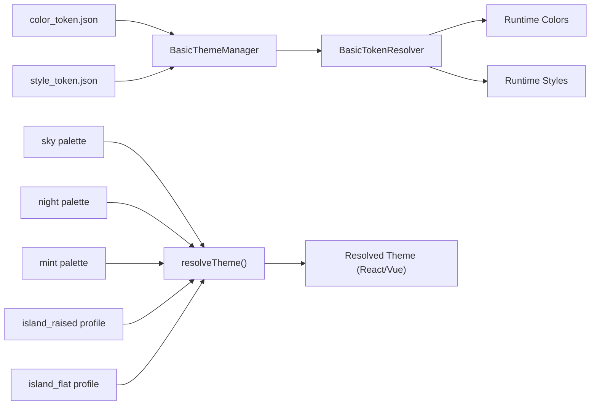

# Theme Management

<cite>
**Referenced Files in This Document**
- [BasicThemeManager.java](file://android/library/src/main/java/com/techskillplanet/basiccontrols/theme/BasicThemeManager.java)
- [BasicTokenResolver.java](file://android/library/src/main/java/com/techskillplanet/basiccontrols/theme/BasicTokenResolver.java)
- [color_token.json](file://android/library/src/main/assets/theme/color_token.json)
- [style_token.json](file://android/library/src/main/assets/theme/style_token.json)
- [starPlanetTheme.swift](file://ios-swiftui/library/Sources/TechSkillPlanetBasicControls/StarPlanetTheme.swift)
- [theme.js (React Web)](file://react-web/library/src/theme.js)
- [theme.js (Vue Web)](file://vue-web/library/src/theme.js)
- [theme.js (Mini Program)](file://miniprogram/library/theme/theme.js)
- [SettingsSamplePage.java](file://android/samples/src/main/java/com/techskillplanet/basiccontrols/samples/SettingsSamplePage.java)
- [components.test.js](file://react-web/library/tests/components.test.js)
- [token-view-workflow.md](file://.agents/skills/build-android-ui/references/token-view-workflow.md)
</cite>

## Table of Contents
1. [Introduction](#introduction)
2. [Project Structure](#project-structure)
3. [Core Components](#core-components)
4. [Architecture Overview](#architecture-overview)
5. [Detailed Component Analysis](#detailed-component-analysis)
6. [Dependency Analysis](#dependency-analysis)
7. [Performance Considerations](#performance-considerations)
8. [Troubleshooting Guide](#troubleshooting-guide)
9. [Conclusion](#conclusion)
10. [Appendices](#appendices)

## Introduction
This document explains the cross-platform theme management system across Android, iOS/SwiftUI, React Web, Vue Web, Mini Program, and Flutter environments. It covers the theme architecture, token resolution mechanisms, and theme switching capabilities. It documents the three primary themes (Sky Planet, Star Planet Night, Mint Planet) with their specific configurations and use cases, and details initialization, provider patterns, and context management. Practical examples demonstrate dynamic theme switching, persistence strategies, and custom theme creation. Performance and memory considerations are addressed for efficient theme operations.

## Project Structure
The theme system is implemented consistently across platforms with a shared token-driven model:
- Android: JSON-based tokens resolved at startup into runtime types.
- iOS/SwiftUI: Predefined theme instances with explicit color values.
- Web frameworks (React and Vue): JavaScript theme objects and style profiles.
- Mini Program: Theme presets mapped to CSS classes.
- Flutter: Built-in theme presets and dynamic switching in samples.

**Diagram sources**
- [BasicThemeManager.java:1-221](file://android/library/src/main/java/com/techskillplanet/basiccontrols/theme/BasicThemeManager.java#L1-L221)
- [BasicTokenResolver.java:1-161](file://android/library/src/main/java/com/techskillplanet/basiccontrols/theme/BasicTokenResolver.java#L1-L161)
- [color_token.json](file://android/library/src/main/assets/theme/color_token.json)
- [style_token.json](file://android/library/src/main/assets/theme/style_token.json)
- [starPlanetTheme.swift:19-42](file://ios-swiftui/library/Sources/TechSkillPlanetBasicControls/StarPlanetTheme.swift#L19-L42)
- [theme.js (React Web):1-106](file://react-web/library/src/theme.js#L1-L106)
- [theme.js (Vue Web):1-106](file://vue-web/library/src/theme.js#L1-L106)
- [theme.js (Mini Program):53-84](file://miniprogram/library/theme/theme.js#L53-L84)

**Section sources**
- [token-view-workflow.md:1-44](file://.agents/skills/build-android-ui/references/token-view-workflow.md#L1-L44)

## Core Components
- Android
  - BasicThemeManager: Central theme entry point; initializes and caches resolved color and style sets; exposes current theme keys and runtime accessors.
  - BasicTokenResolver: Resolves JSON paths, resolves token references, and converts primitives to Android runtime values.
  - Tokens: color_token.json and style_token.json define themes and style profiles.
- iOS/SwiftUI
  - StarPlanetTheme: Provides predefined theme instances (sky, night, mint) with explicit Color values.
- Web (React and Vue)
  - theme.js: Defines theme palettes, style profiles, presets, and a resolver that merges color and style tokens into a single theme object.
- Mini Program
  - theme.js: Exposes theme presets and a class selector to toggle dark/light modes via CSS classes.
- Flutter
  - Theme presets and dynamic switching demonstrated in samples.

**Section sources**
- [BasicThemeManager.java:1-221](file://android/library/src/main/java/com/techskillplanet/basiccontrols/theme/BasicThemeManager.java#L1-L221)
- [BasicTokenResolver.java:1-161](file://android/library/src/main/java/com/techskillplanet/basiccontrols/theme/BasicTokenResolver.java#L1-L161)
- [starPlanetTheme.swift:19-42](file://ios-swiftui/library/Sources/TechSkillPlanetBasicControls/StarPlanetTheme.swift#L19-L42)
- [theme.js (React Web):1-106](file://react-web/library/src/theme.js#L1-L106)
- [theme.js (Vue Web):1-106](file://vue-web/library/src/theme.js#L1-L106)
- [theme.js (Mini Program):53-84](file://miniprogram/library/theme/theme.js#L53-L84)

## Architecture Overview
The theme architecture follows a token-driven pattern:
- Tokens are defined in JSON (Android) or JS objects (Web/iOS).
- At initialization, tokens are resolved into runtime types or values.
- Components consume pre-resolved values via centralized managers/providers.
- Theme switching updates the active theme and refreshes component styling.

**Diagram sources**
- [BasicThemeManager.java:64-82](file://android/library/src/main/java/com/techskillplanet/basiccontrols/theme/BasicThemeManager.java#L64-L82)
- [BasicTokenResolver.java:1-161](file://android/library/src/main/java/com/techskillplanet/basiccontrols/theme/BasicTokenResolver.java#L1-L161)
- [color_token.json](file://android/library/src/main/assets/theme/color_token.json)
- [style_token.json](file://android/library/src/main/assets/theme/style_token.json)

## Detailed Component Analysis

### Android Theme System
- Initialization
  - BasicThemeManager.init(...) reads color_token.json and style_token.json from assets, selects the requested theme and style profile, merges them, and constructs runtime color and style objects.
  - It stores the active theme name and style profile for diagnostics and runtime accessors.
- Token Resolution
  - BasicTokenResolver resolves dot-delimited JSON paths, dereferences primitive references, and converts units (e.g., dp, sp) to Android runtime values.
- Provider Pattern
  - Components call BasicThemeManager.colors() and BasicThemeManager.style() to obtain pre-resolved values, avoiding repeated JSON parsing.

**Diagram sources**
- [BasicThemeManager.java:20-124](file://android/library/src/main/java/com/techskillplanet/basiccontrols/theme/BasicThemeManager.java#L20-L124)
- [BasicTokenResolver.java:24-161](file://android/library/src/main/java/com/techskillplanet/basiccontrols/theme/BasicTokenResolver.java#L24-L161)

**Section sources**
- [BasicThemeManager.java:40-124](file://android/library/src/main/java/com/techskillplanet/basiccontrols/theme/BasicThemeManager.java#L40-L124)
- [BasicTokenResolver.java:126-161](file://android/library/src/main/java/com/techskillplanet/basiccontrols/theme/BasicTokenResolver.java#L126-L161)
- [token-view-workflow.md:24-34](file://.agents/skills/build-android-ui/references/token-view-workflow.md#L24-L34)

### iOS/SwiftUI Theme System
- StarPlanetTheme defines static instances for sky, night, and mint themes with explicit Color values.
- Components receive a theme instance and apply colors directly.

**Diagram sources**
- [starPlanetTheme.swift:19-42](file://ios-swiftui/library/Sources/TechSkillPlanetBasicControls/StarPlanetTheme.swift#L19-L42)

**Section sources**
- [starPlanetTheme.swift:19-42](file://ios-swiftui/library/Sources/TechSkillPlanetBasicControls/StarPlanetTheme.swift#L19-L42)

### Web Theme Systems (React and Vue)
- Theme definition and resolution
  - Theme palettes (sky, night, mint, sunrise) and style profiles (island_raised, island_flat) are defined in theme.js.
  - resolveTheme merges a color palette with a style profile and computes derived values (e.g., button height).
- Provider pattern
  - Components consume the resolved theme object directly.

**Diagram sources**
- [theme.js (React Web):96-106](file://react-web/library/src/theme.js#L96-L106)
- [theme.js (Vue Web):96-106](file://vue-web/library/src/theme.js#L96-L106)

**Section sources**
- [theme.js (React Web):1-106](file://react-web/library/src/theme.js#L1-L106)
- [theme.js (Vue Web):1-106](file://vue-web/library/src/theme.js#L1-L106)
- [components.test.js:52-66](file://react-web/library/tests/components.test.js#L52-L66)

### Mini Program Theme System
- Theme presets are defined and selected via a helper that returns a CSS class name to toggle light/dark mode.
- Components apply the returned class to switch themes.

**Section sources**
- [theme.js (Mini Program):53-84](file://miniprogram/library/theme/theme.js#L53-L84)

### Theme Switching Examples

- Android
  - Use BasicThemeManager.init(context, themeName, styleProfile) to switch themes dynamically. The manager caches the resolved values and exposes them via colors() and style().
  - Example usage is shown in the sample settings page with preset definitions.

- iOS/SwiftUI
  - Instantiate StarPlanetTheme.sky, .night, or .mint and pass the instance to views.

- Web (React/Vue)
  - Call resolveTheme(colorKey, styleProfile) to compute a theme object and pass it to components.

- Mini Program
  - Use the theme class helper to apply a CSS class for theme switching.

**Section sources**
- [BasicThemeManager.java:64-124](file://android/library/src/main/java/com/techskillplanet/basiccontrols/theme/BasicThemeManager.java#L64-L124)
- [SettingsSamplePage.java:107-122](file://android/samples/src/main/java/com/techskillplanet/basiccontrols/samples/SettingsSamplePage.java#L107-L122)
- [theme.js (React Web):96-106](file://react-web/library/src/theme.js#L96-L106)
- [theme.js (Vue Web):96-106](file://vue-web/library/src/theme.js#L96-L106)
- [theme.js (Mini Program):76-82](file://miniprogram/library/theme/theme.js#L76-L82)

## Dependency Analysis
- Android
  - BasicThemeManager depends on asset files and BasicTokenResolver to produce BasicColors and BasicStyle.
  - Token references are resolved during initialization; components depend on the manager’s cached results.
- iOS/SwiftUI
  - Components depend on StarPlanetTheme instances.
- Web
  - Components depend on the resolved theme object produced by resolveTheme.
- Mini Program
  - Components depend on the CSS class returned by the theme helper.

**Diagram sources**
- [BasicThemeManager.java:64-82](file://android/library/src/main/java/com/techskillplanet/basiccontrols/theme/BasicThemeManager.java#L64-L82)
- [BasicTokenResolver.java:126-161](file://android/library/src/main/java/com/techskillplanet/basiccontrols/theme/BasicTokenResolver.java#L126-L161)
- [color_token.json](file://android/library/src/main/assets/theme/color_token.json)
- [style_token.json](file://android/library/src/main/assets/theme/style_token.json)
- [theme.js (React Web):96-106](file://react-web/library/src/theme.js#L96-L106)

**Section sources**
- [BasicThemeManager.java:64-124](file://android/library/src/main/java/com/techskillplanet/basiccontrols/theme/BasicThemeManager.java#L64-L124)
- [theme.js (React Web):96-106](file://react-web/library/src/theme.js#L96-L106)

## Performance Considerations
- Initialization cost
  - Android: JSON parsing and merging occur once during init; subsequent access is O(1) via cached BasicColors and BasicStyle.
  - Web: resolveTheme performs shallow merges and derived computations; cache the returned object per session.
  - iOS: Theme instances are static; minimal runtime cost.
- Memory management
  - Android: Store BasicThemeManager references at application scope to avoid leaks; use ApplicationContext for asset access.
  - Web: Keep a single resolved theme instance per session; avoid recreating objects frequently.
  - iOS: Reuse theme instances; avoid reconstructing Color objects.
- Rendering efficiency
  - Android: Prefer using BasicThemeManager.colors() and BasicThemeManager.style() to minimize recomputation.
  - Web: Apply CSS variables or precomputed inline styles to reduce layout thrashing.
- Persistence
  - Persist user’s last selection (theme name and style profile) and reapply at app start to avoid redundant parsing.

[No sources needed since this section provides general guidance]

## Troubleshooting Guide
- Android
  - Symptom: IllegalStateException indicating theme not initialized.
    - Cause: Components called colors() or style() before BasicThemeManager.init(...).
    - Fix: Ensure init is called early in app lifecycle (e.g., Application.onCreate or first activity).
  - Symptom: Missing token path errors.
    - Cause: JSON path does not exist or token reference unresolved.
    - Fix: Verify color_token.json and style_token.json structure; ensure referenced paths exist.
- Web
  - Symptom: Defaults not applied when keys are missing.
    - Behavior: resolveTheme falls back to sky palette and island_raised profile.
    - Action: Validate inputs and ensure expected keys are present.
- iOS
  - Symptom: Incorrect color rendering.
    - Action: Confirm Color values match design specs; avoid recalculating Color objects repeatedly.
- Mini Program
  - Symptom: Theme not switching.
    - Action: Ensure the returned CSS class is applied to the root element.

**Section sources**
- [BasicThemeManager.java:107-124](file://android/library/src/main/java/com/techskillplanet/basiccontrols/theme/BasicThemeManager.java#L107-L124)
- [BasicThemeManager.java:79-81](file://android/library/src/main/java/com/techskillplanet/basiccontrols/theme/BasicThemeManager.java#L79-L81)
- [theme.js (React Web):96-106](file://react-web/library/src/theme.js#L96-L106)

## Conclusion
The theme management system employs a consistent token-driven architecture across platforms. Android uses JSON tokens resolved at startup into runtime types; iOS/SwiftUI uses predefined theme instances; React and Vue use JavaScript theme objects and style profiles; Mini Program toggles themes via CSS classes. The system supports dynamic switching, persistence, and efficient rendering. Following the provider patterns and initialization guidelines ensures robust, maintainable theming across all platforms.

[No sources needed since this section summarizes without analyzing specific files]

## Appendices

### Theme Definitions and Use Cases

- Sky Planet
  - Android: color_theme = sky_planet_day; style_profile = island_raised or island_flat.
  - iOS: StarPlanetTheme.sky.
  - Web: starPlanetThemes.sky; commonly paired with island_raised for raised shadows.
  - Mini Program: theme-sky class.
  - Use case: Default light theme with optional elevation shadows.

- Star Planet Night
  - Android: color_theme = sky_planet_night; style_profile = island_raised or island_flat.
  - iOS: StarPlanetTheme.night.
  - Web: starPlanetThemes.night; commonly paired with island_raised for raised shadows.
  - Mini Program: theme-night class.
  - Use case: Dark theme with elevated surfaces and strong contrast.

- Mint Planet
  - Android: color_theme = mint_planet; style_profile = island_raised or island_flat.
  - iOS: StarPlanetTheme.mint.
  - Web: starPlanetThemes.mint; commonly paired with island_raised for raised shadows.
  - Use case: Calming green-toned theme with optional elevation.

**Section sources**
- [BasicThemeManager.java:64-82](file://android/library/src/main/java/com/techskillplanet/basiccontrols/theme/BasicThemeManager.java#L64-L82)
- [starPlanetTheme.swift:19-42](file://ios-swiftui/library/Sources/TechSkillPlanetBasicControls/StarPlanetTheme.swift#L19-L42)
- [theme.js (React Web):18-68](file://react-web/library/src/theme.js#L18-L68)
- [theme.js (Vue Web):18-68](file://vue-web/library/src/theme.js#L18-L68)
- [theme.js (Mini Program):53-84](file://miniprogram/library/theme/theme.js#L53-L84)

### Theme Switching Patterns

- Android
  - Initialize with desired theme and style profile; update by calling init again and refreshing UI.
  - Example preset definitions are available in the sample settings page.

- iOS/SwiftUI
  - Instantiate the appropriate theme instance and pass it down the view hierarchy.

- Web (React/Vue)
  - Compute a new theme object via resolveTheme and pass it to components.

- Mini Program
  - Apply the returned CSS class to the root element to switch themes.

**Section sources**
- [SettingsSamplePage.java:107-122](file://android/samples/src/main/java/com/techskillplanet/basiccontrols/samples/SettingsSamplePage.java#L107-L122)
- [theme.js (React Web):96-106](file://react-web/library/src/theme.js#L96-L106)
- [theme.js (Vue Web):96-106](file://vue-web/library/src/theme.js#L96-L106)
- [theme.js (Mini Program):76-82](file://miniprogram/library/theme/theme.js#L76-L82)

### Custom Theme Creation

- Android
  - Add a new theme under themes in color_token.json and optionally a style profile under themes in style_token.json.
  - Initialize with BasicThemeManager.init(context, newThemeName, styleProfileName).

- iOS/SwiftUI
  - Define a new static instance of StarPlanetTheme with required Color values.

- Web (React/Vue)
  - Extend starPlanetThemes with a new key and optionally add a new style profile to starPlanetStyleProfiles; update builtInThemePresets accordingly.

- Mini Program
  - Add a new theme preset and a corresponding CSS class; update the theme class helper to return the new class when selected.

**Section sources**
- [BasicThemeManager.java:64-82](file://android/library/src/main/java/com/techskillplanet/basiccontrols/theme/BasicThemeManager.java#L64-L82)
- [starPlanetTheme.swift:19-42](file://ios-swiftui/library/Sources/TechSkillPlanetBasicControls/StarPlanetTheme.swift#L19-L42)
- [theme.js (React Web):18-94](file://react-web/library/src/theme.js#L18-L94)
- [theme.js (Vue Web):18-94](file://vue-web/library/src/theme.js#L18-L94)
- [theme.js (Mini Program):53-84](file://miniprogram/library/theme/theme.js#L53-L84)