# Development Workflow

<cite>
**Referenced Files in This Document**
- [README.md](file://README.md)
- [AGENTS.md](file://AGENTS.md)
- [docs/COMPONENT_CONTRACT.md](file://docs/COMPONENT_CONTRACT.md)
- [docs/PLATFORM_STRUCTURE.md](file://docs/PLATFORM_STRUCTURE.md)
- [component_contract.json](file://component_contract.json)
- [.agents/skills/build-planet-components/SKILL.md](file://.agents/skills/build-planet-components/SKILL.md)
- [.agents/skills/build-android-ui/SKILL.md](file://.agents/skills/build-android-ui/SKILL.md)
- [.agents/skills/integrate-react-components/SKILL.md](file://.agents/skills/integrate-react-components/SKILL.md)
- [tools/check-structure.cjs](file://tools/check-structure.cjs)
- [android/library/src/main/java/com/techskillplanet/basiccontrols/widget/BasicButton.java](file://android/library/src/main/java/com/techskillplanet/basiccontrols/widget/BasicButton.java)
- [react-web/library/src/components/TspButton.js](file://react-web/library/src/components/TspButton.js)
- [flutter/library/lib/tech_skill_planet_components.dart](file://flutter/library/lib/tech_skill_planet_components.dart)
- [ios-swiftui/library/Sources/TechSkillPlanetBasicControls/BasicControls.swift](file://ios-swiftui/library/Sources/TechSkillPlanetBasicControls/BasicControls.swift)
- [miniprogram/library/components/bc-button/bc-button.js](file://miniprogram/library/components/bc-button/bc-button.js)
- [react-web/library/tests/setup.js](file://react-web/library/tests/setup.js)
- [react-web/library/vitest.config.js](file://react-web/library/vitest.config.js)
- [design/tokens/color_token.json](file://design/tokens/color_token.json)
- [design/tokens/style_token.json](file://design/tokens/style_token.json)
</cite>

## Table of Contents
1. [Introduction](#introduction)
2. [Project Structure](#project-structure)
3. [Core Components](#core-components)
4. [Architecture Overview](#architecture-overview)
5. [Detailed Component Analysis](#detailed-component-analysis)
6. [Dependency Analysis](#dependency-analysis)
7. [Performance Considerations](#performance-considerations)
8. [Troubleshooting Guide](#troubleshooting-guide)
9. [Conclusion](#conclusion)
10. [Appendices](#appendices)

## Introduction
This document describes the end-to-end development workflow for Planet Components, focusing on:
- Automated component creation via AI agents (build-planet-components and build-android-ui skills)
- Cross-platform synchronization enforced by the component contract
- Development environment setup, code generation patterns, and quality assurance
- Testing strategies across platforms
- Guidelines for adding new components while maintaining platform parity
- Local validation and CI/CD expectations

The repository organizes each platform as a first-class stack with a standalone library and a runnable samples project. Shared design tokens underpin visual consistency across Android View, React Native, React Web, Vue Web, Flutter, iOS SwiftUI, WeChat Mini Program, and Kuikly.

## Project Structure
Planet Components follows a consistent layout per platform:
- library: independent, publishable component library
- samples: runnable sample project depending on the local library
- Shared design tokens under design/tokens

```mermaid
graph TB
subgraph "Repository Root"
A["android/"]
B["react-native/"]
C["react-web/"]
D["vue-web/"]
E["flutter/"]
F["ios-swiftui/"]
G["miniprogram/"]
H["kuikly/"]
T["design/tokens/"]
U["docs/"]
V[".agents/skills/"]
W["tools/"]
end
A --> A1["library/"]
A --> A2["samples/"]
B --> B1["library/"]
B --> B2["samples/"]
C --> C1["library/"]
C --> C2["samples/"]
D --> D1["library/"]
D --> D2["samples/"]
E --> E1["library/"]
E --> E2["samples/"]
F --> F1["library/"]
F --> F2["samples/"]
G --> G1["library/"]
G --> G2["samples/"]
H --> H1["library/"]
H --> H2["samples/"]
T --> T1["color_token.json"]
T --> T2["style_token.json"]
U --> U1["COMPONENT_CONTRACT.md"]
U --> U2["PLATFORM_STRUCTURE.md"]
V --> V1["build-planet-components/SKILL.md"]
V --> V2["build-android-ui/SKILL.md"]
V --> V3["integrate-react-components/SKILL.md"]
W --> W1["check-structure.cjs"]
```

**Diagram sources**
- [README.md:10-22](file://README.md#L10-L22)
- [docs/PLATFORM_STRUCTURE.md:35-41](file://docs/PLATFORM_STRUCTURE.md#L35-L41)
- [design/tokens/color_token.json:1-200](file://design/tokens/color_token.json#L1-L200)
- [design/tokens/style_token.json:1-200](file://design/tokens/style_token.json#L1-L200)
- [.agents/skills/build-planet-components/SKILL.md:1-88](file://.agents/skills/build-planet-components/SKILL.md#L1-L88)
- [.agents/skills/build-android-ui/SKILL.md:1-96](file://.agents/skills/build-android-ui/SKILL.md#L1-L96)
- [.agents/skills/integrate-react-components/SKILL.md:1-214](file://.agents/skills/integrate-react-components/SKILL.md#L1-L214)
- [tools/check-structure.cjs:16-34](file://tools/check-structure.cjs#L16-L34)

**Section sources**
- [README.md:10-22](file://README.md#L10-L22)
- [docs/PLATFORM_STRUCTURE.md:35-41](file://docs/PLATFORM_STRUCTURE.md#L35-L41)
- [tools/check-structure.cjs:16-34](file://tools/check-structure.cjs#L16-L34)

## Core Components
Planet Components enforces a strict component contract ensuring naming, props, variants, and visual semantics align across platforms. The machine-readable contract and human-readable guide define the canonical API surface.

Key elements:
- Shared theme name and semantic tokens
- Component catalog with required variants and core props
- Sample coverage requirements for states and realistic usage

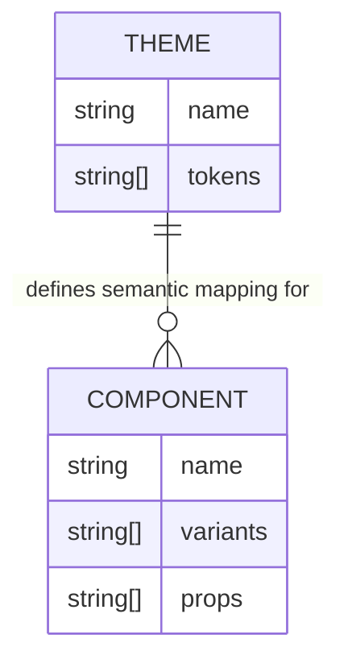

**Diagram sources**
- [component_contract.json:1-159](file://component_contract.json#L1-L159)
- [docs/COMPONENT_CONTRACT.md:1-68](file://docs/COMPONENT_CONTRACT.md#L1-L68)

**Section sources**
- [component_contract.json:1-159](file://component_contract.json#L1-L159)
- [docs/COMPONENT_CONTRACT.md:1-68](file://docs/COMPONENT_CONTRACT.md#L1-L68)

## Architecture Overview
Planet Components employs a token-driven architecture:
- Shared design tokens (color_token.json, style_token.json) define visual primitives and semantic mappings
- Each platform consumes tokens to render components consistently
- AI agent skills coordinate cross-platform generation and validation

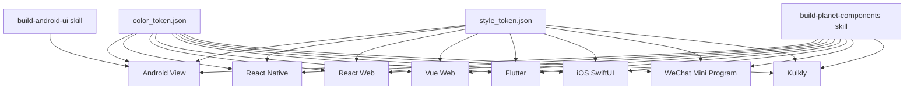

**Diagram sources**
- [design/tokens/color_token.json:1-200](file://design/tokens/color_token.json#L1-L200)
- [design/tokens/style_token.json:1-200](file://design/tokens/style_token.json#L1-L200)
- [.agents/skills/build-planet-components/SKILL.md:12-17](file://.agents/skills/build-planet-components/SKILL.md#L12-L17)
- [.agents/skills/build-android-ui/SKILL.md:12-17](file://.agents/skills/build-android-ui/SKILL.md#L12-L17)

## Detailed Component Analysis

### Automated Component Creation with AI Agents
Two primary agent skills streamline development:
- build-planet-components: orchestrates cross-platform component libraries and samples
- build-android-ui: focuses on Android View Java/XML components with token-driven theming

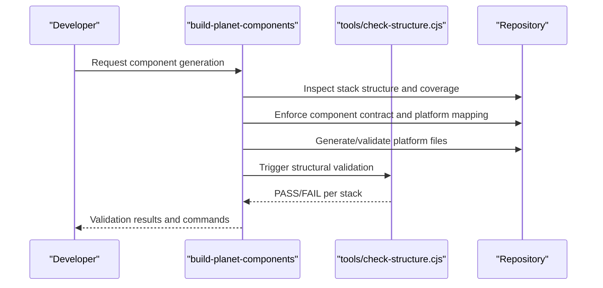

**Diagram sources**
- [.agents/skills/build-planet-components/SKILL.md:19-50](file://.agents/skills/build-planet-components/SKILL.md#L19-L50)
- [tools/check-structure.cjs:16-34](file://tools/check-structure.cjs#L16-L34)

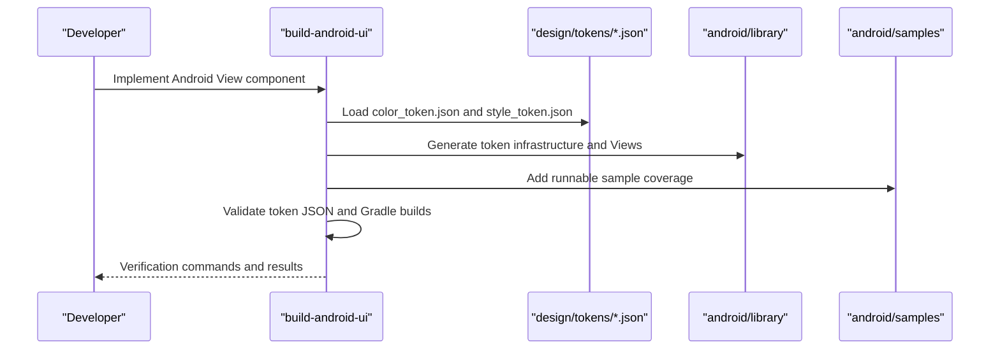

**Diagram sources**
- [.agents/skills/build-android-ui/SKILL.md:19-54](file://.agents/skills/build-android-ui/SKILL.md#L19-L54)
- [design/tokens/color_token.json:1-200](file://design/tokens/color_token.json#L1-L200)
- [design/tokens/style_token.json:1-200](file://design/tokens/style_token.json#L1-L200)

**Section sources**
- [.agents/skills/build-planet-components/SKILL.md:19-50](file://.agents/skills/build-planet-components/SKILL.md#L19-L50)
- [.agents/skills/build-android-ui/SKILL.md:19-54](file://.agents/skills/build-android-ui/SKILL.md#L19-L54)

### Component Contract Enforcement System
The component contract ensures platform parity:
- Naming and props standardized across stacks
- Variants enumerated centrally
- Sample coverage enforced per platform

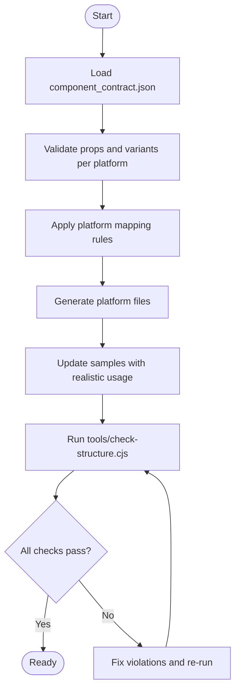

**Diagram sources**
- [component_contract.json:21-157](file://component_contract.json#L21-L157)
- [docs/COMPONENT_CONTRACT.md:26-67](file://docs/COMPONENT_CONTRACT.md#L26-L67)
- [tools/check-structure.cjs:16-34](file://tools/check-structure.cjs#L16-L34)

**Section sources**
- [component_contract.json:21-157](file://component_contract.json#L21-L157)
- [docs/COMPONENT_CONTRACT.md:26-67](file://docs/COMPONENT_CONTRACT.md#L26-L67)
- [tools/check-structure.cjs:16-34](file://tools/check-structure.cjs#L16-L34)

### Cross-Platform Synchronization Process
Across platforms, components share a common API and token-driven theming. The platform mapping rules specify file and routing conventions.

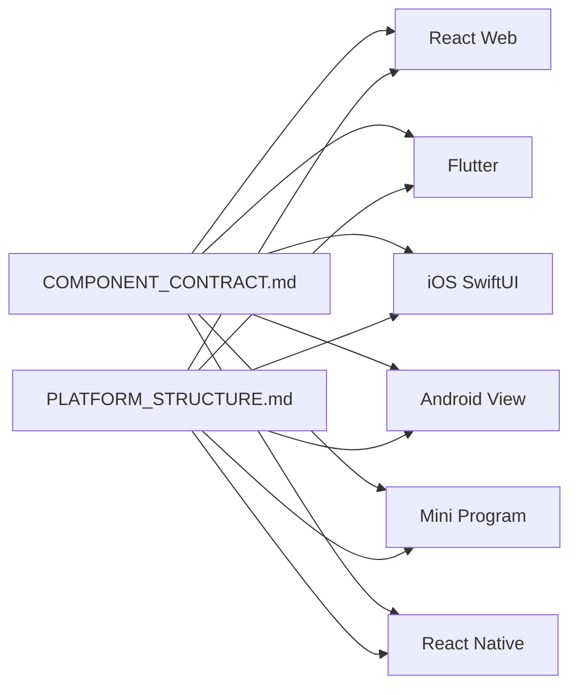

**Diagram sources**
- [docs/COMPONENT_CONTRACT.md:26-67](file://docs/COMPONENT_CONTRACT.md#L26-L67)
- [docs/PLATFORM_STRUCTURE.md:24-33](file://docs/PLATFORM_STRUCTURE.md#L24-L33)

**Section sources**
- [docs/COMPONENT_CONTRACT.md:26-67](file://docs/COMPONENT_CONTRACT.md#L26-L67)
- [docs/PLATFORM_STRUCTURE.md:24-33](file://docs/PLATFORM_STRUCTURE.md#L24-L33)

### Development Environment Setup
Local development requires platform-specific toolchains and validation steps. The repository provides:
- Structural checker to validate stack completeness
- Platform-specific commands for building and verifying samples
- Shared design tokens for theme-driven rendering

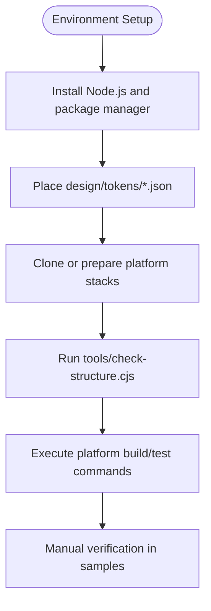

**Diagram sources**
- [README.md:48-68](file://README.md#L48-L68)
- [tools/check-structure.cjs:16-34](file://tools/check-structure.cjs#L16-L34)

**Section sources**
- [README.md:48-68](file://README.md#L48-L68)
- [tools/check-structure.cjs:16-34](file://tools/check-structure.cjs#L16-L34)

### Code Generation Patterns
Patterns observed across platforms:
- One component per source file
- One sample page per file
- Centralized navigation/router
- Barrel/index files export public APIs only
- Token-driven theming with semantic keys

Examples:
- Android View: Java View class with token-resolved attributes
- React Web: Functional component with theme CSS variables
- Flutter: Widget with StarPlanetTheme
- iOS SwiftUI: View structs with theme binding
- Mini Program: Component definition with event handling

```mermaid
classDiagram
class BasicButton_Android {
+setVariant(variant)
+setBasicText(text)
+setBasicDisabled(disabled)
+refreshTheme()
}
class TspButton_React {
+text
+variant
+disabled
+fullWidth
+theme
+onTap()
}
class TspButton_Flutter {
+text
+variant
+disabled
+fullWidth
+theme
+onTap()
}
class TspButton_iOS {
+text
+variant
+disabled
+theme
+action()
}
class BC_Button_MP {
+text
+variant
+disabled
+theme
+onTap()
}
BasicButton_Android --> "uses tokens" design_tokens["design/tokens/*.json"]
TspButton_React --> "uses theme vars" design_tokens
TspButton_Flutter --> "uses StarPlanetTheme" design_tokens
TspButton_iOS --> "uses StarPlanetTheme" design_tokens
BC_Button_MP --> "uses theme object" design_tokens
```

**Diagram sources**
- [android/library/src/main/java/com/techskillplanet/basiccontrols/widget/BasicButton.java:30-171](file://android/library/src/main/java/com/techskillplanet/basiccontrols/widget/BasicButton.java#L30-L171)
- [react-web/library/src/components/TspButton.js:20-47](file://react-web/library/src/components/TspButton.js#L20-L47)
- [flutter/library/lib/tech_skill_planet_components.dart:74-123](file://flutter/library/lib/tech_skill_planet_components.dart#L74-L123)
- [ios-swiftui/library/Sources/TechSkillPlanetBasicControls/BasicControls.swift:6-51](file://ios-swiftui/library/Sources/TechSkillPlanetBasicControls/BasicControls.swift#L6-L51)
- [miniprogram/library/components/bc-button/bc-button.js:1-22](file://miniprogram/library/components/bc-button/bc-button.js#L1-L22)
- [design/tokens/color_token.json:1-200](file://design/tokens/color_token.json#L1-L200)
- [design/tokens/style_token.json:1-200](file://design/tokens/style_token.json#L1-L200)

**Section sources**
- [docs/PLATFORM_STRUCTURE.md:5-22](file://docs/PLATFORM_STRUCTURE.md#L5-L22)
- [android/library/src/main/java/com/techskillplanet/basiccontrols/widget/BasicButton.java:30-171](file://android/library/src/main/java/com/techskillplanet/basiccontrols/widget/BasicButton.java#L30-L171)
- [react-web/library/src/components/TspButton.js:20-47](file://react-web/library/src/components/TspButton.js#L20-L47)
- [flutter/library/lib/tech_skill_planet_components.dart:74-123](file://flutter/library/lib/tech_skill_planet_components.dart#L74-L123)
- [ios-swiftui/library/Sources/TechSkillPlanetBasicControls/BasicControls.swift:6-51](file://ios-swiftui/library/Sources/TechSkillPlanetBasicControls/BasicControls.swift#L6-L51)
- [miniprogram/library/components/bc-button/bc-button.js:1-22](file://miniprogram/library/components/bc-button/bc-button.js#L1-L22)

### Quality Assurance Procedures
Quality gates include:
- Structural validation via tools/check-structure.cjs
- Platform-specific build and lint checks
- Token JSON parsing verification
- Sample coverage validation

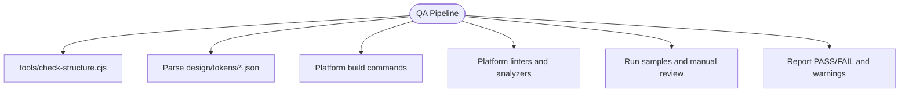

**Diagram sources**
- [tools/check-structure.cjs:16-34](file://tools/check-structure.cjs#L16-L34)
- [README.md:48-68](file://README.md#L48-L68)
- [.agents/skills/build-android-ui/SKILL.md:50-54](file://.agents/skills/build-android-ui/SKILL.md#L50-L54)

**Section sources**
- [tools/check-structure.cjs:16-34](file://tools/check-structure.cjs#L16-L34)
- [README.md:48-68](file://README.md#L48-L68)
- [.agents/skills/build-android-ui/SKILL.md:50-54](file://.agents/skills/build-android-ui/SKILL.md#L50-L54)

### Testing Strategies
Testing varies by platform:
- React Web: Vitest with jsdom environment and DOM assertions
- Flutter: Built-in widget tests and theme assertions
- iOS SwiftUI: Xcode builds and sample app validation
- Android View: Gradle assemble for library and samples
- Others: Platform-specific analyzers and build validations

```mermaid
sequenceDiagram
participant Test as "Test Runner"
participant RW as "React Web Tests"
participant FL as "Flutter Tests"
participant IS as "iOS Build"
participant AND as "Android Gradle"
Test->>RW : vitest config and setup
Test->>FL : Flutter analyzer and widget tests
Test->>IS : swift build samples
Test->>AND : ./gradlew assembleRelease/Debug
Test-->>Test : Aggregate results and coverage
```

**Diagram sources**
- [react-web/library/vitest.config.js:1-11](file://react-web/library/vitest.config.js#L1-L11)
- [react-web/library/tests/setup.js:1-2](file://react-web/library/tests/setup.js#L1-L2)
- [README.md:62-67](file://README.md#L62-L67)
- [.agents/skills/integrate-react-components/SKILL.md:189-196](file://.agents/skills/integrate-react-components/SKILL.md#L189-L196)

**Section sources**
- [react-web/library/vitest.config.js:1-11](file://react-web/library/vitest.config.js#L1-L11)
- [react-web/library/tests/setup.js:1-2](file://react-web/library/tests/setup.js#L1-L2)
- [README.md:62-67](file://README.md#L62-L67)
- [.agents/skills/integrate-react-components/SKILL.md:189-196](file://.agents/skills/integrate-react-components/SKILL.md#L189-L196)

### Adding New Components: Guidelines and Platform Parity
Follow these steps to add a new component:
- Define the component in component_contract.json and docs/COMPONENT_CONTRACT.md
- Implement per platform following one-component-per-file and one-sample-per-file rules
- Consume design tokens for colors and styles
- Update samples to demonstrate all relevant states and realistic usage
- Run structural and platform-specific validations

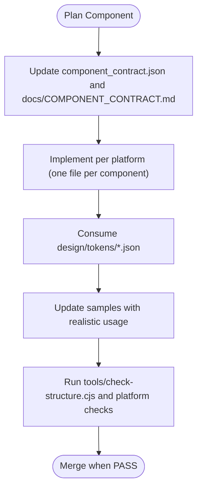

**Diagram sources**
- [docs/COMPONENT_CONTRACT.md:26-67](file://docs/COMPONENT_CONTRACT.md#L26-L67)
- [docs/PLATFORM_STRUCTURE.md:5-22](file://docs/PLATFORM_STRUCTURE.md#L5-L22)
- [design/tokens/color_token.json:1-200](file://design/tokens/color_token.json#L1-L200)
- [design/tokens/style_token.json:1-200](file://design/tokens/style_token.json#L1-L200)

**Section sources**
- [docs/COMPONENT_CONTRACT.md:26-67](file://docs/COMPONENT_CONTRACT.md#L26-L67)
- [docs/PLATFORM_STRUCTURE.md:5-22](file://docs/PLATFORM_STRUCTURE.md#L5-L22)
- [design/tokens/color_token.json:1-200](file://design/tokens/color_token.json#L1-L200)
- [design/tokens/style_token.json:1-200](file://design/tokens/style_token.json#L1-L200)

### Local Validation Checks and CI/CD Expectations
Local validation checklist:
- Run structural checker after changes
- Validate token JSON files parse successfully
- Build platform library and sample targets
- Confirm no unintended dependencies (e.g., Compose/Kotlin/AppCompat/Material in Android View)

CI/CD expectations:
- Gate PRs on structural and platform checks
- Require PASS results for all affected stacks
- Allow known warnings to be reported per agent skill reporting rules

**Section sources**
- [tools/check-structure.cjs:16-34](file://tools/check-structure.cjs#L16-L34)
- [.agents/skills/build-android-ui/SKILL.md:50-54](file://.agents/skills/build-android-ui/SKILL.md#L50-L54)
- [.agents/skills/build-planet-components/SKILL.md:78-86](file://.agents/skills/build-planet-components/SKILL.md#L78-L86)

## Dependency Analysis
The repository exhibits low coupling between stacks, with shared tokens as the central dependency. Each stack maintains independent build artifacts and sample apps.

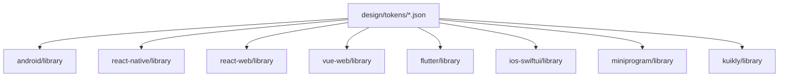

**Diagram sources**
- [design/tokens/color_token.json:1-200](file://design/tokens/color_token.json#L1-L200)
- [design/tokens/style_token.json:1-200](file://design/tokens/style_token.json#L1-L200)

**Section sources**
- [design/tokens/color_token.json:1-200](file://design/tokens/color_token.json#L1-L200)
- [design/tokens/style_token.json:1-200](file://design/tokens/style_token.json#L1-L200)

## Performance Considerations
- Keep component APIs minimal and consistent across platforms to reduce maintenance overhead
- Prefer token-driven theming to avoid hardcoding visual values and enable efficient theme switching
- Optimize rendering by leveraging platform-specific capabilities (e.g., Flutter widgets, SwiftUI views)
- Minimize rebuild scope by adhering to one-component-per-file and barrel exports only for public APIs

## Troubleshooting Guide
Common issues and resolutions:
- Components unstyled in React Web: ensure global styles are imported once at the app entry
- Theme not applying: pass the theme prop to every component instance
- TspSelect not opening in React Web: verify React version supports hooks
- Buttons too wide: set fullWidth to false on TspButton
- Android View token JSON parse failures: confirm color_token.json and style_token.json are valid JSON
- Android View unintended dependencies: exclude Compose/Kotlin/AppCompat/Material unless explicitly requested

**Section sources**
- [.agents/skills/integrate-react-components/SKILL.md:197-205](file://.agents/skills/integrate-react-components/SKILL.md#L197-L205)
- [.agents/skills/build-android-ui/SKILL.md:90-94](file://.agents/skills/build-android-ui/SKILL.md#L90-L94)

## Conclusion
Planet Components provides a robust, token-driven, cross-platform component system. AI agent skills automate generation and validation, while the component contract and platform structure rules enforce consistency. By following the outlined workflows, validation procedures, and testing strategies, contributors can efficiently add new components and maintain platform parity.

## Appendices
- Agent skill references:
  - [build-planet-components](file://.agents/skills/build-planet-components/SKILL.md)
  - [build-android-ui](file://.agents/skills/build-android-ui/SKILL.md)
  - [integrate-react-components](file://.agents/skills/integrate-react-components/SKILL.md)
- Repository rules and product direction:
  - [AGENTS.md](file://AGENTS.md)
- Component contract and platform structure:
  - [COMPONENT_CONTRACT.md](file://docs/COMPONENT_CONTRACT.md)
  - [PLATFORM_STRUCTURE.md](file://docs/PLATFORM_STRUCTURE.md)
- Design tokens:
  - [color_token.json](file://design/tokens/color_token.json)
  - [style_token.json](file://design/tokens/style_token.json)
- Structural checker:
  - [check-structure.cjs](file://tools/check-structure.cjs)