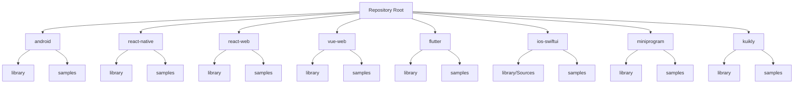
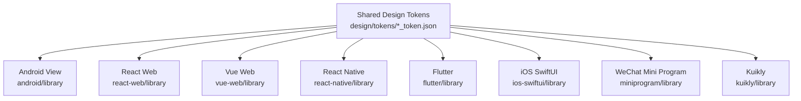
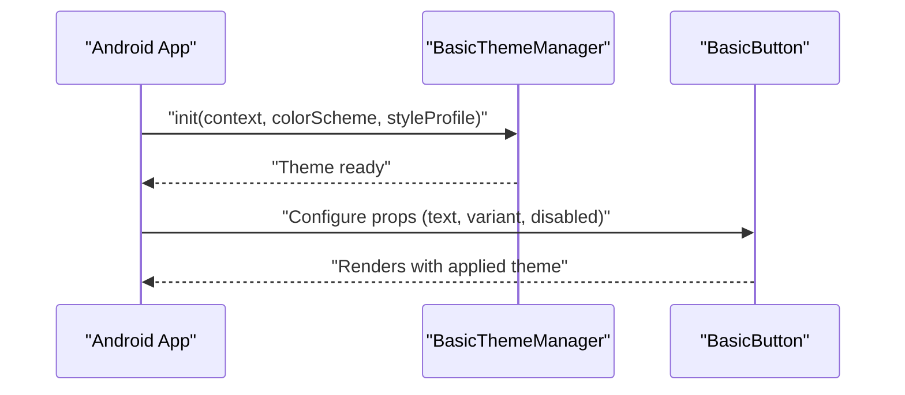
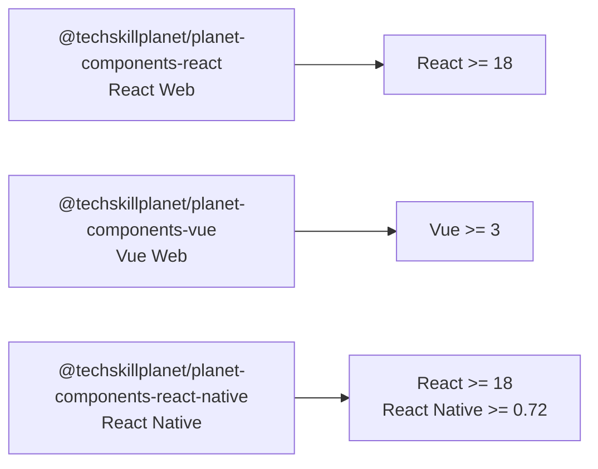

# Getting Started

<cite>
**Referenced Files in This Document**
- [README.md](file://README.md)
- [android/library/README.md](file://android/library/README.md)
- [android/library/build.gradle](file://android/library/build.gradle)
- [android/library/src/main/java/com/techskillplanet/basiccontrols/widget/BasicButton.java](file://android/library/src/main/java/com/techskillplanet/basiccontrols/widget/BasicButton.java)
- [android/library/src/main/java/com/techskillplanet/basiccontrols/theme/BasicThemeManager.java](file://android/library/src/main/java/com/techskillplanet/basiccontrols/theme/BasicThemeManager.java)
- [android/samples/README.md](file://android/samples/README.md)
- [android/samples/src/main/java/com/techskillplanet/basiccontrols/samples/MainActivity.java](file://android/samples/src/main/java/com/techskillplanet/basiccontrols/samples/MainActivity.java)
- [android/samples/src/main/java/com/techskillplanet/basiccontrols/samples/HomeSamplePage.java](file://android/samples/src/main/java/com/techskillplanet/basiccontrols/samples/HomeSamplePage.java)
- [android/samples/src/main/java/com/techskillplanet/basiccontrols/samples/ComponentDetailSamplePage.java](file://android/samples/src/main/java/com/techskillplanet/basiccontrols/samples/ComponentDetailSamplePage.java)
- [android/samples/src/main/java/com/techskillplanet/basiccontrols/samples/SampleRouter.java](file://android/samples/src/main/java/com/techskillplanet/basiccontrols/samples/SampleRouter.java)
- [android/samples/src/main/java/com/techskillplanet/basiccontrols/samples/SampleRoute.java](file://android/samples/src/main/java/com/techskillplanet/basiccontrols/samples/SampleRoute.java)
- [android/samples/src/main/java/com/techskillplanet/basiccontrols/samples/SamplePageHost.java](file://android/samples/src/main/java/com/techskillplanet/basiccontrols/samples/SamplePageHost.java)
- [android/samples/src/main/java/com/techskillplanet/basiccontrols/samples/SettingsSamplePage.java](file://android/samples/src/main/java/com/techskillplanet/basiccontrols/samples/SettingsSamplePage.java)
- [android/samples/src/main/res/values/strings.xml](file://android/samples/src/main/res/values/strings.xml)
- [android/samples/src/main/AndroidManifest.xml](file://android/samples/src/main/AndroidManifest.xml)
- [android/library/src/main/assets/theme/color_token.json](file://android/library/src/main/assets/theme/color_token.json)
- [android/library/src/main/assets/theme/style_token.json](file://android/library/src/main/assets/theme/style_token.json)
- [design/tokens/color_token.json](file://design/tokens/color_token.json)
- [design/tokens/style_token.json](file://design/tokens/style_token.json)
- [react-web/library/README.md](file://react-web/library/README.md)
- [react-web/library/package.json](file://react-web/library/package.json)
- [react-web/library/src/index.js](file://react-web/library/src/index.js)
- [react-web/library/src/theme.js](file://react-web/library/src/theme.js)
- [react-web/library/src/styles.css](file://react-web/library/src/styles.css)
- [react-web/library/src/components/TspButton.js](file://react-web/library/src/components/TspButton.js)
- [react-web/samples/BasicControlsSample.js](file://react-web/samples/BasicControlsSample.js)
- [react-web/samples/index.html](file://react-web/samples/index.html)
- [vue-web/library/README.md](file://vue-web/library/README.md)
- [vue-web/library/package.json](file://vue-web/library/package.json)
- [vue-web/library/src/index.js](file://vue-web/library/src/index.js)
- [vue-web/library/src/components/TspButton.js](file://vue-web/library/src/components/TspButton.js)
- [vue-web/samples/index.html](file://vue-web/samples/index.html)
- [react-native/library/README.md](file://react-native/library/README.md)
- [react-native/library/package.json](file://react-native/library/package.json)
- [react-native/library/src/starPlanet/index.js](file://react-native/library/src/starPlanet/index.js)
- [react-native/library/src/starPlanet/theme.js](file://react-native/library/src/starPlanet/theme.js)
- [react-native/library/src/starPlanet/components/TspButton.js](file://react-native/library/src/starPlanet/components/TspButton.js)
- [react-native/samples/App.js](file://react-native/samples/App.js)
- [react-native/samples/src/navigation/AppRouter.js](file://react-native/samples/src/navigation/AppRouter.js)
- [react-native/samples/src/pages/HomePage.js](file://react-native/samples/src/pages/HomePage.js)
- [react-native/samples/src/pages/ComponentDetailPage.js](file://react-native/samples/src/pages/ComponentDetailPage.js)
- [react-native/samples/src/pages/SettingsPage.js](file://react-native/samples/src/pages/SettingsPage.js)
- [react-native/samples/src/data/componentDocs.js](file://react-native/samples/src/data/componentDocs.js)
- [flutter/library/README.md](file://flutter/library/README.md)
- [flutter/library/pubspec.yaml](file://flutter/library/pubspec.yaml)
- [flutter/library/lib/tech_skill_planet_components.dart](file://flutter/library/lib/tech_skill_planet_components.dart)
- [flutter/samples/lib/main.dart](file://flutter/samples/lib/main.dart)
- [ios-swiftui/library/Package.swift](file://ios-swiftui/library/Package.swift)
- [ios-swiftui/library/Sources/TechSkillPlanetBasicControls/BasicControls.swift](file://ios-swiftui/library/Sources/TechSkillPlanetBasicControls/BasicControls.swift)
- [ios-swiftui/library/Sources/TechSkillPlanetBasicControls/StarPlanetTheme.swift](file://ios-swiftui/library/Sources/TechSkillPlanetBasicControls/StarPlanetTheme.swift)
- [ios-swiftui/samples/Sources/BasicControlsSamples/BasicControlsSampleView.swift](file://ios-swiftui/samples/Sources/BasicControlsSamples/BasicControlsSampleView.swift)
- [miniprogram/library/README.md](file://miniprogram/library/README.md)
- [miniprogram/library/package.json](file://miniprogram/library/package.json)
- [miniprogram/library/components/bc-button/bc-button.js](file://miniprogram/library/components/bc-button/bc-button.js)
- [miniprogram/library/theme/theme.js](file://miniprogram/library/theme/theme.js)
- [miniprogram/library/i18n/i18n.js](file://miniprogram/library/i18n/i18n.js)
- [miniprogram/samples/pages/basic-samples/index.js](file://miniprogram/samples/pages/basic-samples/index.js)
- [miniprogram/samples/app.js](file://miniprogram/samples/app.js)
- [miniprogram/samples/app.json](file://miniprogram/samples/app.json)
- [kuikly/build.gradle.kts](file://kuikly/build.gradle.kts)
- [kuikly/library/shared/build.gradle.kts](file://kuikly/library/shared/build.gradle.kts)
- [kuikly/library/shared/src/commonMain/kotlin/com/techskillplanet/phonics/controls/PhonicsControls.kt](file://kuikly/library/shared/src/commonMain/kotlin/com/techskillplanet/phonics/controls/PhonicsControls.kt)
- [kuikly/samples/miniApp/src/jsMain/kotlin/Main.kt](file://kuikly/samples/miniApp/src/jsMain/kotlin/Main.kt)
- [kuikly/samples/ohosApp/entry/src/main/ets/pages/Index.ets](file://kuikly/samples/ohosApp/entry/src/main/ets/pages/Index.ets)
- [kuikly/samples/ios/HostApp.swift](file://kuikly/samples/ios/HostApp.swift)
- [tools/check-structure.cjs](file://tools/check-structure.cjs)
</cite>

## Table of Contents
1. [Introduction](#introduction)
2. [Project Structure](#project-structure)
3. [Core Components](#core-components)
4. [Architecture Overview](#architecture-overview)
5. [Detailed Component Analysis](#detailed-component-analysis)
6. [Dependency Analysis](#dependency-analysis)
7. [Performance Considerations](#performance-considerations)
8. [Troubleshooting Guide](#troubleshooting-guide)
9. [Conclusion](#conclusion)
10. [Appendices](#appendices)

## Introduction
Planet Components is a cross-platform design system that delivers consistent, themed UI components across multiple frameworks and platforms. The repository organizes each platform into a separate library and runnable sample project, ensuring parity in component APIs, theming, and usage patterns. This guide helps you install and integrate Planet Components across Android, React Web, Vue Web, React Native, Flutter, iOS SwiftUI, WeChat Mini Program, and Kuikly, with step-by-step instructions, quick-start examples, prerequisites, and troubleshooting tips.

Prerequisites
- Design Systems: Understand tokens (colors and styles), themes, variants, and semantic props.
- Component-Based Architecture: Know how components expose props for state, interactivity, and styling.
- Platform-Specific Environments:
  - Android: Android Studio, JDK, Gradle, and Android SDK.
  - React Web: Node.js and a modern package manager (npm/yarn/pnpm).
  - Vue Web: Node.js and a modern package manager.
  - React Native: Node.js, npm/yarn, Expo CLI or React Native CLI, and platform SDKs (Android/iOS).
  - Flutter: Flutter SDK and IDE plugins.
  - iOS SwiftUI: Xcode and Swift toolchain.
  - WeChat Mini Program: WeChat DevTools and Node.js.
  - Kuikly: Kotlin Multiplatform, Gradle, and Kuikly toolchains.

## Project Structure
Planet Components is organized by platform, with each platform containing:
- library: A publishable component library.
- samples: A runnable sample app depending on the local library.

**Diagram sources**
- [README.md:10-21](file://README.md#L10-L21)

**Section sources**
- [README.md:10-21](file://README.md#L10-L21)

## Core Components
Across platforms, components share a consistent contract: props for text/title/message, variant selection, disabled state, and theme integration. Each platform’s library README documents the available components and quick-start usage.

- Android View: See the library README for installation and theme initialization.
- React Web: See the library README for installation, peer dependency, and quick start.
- Vue Web: See the library README for component list and CSS import.
- React Native: See the library README for structure and sample project layout.
- Flutter: See the library README for import path and package name.
- iOS SwiftUI: See the Package.swift and component source for package and API.
- WeChat Mini Program: See the library README for component list and theme integration.
- Kuikly: See the build files for multiplatform setup and shared controls.

**Section sources**
- [android/library/README.md:1-82](file://android/library/README.md#L1-L82)
- [react-web/library/README.md:1-669](file://react-web/library/README.md#L1-L669)
- [vue-web/library/README.md:1-18](file://vue-web/library/README.md#L1-L18)
- [react-native/library/README.md:1-54](file://react-native/library/README.md#L1-L54)
- [flutter/library/README.md:1-10](file://flutter/library/README.md#L1-L10)
- [ios-swiftui/library/Package.swift:1-14](file://ios-swiftui/library/Package.swift#L1-L14)
- [miniprogram/library/README.md:1-25](file://miniprogram/library/README.md#L1-L25)
- [kuikly/build.gradle.kts:1-32](file://kuikly/build.gradle.kts#L1-L32)

## Architecture Overview
Planet Components enforces a consistent component contract and theme token system across platforms. Shared design tokens are maintained in the repository root and mirrored into each platform’s assets.

**Diagram sources**
- [design/tokens/color_token.json](file://design/tokens/color_token.json)
- [design/tokens/style_token.json](file://design/tokens/style_token.json)
- [android/library/src/main/assets/theme/color_token.json](file://android/library/src/main/assets/theme/color_token.json)
- [android/library/src/main/assets/theme/style_token.json](file://android/library/src/main/assets/theme/style_token.json)

## Detailed Component Analysis

### Android (Maven/Gradle)
Installation
- Add Maven Central to repositories and include the Android View library dependency.
- Initialize the theme before using components.

Quick Start
- Initialize theme with a color scheme and style profile.
- Use a component (for example, a button) in your layout.

Common Setup Notes
- Ensure minSdk and compileSdk match the library’s requirements.
- Verify theme assets are packaged into the library.

**Diagram sources**
- [android/library/src/main/java/com/techskillplanet/basiccontrols/theme/BasicThemeManager.java](file://android/library/src/main/java/com/techskillplanet/basiccontrols/theme/BasicThemeManager.java)
- [android/library/src/main/java/com/techskillplanet/basiccontrols/widget/BasicButton.java](file://android/library/src/main/java/com/techskillplanet/basiccontrols/widget/BasicButton.java)

**Section sources**
- [android/library/README.md:5-27](file://android/library/README.md#L5-L27)
- [android/library/build.gradle:10-17](file://android/library/build.gradle#L10-L17)
- [android/library/src/main/java/com/techskillplanet/basiccontrols/theme/BasicThemeManager.java](file://android/library/src/main/java/com/techskillplanet/basiccontrols/theme/BasicThemeManager.java)
- [android/library/src/main/java/com/techskillplanet/basiccontrols/widget/BasicButton.java](file://android/library/src/main/java/com/techskillplanet/basiccontrols/widget/BasicButton.java)

### React Native (npm)
Installation
- Install the React Native package as a peer dependency.
- The library exposes components and theme utilities.

Quick Start
- Import a component and theme.
- Render a component with props and theme.

Sample Project
- The sample app demonstrates navigation, routing, and theme switching.

**Section sources**
- [react-native/library/README.md:12-54](file://react-native/library/README.md#L12-L54)
- [react-native/library/package.json:13-16](file://react-native/library/package.json#L13-L16)
- [react-native/library/src/starPlanet/components/TspButton.js](file://react-native/library/src/starPlanet/components/TspButton.js)
- [react-native/samples/App.js](file://react-native/samples/App.js)
- [react-native/samples/src/navigation/AppRouter.js](file://react-native/samples/src/navigation/AppRouter.js)

### React Web (npm)
Installation
- Install the React package with a compatible React version.
- Import the CSS stylesheet once in your app shell.

Quick Start
- Import a component and theme.
- Render a component with props and theme.

**Section sources**
- [react-web/library/README.md:7-36](file://react-web/library/README.md#L7-L36)
- [react-web/library/package.json:21-23](file://react-web/library/package.json#L21-L23)
- [react-web/library/src/index.js](file://react-web/library/src/index.js)
- [react-web/library/src/theme.js](file://react-web/library/src/theme.js)
- [react-web/library/src/styles.css](file://react-web/library/src/styles.css)

### Vue Web (npm)
Installation
- Install the Vue package with a compatible Vue version.
- Import the CSS stylesheet once in your app shell.

Quick Start
- Import a component and theme.
- Render a component with props and theme.

**Section sources**
- [vue-web/library/README.md:1-18](file://vue-web/library/README.md#L1-L18)
- [vue-web/library/package.json:20-22](file://vue-web/library/package.json#L20-L22)
- [vue-web/library/src/index.js](file://vue-web/library/src/index.js)

### Flutter (pub.dev)
Installation
- Add the Flutter package from pub.dev.
- Import the package in your Dart code.

Quick Start
- Import the package and use a component with a theme.

**Section sources**
- [flutter/library/README.md:1-10](file://flutter/library/README.md#L1-L10)
- [flutter/library/pubspec.yaml:1-22](file://flutter/library/pubspec.yaml#L1-L22)
- [flutter/library/lib/tech_skill_planet_components.dart](file://flutter/library/lib/tech_skill_planet_components.dart)

### iOS SwiftUI (Swift Package Manager)
Installation
- Add the Swift package to your iOS/macOS project.
- Import the package in your Swift code.

Quick Start
- Import the package and use a component with a theme.

**Section sources**
- [ios-swiftui/library/Package.swift:1-14](file://ios-swiftui/library/Package.swift#L1-L14)
- [ios-swiftui/library/Sources/TechSkillPlanetBasicControls/BasicControls.swift](file://ios-swiftui/library/Sources/TechSkillPlanetBasicControls/BasicControls.swift)
- [ios-swiftui/library/Sources/TechSkillPlanetBasicControls/StarPlanetTheme.swift](file://ios-swiftui/library/Sources/TechSkillPlanetBasicControls/StarPlanetTheme.swift)

### WeChat Mini Program (npm/miniprogram)
Installation
- Use the npm package name for the Mini Program component library.
- The library provides components, theme, and internationalization modules.

Quick Start
- Import a component and theme.
- Pass global theme data from the app to components.

**Section sources**
- [miniprogram/library/README.md:1-25](file://miniprogram/library/README.md#L1-L25)
- [miniprogram/library/package.json:1-14](file://miniprogram/library/package.json#L1-L14)
- [miniprogram/library/components/bc-button/bc-button.js](file://miniprogram/library/components/bc-button/bc-button.js)
- [miniprogram/library/theme/theme.js](file://miniprogram/library/theme/theme.js)
- [miniprogram/library/i18n/i18n.js](file://miniprogram/library/i18n/i18n.js)

### Kuikly (Maven/internal)
Installation
- Configure Kotlin Multiplatform and Kuikly Gradle plugins.
- The shared library targets Android, iOS, JS, and OHOS.

Quick Start
- Use shared controls and integrate with Kuikly toolchains.

**Section sources**
- [kuikly/build.gradle.kts:1-32](file://kuikly/build.gradle.kts#L1-L32)
- [kuikly/library/shared/build.gradle.kts:1-90](file://kuikly/library/shared/build.gradle.kts#L1-L90)
- [kuikly/library/shared/src/commonMain/kotlin/com/techskillplanet/phonics/controls/PhonicsControls.kt](file://kuikly/library/shared/src/commonMain/kotlin/com/techskillplanet/phonics/controls/PhonicsControls.kt)

## Dependency Analysis
Each platform defines its own packaging and peer dependencies. The following diagram shows typical dependency relationships for web-based platforms.

**Diagram sources**
- [react-web/library/package.json:21-23](file://react-web/library/package.json#L21-L23)
- [vue-web/library/package.json:20-22](file://vue-web/library/package.json#L20-L22)
- [react-native/library/package.json:13-16](file://react-native/library/package.json#L13-L16)

**Section sources**
- [react-web/library/package.json:21-23](file://react-web/library/package.json#L21-L23)
- [vue-web/library/package.json:20-22](file://vue-web/library/package.json#L20-L22)
- [react-native/library/package.json:13-16](file://react-native/library/package.json#L13-L16)

## Performance Considerations
- Prefer importing the CSS stylesheet once in your app shell to avoid duplication.
- Use theme utilities to compute CSS variables efficiently.
- Keep component prop usage minimal and declarative to reduce re-renders.
- For mobile apps, initialize theme early to prevent layout shifts during startup.

## Troubleshooting Guide
Common Issues and Fixes
- React Web missing CSS: Ensure the stylesheet is imported once in your app shell.
- Peer dependency mismatch: Align React/Vue/React Native versions with the library’s peerDependencies.
- Android theme not applied: Initialize the theme before rendering components and verify assets are included.
- iOS package resolution: Confirm the Swift Package is added to your target and the module is imported.
- WeChat Mini Program component not found: Verify the component path and ensure the package is installed.
- Kuikly build failures: Confirm Kotlin Multiplatform and Kuikly plugin versions match the project configuration.

Validation Scripts
- Use the repository’s structure checker to validate platform layouts and exports.

**Section sources**
- [react-web/library/README.md:46](file://react-web/library/README.md#L46)
- [react-native/library/package.json:13-16](file://react-native/library/package.json#L13-L16)
- [android/library/README.md:23-27](file://android/library/README.md#L23-L27)
- [ios-swiftui/library/Package.swift:4-12](file://ios-swiftui/library/Package.swift#L4-L12)
- [miniprogram/library/package.json:1-14](file://miniprogram/library/package.json#L1-L14)
- [kuikly/build.gradle.kts:1-32](file://kuikly/build.gradle.kts#L1-L32)
- [tools/check-structure.cjs](file://tools/check-structure.cjs)

## Conclusion
Planet Components provides a unified design system across platforms. By following the platform-specific installation steps, initializing themes, and using the documented components and APIs, you can quickly integrate consistent UI elements into your applications. Refer to the sample projects for working examples and consult the troubleshooting section for common setup issues.

## Appendices

### Platform Quick-Start References
- Android View: [Installation and theme init:5-27](file://android/library/README.md#L5-L27)
- React Web: [Installation and quick start:7-36](file://react-web/library/README.md#L7-L36)
- Vue Web: [Components and CSS import:1-18](file://vue-web/library/README.md#L1-L18)
- React Native: [Library structure and sample:12-54](file://react-native/library/README.md#L12-L54)
- Flutter: [Package import:1-10](file://flutter/library/README.md#L1-L10)
- iOS SwiftUI: [Package and API:1-14](file://ios-swiftui/library/Package.swift#L1-L14)
- WeChat Mini Program: [Package and components:1-25](file://miniprogram/library/README.md#L1-L25)
- Kuikly: [Multiplatform setup:1-32](file://kuikly/build.gradle.kts#L1-L32)

### Sample Applications and Demos
- Android: [Sample app structure](file://android/samples/README.md)
- React Native: [Sample app entry and router](file://react-native/samples/App.js), [router](file://react-native/samples/src/navigation/AppRouter.js)
- React Web: [Sample app](file://react-web/samples/BasicControlsSample.js), [HTML shell](file://react-web/samples/index.html)
- Vue Web: [Sample HTML](file://vue-web/samples/index.html)
- Flutter: [Sample main](file://flutter/samples/lib/main.dart)
- iOS SwiftUI: [Sample view](file://ios-swiftui/samples/Sources/BasicControlsSamples/BasicControlsSampleView.swift)
- WeChat Mini Program: [Sample page](file://miniprogram/samples/pages/basic-samples/index.js), [app config](file://miniprogram/samples/app.json)
- Kuikly: [MiniApp entry](file://kuikly/samples/miniApp/src/jsMain/kotlin/Main.kt), [OHOS page](file://kuikly/samples/ohosApp/entry/src/main/ets/pages/Index.ets), [iOS host](file://kuikly/samples/ios/HostApp.swift)