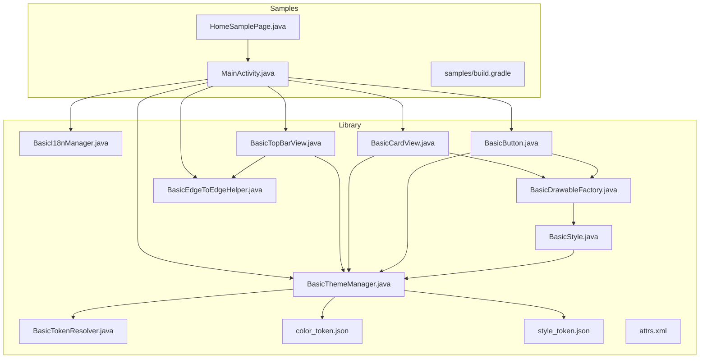
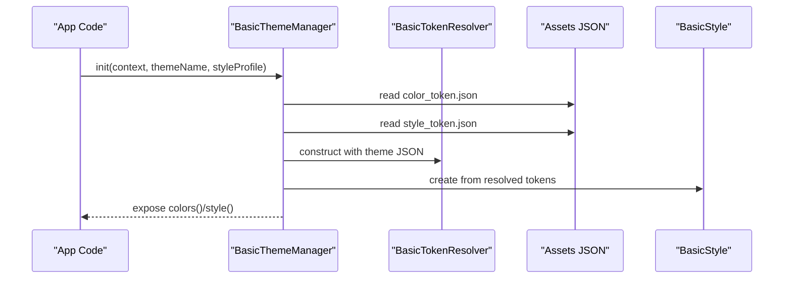
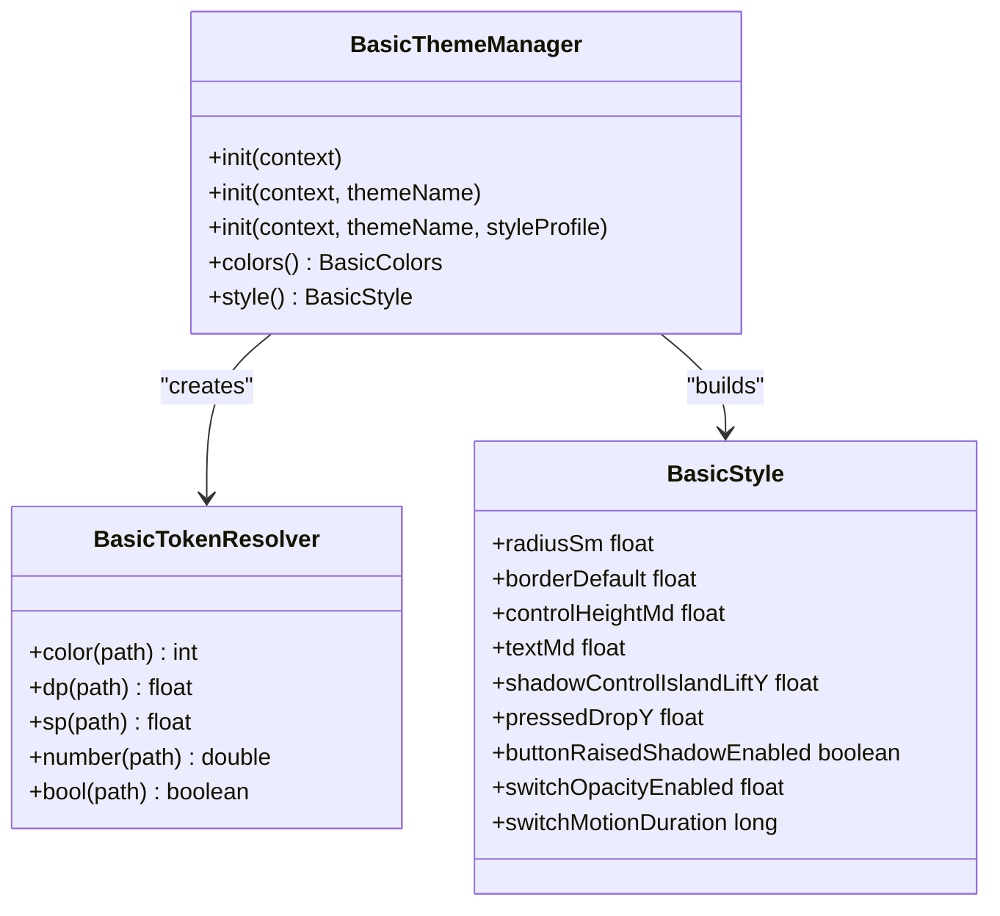
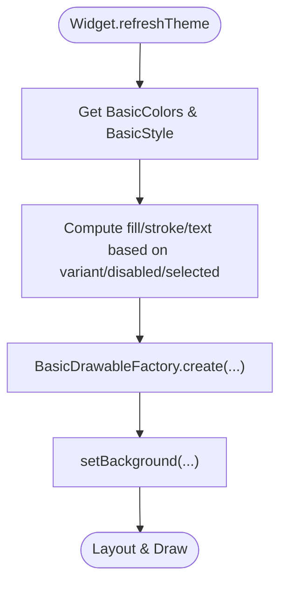
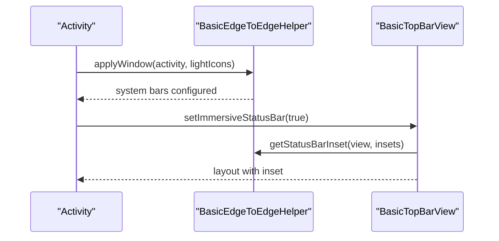
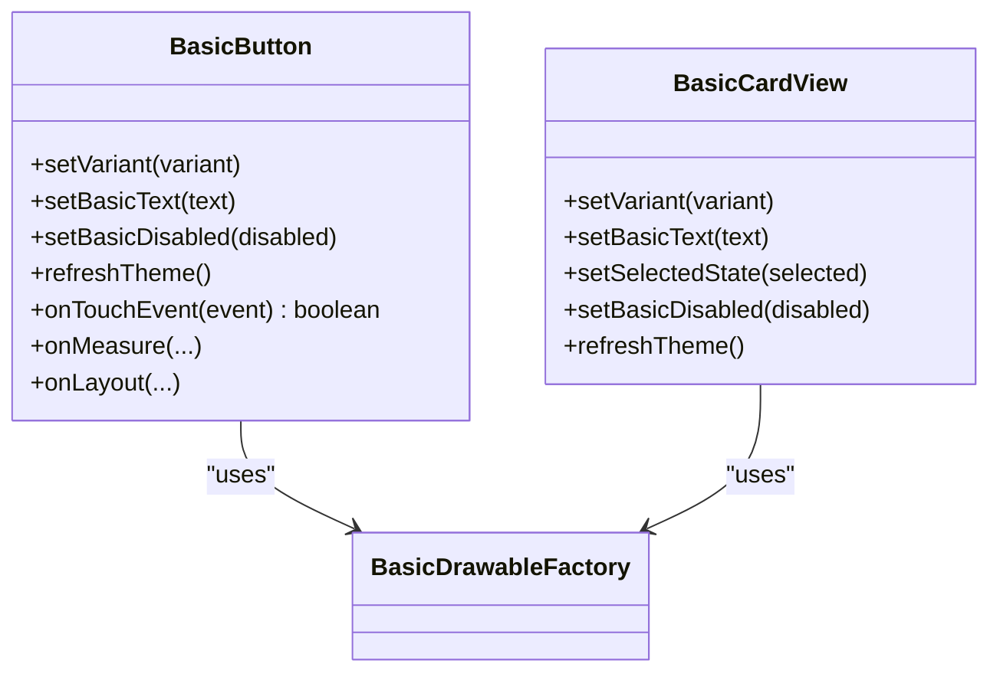
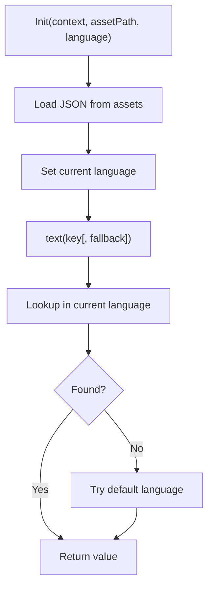
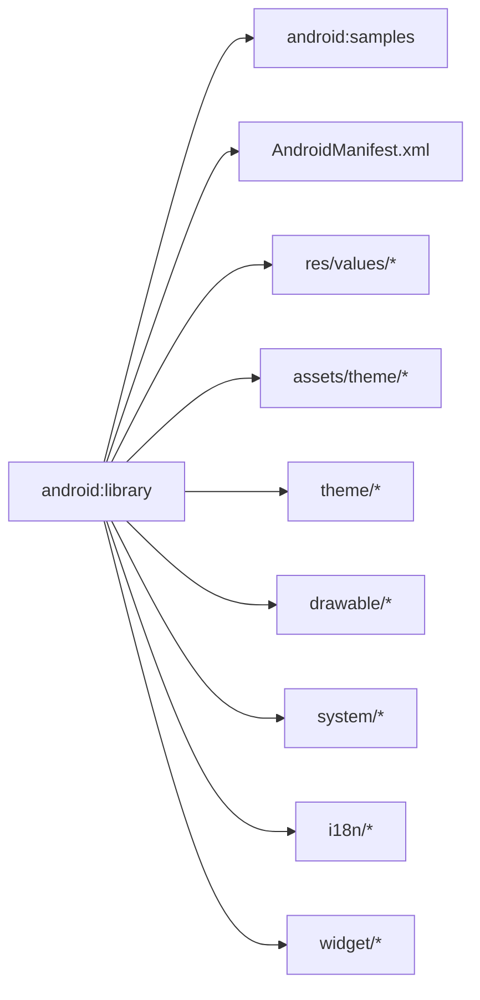

# Android View

<cite>
**Referenced Files in This Document**
- [android/library/build.gradle](file://android/library/build.gradle)
- [android/library/README.md](file://android/library/README.md)
- [android/library/src/main/AndroidManifest.xml](file://android/library/src/main/AndroidManifest.xml)
- [android/library/src/main/assets/theme/color_token.json](file://android/library/src/main/assets/theme/color_token.json)
- [android/library/src/main/assets/theme/style_token.json](file://android/library/src/main/assets/theme/style_token.json)
- [android/library/src/main/res/values/attrs.xml](file://android/library/src/main/res/values/attrs.xml)
- [android/library/src/main/res/values/strings.xml](file://android/library/src/main/res/values/strings.xml)
- [android/library/src/main/java/com/techskillplanet/basiccontrols/theme/BasicThemeManager.java](file://android/library/src/main/java/com/techskillplanet/basiccontrols/theme/BasicThemeManager.java)
- [android/library/src/main/java/com/techskillplanet/basiccontrols/theme/BasicTokenResolver.java](file://android/library/src/main/java/com/techskillplanet/basiccontrols/theme/BasicTokenResolver.java)
- [android/library/src/main/java/com/techskillplanet/basiccontrols/theme/BasicStyle.java](file://android/library/src/main/java/com/techskillplanet/basiccontrols/theme/BasicStyle.java)
- [android/library/src/main/java/com/techskillplanet/basiccontrols/drawable/BasicDrawableFactory.java](file://android/library/src/main/java/com/techskillplanet/basiccontrols/drawable/BasicDrawableFactory.java)
- [android/library/src/main/java/com/techskillplanet/basiccontrols/system/BasicEdgeToEdgeHelper.java](file://android/library/src/main/java/com/techskillplanet/basiccontrols/system/BasicEdgeToEdgeHelper.java)
- [android/library/src/main/java/com/techskillplanet/basiccontrols/i18n/BasicI18nManager.java](file://android/library/src/main/java/com/techskillplanet/basiccontrols/i18n/BasicI18nManager.java)
- [android/library/src/main/java/com/techskillplanet/basiccontrols/widget/BasicButton.java](file://android/library/src/main/java/com/techskillplanet/basiccontrols/widget/BasicButton.java)
- [android/library/src/main/java/com/techskillplanet/basiccontrols/widget/BasicCardView.java](file://android/library/src/main/java/com/techskillplanet/basiccontrols/widget/BasicCardView.java)
- [android/library/src/main/java/com/techskillplanet/basiccontrols/widget/BasicTopBarView.java](file://android/library/src/main/java/com/techskillplanet/basiccontrols/widget/BasicTopBarView.java)
- [android/samples/build.gradle](file://android/samples/build.gradle)
- [android/samples/src/main/java/com/techskillplanet/basiccontrols/samples/MainActivity.java](file://android/samples/src/main/java/com/techskillplanet/basiccontrols/samples/MainActivity.java)
- [android/samples/src/main/java/com/techskillplanet/basiccontrols/samples/HomeSamplePage.java](file://android/samples/src/main/java/com/techskillplanet/basiccontrols/samples/HomeSamplePage.java)
</cite>

## Table of Contents
1. [Introduction](#introduction)
2. [Project Structure](#project-structure)
3. [Core Components](#core-components)
4. [Architecture Overview](#architecture-overview)
5. [Detailed Component Analysis](#detailed-component-analysis)
6. [Dependency Analysis](#dependency-analysis)
7. [Performance Considerations](#performance-considerations)
8. [Troubleshooting Guide](#troubleshooting-guide)
9. [Conclusion](#conclusion)
10. [Appendices](#appendices)

## Introduction
This document describes the Android View implementation of Planet Components. It explains the library architecture, theme and token-driven design, widget implementations, edge-to-edge support, internationalization, and the widget factory pattern used for drawables. It also covers Gradle setup, integration steps, runtime theme switching, performance and memory considerations, and common integration issues.

## Project Structure
The Android View library is organized around a token-driven theme system, a small set of reusable widgets, a drawable factory, and optional system helpers for edge-to-edge. The samples demonstrate a shell-router-page architecture to showcase components and theme switching.

**Diagram sources**
- [android/library/src/main/java/com/techskillplanet/basiccontrols/theme/BasicThemeManager.java:1-294](file://android/library/src/main/java/com/techskillplanet/basiccontrols/theme/BasicThemeManager.java#L1-294)
- [android/library/src/main/java/com/techskillplanet/basiccontrols/theme/BasicTokenResolver.java:1-192](file://android/library/src/main/java/com/techskillplanet/basiccontrols/theme/BasicTokenResolver.java#L1-192)
- [android/library/src/main/java/com/techskillplanet/basiccontrols/theme/BasicStyle.java:1-205](file://android/library/src/main/java/com/techskillplanet/basiccontrols/theme/BasicStyle.java#L1-205)
- [android/library/src/main/java/com/techskillplanet/basiccontrols/drawable/BasicDrawableFactory.java:1-116](file://android/library/src/main/java/com/techskillplanet/basiccontrols/drawable/BasicDrawableFactory.java#L1-116)
- [android/library/src/main/java/com/techskillplanet/basiccontrols/system/BasicEdgeToEdgeHelper.java:1-121](file://android/library/src/main/java/com/techskillplanet/basiccontrols/system/BasicEdgeToEdgeHelper.java#L1-121)
- [android/library/src/main/java/com/techskillplanet/basiccontrols/i18n/BasicI18nManager.java:1-118](file://android/library/src/main/java/com/techskillplanet/basiccontrols/i18n/BasicI18nManager.java#L1-118)
- [android/library/src/main/java/com/techskillplanet/basiccontrols/widget/BasicButton.java:1-255](file://android/library/src/main/java/com/techskillplanet/basiccontrols/widget/BasicButton.java#L1-255)
- [android/library/src/main/java/com/techskillplanet/basiccontrols/widget/BasicCardView.java:1-104](file://android/library/src/main/java/com/techskillplanet/basiccontrols/widget/BasicCardView.java#L1-104)
- [android/library/src/main/java/com/techskillplanet/basiccontrols/widget/BasicTopBarView.java:1-214](file://android/library/src/main/java/com/techskillplanet/basiccontrols/widget/BasicTopBarView.java#L1-214)
- [android/library/src/main/assets/theme/color_token.json:1-406](file://android/library/src/main/assets/theme/color_token.json#L1-406)
- [android/library/src/main/assets/theme/style_token.json:1-392](file://android/library/src/main/assets/theme/style_token.json#L1-392)
- [android/library/src/main/res/values/attrs.xml:1-23](file://android/library/src/main/res/values/attrs.xml#L1-23)
- [android/samples/src/main/java/com/techskillplanet/basiccontrols/samples/MainActivity.java:1-439](file://android/samples/src/main/java/com/techskillplanet/basiccontrols/samples/MainActivity.java#L1-439)
- [android/samples/src/main/java/com/techskillplanet/basiccontrols/samples/HomeSamplePage.java:1-77](file://android/samples/src/main/java/com/techskillplanet/basiccontrols/samples/HomeSamplePage.java#L1-77)
- [android/samples/build.gradle:1-21](file://android/samples/build.gradle#L1-21)

**Section sources**
- [android/library/README.md:1-82](file://android/library/README.md#L1-L82)
- [android/library/build.gradle:1-98](file://android/library/build.gradle#L1-L98)
- [android/library/src/main/AndroidManifest.xml:1-2](file://android/library/src/main/AndroidManifest.xml#L1-L2)
- [android/library/src/main/res/values/attrs.xml:1-23](file://android/library/src/main/res/values/attrs.xml#L1-L23)
- [android/library/src/main/res/values/strings.xml:1-4](file://android/library/src/main/res/values/strings.xml#L1-L4)
- [android/samples/build.gradle:1-21](file://android/samples/build.gradle#L1-L21)

## Core Components
- Theme Manager: Initializes and exposes current color and style tokens, merges style profiles, and validates initialization.
- Token Resolver: Reads tokens from JSON, resolves references, and converts units to Android runtime values.
- Style Model: Exposes runtime sizes, radii, typography scales, shadows, motion, and opacity derived from tokens.
- Drawable Factory: Centralized creation of shapes, strokes, and state lists for backgrounds.
- Edge-to-Edge Helper: Applies transparent system bars and computes status bar icon appearance.
- Internationalization Manager: Loads per-language JSON and resolves localized strings.
- Widgets: Implement cross-platform contracts via unified XML attributes and refreshTheme lifecycle.

**Section sources**
- [android/library/src/main/java/com/techskillplanet/basiccontrols/theme/BasicThemeManager.java:1-294](file://android/library/src/main/java/com/techskillplanet/basiccontrols/theme/BasicThemeManager.java#L1-L294)
- [android/library/src/main/java/com/techskillplanet/basiccontrols/theme/BasicTokenResolver.java:1-192](file://android/library/src/main/java/com/techskillplanet/basiccontrols/theme/BasicTokenResolver.java#L1-L192)
- [android/library/src/main/java/com/techskillplanet/basiccontrols/theme/BasicStyle.java:1-205](file://android/library/src/main/java/com/techskillplanet/basiccontrols/theme/BasicStyle.java#L1-L205)
- [android/library/src/main/java/com/techskillplanet/basiccontrols/drawable/BasicDrawableFactory.java:1-116](file://android/library/src/main/java/com/techskillplanet/basiccontrols/drawable/BasicDrawableFactory.java#L1-L116)
- [android/library/src/main/java/com/techskillplanet/basiccontrols/system/BasicEdgeToEdgeHelper.java:1-121](file://android/library/src/main/java/com/techskillplanet/basiccontrols/system/BasicEdgeToEdgeHelper.java#L1-L121)
- [android/library/src/main/java/com/techskillplanet/basiccontrols/i18n/BasicI18nManager.java:1-118](file://android/library/src/main/java/com/techskillplanet/basiccontrols/i18n/BasicI18nManager.java#L1-L118)

## Architecture Overview
The library follows a token-driven architecture:
- Tokens define colors and styles in JSON assets.
- Theme Manager parses tokens into strongly-typed models.
- Widgets consume these models to render visuals and layouts.
- Drawable Factory encapsulates shape/stroke/state-list creation.
- Edge-to-Edge Helper integrates with system bars for immersive UI.
- Internationalization Manager supplies localized strings from assets.

**Diagram sources**
- [android/library/src/main/java/com/techskillplanet/basiccontrols/theme/BasicThemeManager.java:64-82](file://android/library/src/main/java/com/techskillplanet/basiccontrols/theme/BasicThemeManager.java#L64-L82)
- [android/library/src/main/java/com/techskillplanet/basiccontrols/theme/BasicTokenResolver.java:34-37](file://android/library/src/main/java/com/techskillplanet/basiccontrols/theme/BasicTokenResolver.java#L34-L37)
- [android/library/src/main/java/com/techskillplanet/basiccontrols/theme/BasicStyle.java:109-203](file://android/library/src/main/java/com/techskillplanet/basiccontrols/theme/BasicStyle.java#L109-L203)
- [android/library/src/main/assets/theme/color_token.json:1-406](file://android/library/src/main/assets/theme/color_token.json#L1-L406)
- [android/library/src/main/assets/theme/style_token.json:1-392](file://android/library/src/main/assets/theme/style_token.json#L1-L392)

## Detailed Component Analysis

### Theme System
- Initialization: Initialize theme early in application lifecycle with a color theme and style profile. After initialization, widgets can safely call refreshTheme.
- Token Resolution: Color tokens may reference primitive tokens; resolver recursively resolves references and parses hex colors.
- Style Merging: Style profiles (e.g., island raised vs flat) override base tokens; metadata nodes are excluded from merging.
- Runtime Access: Widgets read BasicThemeManager.colors() and BasicThemeManager.style() to render consistently.

**Diagram sources**
- [android/library/src/main/java/com/techskillplanet/basiccontrols/theme/BasicThemeManager.java:64-124](file://android/library/src/main/java/com/techskillplanet/basiccontrols/theme/BasicThemeManager.java#L64-L124)
- [android/library/src/main/java/com/techskillplanet/basiccontrols/theme/BasicTokenResolver.java:45-124](file://android/library/src/main/java/com/techskillplanet/basiccontrols/theme/BasicTokenResolver.java#L45-L124)
- [android/library/src/main/java/com/techskillplanet/basiccontrols/theme/BasicStyle.java:9-107](file://android/library/src/main/java/com/techskillplanet/basiccontrols/theme/BasicStyle.java#L9-L107)

**Section sources**
- [android/library/src/main/java/com/techskillplanet/basiccontrols/theme/BasicThemeManager.java:64-124](file://android/library/src/main/java/com/techskillplanet/basiccontrols/theme/BasicThemeManager.java#L64-L124)
- [android/library/src/main/java/com/techskillplanet/basiccontrols/theme/BasicTokenResolver.java:151-190](file://android/library/src/main/java/com/techskillplanet/basiccontrols/theme/BasicTokenResolver.java#L151-L190)
- [android/library/src/main/java/com/techskillplanet/basiccontrols/theme/BasicStyle.java:109-203](file://android/library/src/main/java/com/techskillplanet/basiccontrols/theme/BasicStyle.java#L109-L203)
- [android/library/src/main/assets/theme/color_token.json:1-406](file://android/library/src/main/assets/theme/color_token.json#L1-L406)
- [android/library/src/main/assets/theme/style_token.json:1-392](file://android/library/src/main/assets/theme/style_token.json#L1-L392)

### Widget Factory Pattern and Drawable Creation
- Centralized creation: Use BasicDrawableFactory to produce rounded fills, strokes, ovals, and state lists.
- State handling: StateListDrawable orders matter; disabled takes precedence, then pressed, then default.
- Widget integration: Widgets call refreshTheme and apply resolved colors and sizes from BasicStyle.

**Diagram sources**
- [android/library/src/main/java/com/techskillplanet/basiccontrols/drawable/BasicDrawableFactory.java:25-114](file://android/library/src/main/java/com/techskillplanet/basiccontrols/drawable/BasicDrawableFactory.java#L25-L114)
- [android/library/src/main/java/com/techskillplanet/basiccontrols/widget/BasicButton.java:125-171](file://android/library/src/main/java/com/techskillplanet/basiccontrols/widget/BasicButton.java#L125-L171)
- [android/library/src/main/java/com/techskillplanet/basiccontrols/widget/BasicCardView.java:65-85](file://android/library/src/main/java/com/techskillplanet/basiccontrols/widget/BasicCardView.java#L65-L85)

**Section sources**
- [android/library/src/main/java/com/techskillplanet/basiccontrols/drawable/BasicDrawableFactory.java:1-116](file://android/library/src/main/java/com/techskillplanet/basiccontrols/drawable/BasicDrawableFactory.java#L1-L116)
- [android/library/src/main/java/com/techskillplanet/basiccontrols/widget/BasicButton.java:125-171](file://android/library/src/main/java/com/techskillplanet/basiccontrols/widget/BasicButton.java#L125-L171)
- [android/library/src/main/java/com/techskillplanet/basiccontrols/widget/BasicCardView.java:65-85](file://android/library/src/main/java/com/techskillplanet/basiccontrols/widget/BasicCardView.java#L65-L85)

### Edge-to-Edge Support
- Apply transparent system bars and status bar icon appearance based on theme brightness.
- TopBar reads status bar inset and adjusts layout for immersive mode.
- Helper ensures compatibility across API levels.

**Diagram sources**
- [android/library/src/main/java/com/techskillplanet/basiccontrols/system/BasicEdgeToEdgeHelper.java:30-75](file://android/library/src/main/java/com/techskillplanet/basiccontrols/system/BasicEdgeToEdgeHelper.java#L30-L75)
- [android/library/src/main/java/com/techskillplanet/basiccontrols/widget/BasicTopBarView.java:157-164](file://android/library/src/main/java/com/techskillplanet/basiccontrols/widget/BasicTopBarView.java#L157-L164)
- [android/samples/src/main/java/com/techskillplanet/basiccontrols/samples/MainActivity.java:153-155](file://android/samples/src/main/java/com/techskillplanet/basiccontrols/samples/MainActivity.java#L153-L155)

**Section sources**
- [android/library/src/main/java/com/techskillplanet/basiccontrols/system/BasicEdgeToEdgeHelper.java:30-120](file://android/library/src/main/java/com/techskillplanet/basiccontrols/system/BasicEdgeToEdgeHelper.java#L30-L120)
- [android/library/src/main/java/com/techskillplanet/basiccontrols/widget/BasicTopBarView.java:157-204](file://android/library/src/main/java/com/techskillplanet/basiccontrols/widget/BasicTopBarView.java#L157-L204)
- [android/samples/src/main/java/com/techskillplanet/basiccontrols/samples/MainActivity.java:153-155](file://android/samples/src/main/java/com/techskillplanet/basiccontrols/samples/MainActivity.java#L153-L155)

### Widget Examples: Button and Card
- BasicButton: Two-layer composition (shadow + label), variant-driven coloring, press translation, minimum width, and shadow visibility controlled by style.
- BasicCardView: Background fill/stroke with organic radii, selection highlighting, subtle variant, and uniform padding.

**Diagram sources**
- [android/library/src/main/java/com/techskillplanet/basiccontrols/widget/BasicButton.java:30-255](file://android/library/src/main/java/com/techskillplanet/basiccontrols/widget/BasicButton.java#L30-L255)
- [android/library/src/main/java/com/techskillplanet/basiccontrols/widget/BasicCardView.java:20-104](file://android/library/src/main/java/com/techskillplanet/basiccontrols/widget/BasicCardView.java#L20-L104)
- [android/library/src/main/java/com/techskillplanet/basiccontrols/drawable/BasicDrawableFactory.java:25-114](file://android/library/src/main/java/com/techskillplanet/basiccontrols/drawable/BasicDrawableFactory.java#L25-L114)

**Section sources**
- [android/library/src/main/java/com/techskillplanet/basiccontrols/widget/BasicButton.java:97-255](file://android/library/src/main/java/com/techskillplanet/basiccontrols/widget/BasicButton.java#L97-L255)
- [android/library/src/main/java/com/techskillplanet/basiccontrols/widget/BasicCardView.java:40-104](file://android/library/src/main/java/com/techskillplanet/basiccontrols/widget/BasicCardView.java#L40-L104)

### Internationalization
- Load language JSON from assets and select language at runtime.
- Provides fallback to default language and enumerates available languages.

**Diagram sources**
- [android/library/src/main/java/com/techskillplanet/basiccontrols/i18n/BasicI18nManager.java:30-88](file://android/library/src/main/java/com/techskillplanet/basiccontrols/i18n/BasicI18nManager.java#L30-L88)

**Section sources**
- [android/library/src/main/java/com/techskillplanet/basiccontrols/i18n/BasicI18nManager.java:1-118](file://android/library/src/main/java/com/techskillplanet/basiccontrols/i18n/BasicI18nManager.java#L1-L118)

### Cross-Platform Contract and Attributes
- Unified XML attributes for variants, text, title, message, selection, and disabled state enable consistent component APIs across platforms.
- Widgets read these attributes to initialize state and text.

**Section sources**
- [android/library/src/main/res/values/attrs.xml:6-21](file://android/library/src/main/res/values/attrs.xml#L6-L21)
- [android/library/src/main/java/com/techskillplanet/basiccontrols/widget/BasicButton.java:236-253](file://android/library/src/main/java/com/techskillplanet/basiccontrols/widget/BasicButton.java#L236-L253)
- [android/library/src/main/java/com/techskillplanet/basiccontrols/widget/BasicCardView.java:88-102](file://android/library/src/main/java/com/techskillplanet/basiccontrols/widget/BasicCardView.java#L88-L102)

## Dependency Analysis
- Library build uses Android Gradle Plugin, Maven publishing, and signing plugins.
- Samples depend on the library module.
- No androidx or Jetpack Compose dependencies; pure Android View.

**Diagram sources**
- [android/library/build.gradle:1-34](file://android/library/build.gradle#L1-L34)
- [android/samples/build.gradle:18-20](file://android/samples/build.gradle#L18-L20)
- [android/library/src/main/AndroidManifest.xml:1-2](file://android/library/src/main/AndroidManifest.xml#L1-L2)

**Section sources**
- [android/library/build.gradle:1-98](file://android/library/build.gradle#L1-L98)
- [android/samples/build.gradle:1-21](file://android/samples/build.gradle#L1-L21)

## Performance Considerations
- Minimize allocations: Reuse drawables and avoid repeated parsing; theme tokens are parsed once and cached.
- Prefer state lists: Use BasicDrawableFactory’s state lists to avoid per-frame condition checks.
- Layout efficiency: Widgets compute sizes from tokens and measure once; avoid excessive re-layouts.
- Edge-to-edge: Apply window flags once during Activity creation; avoid toggling flags frequently.
- Internationalization: Load JSON once and cache; avoid repeated asset reads.

[No sources needed since this section provides general guidance]

## Troubleshooting Guide
- Theme not initialized: Calling widget APIs before BasicThemeManager.init leads to exceptions. Ensure initialization in Application or early Activity.
- Missing assets: If color_token.json or style_token.json is missing or malformed, initialization fails. Verify assets are packaged.
- State order in StateListDrawable: Disabled must be declared before default to take effect.
- Touch interception: Buttons intercept touch to ensure consistent press animations; do not override without understanding side effects.
- Edge-to-edge icons: If status bar icons appear dark on dark backgrounds, compute lightStatusBarIcons using theme brightness.

**Section sources**
- [android/library/src/main/java/com/techskillplanet/basiccontrols/theme/BasicThemeManager.java:107-124](file://android/library/src/main/java/com/techskillplanet/basiccontrols/theme/BasicThemeManager.java#L107-L124)
- [android/library/src/main/java/com/techskillplanet/basiccontrols/drawable/BasicDrawableFactory.java:77-100](file://android/library/src/main/java/com/techskillplanet/basiccontrols/drawable/BasicDrawableFactory.java#L77-L100)
- [android/library/src/main/java/com/techskillplanet/basiccontrols/widget/BasicButton.java:89-95](file://android/library/src/main/java/com/techskillplanet/basiccontrols/widget/BasicButton.java#L89-L95)
- [android/library/src/main/java/com/techskillplanet/basiccontrols/system/BasicEdgeToEdgeHelper.java:53-58](file://android/library/src/main/java/com/techskillplanet/basiccontrols/system/BasicEdgeToEdgeHelper.java#L53-L58)

## Conclusion
Planet Components Android View provides a cohesive, token-driven UI framework built on traditional Android Views. It emphasizes consistent theming, reusable drawables, and immersive edge-to-edge experiences. The architecture supports runtime theme switching, internationalization, and a clear widget contract across platforms.

[No sources needed since this section summarizes without analyzing specific files]

## Appendices

### Integration and Setup
- Add the Maven Central repository and declare the dependency in your app module.
- Initialize the theme in your Application or early Activity with a color theme and style profile.
- Optionally initialize internationalization with your language JSON asset.
- Apply edge-to-edge window flags and configure TopBar for immersive status bar.

**Section sources**
- [android/library/README.md:11-27](file://android/library/README.md#L11-L27)
- [android/library/build.gradle:7-8](file://android/library/build.gradle#L7-L8)
- [android/samples/src/main/java/com/techskillplanet/basiccontrols/samples/MainActivity.java:66-76](file://android/samples/src/main/java/com/techskillplanet/basiccontrols/samples/MainActivity.java#L66-L76)

### Runtime Theme and Language Switching
- Change theme by re-initializing BasicThemeManager with new themeName and styleProfile; then refresh UI.
- Switch language via BasicI18nManager.setLanguage and refresh UI.
- The sample demonstrates updating shell and page content without recreating the Activity.

**Section sources**
- [android/samples/src/main/java/com/techskillplanet/basiccontrols/samples/MainActivity.java:205-244](file://android/samples/src/main/java/com/techskillplanet/basiccontrols/samples/MainActivity.java#L205-L244)
- [android/library/src/main/java/com/techskillplanet/basiccontrols/i18n/BasicI18nManager.java:39-49](file://android/library/src/main/java/com/techskillplanet/basiccontrols/i18n/BasicI18nManager.java#L39-L49)

### Component Usage Examples
- Buttons: Variant, text, disabled state, and click listeners.
- Cards: Variants, selection, disabled state, and padding.
- TopBar: Title, back visibility, immersive status bar, and insets.

**Section sources**
- [android/samples/src/main/java/com/techskillplanet/basiccontrols/samples/MainActivity.java:218-281](file://android/samples/src/main/java/com/techskillplanet/basiccontrols/samples/MainActivity.java#L218-L281)
- [android/library/src/main/java/com/techskillplanet/basiccontrols/widget/BasicButton.java:97-171](file://android/library/src/main/java/com/techskillplanet/basiccontrols/widget/BasicButton.java#L97-L171)
- [android/library/src/main/java/com/techskillplanet/basiccontrols/widget/BasicCardView.java:40-85](file://android/library/src/main/java/com/techskillplanet/basiccontrols/widget/BasicCardView.java#L40-L85)
- [android/library/src/main/java/com/techskillplanet/basiccontrols/widget/BasicTopBarView.java:88-155](file://android/library/src/main/java/com/techskillplanet/basiccontrols/widget/BasicTopBarView.java#L88-L155)