# Flutter Implementation Documentation

<cite>
**Referenced Files in This Document**
- [tech_skill_planet_components.dart](file://flutter/library/lib/tech_skill_planet_components.dart)
- [pubspec.yaml](file://flutter/library/pubspec.yaml)
- [main.dart](file://flutter/samples/lib/main.dart)
- [pubspec.yaml](file://flutter/samples/pubspec.yaml)
- [README.md](file://flutter/library/README.md)
- [README.md](file://flutter/samples/README.md)
- [color_token.json](file://design/tokens/color_token.json)
- [style_token.json](file://design/tokens/style_token.json)
</cite>

## Table of Contents
1. [Introduction](#introduction)
2. [Project Structure](#project-structure)
3. [Core Components](#core-components)
4. [Architecture Overview](#architecture-overview)
5. [Detailed Component Analysis](#detailed-component-analysis)
6. [Theming System](#theming-system)
7. [State Management Integration](#state-management-integration)
8. [Platform Channel Communication](#platform-channel-communication)
9. [Setup and Configuration](#setup-and-configuration)
10. [Widget Composition Patterns](#widget-composition-patterns)
11. [Animation Support](#animation-support)
12. [Performance Optimization](#performance-optimization)
13. [Integration Challenges](#integration-challenges)
14. [Debugging Strategies](#debugging-strategies)
15. [Best Practices](#best-practices)
16. [Conclusion](#conclusion)

## Introduction

Planet Components Flutter implementation provides a comprehensive set of Material Design-inspired widgets that follow the TechSkillPlanet design system. This library offers cross-platform basic controls with consistent theming, responsive layouts, and seamless integration with Flutter's ecosystem. The implementation focuses on composability, type safety, and maintainability while providing extensive customization options through the theme system.

The library consists of 25+ reusable widgets covering all major UI interaction categories including buttons, inputs, navigation, feedback, and data presentation components. Each widget is designed with accessibility, performance, and developer experience in mind.

## Project Structure

The Flutter implementation follows a clean separation of concerns with distinct packages for the library and sample applications:

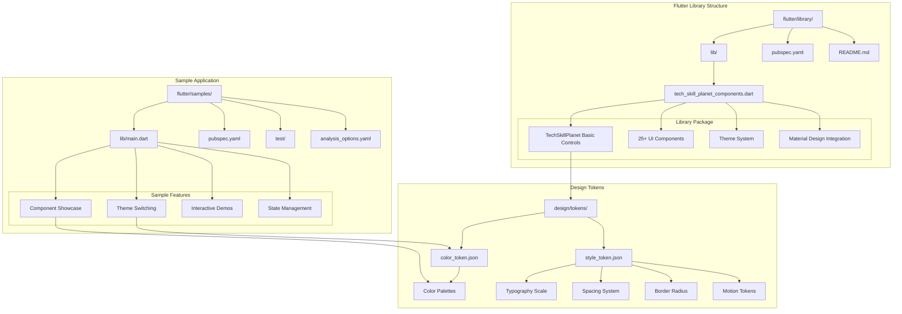

**Diagram sources**
- [tech_skill_planet_components.dart:1-678](file://flutter/library/lib/tech_skill_planet_components.dart#L1-L678)
- [main.dart:1-216](file://flutter/samples/lib/main.dart#L1-L216)

**Section sources**
- [tech_skill_planet_components.dart:1-678](file://flutter/library/lib/tech_skill_planet_components.dart#L1-L678)
- [pubspec.yaml:1-22](file://flutter/library/pubspec.yaml#L1-L22)
- [main.dart:1-216](file://flutter/samples/lib/main.dart#L1-L216)

## Core Components

The Flutter library implements a comprehensive set of 25+ components organized into logical categories:

### Button System
- **TspButton**: Primary action button with multiple variants (primary, standard, danger, text, link)
- **TspIconButton**: Icon-focused action button with selection states
- **TspTextLink**: Text-based navigation elements

### Surface Components
- **TspCard**: Content container with selection and disabled states
- **TspListItem**: Interactive list items with trailing content
- **TspEmpty**: Empty state placeholders with action support

### Feedback Components
- **TspAlert**: Inline notifications with variant styling
- **TspBadge**: Status indicators and metadata tags
- **TspProgress**: Progress visualization with variant colors
- **TspToast**: Lightweight feedback messages
- **TspNotification**: Enhanced alert variants

### Input Components
- **TspInput**: Single-line text input with validation states
- **TspSelect**: Selection dropdown with bottom sheet integration
- **TspOptionSheet**: Mobile-optimized selection interface
- **TspSwitch**: Binary toggle with loading states
- **TspPinInput**: Secure numeric input for PIN/verification

### Navigation Components
- **TspTopBar**: Header navigation with back button support
- **TspBottomTab**: Bottom tab navigation
- **TspTabs**: Horizontal tab switching
- **TspStickyFooter**: Persistent action area

### Data Presentation
- **TspAmount**: Monetary and value display
- **TspKeyValueLabel**: Key-value pair presentation
- **TspStepper**: Step progression visualization

Each component follows consistent patterns for theming, state management, and accessibility while maintaining Material Design principles.

**Section sources**
- [tech_skill_planet_components.dart:74-678](file://flutter/library/lib/tech_skill_planet_components.dart#L74-L678)

## Architecture Overview

The Flutter implementation employs a layered architecture that separates concerns while maintaining tight integration with Flutter's framework:

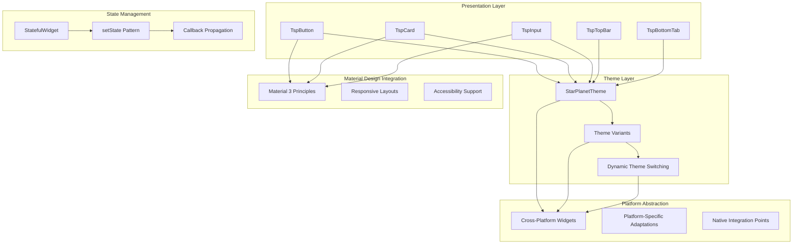

**Diagram sources**
- [tech_skill_planet_components.dart:3-59](file://flutter/library/lib/tech_skill_planet_components.dart#L3-L59)
- [main.dart:20-96](file://flutter/samples/lib/main.dart#L20-L96)

The architecture emphasizes:
- **Separation of Concerns**: Clear boundaries between presentation, theming, and state management
- **Composition Over Inheritance**: Widgets built from smaller, reusable components
- **Type Safety**: Strong typing for props, events, and theme values
- **Extensibility**: Easy addition of new components while maintaining consistency

**Section sources**
- [tech_skill_planet_components.dart:1-678](file://flutter/library/lib/tech_skill_planet_components.dart#L1-L678)
- [main.dart:60-96](file://flutter/samples/lib/main.dart#L60-L96)

## Detailed Component Analysis

### StarPlanetTheme System

The theming system provides three predefined themes with extensive customization capabilities:

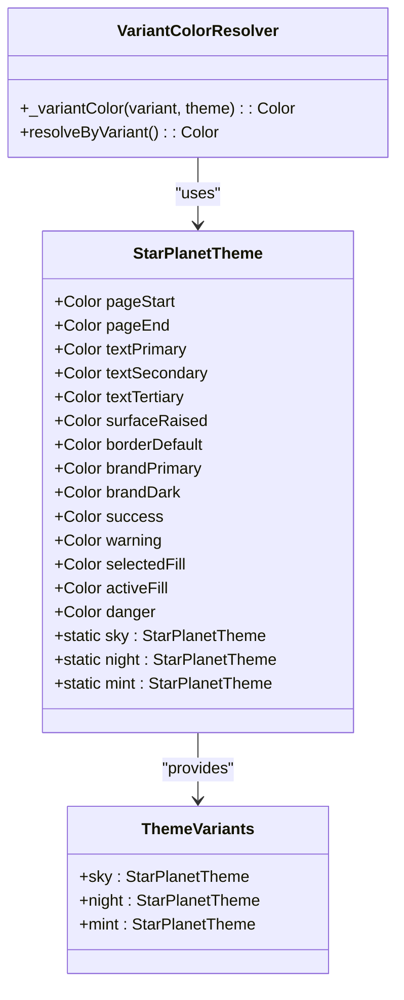

**Diagram sources**
- [tech_skill_planet_components.dart:3-59](file://flutter/library/lib/tech_skill_planet_components.dart#L3-L59)
- [tech_skill_planet_components.dart:64-72](file://flutter/library/lib/tech_skill_planet_components.dart#L64-L72)

### Component Implementation Patterns

Each component follows consistent implementation patterns:

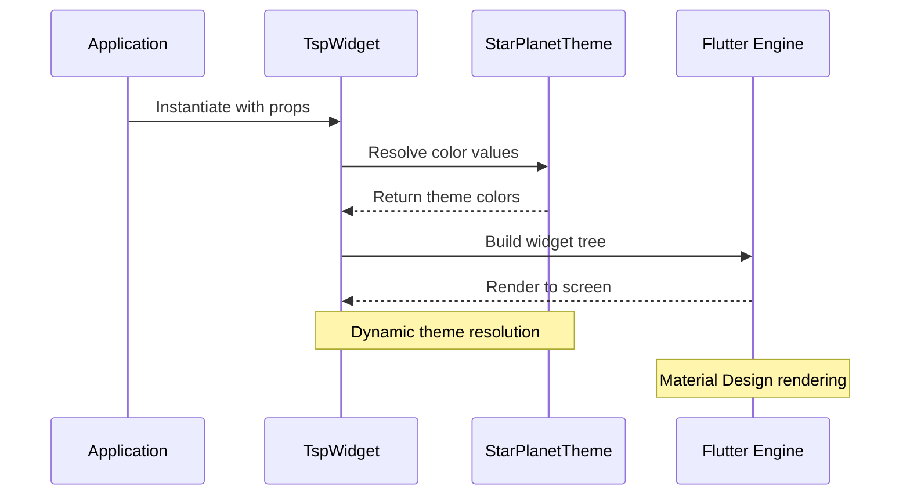

**Diagram sources**
- [tech_skill_planet_components.dart:74-123](file://flutter/library/lib/tech_skill_planet_components.dart#L74-L123)
- [main.dart:68-74](file://flutter/samples/lib/main.dart#L68-L74)

**Section sources**
- [tech_skill_planet_components.dart:3-59](file://flutter/library/lib/tech_skill_planet_components.dart#L3-L59)
- [tech_skill_planet_components.dart:74-678](file://flutter/library/lib/tech_skill_planet_components.dart#L74-L678)

## Theming System

The theming system provides comprehensive color and style management through JSON-based design tokens:

### Color Token System

The color system supports three distinct themes with semantic color mapping:

| Theme | Primary Colors | Usage |
|-------|----------------|--------|
| Sky | Blue gradient (#DDF4FF → #F9FDFF) | Default day theme |
| Night | Dark blue gradient (#0F1A2E → #141E32) | Dark mode variant |
| Mint | Teal gradient (#DFFAF2 → #F8FFFC) | Alternative color scheme |

### Style Token Integration

The style system defines consistent typography, spacing, and motion:

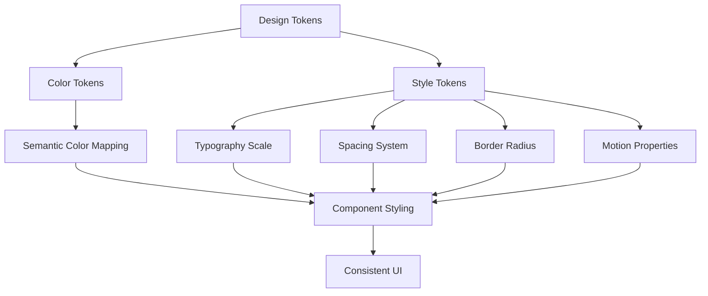

**Diagram sources**
- [color_token.json:1-406](file://design/tokens/color_token.json#L1-L406)
- [style_token.json:1-392](file://design/tokens/style_token.json#L1-L392)

**Section sources**
- [color_token.json:1-406](file://design/tokens/color_token.json#L1-L406)
- [style_token.json:1-392](file://design/tokens/style_token.json#L1-L392)

## State Management Integration

The library integrates seamlessly with Flutter's state management through multiple approaches:

### StatefulWidget Pattern

Most components use StatefulWidget for interactive elements:

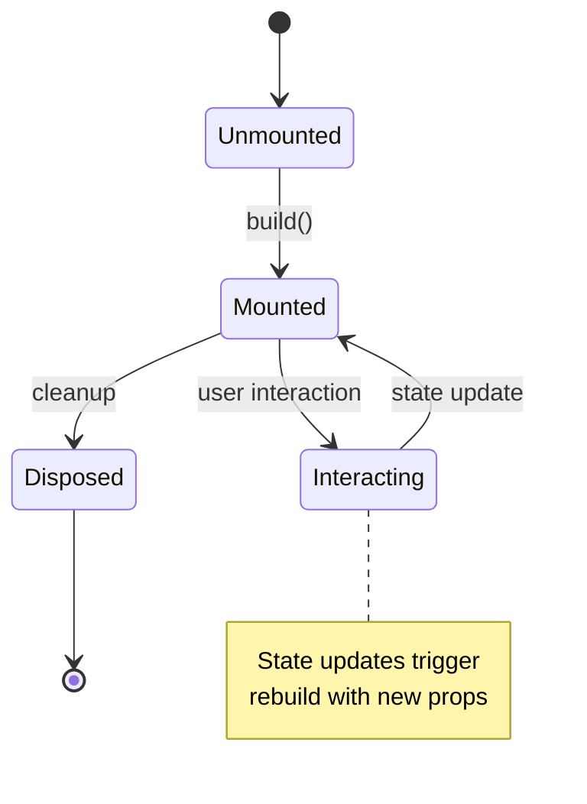

**Diagram sources**
- [main.dart:20-64](file://flutter/samples/lib/main.dart#L20-L64)

### Callback Propagation

Components expose typed callbacks for event handling:

| Component | Event Type | Callback Signature |
|-----------|------------|-------------------|
| TspButton | Tap | VoidCallback? |
| TspInput | Change | ValueChanged<String>? |
| TspSelect | Change | ValueChanged<int>? |
| TspSwitch | Toggle | ValueChanged<bool>? |
| Navigation | Selection | ValueChanged<String>? |

### Example State Management Flow

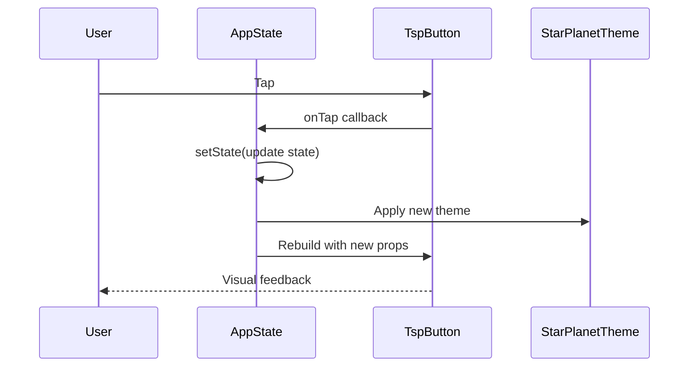

**Diagram sources**
- [main.dart:104-107](file://flutter/samples/lib/main.dart#L104-L107)
- [main.dart:178-179](file://flutter/samples/lib/main.dart#L178-L179)

**Section sources**
- [main.dart:20-96](file://flutter/samples/lib/main.dart#L20-L96)

## Platform Channel Communication

The Flutter implementation maintains compatibility with native platform channels while focusing on pure Dart widget implementation:

### Native Integration Points

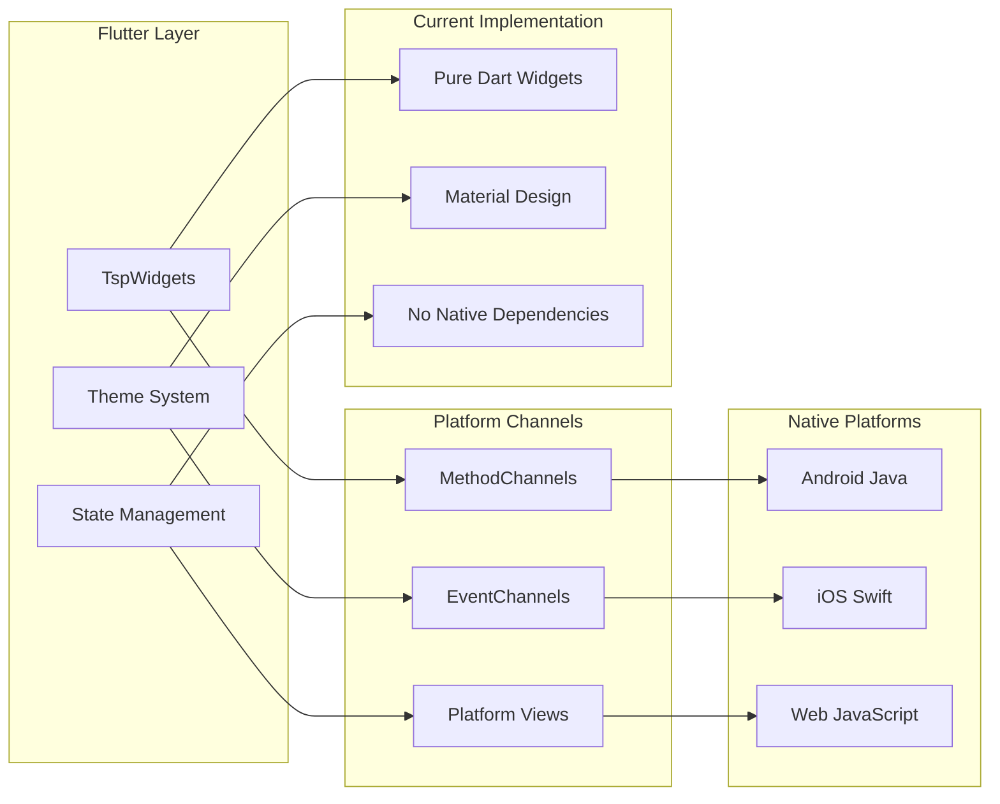

**Diagram sources**
- [tech_skill_planet_components.dart:1-678](file://flutter/library/lib/tech_skill_planet_components.dart#L1-L678)

**Section sources**
- [tech_skill_planet_components.dart:1-678](file://flutter/library/lib/tech_skill_planet_components.dart#L1-L678)

## Setup and Configuration

### Prerequisites

- **Flutter SDK**: Version 3.3.0 or higher
- **Dart SDK**: Compatible with Flutter
- **Development Environment**: Android Studio, VS Code, or IntelliJ IDEA

### Installation Steps

1. **Add Dependency** to your `pubspec.yaml`:
```yaml
dependencies:
  tech_skill_planet_components:
    path: ../path/to/planet-components/flutter/library
```

2. **Install Dependencies**:
```bash
flutter pub get
```

3. **Import Library**:
```dart
import 'package:tech_skill_planet_components/tech_skill_planet_components.dart';
```

### Pubspec Configuration

The library configuration supports:
- **Material Design Integration**: Enabled via `uses-material-design: true`
- **Version Pinning**: Specific Flutter SDK compatibility
- **Development Dependencies**: Testing and linting support

**Section sources**
- [pubspec.yaml:8-22](file://flutter/library/pubspec.yaml#L8-L22)
- [pubspec.yaml:5-21](file://flutter/samples/pubspec.yaml#L5-L21)

## Widget Composition Patterns

### Component Composition

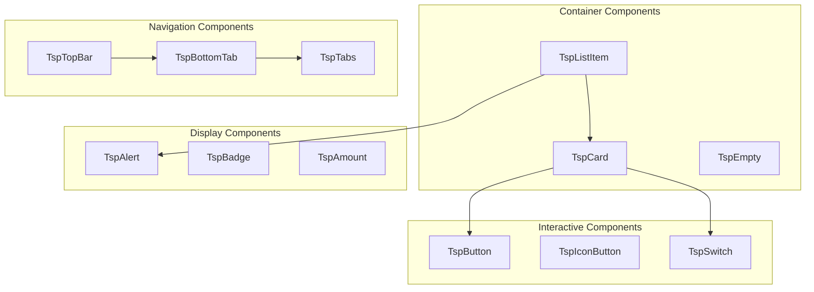

### Responsive Design Patterns

Components adapt to different screen sizes and orientations through:
- **Flexible Layouts**: Using Expanded and Flexible widgets
- **Constraint Handling**: Proper sizing and alignment
- **Safe Area Awareness**: Edge-to-edge display support

**Section sources**
- [tech_skill_planet_components.dart:125-607](file://flutter/library/lib/tech_skill_planet_components.dart#L125-L607)

## Animation Support

### Built-in Animations

The library incorporates subtle animations for enhanced user experience:

| Component | Animation Type | Purpose |
|-----------|----------------|---------|
| TspButton | Press/Release | Touch feedback |
| TspCard | Selection | State transitions |
| TspToast | Fade/Swipe | Notification dismissal |
| TspProgress | Fill/Empty | Loading states |

### Motion Tokens

The design system defines comprehensive motion properties:

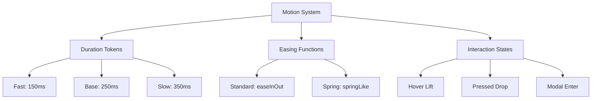

**Diagram sources**
- [style_token.json:313-334](file://design/tokens/style_token.json#L313-L334)

**Section sources**
- [style_token.json:313-334](file://design/tokens/style_token.json#L313-L334)

## Performance Optimization

### Rendering Optimizations

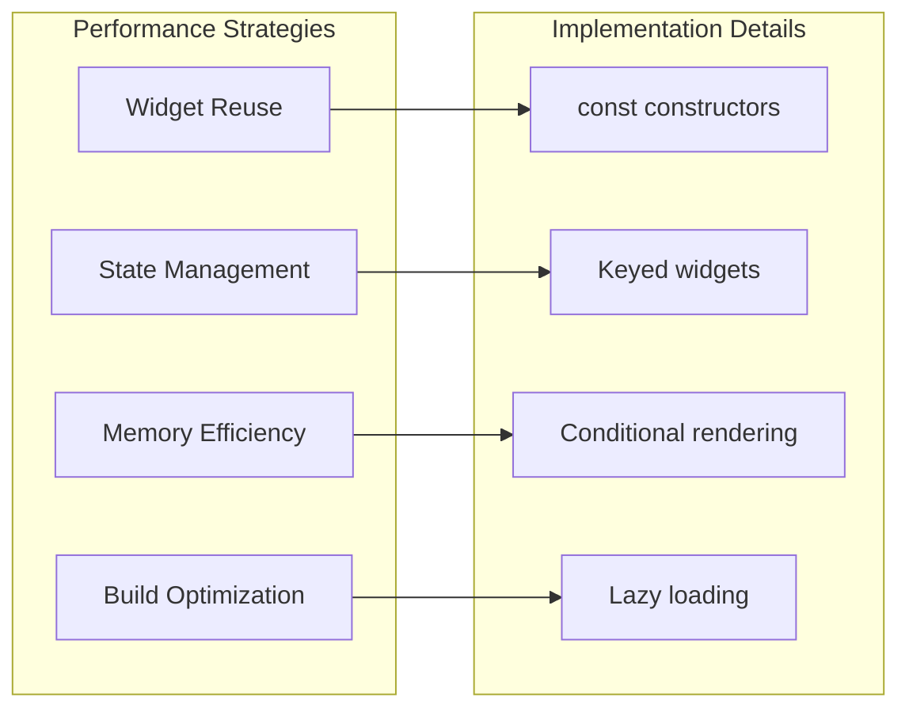

### Best Practices

1. **Use const Constructors**: For immutable widgets
2. **Implement Keys**: For stable widget identity
3. **Optimize Builds**: Minimize unnecessary rebuilds
4. **Manage Memory**: Dispose controllers properly

**Section sources**
- [main.dart:61-64](file://flutter/samples/lib/main.dart#L61-L64)

## Integration Challenges

### Common Integration Issues

| Challenge | Solution | Implementation |
|-----------|----------|----------------|
| Theme Conflicts | Isolate theme application | Scoped theme providers |
| State Management | Centralized state | Provider pattern |
| Performance | Optimize rebuilds | const widgets |
| Accessibility | Follow guidelines | Semantics support |

### Migration Strategies

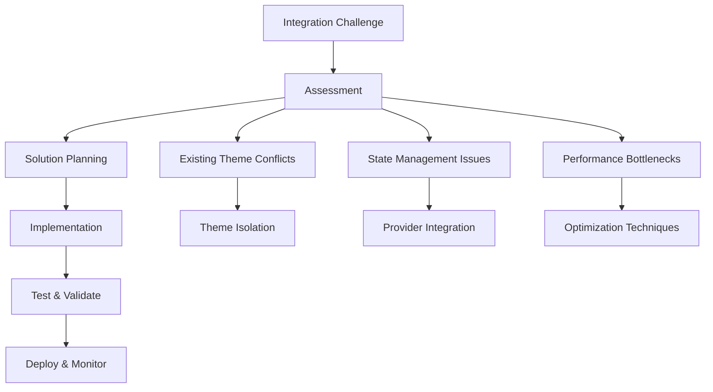

## Debugging Strategies

### Development Tools

1. **Flutter DevTools**: For profiling and debugging
2. **Widget Inspector**: For component hierarchy analysis
3. **Logging**: Structured logging for state changes
4. **Testing**: Comprehensive widget testing suite

### Common Debug Scenarios

| Issue | Symptoms | Resolution |
|-------|----------|------------|
| Theme Not Applied | Incorrect colors | Verify theme prop passing |
| State Not Updating | No UI changes | Check setState calls |
| Performance Issues | Slow rendering | Profile widget builds |
| Accessibility Problems | Screen reader issues | Add semantic properties |

**Section sources**
- [main.dart:20-96](file://flutter/samples/lib/main.dart#L20-L96)

## Best Practices

### Development Guidelines

1. **Component Design**
   - Keep components single-purpose
   - Provide comprehensive props
   - Support all interaction states

2. **Theming**
   - Use semantic color names
   - Support dark/light modes
   - Maintain accessibility compliance

3. **Performance**
   - Minimize rebuild scope
   - Use const constructors
   - Implement proper disposal

4. **Testing**
   - Write unit tests for logic
   - Create widget tests for UI
   - Test accessibility compliance

### Code Organization

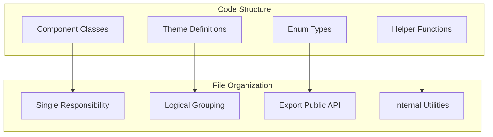

## Conclusion

The Planet Components Flutter implementation provides a robust, scalable foundation for building consistent, accessible user interfaces. The library's architecture emphasizes composability, type safety, and maintainability while offering extensive customization through the theme system.

Key strengths include:
- **Comprehensive Component Coverage**: 25+ widgets covering all UI interaction categories
- **Flexible Theming**: Three predefined themes with easy customization
- **Performance Focus**: Optimized rendering and state management patterns
- **Developer Experience**: Clear APIs, comprehensive documentation, and testing support

The implementation serves as both a practical toolkit and a reference architecture for Flutter component development, demonstrating best practices in widget composition, state management, and design system integration.

Future enhancements could include additional animation support, expanded platform integrations, and enhanced accessibility features while maintaining the library's focus on simplicity and consistency.