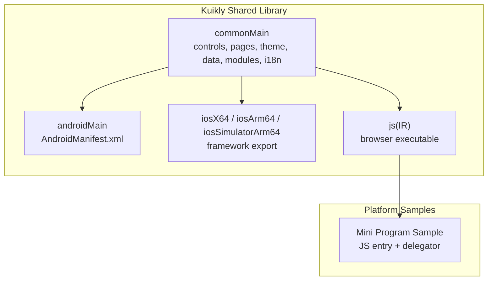
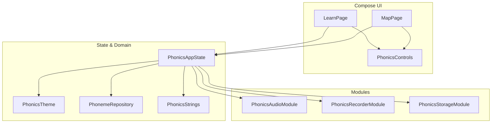
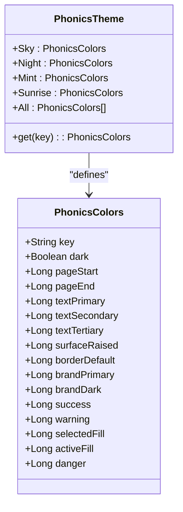
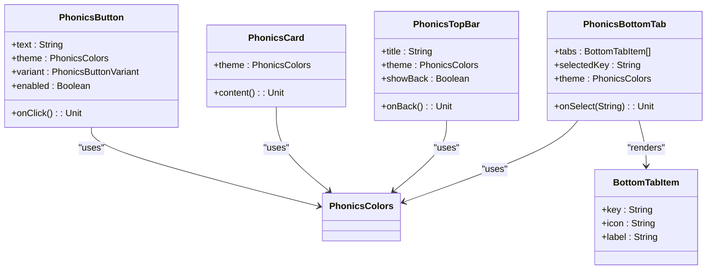
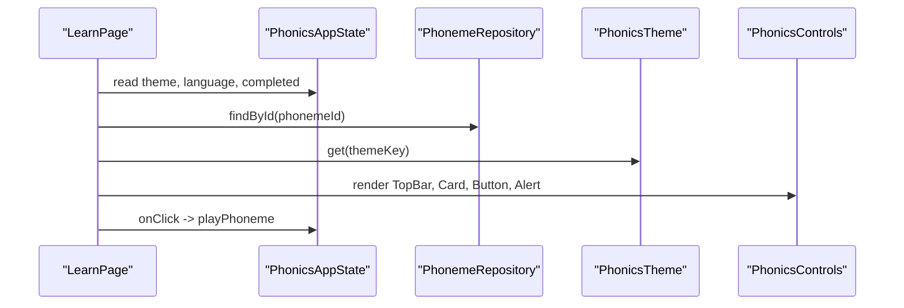
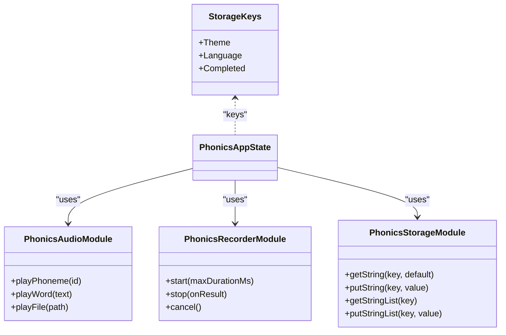
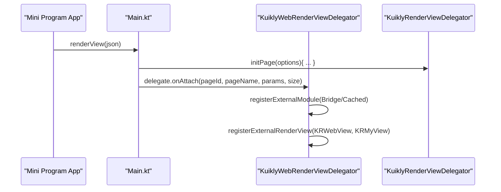
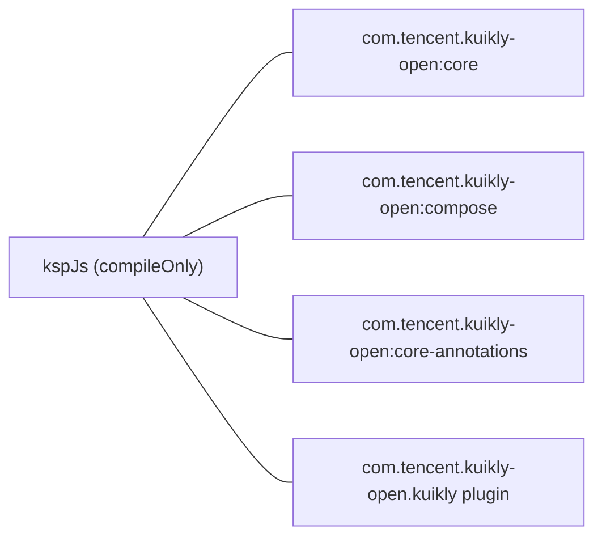

# Kuikly

<cite>
**Referenced Files in This Document**
- [build.gradle.kts](file://kuikly/build.gradle.kts)
- [library/shared/build.gradle.kts](file://kuikly/library/shared/build.gradle.kts)
- [PhonicsControls.kt](file://kuikly/library/shared/src/commonMain/kotlin/com/techskillplanet/phonics/controls/PhonicsControls.kt)
- [LearnPage.kt](file://kuikly/library/shared/src/commonMain/kotlin/com/techskillplanet/phonics/pages/LearnPage.kt)
- [MapPage.kt](file://kuikly/library/shared/src/commonMain/kotlin/com/techskillplanet/phonics/pages/MapPage.kt)
- [PhonicsAppState.kt](file://kuikly/library/shared/src/commonMain/kotlin/com/techskillplanet/phonics/pages/PhonicsAppState.kt)
- [PhonicsTheme.kt](file://kuikly/library/shared/src/commonMain/kotlin/com/techskillplanet/phonics/theme/PhonicsTheme.kt)
- [PhonemeData.kt](file://kuikly/library/shared/src/commonMain/kotlin/com/techskillplanet/phonics/data/PhonemeData.kt)
- [AudioModule.kt](file://kuikly/library/shared/src/commonMain/kotlin/com/techskillplanet/phonics/modules/AudioModule.kt)
- [RecorderModule.kt](file://kuikly/library/shared/src/commonMain/kotlin/com/techskillplanet/phonics/modules/RecorderModule.kt)
- [StorageModule.kt](file://kuikly/library/shared/src/commonMain/kotlin/com/techskillplanet/phonics/modules/StorageModule.kt)
- [PhonicsStrings.kt](file://kuikly/library/shared/src/commonMain/kotlin/com/techskillplanet/phonics/i18n/PhonicsStrings.kt)
- [Main.kt](file://kuikly/samples/miniApp/src/jsMain/kotlin/Main.kt)
- [KuiklyWebRenderViewDelegator.kt](file://kuikly/samples/miniApp/src/jsMain/kotlin/KuiklyWebRenderViewDelegator.kt)
</cite>

## Table of Contents
1. [Introduction](#introduction)
2. [Project Structure](#project-structure)
3. [Core Components](#core-components)
4. [Architecture Overview](#architecture-overview)
5. [Detailed Component Analysis](#detailed-component-analysis)
6. [Dependency Analysis](#dependency-analysis)
7. [Performance Considerations](#performance-considerations)
8. [Troubleshooting Guide](#troubleshooting-guide)
9. [Conclusion](#conclusion)
10. [Appendices](#appendices)

## Introduction
This document explains the Kuikly implementation for Planet Components within the Kotlin Multiplatform ecosystem. It covers the shared code architecture, platform-specific adaptations for Android, iOS, JavaScript/Mini Program, and native framework exports. It also documents the theming system, component composition patterns, JS interop capabilities, and platform integrations. Guidance is included for setting up Kotlin Multiplatform projects, configuring Gradle, building across platforms, and integrating with web rendering frameworks.

## Project Structure
Kuikly organizes shared UI and logic under a Kotlin Multiplatform module with a commonMain source set and platform-specific targets. The shared library integrates Kuikly’s Compose runtime and rendering APIs, while platform samples demonstrate JS/Mini Program integration and native framework export for iOS.

**Diagram sources**
- [library/shared/build.gradle.kts:17-44](file://kuikly/library/shared/build.gradle.kts#L17-L44)
- [Main.kt:10-77](file://kuikly/samples/miniApp/src/jsMain/kotlin/Main.kt#L10-L77)

**Section sources**
- [library/shared/build.gradle.kts:17-44](file://kuikly/library/shared/build.gradle.kts#L17-L44)
- [build.gradle.kts:1-32](file://kuikly/build.gradle.kts#L1-L32)

## Core Components
Kuikly’s shared layer defines:
- Controls: Reusable UI primitives (buttons, cards, chips, progress indicators, top bar, bottom tab, alerts, steppers, sticky footer, pin input, links).
- Pages: Composable screens (Map and Learn) orchestrating state and controls.
- State: Application state container managing theme, language, completion records, and selected phoneme.
- Theme: Typed color tokens and predefined themes (day, night, mint, sunrise).
- Data: Phoneme repository and grouped phoneme collections.
- Modules: Abstractions for audio playback, recording, and persistent storage.
- Internationalization: Multi-language string catalog with formatting helpers.

These components are authored in commonMain and consumed by platform-specific hosts.

**Section sources**
- [PhonicsControls.kt:1-408](file://kuikly/library/shared/src/commonMain/kotlin/com/techskillplanet/phonics/controls/PhonicsControls.kt#L1-L408)
- [LearnPage.kt:1-112](file://kuikly/library/shared/src/commonMain/kotlin/com/techskillplanet/phonics/pages/LearnPage.kt#L1-L112)
- [MapPage.kt:1-183](file://kuikly/library/shared/src/commonMain/kotlin/com/techskillplanet/phonics/pages/MapPage.kt#L1-L183)
- [PhonicsAppState.kt:1-48](file://kuikly/library/shared/src/commonMain/kotlin/com/techskillplanet/phonics/pages/PhonicsAppState.kt#L1-L48)
- [PhonicsTheme.kt:1-103](file://kuikly/library/shared/src/commonMain/kotlin/com/techskillplanet/phonics/theme/PhonicsTheme.kt#L1-L103)
- [PhonemeData.kt:1-592](file://kuikly/library/shared/src/commonMain/kotlin/com/techskillplanet/phonics/data/PhonemeData.kt#L1-L592)
- [AudioModule.kt:1-12](file://kuikly/library/shared/src/commonMain/kotlin/com/techskillplanet/phonics/modules/AudioModule.kt#L1-L12)
- [RecorderModule.kt:1-13](file://kuikly/library/shared/src/commonMain/kotlin/com/techskillplanet/phonics/modules/RecorderModule.kt#L1-L13)
- [StorageModule.kt:1-15](file://kuikly/library/shared/src/commonMain/kotlin/com/techskillplanet/phonics/modules/StorageModule.kt#L1-L15)
- [PhonicsStrings.kt:1-444](file://kuikly/library/shared/src/commonMain/kotlin/com/techskillplanet/phonics/i18n/PhonicsStrings.kt#L1-L444)

## Architecture Overview
Kuikly’s architecture centers on Compose for UI, with a typed theming model and modularized domain services. The state container coordinates theme selection, language, and progress. Pages compose controls and react to user actions, delegating media playback and persistence to platform modules.

**Diagram sources**
- [LearnPage.kt:25-112](file://kuikly/library/shared/src/commonMain/kotlin/com/techskillplanet/phonics/pages/LearnPage.kt#L25-L112)
- [MapPage.kt:36-99](file://kuikly/library/shared/src/commonMain/kotlin/com/techskillplanet/phonics/pages/MapPage.kt#L36-L99)
- [PhonicsControls.kt:35-408](file://kuikly/library/shared/src/commonMain/kotlin/com/techskillplanet/phonics/controls/PhonicsControls.kt#L35-L408)
- [PhonicsAppState.kt:12-47](file://kuikly/library/shared/src/commonMain/kotlin/com/techskillplanet/phonics/pages/PhonicsAppState.kt#L12-L47)
- [PhonicsTheme.kt:22-102](file://kuikly/library/shared/src/commonMain/kotlin/com/techskillplanet/phonics/theme/PhonicsTheme.kt#L22-L102)
- [PhonemeData.kt:21-591](file://kuikly/library/shared/src/commonMain/kotlin/com/techskillplanet/phonics/data/PhonemeData.kt#L21-L591)
- [PhonicsStrings.kt:3-443](file://kuikly/library/shared/src/commonMain/kotlin/com/techskillplanet/phonics/i18n/PhonicsStrings.kt#L3-L443)
- [AudioModule.kt:3-7](file://kuikly/library/shared/src/commonMain/kotlin/com/techskillplanet/phonics/modules/AudioModule.kt#L3-L7)
- [RecorderModule.kt:3-12](file://kuikly/library/shared/src/commonMain/kotlin/com/techskillplanet/phonics/modules/RecorderModule.kt#L3-L12)
- [StorageModule.kt:3-8](file://kuikly/library/shared/src/commonMain/kotlin/com/techskillplanet/phonics/modules/StorageModule.kt#L3-L8)

## Detailed Component Analysis

### Theming System
The theming system defines a compact color palette per theme and exposes a lookup mechanism to resolve the active theme by key. Pages and controls consume theme tokens to render consistent visuals.

**Diagram sources**
- [PhonicsTheme.kt:3-102](file://kuikly/library/shared/src/commonMain/kotlin/com/techskillplanet/phonics/theme/PhonicsTheme.kt#L3-L102)

**Section sources**
- [PhonicsTheme.kt:1-103](file://kuikly/library/shared/src/commonMain/kotlin/com/techskillplanet/phonics/theme/PhonicsTheme.kt#L1-L103)

### Control Composition Patterns
Controls encapsulate layout, styling, and interactivity using Compose modifiers and theme tokens. They expose variants and optional selection states to adapt appearance.

**Diagram sources**
- [PhonicsControls.kt:26-183](file://kuikly/library/shared/src/commonMain/kotlin/com/techskillplanet/phonics/controls/PhonicsControls.kt#L26-L183)

**Section sources**
- [PhonicsControls.kt:1-408](file://kuikly/library/shared/src/commonMain/kotlin/com/techskillplanet/phonics/controls/PhonicsControls.kt#L1-L408)

### Page Orchestration
Pages coordinate state, theme, and controls. LearnPage renders phoneme details and example words, while MapPage presents progress and a grid of phonemes.

**Diagram sources**
- [LearnPage.kt:25-112](file://kuikly/library/shared/src/commonMain/kotlin/com/techskillplanet/phonics/pages/LearnPage.kt#L25-L112)
- [PhonicsAppState.kt:12-47](file://kuikly/library/shared/src/commonMain/kotlin/com/techskillplanet/phonics/pages/PhonicsAppState.kt#L12-L47)
- [PhonemeData.kt:21-591](file://kuikly/library/shared/src/commonMain/kotlin/com/techskillplanet/phonics/data/PhonemeData.kt#L21-L591)
- [PhonicsTheme.kt:22-102](file://kuikly/library/shared/src/commonMain/kotlin/com/techskillplanet/phonics/theme/PhonicsTheme.kt#L22-L102)
- [PhonicsControls.kt:35-202](file://kuikly/library/shared/src/commonMain/kotlin/com/techskillplanet/phonics/controls/PhonicsControls.kt#L35-L202)

**Section sources**
- [LearnPage.kt:1-112](file://kuikly/library/shared/src/commonMain/kotlin/com/techskillplanet/phonics/pages/LearnPage.kt#L1-L112)
- [MapPage.kt:1-183](file://kuikly/library/shared/src/commonMain/kotlin/com/techskillplanet/phonics/pages/MapPage.kt#L1-L183)

### Module Contracts
Domain services are abstracted behind interfaces for pluggable implementations on each platform.

**Diagram sources**
- [AudioModule.kt:3-12](file://kuikly/library/shared/src/commonMain/kotlin/com/techskillplanet/phonics/modules/AudioModule.kt#L3-L12)
- [RecorderModule.kt:3-12](file://kuikly/library/shared/src/commonMain/kotlin/com/techskillplanet/phonics/modules/RecorderModule.kt#L3-L12)
- [StorageModule.kt:3-14](file://kuikly/library/shared/src/commonMain/kotlin/com/techskillplanet/phonics/modules/StorageModule.kt#L3-L14)
- [PhonicsAppState.kt:12-47](file://kuikly/library/shared/src/commonMain/kotlin/com/techskillplanet/phonics/pages/PhonicsAppState.kt#L12-L47)

**Section sources**
- [AudioModule.kt:1-12](file://kuikly/library/shared/src/commonMain/kotlin/com/techskillplanet/phonics/modules/AudioModule.kt#L1-L12)
- [RecorderModule.kt:1-13](file://kuikly/library/shared/src/commonMain/kotlin/com/techskillplanet/phonics/modules/RecorderModule.kt#L1-L13)
- [StorageModule.kt:1-15](file://kuikly/library/shared/src/commonMain/kotlin/com/techskillplanet/phonics/modules/StorageModule.kt#L1-L15)
- [PhonicsAppState.kt:1-48](file://kuikly/library/shared/src/commonMain/kotlin/com/techskillplanet/phonics/pages/PhonicsAppState.kt#L1-L48)

### JS Interop and Mini Program Integration
The JS sample demonstrates initializing a Mini Program host and delegating rendering to Kuikly’s web renderer. It passes platform metadata and registers custom modules and views.

**Diagram sources**
- [Main.kt:27-77](file://kuikly/samples/miniApp/src/jsMain/kotlin/Main.kt#L27-L77)
- [KuiklyWebRenderViewDelegator.kt:46-91](file://kuikly/samples/miniApp/src/jsMain/kotlin/KuiklyWebRenderViewDelegator.kt#L46-L91)

**Section sources**
- [Main.kt:1-77](file://kuikly/samples/miniApp/src/jsMain/kotlin/Main.kt#L1-L77)
- [KuiklyWebRenderViewDelegator.kt:1-91](file://kuikly/samples/miniApp/src/jsMain/kotlin/KuiklyWebRenderViewDelegator.kt#L1-L91)

## Dependency Analysis
Kuikly’s shared module declares dependencies on Kuikly’s core, Compose, annotations, and KSP for code generation. The Android target configures assets and manifests; JS target configures a browser bundle; iOS targets produce static frameworks.

**Diagram sources**
- [library/shared/build.gradle.kts:48-54](file://kuikly/library/shared/build.gradle.kts#L48-L54)
- [library/shared/build.gradle.kts:86-89](file://kuikly/library/shared/build.gradle.kts#L86-L89)

**Section sources**
- [library/shared/build.gradle.kts:1-90](file://kuikly/library/shared/build.gradle.kts#L1-L90)
- [build.gradle.kts:1-32](file://kuikly/build.gradle.kts#L1-L32)

## Performance Considerations
- Prefer immutable state containers and Compose recomposition boundaries to minimize redraws.
- Use lazy layouts for grids and lists to reduce initial render cost.
- Cache theme tokens and avoid repeated conversions to UI color types.
- Keep asset paths consistent for audio modules to enable efficient loading.
- On JS, ensure bundling excludes unused modules and leverages tree-shaking via KSP arguments.

[No sources needed since this section provides general guidance]

## Troubleshooting Guide
- Theme resolution: Verify the theme key exists in the theme registry and defaults gracefully if missing.
- State persistence: Confirm storage keys match expected constants and lists are persisted correctly.
- Audio playback: Validate asset paths generated by helper functions and ensure assets are packaged for each platform.
- JS rendering: Check that the Mini Program host invokes the renderView entry and delegates attach with correct page parameters and sizes.
- KSP configuration: Ensure KSP arguments are passed for pageName, pageNameList, and packLocalJSBundle when generating JS bundles.

**Section sources**
- [PhonicsTheme.kt:101-102](file://kuikly/library/shared/src/commonMain/kotlin/com/techskillplanet/phonics/theme/PhonicsTheme.kt#L101-L102)
- [StorageModule.kt:10-14](file://kuikly/library/shared/src/commonMain/kotlin/com/techskillplanet/phonics/modules/StorageModule.kt#L10-L14)
- [AudioModule.kt:9-12](file://kuikly/library/shared/src/commonMain/kotlin/com/techskillplanet/phonics/modules/AudioModule.kt#L9-L12)
- [Main.kt:27-77](file://kuikly/samples/miniApp/src/jsMain/kotlin/Main.kt#L27-L77)
- [library/shared/build.gradle.kts:57-61](file://kuikly/library/shared/build.gradle.kts#L57-L61)

## Conclusion
Kuikly enables a cohesive, type-safe UI layer across Android, iOS, and JS/Mini Program through Kotlin Multiplatform. By centralizing controls, state, and theming in commonMain and abstracting platform concerns via modules, teams can deliver consistent experiences with minimal duplication. The provided Gradle configuration and JS delegation patterns offer practical pathways to integrate with existing web and native ecosystems.

[No sources needed since this section summarizes without analyzing specific files]

## Appendices

### Setup Instructions: Kotlin Multiplatform and Gradle
- Apply the Kotlin Multiplatform, Compose, Android, KSP, and Kuikly plugins at the root level.
- Configure repositories to include Maven Central, Google, and the Tencent mirror.
- In the shared module:
  - Define targets: Android, iOS frameworks, and JS(IR) with browser configuration.
  - Add Kuikly dependencies in commonMain.
  - Configure Android namespace, minSdk, and assets.
  - Pass KSP arguments for pageName, pageNameList, and packLocalJSBundle.
  - Enable the Kuikly plugin for JS output naming.

**Section sources**
- [build.gradle.kts:1-32](file://kuikly/build.gradle.kts#L1-L32)
- [library/shared/build.gradle.kts:1-90](file://kuikly/library/shared/build.gradle.kts#L1-L90)

### Cross-Platform Build Processes
- Android: Assemble an Android library with assets and manifest from commonMain.
- iOS: Produce static frameworks per target with configured bundle identifiers.
- JS: Emit a browser-executable bundle with a custom module name and webpack output filename.

**Section sources**
- [library/shared/build.gradle.kts:17-44](file://kuikly/library/shared/build.gradle.kts#L17-L44)

### Platform-Specific Optimizations
- Android: Leverage Android resources and system APIs for theming and accessibility.
- iOS: Use exported frameworks and integrate via Xcode; ensure proper linking and bundling.
- JS/Mini Program: Initialize the app lifecycle callbacks, pass platform metadata, and register custom modules/views for extended functionality.

**Section sources**
- [Main.kt:10-77](file://kuikly/samples/miniApp/src/jsMain/kotlin/Main.kt#L10-L77)
- [KuiklyWebRenderViewDelegator.kt:46-91](file://kuikly/samples/miniApp/src/jsMain/kotlin/KuiklyWebRenderViewDelegator.kt#L46-L91)

### Best Practices for Kotlin Multiplatform Development
- Keep UI logic in commonMain; defer platform specifics to modules.
- Use typed enums and sealed data classes for state machines and variants.
- Encapsulate platform differences behind interfaces and inject implementations at runtime.
- Favor small, composable controls and centralized theming to simplify testing and reuse.
- Validate asset packaging and path resolution across platforms.

[No sources needed since this section provides general guidance]