# Platform Implementations

<cite>
**Referenced Files in This Document**
- [README.md](file://README.md)
- [docs/PLATFORM_STRUCTURE.md](file://docs/PLATFORM_STRUCTURE.md)
- [docs/COMPONENT_CONTRACT.md](file://docs/COMPONENT_CONTRACT.md)
- [android/library/build.gradle](file://android/library/build.gradle)
- [android/library/src/main/java/com/techskillplanet/basiccontrols/widget/BasicButton.java](file://android/library/src/main/java/com/techskillplanet/basiccontrols/widget/BasicButton.java)
- [react-web/library/package.json](file://react-web/library/package.json)
- [react-web/library/src/components/TspButton.js](file://react-web/library/src/components/TspButton.js)
- [react-native/library/package.json](file://react-native/library/package.json)
- [react-native/library/src/starPlanet/components/TspButton.js](file://react-native/library/src/starPlanet/components/TspButton.js)
- [vue-web/library/package.json](file://vue-web/library/package.json)
- [vue-web/library/src/components/TspButton.js](file://vue-web/library/src/components/TspButton.js)
- [flutter/library/lib/tech_skill_planet_components.dart](file://flutter/library/lib/tech_skill_planet_components.dart)
- [flutter/library/pubspec.yaml](file://flutter/library/pubspec.yaml)
- [ios-swiftui/library/Package.swift](file://ios-swiftui/library/Package.swift)
- [ios-swiftui/library/Sources/TechSkillPlanetBasicControls/BasicControls.swift](file://ios-swiftui/library/Sources/TechSkillPlanetBasicControls/BasicControls.swift)
- [miniprogram/library/package.json](file://miniprogram/library/package.json)
- [miniprogram/library/components/bc-button/bc-button.js](file://miniprogram/library/components/bc-button/bc-button.js)
- [kuikly/build.gradle.kts](file://kuikly/build.gradle.kts)
- [kuikly/library/shared/src/commonMain/kotlin/com/techskillplanet/phonics/controls/PhonicsControls.kt](file://kuikly/library/shared/src/commonMain/kotlin/com/techskillplanet/phonics/controls/PhonicsControls.kt)
</cite>

## Table of Contents
1. [Introduction](#introduction)
2. [Project Structure](#project-structure)
3. [Core Components](#core-components)
4. [Architecture Overview](#architecture-overview)
5. [Detailed Component Analysis](#detailed-component-analysis)
6. [Dependency Analysis](#dependency-analysis)
7. [Performance Considerations](#performance-considerations)
8. [Troubleshooting Guide](#troubleshooting-guide)
9. [Conclusion](#conclusion)
10. [Appendices](#appendices)

## Introduction
This document explains the cross-platform implementation of Planet Components across eight platforms: Android View, React Web, React Native, Vue Web, Flutter, iOS SwiftUI, WeChat Mini Program, and Kuikly. It describes the adapter pattern that translates a shared component contract into platform-specific implementations, along with architecture, integration patterns, build processes, configuration options, and optimization strategies. The goal is to help maintainers and integrators align UI behavior and visuals across platforms while respecting each runtime’s idioms.

## Project Structure
Planet Components follows a consistent layout per platform:
- library: a standalone, publishable package containing platform-specific components and shared utilities.
- samples: a runnable sample project that depends on the local library.

Rules governing structure and routing are enforced via repository-wide guidelines and platform mapping.

```mermaid
graph TB
subgraph "Repository Root"
A["README.md"]
B["docs/PLATFORM_STRUCTURE.md"]
C["docs/COMPONENT_CONTRACT.md"]
end
subgraph "Android View"
AV_L["android/library"]
AV_S["android/samples"]
end
subgraph "React Web"
RW_L["react-web/library"]
RW_S["react-web/samples"]
end
subgraph "React Native"
RN_L["react-native/library"]
RN_S["react-native/samples"]
end
subgraph "Vue Web"
VW_L["vue-web/library"]
VW_S["vue-web/samples"]
end
subgraph "Flutter"
F_L["flutter/library"]
F_S["flutter/samples"]
end
subgraph "iOS SwiftUI"
IOS_L["ios-swiftui/library"]
IOS_S["ios-swiftui/samples"]
end
subgraph "WeChat Mini Program"
MP_L["miniprogram/library"]
MP_S["miniprogram/samples"]
end
subgraph "Kuikly"
K_L["kuikly/library"]
K_S["kuikly/samples"]
end
A --> AV_L
A --> RW_L
A --> RN_L
A --> VW_L
A --> F_L
A --> IOS_L
A --> MP_L
A --> K_L
B --> AV_L
B --> RW_L
B --> RN_L
B --> VW_L
B --> F_L
B --> IOS_L
B --> MP_L
B --> K_L
C --> AV_L
C --> RW_L
C --> RN_L
C --> VW_L
C --> F_L
C --> IOS_L
C --> MP_L
C --> K_L
```

**Diagram sources**
- [README.md:10-21](file://README.md#L10-L21)
- [docs/PLATFORM_STRUCTURE.md:35-41](file://docs/PLATFORM_STRUCTURE.md#L35-L41)

**Section sources**
- [README.md:10-21](file://README.md#L10-L21)
- [docs/PLATFORM_STRUCTURE.md:1-51](file://docs/PLATFORM_STRUCTURE.md#L1-L51)

## Core Components
Planet Components defines a shared component contract specifying names, variants, and core props that must remain consistent across platforms. The contract enumerates components and their variants, ensuring uniform behavior and visual semantics.

Key aspects:
- Shared theme name and semantic color tokens.
- Component set with required variants and core props.
- Sample coverage expectations for states and realistic usage.

**Section sources**
- [docs/COMPONENT_CONTRACT.md:5-67](file://docs/COMPONENT_CONTRACT.md#L5-L67)

## Architecture Overview
Planet Components employs an adapter pattern:
- The shared component contract defines the canonical API and variants.
- Each platform’s library implements components that accept the canonical props and render according to platform conventions.
- Themes and tokens are resolved at runtime via platform-specific theme managers or theme objects.

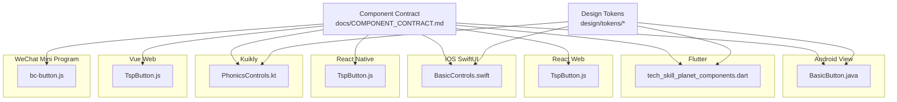

**Diagram sources**
- [docs/COMPONENT_CONTRACT.md:26-56](file://docs/COMPONENT_CONTRACT.md#L26-L56)
- [android/library/src/main/java/com/techskillplanet/basiccontrols/widget/BasicButton.java:30-255](file://android/library/src/main/java/com/techskillplanet/basiccontrols/widget/BasicButton.java#L30-L255)
- [react-web/library/src/components/TspButton.js:19-48](file://react-web/library/src/components/TspButton.js#L19-L48)
- [react-native/library/src/starPlanet/components/TspButton.js:5-44](file://react-native/library/src/starPlanet/components/TspButton.js#L5-L44)
- [vue-web/library/src/components/TspButton.js:4-30](file://vue-web/library/src/components/TspButton.js#L4-L30)
- [flutter/library/lib/tech_skill_planet_components.dart:74-123](file://flutter/library/lib/tech_skill_planet_components.dart#L74-L123)
- [ios-swiftui/library/Sources/TechSkillPlanetBasicControls/BasicControls.swift:6-51](file://ios-swiftui/library/Sources/TechSkillPlanetBasicControls/BasicControls.swift#L6-L51)
- [miniprogram/library/components/bc-button/bc-button.js:1-22](file://miniprogram/library/components/bc-button/bc-button.js#L1-L22)
- [kuikly/library/shared/src/commonMain/kotlin/com/techskillplanet/phonics/controls/PhonicsControls.kt:36-65](file://kuikly/library/shared/src/commonMain/kotlin/com/techskillplanet/phonics/controls/PhonicsControls.kt#L36-L65)

## Detailed Component Analysis

### Android View
- Implementation model: Android View hierarchy with a custom composite widget.
- Example: BasicButton composes a shadow layer and a label view, applying theme tokens and handling touch/press animations.
- Build and publication: Gradle Android Library plugin with Maven Central publishing and signing.
- Integration: Add the published artifact to an Android app; use components in XML or programmatically.

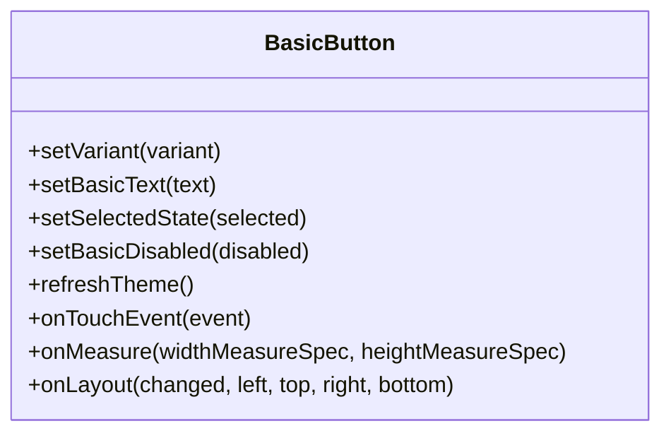

**Diagram sources**
- [android/library/src/main/java/com/techskillplanet/basiccontrols/widget/BasicButton.java:30-255](file://android/library/src/main/java/com/techskillplanet/basiccontrols/widget/BasicButton.java#L30-L255)

**Section sources**
- [android/library/build.gradle:1-98](file://android/library/build.gradle#L1-L98)
- [android/library/src/main/java/com/techskillplanet/basiccontrols/widget/BasicButton.java:30-255](file://android/library/src/main/java/com/techskillplanet/basiccontrols/widget/BasicButton.java#L30-L255)

### React Web
- Implementation model: Functional component returning DOM elements with CSS classes and theme variables.
- Example: TspButton renders a button with shadow and face layers, controlled by theme flags and variant.
- Build and distribution: NPM package with exports for index, theme, and styles; peer dependency on React.
- Integration: Install the package and import components; ensure CSS variables are injected by the theme.

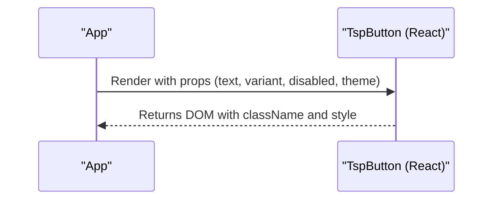

**Diagram sources**
- [react-web/library/src/components/TspButton.js:19-48](file://react-web/library/src/components/TspButton.js#L19-L48)

**Section sources**
- [react-web/library/package.json:1-57](file://react-web/library/package.json#L1-L57)
- [react-web/library/src/components/TspButton.js:19-48](file://react-web/library/src/components/TspButton.js#L19-L48)

### React Native
- Implementation model: Composite component using Pressable and Views to simulate raised buttons; theme applied via computed values.
- Example: TspButton computes face color, shadow lift, and press drop based on theme and variant.
- Build and distribution: NPM package with barrel exports for index, theme, and components; peer dependencies on React and React Native.
- Integration: Install the package and use components in RN apps; ensure platform-specific bundling is configured.

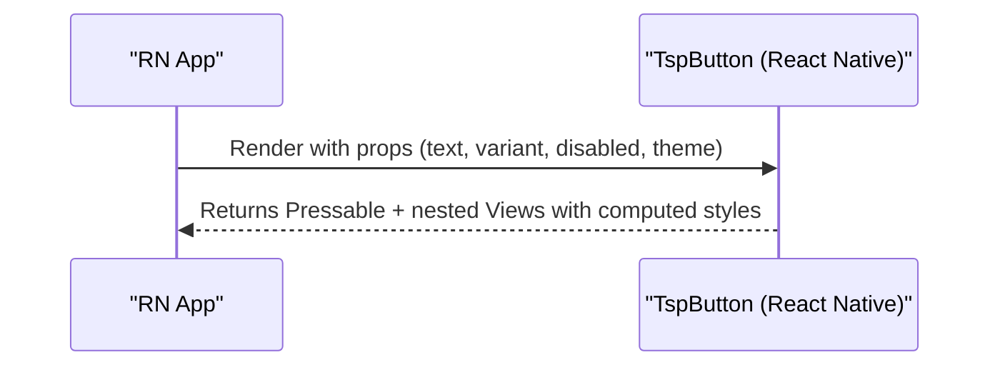

**Diagram sources**
- [react-native/library/src/starPlanet/components/TspButton.js:5-44](file://react-native/library/src/starPlanet/components/TspButton.js#L5-L44)

**Section sources**
- [react-native/library/package.json:1-25](file://react-native/library/package.json#L1-L25)
- [react-native/library/src/starPlanet/components/TspButton.js:5-44](file://react-native/library/src/starPlanet/components/TspButton.js#L5-L44)

### Vue Web
- Implementation model: Vue 3 functional component with props and emits, rendering DOM with theme variables.
- Example: TspButton defines props and emits a tap event; applies theme via a helper.
- Build and distribution: NPM package with exports for index, theme, and styles; peer dependency on Vue 3.
- Integration: Install the package and import components; ensure CSS variables are injected.

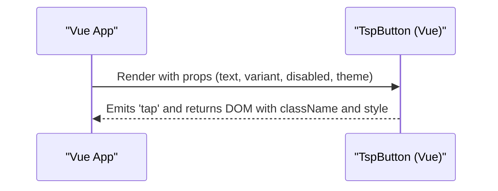

**Diagram sources**
- [vue-web/library/src/components/TspButton.js:4-30](file://vue-web/library/src/components/TspButton.js#L4-L30)

**Section sources**
- [vue-web/library/package.json:1-32](file://vue-web/library/package.json#L1-L32)
- [vue-web/library/src/components/TspButton.js:4-30](file://vue-web/library/src/components/TspButton.js#L4-L30)

### Flutter
- Implementation model: Stateless widgets using Material or Compose primitives; theme encapsulated in a theme object.
- Example: TspButton uses theme colors and shapes; variant and disabled states mapped to visual properties.
- Build and distribution: Pub package with SDK constraints and material design usage.
- Integration: Add the package to pubspec and import; pass a theme instance to components.

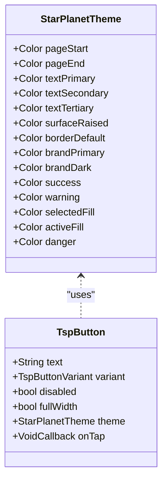

**Diagram sources**
- [flutter/library/lib/tech_skill_planet_components.dart:3-59](file://flutter/library/lib/tech_skill_planet_components.dart#L3-L59)
- [flutter/library/lib/tech_skill_planet_components.dart:74-123](file://flutter/library/lib/tech_skill_planet_components.dart#L74-L123)

**Section sources**
- [flutter/library/pubspec.yaml:1-22](file://flutter/library/pubspec.yaml#L1-L22)
- [flutter/library/lib/tech_skill_planet_components.dart:3-123](file://flutter/library/lib/tech_skill_planet_components.dart#L3-L123)

### iOS SwiftUI
- Implementation model: SwiftUI views with enums for variants; theme passed as a struct with colors.
- Example: TspButton computes face and text colors based on variant and theme; renders a capsule-styled button with a raised shadow effect.
- Build and distribution: Swift Package Manager package with minimum platform versions.
- Integration: Import the package and use views in SwiftUI; pass a theme instance.

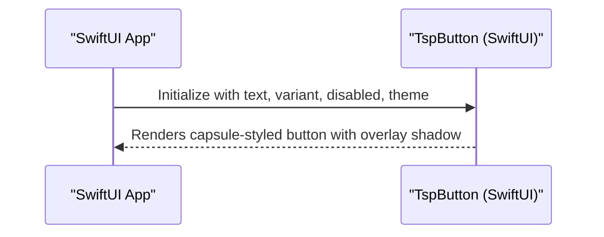

**Diagram sources**
- [ios-swiftui/library/Sources/TechSkillPlanetBasicControls/BasicControls.swift:6-51](file://ios-swiftui/library/Sources/TechSkillPlanetBasicControls/BasicControls.swift#L6-L51)

**Section sources**
- [ios-swiftui/library/Package.swift:1-14](file://ios-swiftui/library/Package.swift#L1-L14)
- [ios-swiftui/library/Sources/TechSkillPlanetBasicControls/BasicControls.swift:6-51](file://ios-swiftui/library/Sources/TechSkillPlanetBasicControls/BasicControls.swift#L6-L51)

### WeChat Mini Program
- Implementation model: Mini Program components with properties and events; minimal lifecycle hooks.
- Example: bc-button component exposes text, variant, disabled, theme and triggers a tap event.
- Build and distribution: NPM-style package with miniprogram field pointing to components.
- Integration: Install the package and use components in WXML; ensure theme and i18n assets are included.

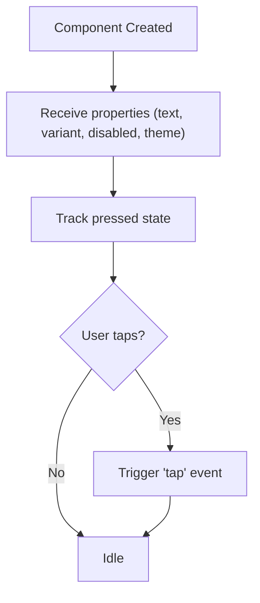

**Diagram sources**
- [miniprogram/library/components/bc-button/bc-button.js:1-22](file://miniprogram/library/components/bc-button/bc-button.js#L1-L22)

**Section sources**
- [miniprogram/library/package.json:1-14](file://miniprogram/library/package.json#L1-L14)
- [miniprogram/library/components/bc-button/bc-button.js:1-22](file://miniprogram/library/components/bc-button/bc-button.js#L1-L22)

### Kuikly
- Implementation model: Multiplatform Kotlin with Compose; platform-specific rendering via Kuikly Compose primitives.
- Example: PhonicsButton composes a clickable box with rounded corners and variant colors; integrates with Kuikly theme.
- Build and distribution: Gradle Kotlin multiplatform with Compose and Kuikly plugins; internal packaging target.
- Integration: Configure the Kuikly Gradle plugin and use composables in shared code.

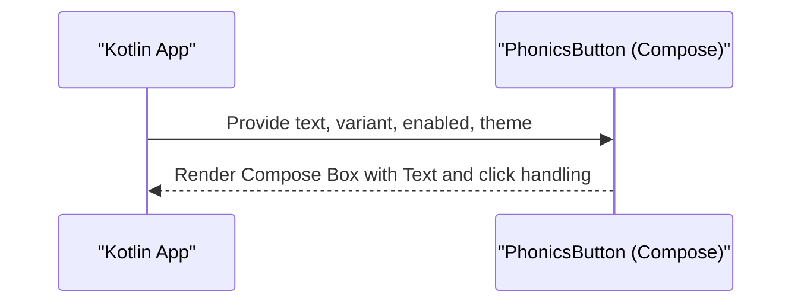

**Diagram sources**
- [kuikly/library/shared/src/commonMain/kotlin/com/techskillplanet/phonics/controls/PhonicsControls.kt:36-65](file://kuikly/library/shared/src/commonMain/kotlin/com/techskillplanet/phonics/controls/PhonicsControls.kt#L36-L65)

**Section sources**
- [kuikly/build.gradle.kts:1-32](file://kuikly/build.gradle.kts#L1-L32)
- [kuikly/library/shared/src/commonMain/kotlin/com/techskillplanet/phonics/controls/PhonicsControls.kt:36-65](file://kuikly/library/shared/src/commonMain/kotlin/com/techskillplanet/phonics/controls/PhonicsControls.kt#L36-L65)

## Dependency Analysis
- Peer dependencies:
  - React Web and Vue Web declare peer dependency on their respective frameworks.
  - React Native declares peer dependencies on React and React Native.
- Theme and styles:
  - React Web and Vue Web expose theme and styles via package exports.
  - Flutter and iOS SwiftUI encapsulate theme in objects/structs.
  - Android View and Kuikly rely on theme managers or theme objects to resolve tokens.
- Packaging:
  - Android View publishes to Maven Central via Gradle.
  - Flutter publishes to pub.dev.
  - React Web, Vue Web, React Native, and WeChat Mini Program publish to NPM.
  - iOS SwiftUI publishes via Swift Package Manager.
  - Kuikly uses internal packaging via Gradle.

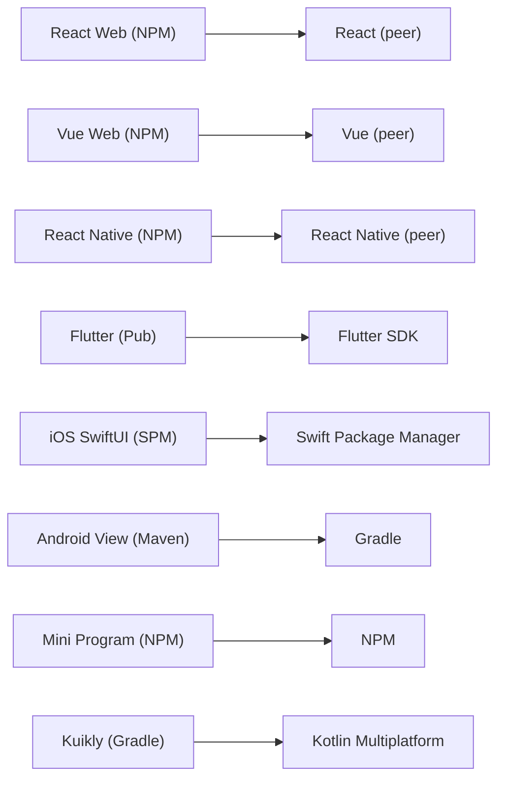

**Diagram sources**
- [react-web/library/package.json:21-23](file://react-web/library/package.json#L21-L23)
- [vue-web/library/package.json:20-22](file://vue-web/library/package.json#L20-L22)
- [react-native/library/package.json:13-16](file://react-native/library/package.json#L13-L16)
- [flutter/library/pubspec.yaml:8-13](file://flutter/library/pubspec.yaml#L8-L13)
- [ios-swiftui/library/Package.swift:4-8](file://ios-swiftui/library/Package.swift#L4-L8)
- [android/library/build.gradle:7-8](file://android/library/build.gradle#L7-L8)
- [miniprogram/library/package.json:4-11](file://miniprogram/library/package.json#L4-L11)
- [kuikly/build.gradle.kts:1-7](file://kuikly/build.gradle.kts#L1-L7)

**Section sources**
- [react-web/library/package.json:1-57](file://react-web/library/package.json#L1-L57)
- [vue-web/library/package.json:1-32](file://vue-web/library/package.json#L1-L32)
- [react-native/library/package.json:1-25](file://react-native/library/package.json#L1-L25)
- [flutter/library/pubspec.yaml:1-22](file://flutter/library/pubspec.yaml#L1-L22)
- [ios-swiftui/library/Package.swift:1-14](file://ios-swiftui/library/Package.swift#L1-L14)
- [android/library/build.gradle:1-98](file://android/library/build.gradle#L1-L98)
- [miniprogram/library/package.json:1-14](file://miniprogram/library/package.json#L1-L14)
- [kuikly/build.gradle.kts:1-32](file://kuikly/build.gradle.kts#L1-L32)

## Performance Considerations
- Rendering cost
  - Android View: Minimize nested layouts; reuse drawables and measure/layout efficiently.
  - React Web/Vue Web: Avoid unnecessary re-renders; memoize components and pass stable theme objects.
  - React Native: Prefer FlatList for lists; avoid heavy transforms; cache computed styles.
  - Flutter: Use const constructors where possible; avoid rebuilding subtrees; leverage Semantics sparingly.
  - iOS SwiftUI: Use @ViewBuilder judiciously; avoid expensive geometry readers; leverage .id() for stable identities.
  - Mini Program: Keep component trees shallow; avoid frequent setData calls; batch updates.
  - Kuikly: Favor lightweight Compose primitives; minimize recompositions; use remember for derived values.
- Memory management
  - Android View: Recycle TypedArray; avoid retaining contexts; clean up listeners.
  - React Web/Vue Web: Unsubscribe from subscriptions; clear timers; avoid closures capturing large objects.
  - React Native: Dispose of native modules; cancel async tasks; clear refs.
  - Flutter: Dispose of streams/subscriptions; avoid retaining large images; use WeakReference patterns where applicable.
  - iOS SwiftUI: Break retain cycles; avoid strong references in closures; dispose of observers.
  - Mini Program: Clear event handlers; avoid global state leaks; manage timers.
  - Kuikly: Dispose of resources in ViewModel; avoid long-lived lambda captures; clear disposables.
- Theming and tokens
  - Resolve theme once per component mount; cache resolved values; avoid deep object churn.
  - Use CSS variables (web) or theme objects (native) consistently to reduce remeasuring and relayouts.

[No sources needed since this section provides general guidance]

## Troubleshooting Guide
- Android View
  - Symptoms: Incorrect sizing or missing shadows.
  - Causes: Mismatched theme tokens or incorrect min/max sizes.
  - Fixes: Verify theme manager resolution and style token values; ensure proper measurement and layout passes.
- React Web
  - Symptoms: Styles not applied or theme variables missing.
  - Causes: Missing theme provider or sideEffects configuration.
  - Fixes: Ensure CSS is imported and sideEffects flag is set; confirm theme exports are loaded.
- React Native
  - Symptoms: Press animations not visible or incorrect colors.
  - Causes: Disabled state not propagated or theme not computed.
  - Fixes: Pass disabled prop; compute theme values before rendering; verify style arrays.
- Vue Web
  - Symptoms: Event not firing or styles inconsistent.
  - Causes: Emitted event name mismatch or missing theme injection.
  - Fixes: Confirm emitted event name matches parent handler; ensure themed helper is used.
- Flutter
  - Symptoms: Colors or shapes incorrect.
  - Causes: Wrong theme variant or missing theme instance.
  - Fixes: Pass correct theme object; verify variant mapping; use const widgets where possible.
- iOS SwiftUI
  - Symptoms: Layout clipping or incorrect colors.
  - Causes: Missing safe area handling or wrong variant mapping.
  - Fixes: Apply safe area insets; verify theme colors; adjust clip shapes.
- WeChat Mini Program
  - Symptoms: Tap events not firing or disabled state ignored.
  - Causes: Missing event binding or incorrect property propagation.
  - Fixes: Bind triggerEvent to handler; ensure disabled property is respected.
- Kuikly
  - Symptoms: Compose recomposition overhead or theme not applied.
  - Causes: Frequent lambda creation or unremembered values.
  - Fixes: Use remember for derived values; avoid passing new lambdas each recomposition.

**Section sources**
- [android/library/src/main/java/com/techskillplanet/basiccontrols/widget/BasicButton.java:196-233](file://android/library/src/main/java/com/techskillplanet/basiccontrols/widget/BasicButton.java#L196-L233)
- [react-web/library/src/components/TspButton.js:29-47](file://react-web/library/src/components/TspButton.js#L29-L47)
- [react-native/library/src/starPlanet/components/TspButton.js:17-42](file://react-native/library/src/starPlanet/components/TspButton.js#L17-L42)
- [vue-web/library/src/components/TspButton.js:14-27](file://vue-web/library/src/components/TspButton.js#L14-L27)
- [flutter/library/lib/tech_skill_planet_components.dart:74-123](file://flutter/library/lib/tech_skill_planet_components.dart#L74-L123)
- [ios-swiftui/library/Sources/TechSkillPlanetBasicControls/BasicControls.swift:22-34](file://ios-swiftui/library/Sources/TechSkillPlanetBasicControls/BasicControls.swift#L22-L34)
- [miniprogram/library/components/bc-button/bc-button.js:9-21](file://miniprogram/library/components/bc-button/bc-button.js#L9-L21)
- [kuikly/library/shared/src/commonMain/kotlin/com/techskillplanet/phonics/controls/PhonicsControls.kt:36-65](file://kuikly/library/shared/src/commonMain/kotlin/com/techskillplanet/phonics/controls/PhonicsControls.kt#L36-L65)

## Conclusion
Planet Components achieves cross-platform consistency by adhering to a shared component contract and an adapter pattern that maps canonical props and variants to platform idioms. Each platform’s library encapsulates theme resolution and rendering specifics, enabling reliable integration and predictable performance. Following the documented setup, configuration, and optimization strategies ensures smooth adoption across Android, web, mobile, and specialized environments.

[No sources needed since this section summarizes without analyzing specific files]

## Appendices
- Setup and configuration quick links
  - Android View: [build.gradle:1-98](file://android/library/build.gradle#L1-L98)
  - React Web: [package.json:1-57](file://react-web/library/package.json#L1-L57)
  - React Native: [package.json:1-25](file://react-native/library/package.json#L1-L25)
  - Vue Web: [package.json:1-32](file://vue-web/library/package.json#L1-L32)
  - Flutter: [pubspec.yaml:1-22](file://flutter/library/pubspec.yaml#L1-L22)
  - iOS SwiftUI: [Package.swift:1-14](file://ios-swiftui/library/Package.swift#L1-L14)
  - WeChat Mini Program: [package.json:1-14](file://miniprogram/library/package.json#L1-L14)
  - Kuikly: [build.gradle.kts:1-32](file://kuikly/build.gradle.kts#L1-L32)
- Component contract reference
  - [COMPONENT_CONTRACT.md:26-56](file://docs/COMPONENT_CONTRACT.md#L26-L56)

[No sources needed since this section aggregates previously cited references]