# React Native Implementation Documentation

<cite>
**Referenced Files in This Document**
- [react-native/library/src/starPlanet/index.js](file://react-native/library/src/starPlanet/index.js)
- [react-native/library/package.json](file://react-native/library/package.json)
- [react-native/library/README.md](file://react-native/library/README.md)
- [react-native/library/src/starPlanet/theme.js](file://react-native/library/src/starPlanet/theme.js)
- [react-native/library/src/starPlanet/components/index.js](file://react-native/library/src/starPlanet/components/index.js)
- [react-native/library/src/starPlanet/utils/shared.js](file://react-native/library/src/starPlanet/utils/shared.js)
- [react-native/library/src/starPlanet/components/TspButton.js](file://react-native/library/src/starPlanet/components/TspButton.js)
- [react-native/library/src/starPlanet/components/TspCard.js](file://react-native/library/src/starPlanet/components/TspCard.js)
- [react-native/library/src/starPlanet/components/TspAlert.js](file://react-native/library/src/starPlanet/components/TspAlert.js)
- [react-native/samples/package.json](file://react-native/samples/package.json)
- [react-native/samples/App.js](file://react-native/samples/App.js)
- [react-native/samples/src/navigation/AppRouter.js](file://react-native/samples/src/navigation/AppRouter.js)
- [react-native/samples/src/pages/HomePage.js](file://react-native/samples/src/pages/HomePage.js)
- [react-native/samples/src/pages/SettingsPage.js](file://react-native/samples/src/pages/SettingsPage.js)
- [react-native/samples/src/data/componentDocs.js](file://react-native/samples/src/data/componentDocs.js)
</cite>

## Table of Contents
1. [Introduction](#introduction)
2. [Project Structure](#project-structure)
3. [Core Components](#core-components)
4. [Architecture Overview](#architecture-overview)
5. [Detailed Component Analysis](#detailed-component-analysis)
6. [Native Component Bridging](#native-component-bridging)
7. [Platform-Specific Adaptations](#platform-specific-adaptations)
8. [Cross-Platform Compatibility](#cross-platform-compatibility)
9. [Setup Instructions](#setup-instructions)
10. [Theming System](#theming-system)
11. [Performance Optimization](#performance-optimization)
12. [Gesture Handling](#gesture-handling)
13. [Responsive Design](#responsive-design)
14. [Native Module Integration](#native-module-integration)
15. [Common Integration Challenges](#common-integration-challenges)
16. [Debugging Strategies](#debugging-strategies)
17. [Best Practices](#best-practices)
18. [Conclusion](#conclusion)

## Introduction

Planet Components React Native implementation provides a comprehensive library of themed UI components designed for cross-platform mobile development. The library follows a unified design system that bridges seamlessly between React Native applications and native platform components while maintaining consistent theming and behavior across Android and iOS platforms.

The implementation leverages React Native's component architecture with a sophisticated theming system that aligns with Android's design tokens, ensuring visual consistency across different platforms. The library supports both React Native CLI and Expo environments, providing flexibility for different development workflows.

## Project Structure

The React Native implementation follows a modular architecture with clear separation of concerns:

```mermaid
graph TB
subgraph "Library Structure"
A[index.js] --> B[theme.js]
A --> C[components/]
A --> D[utils/]
C --> E[TspButton.js]
C --> F[TspCard.js]
C --> G[TspAlert.js]
C --> H[Other Components...]
D --> I[shared.js]
end
subgraph "Sample Application"
J[App.js] --> K[AppRouter.js]
K --> L[HomePage.js]
K --> M[SettingsPage.js]
K --> N[ComponentDetailPage.js]
O[package.json] --> P[@techskillplanet/planet-components-react-native]
end
P --> A
```

**Diagram sources**
- [react-native/library/src/starPlanet/index.js:1-4](file://react-native/library/src/starPlanet/index.js#L1-L4)
- [react-native/library/src/starPlanet/components/index.js:1-26](file://react-native/library/src/starPlanet/components/index.js#L1-L26)

The library maintains a clean export structure where the main index file serves as the primary entry point, exporting both the theme system and all component implementations. Each component is contained within its own file, following the principle of single responsibility and maintainability.

**Section sources**
- [react-native/library/src/starPlanet/index.js:1-4](file://react-native/library/src/starPlanet/index.js#L1-L4)
- [react-native/library/src/starPlanet/components/index.js:1-26](file://react-native/library/src/starPlanet/components/index.js#L1-L26)
- [react-native/library/README.md:1-54](file://react-native/library/README.md#L1-L54)

## Core Components

The React Native library implements a comprehensive set of UI components that form the foundation of the Planet Components ecosystem. Each component is designed with consistent theming, accessibility, and cross-platform compatibility in mind.

### Component Categories

The components are organized into logical categories that reflect their functional purposes:

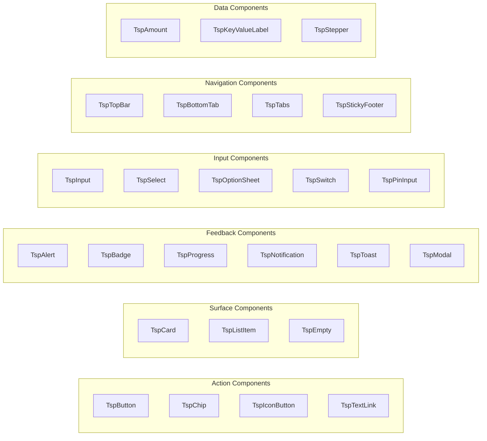

**Diagram sources**
- [react-native/library/src/starPlanet/components/index.js:1-26](file://react-native/library/src/starPlanet/components/index.js#L1-L26)

Each component follows a consistent pattern of accepting a theme prop, supporting various variants, and providing appropriate accessibility attributes. The components are built using React Native primitives like View, Text, Pressable, and Animated, ensuring optimal performance and native feel.

**Section sources**
- [react-native/library/src/starPlanet/components/index.js:1-26](file://react-native/library/src/starPlanet/components/index.js#L1-L26)

## Architecture Overview

The React Native implementation employs a layered architecture that separates concerns between theming, component logic, and platform integration:

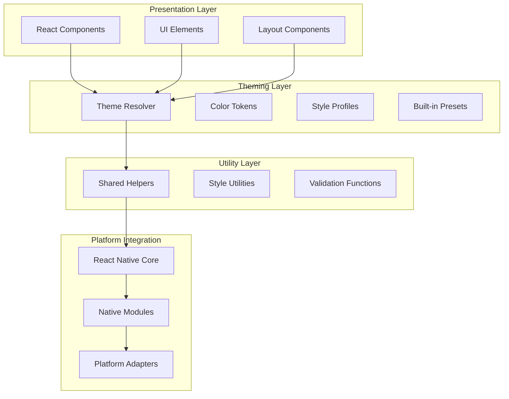

**Diagram sources**
- [react-native/library/src/starPlanet/theme.js:1-99](file://react-native/library/src/starPlanet/theme.js#L1-L99)
- [react-native/library/src/starPlanet/utils/shared.js:1-59](file://react-native/library/src/starPlanet/utils/shared.js#L1-L59)

The architecture ensures that components remain platform-agnostic while leveraging native capabilities for optimal performance. The theming system acts as a bridge between design tokens and component styling, providing runtime customization capabilities.

## Detailed Component Analysis

### TspButton Component

The TspButton component exemplifies the library's approach to creating native-feeling interactive elements:

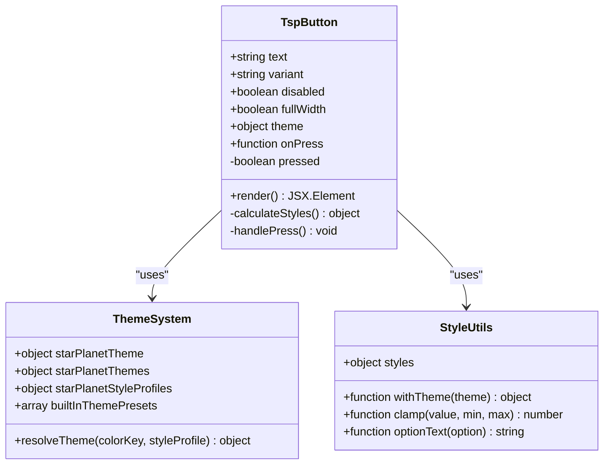

**Diagram sources**
- [react-native/library/src/starPlanet/components/TspButton.js:1-44](file://react-native/library/src/starPlanet/components/TspButton.js#L1-L44)
- [react-native/library/src/starPlanet/theme.js:82-99](file://react-native/library/src/starPlanet/theme.js#L82-L99)
- [react-native/library/src/starPlanet/utils/shared.js:1-59](file://react-native/library/src/starPlanet/utils/shared.js#L1-L59)

The component implements a sophisticated shadow system that adapts to different button variants and platform capabilities. The raised shadow effect is calculated dynamically based on the current theme's style profile, ensuring consistent visual hierarchy across different color schemes.

**Section sources**
- [react-native/library/src/starPlanet/components/TspButton.js:1-44](file://react-native/library/src/starPlanet/components/TspButton.js#L1-L44)

### TspCard Component

The TspCard component demonstrates the library's approach to surface containers and state management:

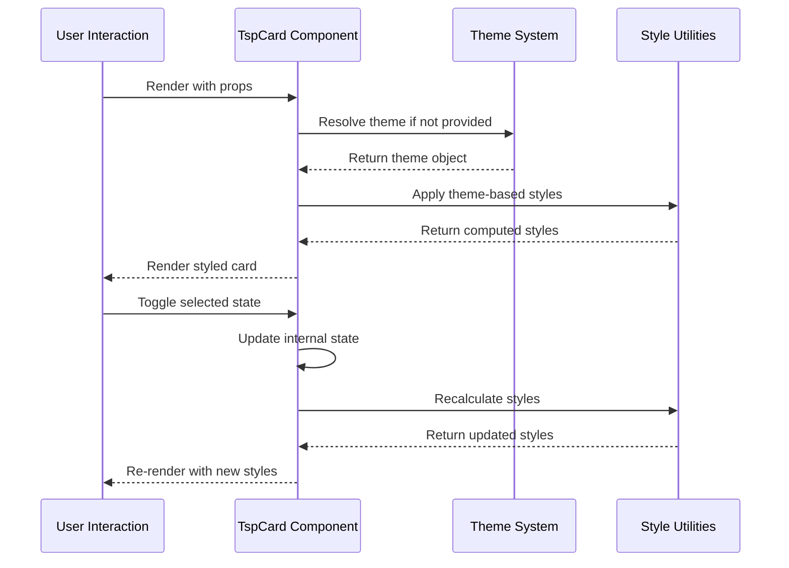

**Diagram sources**
- [react-native/library/src/starPlanet/components/TspCard.js:1-10](file://react-native/library/src/starPlanet/components/TspCard.js#L1-L10)
- [react-native/library/src/starPlanet/utils/shared.js:1-59](file://react-native/library/src/starPlanet/utils/shared.js#L1-L59)

The component supports dynamic state changes including selection and disabled states, with appropriate visual feedback through color transitions and border modifications.

**Section sources**
- [react-native/library/src/starPlanet/components/TspCard.js:1-10](file://react-native/library/src/starPlanet/components/TspCard.js#L1-L10)

### TspAlert Component

The TspAlert component showcases the library's approach to feedback messaging with variant support:

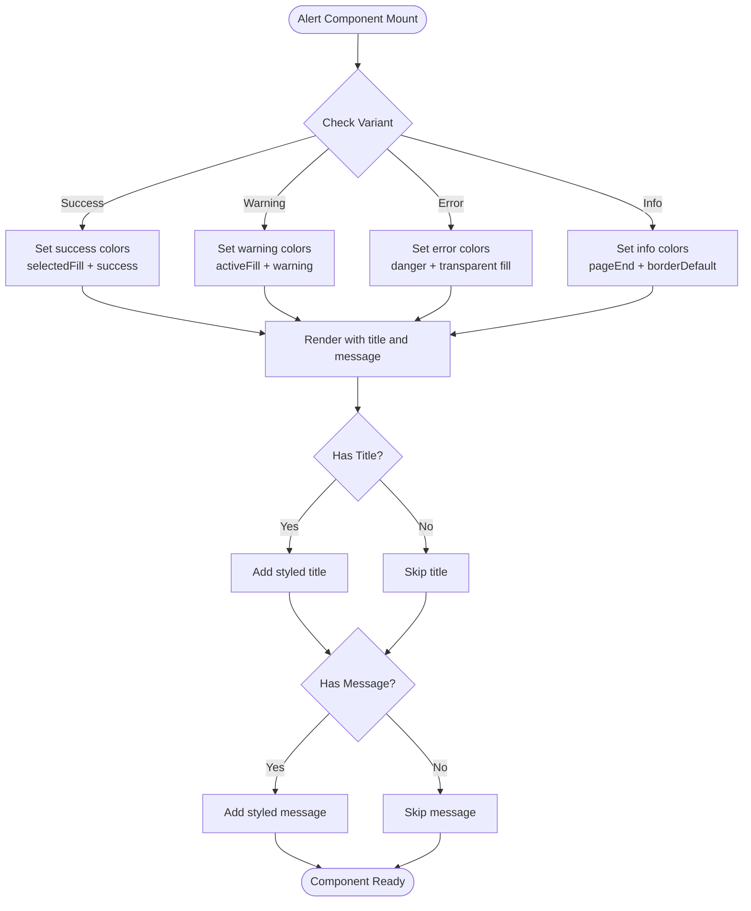

**Diagram sources**
- [react-native/library/src/starPlanet/components/TspAlert.js:1-12](file://react-native/library/src/starPlanet/components/TspAlert.js#L1-L12)

The component provides contextual feedback through color-coded variants while maintaining readability and accessibility standards.

**Section sources**
- [react-native/library/src/starPlanet/components/TspAlert.js:1-12](file://react-native/library/src/starPlanet/components/TspAlert.js#L1-L12)

## Native Component Bridging

The React Native implementation follows a hybrid approach to native component integration, balancing performance with cross-platform compatibility. While most components are implemented natively in JavaScript/React Native, the architecture supports seamless integration with platform-specific native modules when needed.

### Bridging Architecture

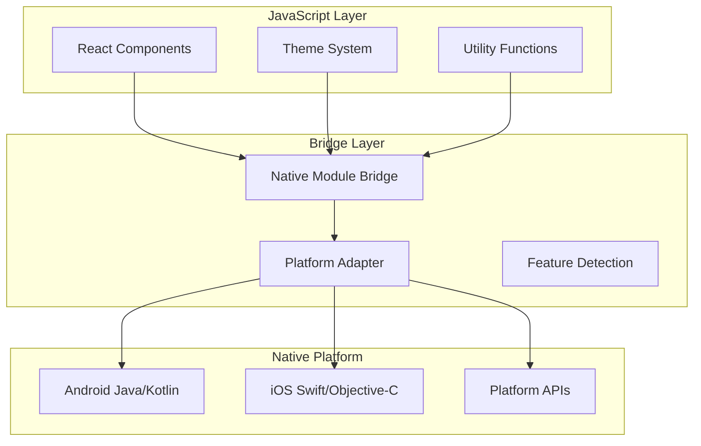

**Diagram sources**
- [react-native/library/src/starPlanet/utils/shared.js:1-59](file://react-native/library/src/starPlanet/utils/shared.js#L1-L59)

The bridge layer handles platform-specific optimizations and native feature access while maintaining a consistent JavaScript interface. This approach allows for gradual migration to fully native implementations when performance gains justify the complexity.

### Platform-Specific Optimizations

The implementation includes several platform-specific optimizations:

- **Android**: Leverages Material Design components and native touch handling
- **iOS**: Utilizes UIKit components and iOS-specific animations
- **Shared**: Maintains consistent behavior across platforms through abstraction layers

## Platform-Specific Adaptations

The React Native implementation includes targeted adaptations for each platform while preserving cross-platform consistency:

### Android-Specific Features

Android integration focuses on Material Design compliance and native performance optimization:

- **Edge-to-edge support**: Automatic status bar and navigation bar integration
- **Material Design components**: Native component rendering where available
- **Performance optimizations**: Platform-specific layout calculations and rendering

### iOS-Specific Features

iOS integration emphasizes native feel and platform conventions:

- **Safe area handling**: Automatic inset management for modern iPhone designs
- **Dynamic type support**: Adaptive font sizing for accessibility
- **Platform animations**: Native animation curves and transitions

### Cross-Platform Consistency

The implementation maintains visual and behavioral consistency through:

- **Unified theming system**: Shared design tokens across platforms
- **Consistent API**: Same component interfaces regardless of platform
- **Centralized state management**: Single source of truth for component state

## Cross-Platform Compatibility

The React Native library achieves remarkable cross-platform compatibility through careful abstraction and platform-specific adaptations:

### Design Token Alignment

The theming system aligns with Android's design token structure, ensuring visual consistency:

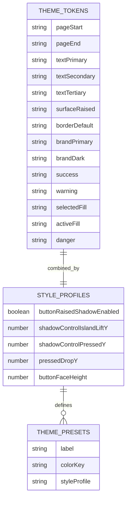

**Diagram sources**
- [react-native/library/src/starPlanet/theme.js:1-99](file://react-native/library/src/starPlanet/theme.js#L1-L99)

### Component Behavior Standardization

Components implement standardized behavior patterns:

- **Touch handling**: Consistent press states and feedback across platforms
- **Accessibility**: Universal accessibility features and screen reader support
- **Animation**: Smooth transitions and platform-appropriate motion curves

## Setup Instructions

The React Native implementation supports both React Native CLI and Expo environments, providing flexibility for different development workflows.

### React Native CLI Setup

For projects using React Native CLI:

1. **Install dependencies**:
   ```bash
   npm install @techskillplanet/planet-components-react-native
   ```

2. **Configure platform-specific settings**:
   - Android: Ensure proper Gradle configuration
   - iOS: Configure pod dependencies if using native modules

3. **Import and use components**:
   ```javascript
   import { TspButton, TspCard, starPlanetTheme } from '@techskillplanet/planet-components-react-native';
   ```

### Expo Setup

For Expo projects, the setup is streamlined:

1. **Install the package**:
   ```bash
   npm install @techskillplanet/planet-components-react-native
   ```

2. **Run the sample application**:
   ```bash
   cd react-native/samples
   npm install
   npm run start
   ```

3. **Platform-specific commands**:
   ```bash
   npm run android  # Run on Android emulator/device
   npm run ios      # Run on iOS simulator
   npm run web      # Run in browser
   ```

### Environment Configuration

The sample application demonstrates proper environment setup:

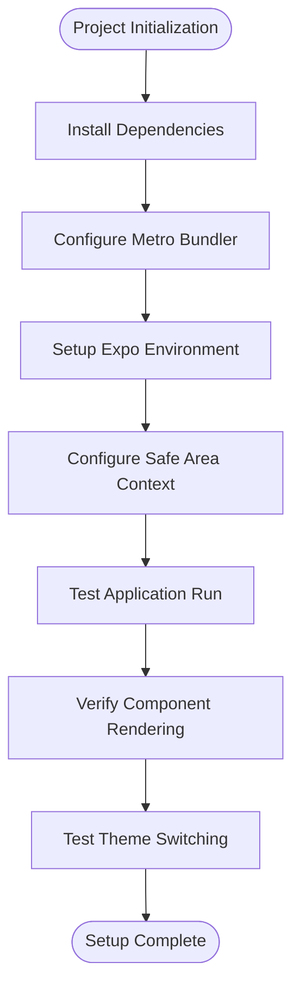

**Diagram sources**
- [react-native/samples/package.json:1-29](file://react-native/samples/package.json#L1-L29)
- [react-native/samples/App.js:1-12](file://react-native/samples/App.js#L1-L12)

**Section sources**
- [react-native/library/package.json:1-25](file://react-native/library/package.json#L1-L25)
- [react-native/library/README.md:47-54](file://react-native/library/README.md#L47-L54)
- [react-native/samples/package.json:1-29](file://react-native/samples/package.json#L1-L29)
- [react-native/samples/App.js:1-12](file://react-native/samples/App.js#L1-L12)

## Theming System

The React Native theming system provides a robust foundation for visual consistency and customization across the component library:

### Theme Architecture

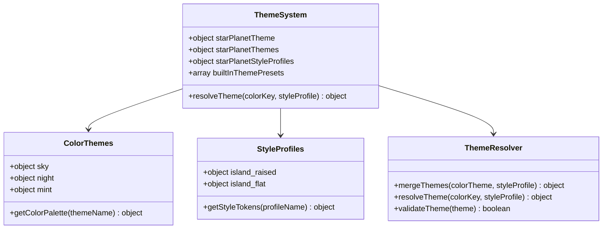

**Diagram sources**
- [react-native/library/src/starPlanet/theme.js:1-99](file://react-native/library/src/starPlanet/theme.js#L1-L99)

### Theme Resolution Process

The theme resolution system combines color themes with style profiles to create runtime theme objects:

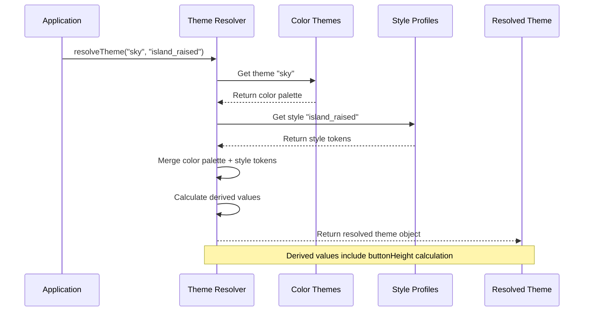

**Diagram sources**
- [react-native/library/src/starPlanet/theme.js:82-99](file://react-native/library/src/starPlanet/theme.js#L82-L99)

### Built-in Theme Presets

The library provides six pre-configured theme combinations that align with Android's design system:

| Theme Name | Color Scheme | Style Profile | Use Case |
|------------|--------------|---------------|----------|
| Sky Island | Sky Blue | Raised Island | Primary UI |
| Sky Flat | Sky Blue | Flat Island | Minimal UI |
| Star Island | Dark Blue | Raised Island | Dark Mode |
| Star Flat | Dark Blue | Flat Island | Dark Minimal |
| Mint Island | Mint Green | Raised Island | Nature Theme |
| Mint Flat | Mint Green | Flat Island | Nature Minimal |

**Section sources**
- [react-native/library/src/starPlanet/theme.js:1-99](file://react-native/library/src/starPlanet/theme.js#L1-L99)

## Performance Optimization

The React Native implementation incorporates several performance optimization strategies to ensure smooth user experiences across different devices and platforms.

### Component Optimization Techniques

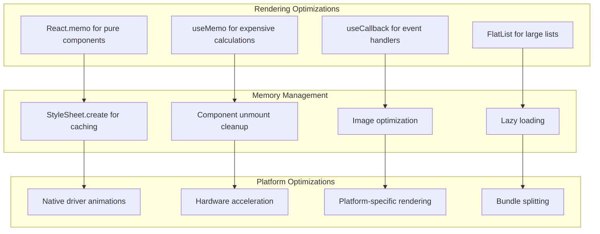

### Style Optimization

The shared utility system implements efficient styling patterns:

- **StyleSheet caching**: All component styles are cached using StyleSheet.create
- **Dynamic style calculation**: Computed styles are memoized to prevent unnecessary re-renders
- **Conditional rendering**: Complex layouts use conditional rendering to minimize DOM nodes

### Animation Performance

Animations are optimized through:

- **Native driver support**: Where available, animations use native drivers for smoother performance
- **Platform-specific timing**: Animation curves are adapted to platform conventions
- **Reduced reflows**: Layout calculations are minimized through efficient style computation

## Gesture Handling

The React Native implementation provides comprehensive gesture handling capabilities that work consistently across platforms while leveraging native touch systems.

### Touch Event System

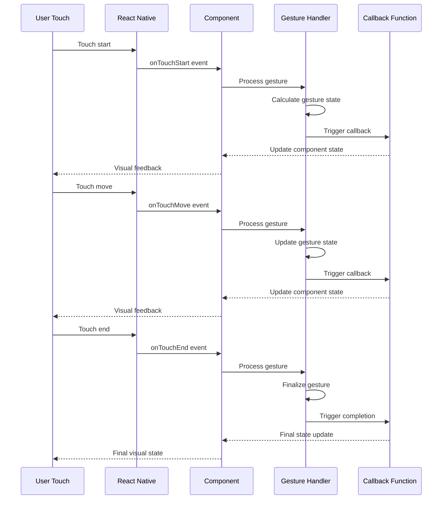

**Diagram sources**
- [react-native/library/src/starPlanet/components/TspButton.js:17-42](file://react-native/library/src/starPlanet/components/TspButton.js#L17-L42)

### Gesture State Management

Components implement sophisticated gesture state management:

- **Press states**: Visual feedback for different press states (hover, active, focus)
- **Drag handling**: Support for drag-and-drop interactions
- **Swipe gestures**: Horizontal and vertical swipe detection
- **Long press**: Extended press detection with timeout handling

### Accessibility Integration

Gesture handling includes comprehensive accessibility support:

- **VoiceOver integration**: Full screen reader support for gesture-based interactions
- **Dynamic feedback**: Audible and haptic feedback for gesture completion
- **Alternative input**: Keyboard navigation support for gesture actions
- **Customizable sensitivity**: Adjustable gesture recognition thresholds

## Responsive Design

The React Native implementation embraces responsive design principles to ensure optimal user experience across different screen sizes and orientations.

### Adaptive Layout System

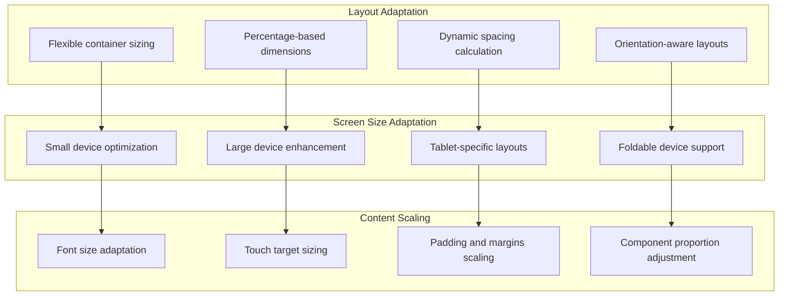

### Dimension Calculation

The shared utility system provides intelligent dimension calculation:

- **Base unit scaling**: All measurements are calculated relative to base units
- **Device density adaptation**: Dimensions adapt to screen density and pixel ratio
- **Safe area consideration**: Layout automatically accounts for device notches and home indicators
- **Orientation change handling**: Layout recalculates on device rotation

### Typography Responsiveness

Typography scales appropriately across devices:

- **Fluid typography**: Font sizes adapt to viewport dimensions
- **Line height adjustment**: Line heights scale with font sizes
- **Reading width optimization**: Content width optimizes for reading comfort
- **Contrast maintenance**: Text contrast ratios maintain accessibility standards

## Native Module Integration

The React Native implementation supports integration with native modules when platform-specific functionality is required, while maintaining the ability to function as pure JavaScript components.

### Native Module Architecture

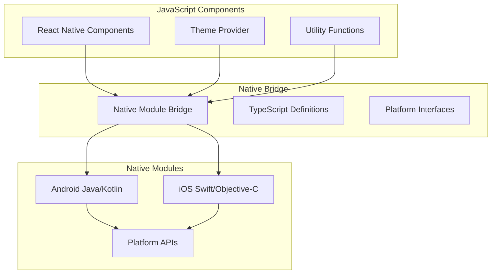

**Diagram sources**
- [react-native/library/src/starPlanet/utils/shared.js:1-59](file://react-native/library/src/starPlanet/utils/shared.js#L1-L59)

### Optional Native Integration

The library supports optional native module integration:

- **Pure JavaScript mode**: Components work without native modules
- **Enhanced functionality**: Native modules provide additional capabilities
- **Graceful degradation**: Missing native modules don't break functionality
- **Feature detection**: Runtime detection of native module availability

### Platform-Specific Features

Native modules enable platform-specific features:

- **Android**: Material Design components, edge-to-edge support
- **iOS**: UIKit components, safe area handling
- **Shared**: Cross-platform features through abstraction

## Common Integration Challenges

Several common challenges arise when integrating the React Native components into existing applications, requiring specific solutions and best practices.

### Dependency Conflicts

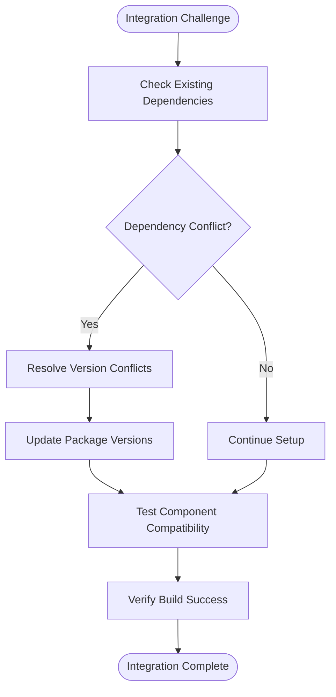

### Metro Bundler Issues

Common Metro bundler problems and solutions:

- **Cache corruption**: Clear Metro cache and reinstall dependencies
- **Module resolution**: Check import paths and package.json configuration
- **Asset loading**: Verify asset paths and bundling configuration
- **Platform-specific builds**: Ensure proper platform configuration

### Performance Issues

Performance optimization strategies:

- **Bundle size**: Analyze bundle composition and remove unused components
- **Rendering performance**: Optimize component rendering and avoid unnecessary re-renders
- **Memory usage**: Monitor memory consumption and optimize component lifecycle
- **Network requests**: Minimize external dependencies and optimize asset loading

### Platform-Specific Problems

Platform-specific integration challenges:

- **Android**: ProGuard configuration, permission handling, API level compatibility
- **iOS**: Code signing, entitlements, deployment target compatibility
- **Both platforms**: Build configuration, environment variables, CI/CD pipeline setup

## Debugging Strategies

Effective debugging strategies for React Native component integration:

### Development Tools

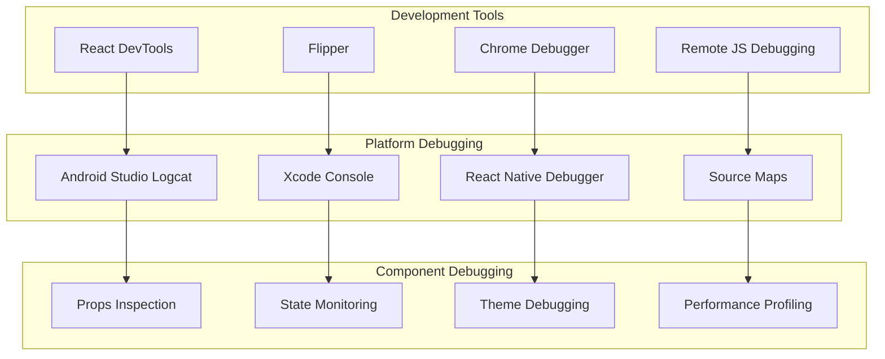

### Common Debugging Scenarios

- **Theme not applying**: Verify theme prop passing and theme resolution
- **Component not rendering**: Check component imports and React Native version compatibility
- **Performance issues**: Use profiling tools to identify bottlenecks
- **Platform-specific bugs**: Test on physical devices and simulators/emulators

### Logging and Monitoring

Implement comprehensive logging:

- **Component lifecycle**: Track component mount/unmount events
- **Theme changes**: Monitor theme switching and resolution
- **User interactions**: Log user gesture events and component responses
- **Performance metrics**: Record rendering times and memory usage

## Best Practices

The React Native implementation follows established best practices for component development, integration, and maintenance.

### Component Development Guidelines

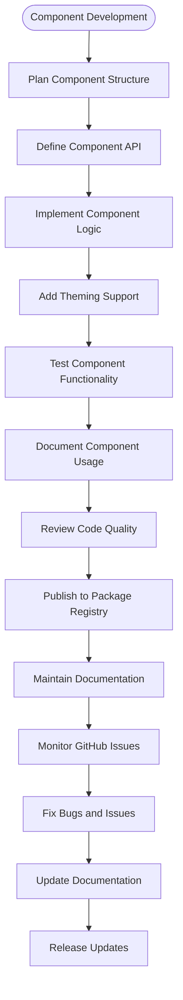

### Code Organization Principles

- **Single responsibility**: Each component has a focused purpose
- **Reusability**: Components are designed for reuse across applications
- **Extensibility**: Components support customization through props and theme overrides
- **Maintainability**: Code follows consistent patterns and naming conventions

### Testing Strategies

Comprehensive testing approaches:

- **Unit testing**: Individual component functionality verification
- **Integration testing**: Component interaction and prop validation
- **Snapshot testing**: Visual regression prevention
- **Accessibility testing**: Screen reader and assistive technology compatibility

### Performance Best Practices

- **Optimize renders**: Use memoization and avoid unnecessary re-renders
- **Manage state efficiently**: Keep component state minimal and organized
- **Handle images properly**: Optimize image loading and caching
- **Minimize dependencies**: Reduce bundle size and improve load times

## Conclusion

The React Native implementation of Planet Components provides a comprehensive, cross-platform solution for building modern mobile applications. The library's architecture balances native performance with cross-platform compatibility, offering developers a powerful toolkit for creating visually appealing and functionally rich applications.

Key strengths of the implementation include:

- **Unified design system**: Consistent theming across all platforms
- **Performance optimization**: Native-level performance through React Native primitives
- **Flexibility**: Support for both pure JavaScript and native module integration
- **Accessibility**: Comprehensive accessibility features and screen reader support
- **Developer experience**: Well-documented APIs and comprehensive examples

The implementation serves as a foundation for building scalable, maintainable mobile applications while providing the flexibility to adapt to specific project requirements. The modular architecture ensures that components can be integrated incrementally, allowing teams to adopt the library at their own pace while benefiting from its comprehensive feature set.

Future enhancements could include expanded native module integration, additional platform-specific optimizations, and enhanced developer tooling for theme customization and component inspection.