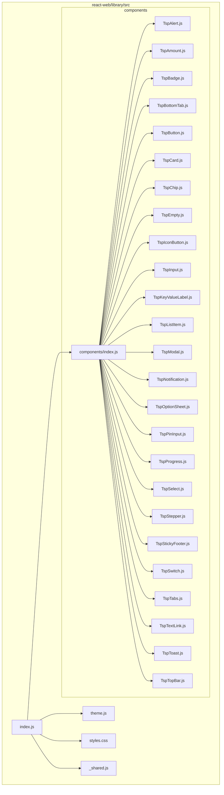
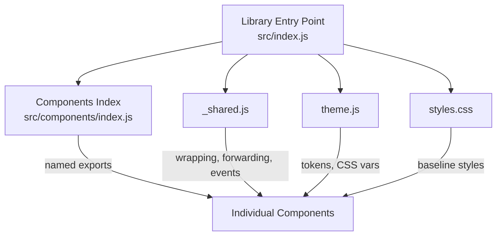
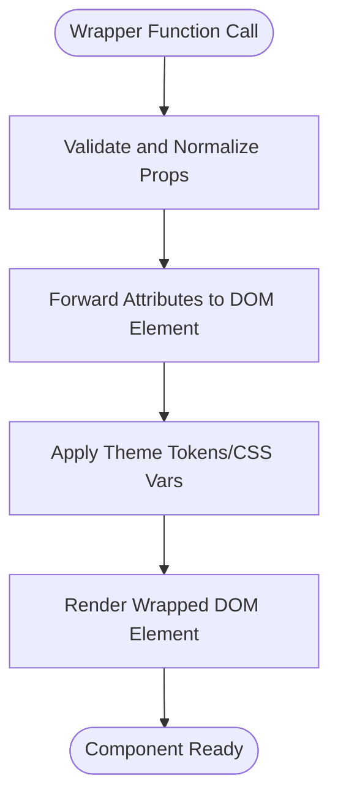
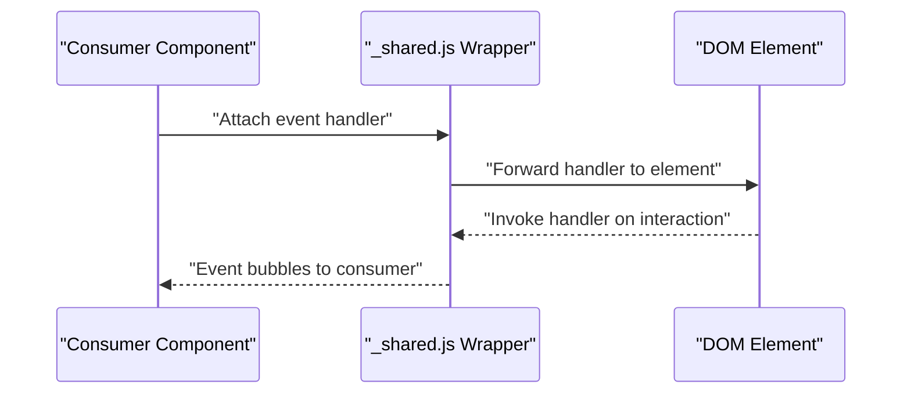
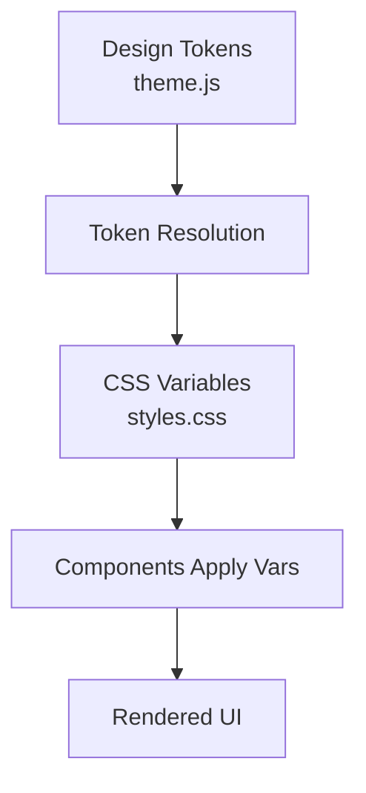
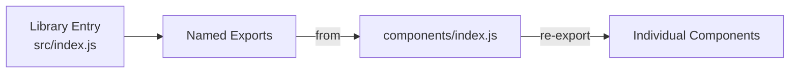
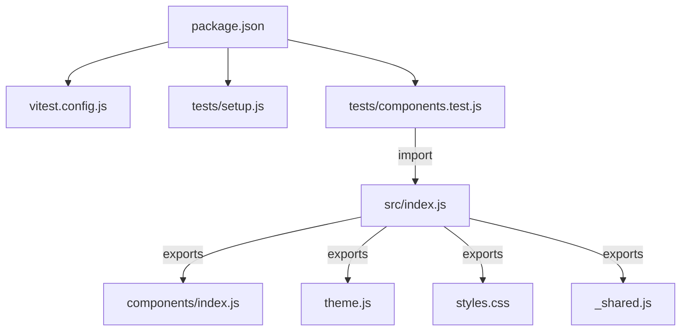

# React Web

<cite>
**Referenced Files in This Document**
- [react-web/library/src/components/index.js](file://react-web/library/src/components/index.js)
- [react-web/library/src/components/_shared.js](file://react-web/library/src/components/_shared.js)
- [react-web/library/src/theme.js](file://react-web/library/src/theme.js)
- [react-web/library/src/styles.css](file://react-web/library/src/styles.css)
- [react-web/library/src/index.js](file://react-web/library/src/index.js)
- [react-web/library/package.json](file://react-web/library/package.json)
- [react-web/library/vitest.config.js](file://react-web/library/vitest.config.js)
- [react-web/library/tests/setup.js](file://react-web/library/tests/setup.js)
- [react-web/library/tests/components.test.js](file://react-web/library/tests/components.test.js)
- [react-web/samples/BasicControlsSample.js](file://react-web/samples/BasicControlsSample.js)
- [react-web/samples/index.html](file://react-web/samples/index.html)
- [docs/COMPONENT_CONTRACT.md](file://docs/COMPONENT_CONTRACT.md)
- [docs/PLATFORM_STRUCTURE.md](file://docs/PLATFORM_STRUCTURE.md)
</cite>

## Table of Contents
1. [Introduction](#introduction)
2. [Project Structure](#project-structure)
3. [Core Components](#core-components)
4. [Architecture Overview](#architecture-overview)
5. [Detailed Component Analysis](#detailed-component-analysis)
6. [Dependency Analysis](#dependency-analysis)
7. [Performance Considerations](#performance-considerations)
8. [Troubleshooting Guide](#troubleshooting-guide)
9. [Conclusion](#conclusion)
10. [Appendices](#appendices)

## Introduction
This document describes the React Web implementation of Planet Components. It explains the component architecture, ES module exports, theme integration patterns, and how components are composed and styled. It also covers setup for npm/yarn, testing with Vitest, and practical guidance for integrating Planet Components into a React application.

## Project Structure
The React Web library is organized around a small set of reusable UI components, a shared wrapper utility, a theme module, global styles, and a single export entry point. Tests and samples demonstrate usage and verification.

**Diagram sources**
- [react-web/library/src/index.js](file://react-web/library/src/index.js)
- [react-web/library/src/components/index.js](file://react-web/library/src/components/index.js)
- [react-web/library/src/theme.js](file://react-web/library/src/theme.js)
- [react-web/library/src/styles.css](file://react-web/library/src/styles.css)
- [react-web/library/src/components/_shared.js](file://react-web/library/src/components/_shared.js)

**Section sources**
- [react-web/library/src/index.js](file://react-web/library/src/index.js)
- [react-web/library/src/components/index.js](file://react-web/library/src/components/index.js)
- [react-web/library/src/theme.js](file://react-web/library/src/theme.js)
- [react-web/library/src/styles.css](file://react-web/library/src/styles.css)
- [react-web/library/src/components/_shared.js](file://react-web/library/src/components/_shared.js)

## Core Components
- Component exports: The components are exported via a centralized index that aggregates individual component modules. Consumers import from the library’s main entry point and receive named exports for each component.
- Shared wrapper: A shared utility provides a consistent pattern for wrapping native DOM elements, forwarding props, and handling events. This ensures uniform behavior across components.
- Theme integration: A theme module exposes tokens and helpers to resolve design tokens into CSS variables and apply them consistently across components.
- Global styles: A global stylesheet defines baseline styles and CSS custom properties used by components.

Key implementation anchors:
- Component index export: [react-web/library/src/components/index.js](file://react-web/library/src/components/index.js)
- Shared wrapper utility: [react-web/library/src/components/_shared.js](file://react-web/library/src/components/_shared.js)
- Theme module: [react-web/library/src/theme.js](file://react-web/library/src/theme.js)
- Global styles: [react-web/library/src/styles.css](file://react-web/library/src/styles.css)
- Library entry point: [react-web/library/src/index.js](file://react-web/library/src/index.js)

**Section sources**
- [react-web/library/src/components/index.js](file://react-web/library/src/components/index.js)
- [react-web/library/src/components/_shared.js](file://react-web/library/src/components/_shared.js)
- [react-web/library/src/theme.js](file://react-web/library/src/theme.js)
- [react-web/library/src/styles.css](file://react-web/library/src/styles.css)
- [react-web/library/src/index.js](file://react-web/library/src/index.js)

## Architecture Overview
The React Web library follows a modular architecture:
- Single entry point exports components, theme, and shared utilities.
- Each component is self-contained with its own module and is re-exported via the components index.
- A shared wrapper utility centralizes DOM wrapping, prop forwarding, and event handling.
- Theme and styles are decoupled from components to enable easy customization and dynamic switching.

**Diagram sources**
- [react-web/library/src/index.js](file://react-web/library/src/index.js)
- [react-web/library/src/components/index.js](file://react-web/library/src/components/index.js)
- [react-web/library/src/components/_shared.js](file://react-web/library/src/components/_shared.js)
- [react-web/library/src/theme.js](file://react-web/library/src/theme.js)
- [react-web/library/src/styles.css](file://react-web/library/src/styles.css)

## Detailed Component Analysis

### Component Wrapper Approach and Prop Forwarding
- Purpose: Provide a consistent DOM element wrapper for components, ensuring predictable styling and behavior.
- Responsibilities:
  - Wrap native HTML elements with a consistent shape.
  - Forward props to the underlying element.
  - Normalize event handlers and attributes.
- Implementation anchor: [react-web/library/src/components/_shared.js](file://react-web/library/src/components/_shared.js)

**Diagram sources**
- [react-web/library/src/components/_shared.js](file://react-web/library/src/components/_shared.js)

**Section sources**
- [react-web/library/src/components/_shared.js](file://react-web/library/src/components/_shared.js)

### Event Handling Mechanisms
- Pattern: Events are forwarded through the wrapper to the underlying DOM element, preserving React event semantics.
- Benefits: Enables consumers to attach handlers without worrying about internal DOM structure.
- Implementation anchor: [react-web/library/src/components/_shared.js](file://react-web/library/src/components/_shared.js)

**Diagram sources**
- [react-web/library/src/components/_shared.js](file://react-web/library/src/components/_shared.js)

**Section sources**
- [react-web/library/src/components/_shared.js](file://react-web/library/src/components/_shared.js)

### Theming System Implementation
- Tokens: Design tokens (colors, typography, spacing) are exposed via the theme module.
- Resolution: Tokens are resolved into CSS variables and applied to components.
- Dynamic switching: Consumers can switch themes by updating CSS variables or applying alternate class roots.
- Implementation anchors:
  - Theme module: [react-web/library/src/theme.js](file://react-web/library/src/theme.js)
  - Global styles: [react-web/library/src/styles.css](file://react-web/library/src/styles.css)

**Diagram sources**
- [react-web/library/src/theme.js](file://react-web/library/src/theme.js)
- [react-web/library/src/styles.css](file://react-web/library/src/styles.css)

**Section sources**
- [react-web/library/src/theme.js](file://react-web/library/src/theme.js)
- [react-web/library/src/styles.css](file://react-web/library/src/styles.css)

### Component Composition Patterns
- Composition: Components are composed from smaller building blocks and wrappers.
- Export strategy: Each component is individually exportable from the components index, enabling tree-shaking and selective imports.
- Implementation anchors:
  - Components index: [react-web/library/src/components/index.js](file://react-web/library/src/components/index.js)
  - Library entry point: [react-web/library/src/index.js](file://react-web/library/src/index.js)

**Diagram sources**
- [react-web/library/src/index.js](file://react-web/library/src/index.js)
- [react-web/library/src/components/index.js](file://react-web/library/src/components/index.js)

**Section sources**
- [react-web/library/src/index.js](file://react-web/library/src/index.js)
- [react-web/library/src/components/index.js](file://react-web/library/src/components/index.js)

### Example Component: Button
- Behavior: Demonstrates wrapper usage, prop forwarding, and event handling.
- Reference: [react-web/library/src/components/TspButton.js](file://react-web/library/src/components/TspButton.js)
- Notes: See the shared wrapper for consistent DOM wrapping and event forwarding.

**Section sources**
- [react-web/library/src/components/TspButton.js](file://react-web/library/src/components/TspButton.js)
- [react-web/library/src/components/_shared.js](file://react-web/library/src/components/_shared.js)

### Example Component: Alert
- Behavior: Demonstrates themed rendering and content composition.
- Reference: [react-web/library/src/components/TspAlert.js](file://react-web/library/src/components/TspAlert.js)
- Notes: Leverages theme tokens and global styles for consistent appearance.

**Section sources**
- [react-web/library/src/components/TspAlert.js](file://react-web/library/src/components/TspAlert.js)
- [react-web/library/src/theme.js](file://react-web/library/src/theme.js)
- [react-web/library/src/styles.css](file://react-web/library/src/styles.css)

## Dependency Analysis
- Internal dependencies:
  - Library entry point depends on components index, theme, styles, and shared wrapper.
  - Components index depends on individual component modules.
- External dependencies:
  - The package manifest defines runtime and dev dependencies for bundling and testing.
- Testing:
  - Vitest is configured for unit tests; setup and component tests are included.

**Diagram sources**
- [react-web/library/package.json](file://react-web/library/package.json)
- [react-web/library/vitest.config.js](file://react-web/library/vitest.config.js)
- [react-web/library/tests/setup.js](file://react-web/library/tests/setup.js)
- [react-web/library/tests/components.test.js](file://react-web/library/tests/components.test.js)
- [react-web/library/src/index.js](file://react-web/library/src/index.js)
- [react-web/library/src/components/index.js](file://react-web/library/src/components/index.js)
- [react-web/library/src/theme.js](file://react-web/library/src/theme.js)
- [react-web/library/src/styles.css](file://react-web/library/src/styles.css)
- [react-web/library/src/components/_shared.js](file://react-web/library/src/components/_shared.js)

**Section sources**
- [react-web/library/package.json](file://react-web/library/package.json)
- [react-web/library/vitest.config.js](file://react-web/library/vitest.config.js)
- [react-web/library/tests/setup.js](file://react-web/library/tests/setup.js)
- [react-web/library/tests/components.test.js](file://react-web/library/tests/components.test.js)
- [react-web/library/src/index.js](file://react-web/library/src/index.js)
- [react-web/library/src/components/index.js](file://react-web/library/src/components/index.js)
- [react-web/library/src/theme.js](file://react-web/library/src/theme.js)
- [react-web/library/src/styles.css](file://react-web/library/src/styles.css)
- [react-web/library/src/components/_shared.js](file://react-web/library/src/components/_shared.js)

## Performance Considerations
- Tree shaking: Prefer named imports from the components index to enable dead-code elimination.
- Minimal re-renders: Use memoization for expensive computations inside components and avoid unnecessary prop churn.
- Styles: Keep global styles minimal and scoped; rely on CSS variables for theming to reduce style recalculation.
- Bundle size: Avoid importing unused components; import only what you need from the components index.

## Troubleshooting Guide
- Missing styles:
  - Ensure the global stylesheet is imported in your application so CSS variables and base styles are available.
  - Verify theme tokens are properly resolved and CSS variables are defined.
- Theme not applying:
  - Confirm the theme module is imported and tokens are being resolved into CSS variables.
  - Check that components consume the theme via the shared wrapper and global styles.
- Events not firing:
  - Verify event handlers are attached at the component boundary and forwarded through the shared wrapper.
- Testing failures:
  - Run tests with Vitest using the provided configuration and setup.
  - Inspect component tests to understand expected behavior and assertions.

**Section sources**
- [react-web/library/src/styles.css](file://react-web/library/src/styles.css)
- [react-web/library/src/theme.js](file://react-web/library/src/theme.js)
- [react-web/library/src/components/_shared.js](file://react-web/library/src/components/_shared.js)
- [react-web/library/vitest.config.js](file://react-web/library/vitest.config.js)
- [react-web/library/tests/setup.js](file://react-web/library/tests/setup.js)
- [react-web/library/tests/components.test.js](file://react-web/library/tests/components.test.js)

## Conclusion
The React Web implementation of Planet Components emphasizes modularity, consistent wrapping, and theme-driven styling. By leveraging the shared wrapper, theme module, and global styles, developers can compose reliable UI surfaces while maintaining flexibility for customization and dynamic theme switching.

## Appendices

### Setup Instructions
- Installation:
  - Use npm or yarn to install the library package from the provided manifest.
  - Reference: [react-web/library/package.json](file://react-web/library/package.json)
- Importing:
  - Import components from the library entry point; the components index re-exports individual components.
  - References:
    - [react-web/library/src/index.js](file://react-web/library/src/index.js)
    - [react-web/library/src/components/index.js](file://react-web/library/src/components/index.js)
- Theming:
  - Import the theme module and global styles to enable token resolution and CSS variable application.
  - References:
    - [react-web/library/src/theme.js](file://react-web/library/src/theme.js)
    - [react-web/library/src/styles.css](file://react-web/library/src/styles.css)
- Testing:
  - Configure and run tests with Vitest using the provided configuration and setup.
  - References:
    - [react-web/library/vitest.config.js](file://react-web/library/vitest.config.js)
    - [react-web/library/tests/setup.js](file://react-web/library/tests/setup.js)
    - [react-web/library/tests/components.test.js](file://react-web/library/tests/components.test.js)
- Samples:
  - Explore the sample application to see integration patterns and usage examples.
  - References:
    - [react-web/samples/BasicControlsSample.js](file://react-web/samples/BasicControlsSample.js)
    - [react-web/samples/index.html](file://react-web/samples/index.html)

**Section sources**
- [react-web/library/package.json](file://react-web/library/package.json)
- [react-web/library/src/index.js](file://react-web/library/src/index.js)
- [react-web/library/src/components/index.js](file://react-web/library/src/components/index.js)
- [react-web/library/src/theme.js](file://react-web/library/src/theme.js)
- [react-web/library/src/styles.css](file://react-web/library/src/styles.css)
- [react-web/library/vitest.config.js](file://react-web/library/vitest.config.js)
- [react-web/library/tests/setup.js](file://react-web/library/tests/setup.js)
- [react-web/library/tests/components.test.js](file://react-web/library/tests/components.test.js)
- [react-web/samples/BasicControlsSample.js](file://react-web/samples/BasicControlsSample.js)
- [react-web/samples/index.html](file://react-web/samples/index.html)

### Component Contract and Platform Structure
- Component contract: Defines the expected interface and behavior for components across platforms.
  - Reference: [docs/COMPONENT_CONTRACT.md](file://docs/COMPONENT_CONTRACT.md)
- Platform structure: Describes how components are structured and organized across platforms.
  - Reference: [docs/PLATFORM_STRUCTURE.md](file://docs/PLATFORM_STRUCTURE.md)

**Section sources**
- [docs/COMPONENT_CONTRACT.md](file://docs/COMPONENT_CONTRACT.md)
- [docs/PLATFORM_STRUCTURE.md](file://docs/PLATFORM_STRUCTURE.md)