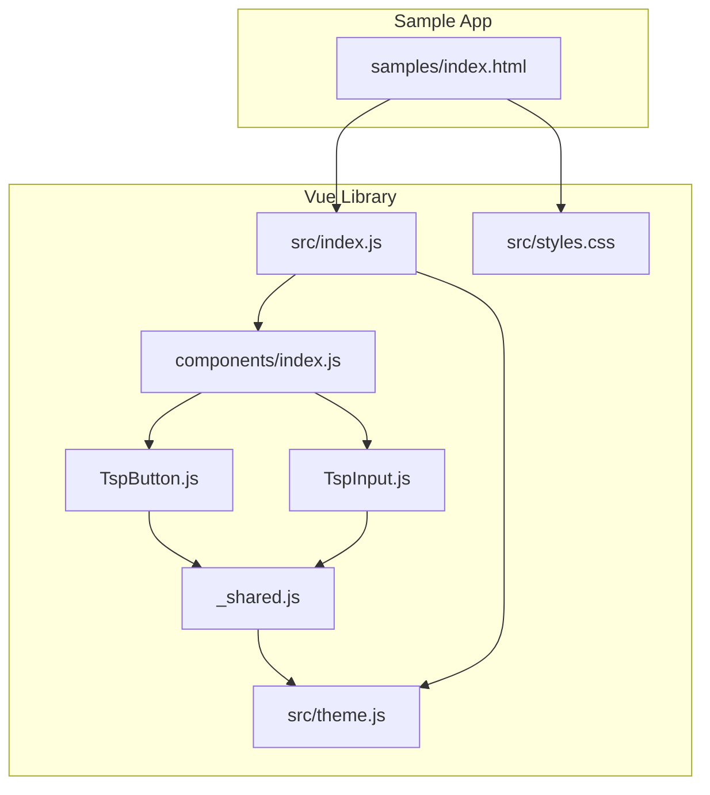
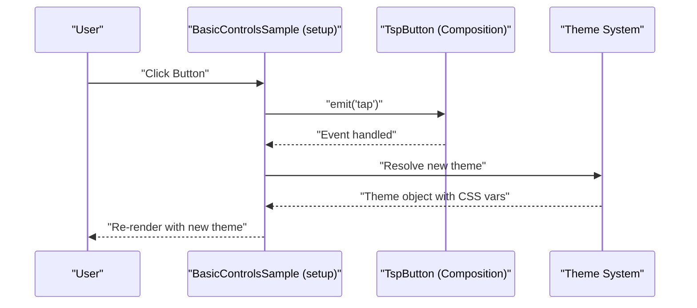
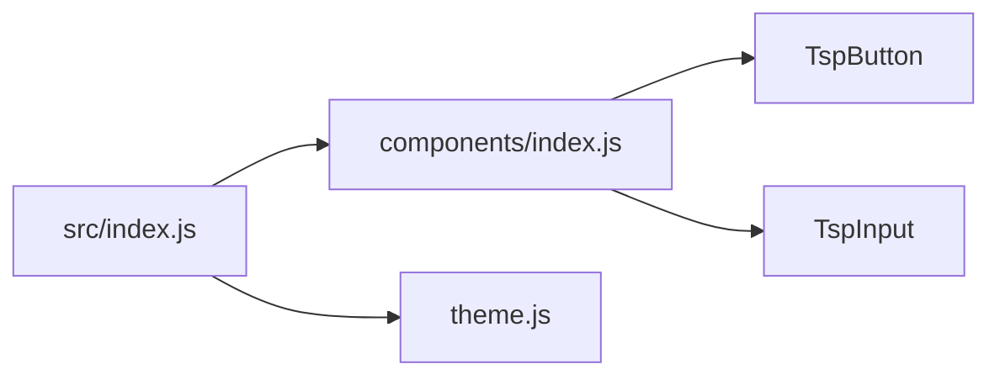
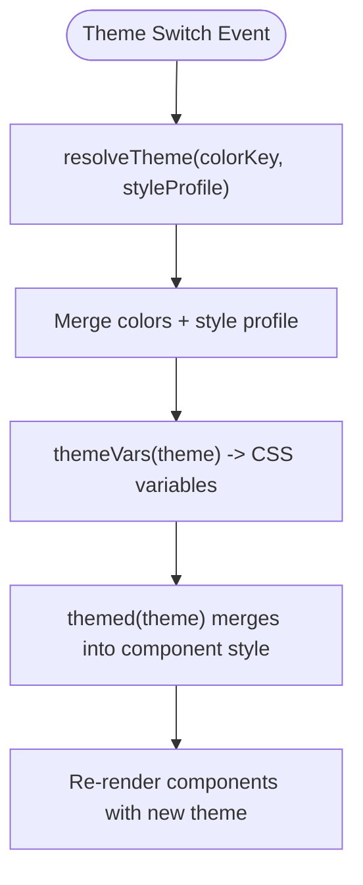
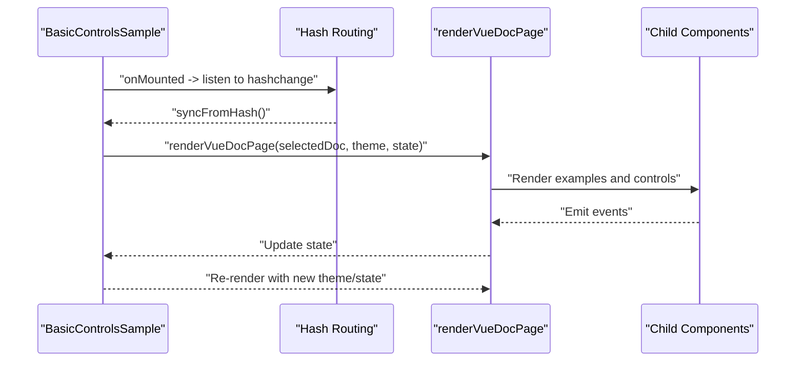
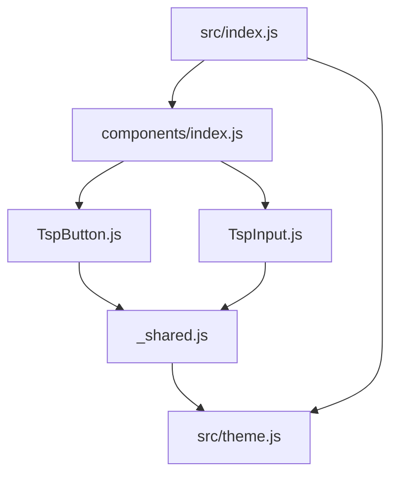

# Vue Web

<cite>
**Referenced Files in This Document**
- [index.js](file://vue-web/library/src/index.js)
- [theme.js](file://vue-web/library/src/theme.js)
- [_shared.js](file://vue-web/library/src/components/_shared.js)
- [TspButton.js](file://vue-web/library/src/components/TspButton.js)
- [TspInput.js](file://vue-web/library/src/components/TspInput.js)
- [components/index.js](file://vue-web/library/src/components/index.js)
- [package.json](file://vue-web/library/package.json)
- [styles.css](file://vue-web/library/src/styles.css)
- [component_contract.json](file://component_contract.json)
- [samples/index.html](file://vue-web/samples/index.html)
- [README.md](file://vue-web/library/README.md)
</cite>

## Table of Contents
1. [Introduction](#introduction)
2. [Project Structure](#project-structure)
3. [Core Components](#core-components)
4. [Architecture Overview](#architecture-overview)
5. [Detailed Component Analysis](#detailed-component-analysis)
6. [Dependency Analysis](#dependency-analysis)
7. [Performance Considerations](#performance-considerations)
8. [Troubleshooting Guide](#troubleshooting-guide)
9. [Conclusion](#conclusion)
10. [Appendices](#appendices)

## Introduction
This document describes the Vue Web implementation of Planet Components. It focuses on the Vue component architecture, single-file component structure, Composition API integration patterns, component registration, prop/event contracts, theming system, reactive theme switching, and practical guidance for integrating and extending the library in Vue applications.

## Project Structure
The Vue Web library is organized around a small set of reusable UI primitives and a cohesive theming system. The structure emphasizes:
- A central index that re-exports components and theme utilities
- A shared utilities module consumed by components
- A theme module that defines tokens, presets, and CSS variable generation
- A compact visual sample that demonstrates live theme and language switching

**Diagram sources**
- [index.js:1-334](file://vue-web/library/src/index.js#L1-L334)
- [theme.js:1-131](file://vue-web/library/src/theme.js#L1-L131)
- [_shared.js:1-10](file://vue-web/library/src/components/_shared.js#L1-L10)
- [components/index.js:1-26](file://vue-web/library/src/components/index.js#L1-L26)
- [TspButton.js:1-30](file://vue-web/library/src/components/TspButton.js#L1-L30)
- [TspInput.js:1-28](file://vue-web/library/src/components/TspInput.js#L1-L28)
- [styles.css:1-2](file://vue-web/library/src/styles.css#L1-L2)
- [samples/index.html:1-25](file://vue-web/samples/index.html#L1-L25)

**Section sources**
- [README.md:1-18](file://vue-web/library/README.md#L1-L18)
- [package.json:1-32](file://vue-web/library/package.json#L1-L32)

## Core Components
The Vue library exposes a set of primitive UI components designed to match the cross-platform component contract. Each component is authored as a Composition API component with explicit props and emitted events. The central index re-exports all components and theme utilities for convenient consumption.

Key characteristics:
- Composition API components with explicit props and emits
- Theme integration via a themed style object
- Shared helpers for class joining, clamping, and slot rendering
- Centralized exports for easy installation and tree-shaking

Examples of component exports and usage are visible in the index and component index files.

**Section sources**
- [index.js:1-334](file://vue-web/library/src/index.js#L1-L334)
- [components/index.js:1-26](file://vue-web/library/src/components/index.js#L1-L26)
- [_shared.js:1-10](file://vue-web/library/src/components/_shared.js#L1-L10)

## Architecture Overview
The Vue Web implementation follows a unidirectional data flow:
- Reactive state in the sample app drives component previews
- Components receive theme objects and props
- Events propagate upward to update state
- Theme switching updates the theme object and recomputes CSS variables

**Diagram sources**
- [index.js:225-334](file://vue-web/library/src/index.js#L225-L334)
- [TspButton.js:4-29](file://vue-web/library/src/components/TspButton.js#L4-L29)
- [theme.js:96-131](file://vue-web/library/src/theme.js#L96-L131)

## Detailed Component Analysis

### Component Registration and Export
Components are individually exported from the components index and re-exported by the library index. Consumers can import individual components or the whole suite.

**Diagram sources**
- [components/index.js:1-26](file://vue-web/library/src/components/index.js#L1-L26)
- [index.js:1-35](file://vue-web/library/src/index.js#L1-L35)
- [theme.js:1-131](file://vue-web/library/src/theme.js#L1-L131)

**Section sources**
- [components/index.js:1-26](file://vue-web/library/src/components/index.js#L1-L26)
- [index.js:1-35](file://vue-web/library/src/index.js#L1-L35)

### Props, Events, and Slots
Each component defines a clear prop interface and emits predictable events. The shared utilities provide helpers for rendering children and deriving text from options.

- Example props and emits:
  - TspButton: props include text, variant, disabled, fullWidth, theme; emits tap
  - TspInput: props include value, placeholder, variant, disabled, theme; emits change and update:value

- Shared utilities:
  - cx: join class names
  - clamp: constrain numeric values
  - themed: merge theme CSS variables with inline styles
  - childrenOr: render slot default or fallback
  - optionText: normalize option label extraction

These patterns ensure consistent behavior across components and simplify customization.

**Section sources**
- [TspButton.js:4-29](file://vue-web/library/src/components/TspButton.js#L4-L29)
- [TspInput.js:4-27](file://vue-web/library/src/components/TspInput.js#L4-L27)
- [_shared.js:1-10](file://vue-web/library/src/components/_shared.js#L1-L10)

### Theming System and Reactive Theme Switching
The theming system centers on:
- A base theme object with named color tokens
- Multiple built-in themes keyed by semantic names
- Style profiles that adjust shadows and heights
- A resolver that merges color and style profiles
- A generator that produces CSS variable maps

The sample app demonstrates reactive theme switching by updating a reactive theme key and resolving a theme object on each render. The themed helper merges theme CSS variables into component styles.

**Diagram sources**
- [theme.js:96-131](file://vue-web/library/src/theme.js#L96-L131)
- [_shared.js:7-7](file://vue-web/library/src/components/_shared.js#L7-L7)
- [index.js:225-334](file://vue-web/library/src/index.js#L225-L334)

**Section sources**
- [theme.js:1-131](file://vue-web/library/src/theme.js#L1-L131)
- [_shared.js:1-10](file://vue-web/library/src/components/_shared.js#L1-L10)
- [index.js:225-334](file://vue-web/library/src/index.js#L225-L334)

### Component Composition Patterns and Lifecycle Management
The sample app composes multiple components to render documentation pages and interactive previews. It uses:
- Composition API setup for reactive state (refs, watchers via hashchange)
- Dynamic rendering of examples and API metadata
- Inline event handlers to mutate state and trigger reactivity
- Lifecycle hooks to attach/detach global listeners

**Diagram sources**
- [index.js:225-334](file://vue-web/library/src/index.js#L225-L334)

**Section sources**
- [index.js:225-334](file://vue-web/library/src/index.js#L225-L334)

### Setup Instructions for Vue CLI and Plugin Integration
- Install peer dependency: Vue 3
- Import styles once in the app shell
- Use the provided index to import components and theme utilities
- For plugin-like usage, register components globally or locally per component

Integration guidance:
- Add the Vue peer dependency in your project
- Import the library’s styles in your main entry
- Import components from the index for local usage
- Use theme utilities to supply theme objects to components

**Section sources**
- [package.json:20-22](file://vue-web/library/package.json#L20-L22)
- [styles.css:1-2](file://vue-web/library/src/styles.css#L1-L2)
- [README.md:1-18](file://vue-web/library/README.md#L1-L18)

### Webpack and Build Configuration Notes
- The library is published as an ES module with exports configured for direct imports
- Side effects are declared for styles to enable tree-shaking
- No bundler-specific configuration is embedded in the library; consumers manage their own builds

**Section sources**
- [package.json:8-19](file://vue-web/library/package.json#L8-L19)

### API Surface and Cross-Platform Contract
The component contract defines variants and props for each component. This ensures consistent behavior across platforms and helps maintainers keep implementations aligned.

Representative entries:
- Button: variants include primary, default, danger, text, link; props include text, variant, disabled, fullWidth, onTap
- Input: variants include default, error, disabled; props include value, placeholder, variant, disabled, onChange
- Select: props include options, selectedIndex, disabled, onSelect
- Switch: props include text, checked, checkedText, uncheckedText, loading, disabled, onChange
- Modal: props include title, message, confirmText, cancelText, onConfirm, onCancel

**Section sources**
- [component_contract.json:21-157](file://component_contract.json#L21-L157)

## Dependency Analysis
The Vue library maintains low coupling between components and a centralized theme system. Components depend on shared utilities and theme helpers, while the index orchestrates exports and sample rendering.

**Diagram sources**
- [index.js:1-35](file://vue-web/library/src/index.js#L1-L35)
- [theme.js:1-131](file://vue-web/library/src/theme.js#L1-L131)
- [_shared.js:1-10](file://vue-web/library/src/components/_shared.js#L1-L10)
- [components/index.js:1-26](file://vue-web/library/src/components/index.js#L1-L26)
- [TspButton.js:1-30](file://vue-web/library/src/components/TspButton.js#L1-L30)
- [TspInput.js:1-28](file://vue-web/library/src/components/TspInput.js#L1-L28)

**Section sources**
- [index.js:1-35](file://vue-web/library/src/index.js#L1-L35)
- [theme.js:1-131](file://vue-web/library/src/theme.js#L1-L131)
- [_shared.js:1-10](file://vue-web/library/src/components/_shared.js#L1-L10)
- [components/index.js:1-26](file://vue-web/library/src/components/index.js#L1-L26)

## Performance Considerations
- Prefer shallow props and avoid unnecessary reactive overhead in child components
- Use the provided themed helper to compute CSS variables once per component render
- Minimize DOM churn by avoiding frequent re-creation of large subtrees
- Leverage the provided CSS variables to reduce style recalculation costs
- Keep event handlers lightweight; defer heavy work to microtasks or idle callbacks

## Troubleshooting Guide
Common issues and resolutions:
- Missing Vue peer dependency: Ensure Vue 3 is installed in the consuming app
- Styles not applied: Confirm that the library’s styles are imported once in the app shell
- Theme variables missing: Verify that the theme object passed to components is resolved via the theme system
- Events not firing: Ensure event names match the component’s emits definition and listeners are attached correctly
- Styling conflicts: Use the themed helper to scope styles and avoid global overrides

**Section sources**
- [package.json:20-22](file://vue-web/library/package.json#L20-L22)
- [styles.css:1-2](file://vue-web/library/src/styles.css#L1-L2)
- [TspButton.js:13-27](file://vue-web/library/src/components/TspButton.js#L13-L27)
- [TspInput.js:13-25](file://vue-web/library/src/components/TspInput.js#L13-L25)

## Conclusion
The Vue Web implementation of Planet Components provides a concise, theme-aware set of primitives built with the Composition API. Its architecture supports easy integration, predictable prop/event contracts, and flexible theming. By following the patterns outlined here—using the provided theme utilities, importing styles once, and composing components with reactive state—you can build robust, visually consistent UIs that align with the cross-platform component contract.

## Appendices

### Quick Start: Using the Sample App
- The sample app demonstrates live theme and language switching and serves as a reference for component usage
- It imports Vue from an import map and mounts the sample component directly

**Section sources**
- [samples/index.html:1-25](file://vue-web/samples/index.html#L1-L25)