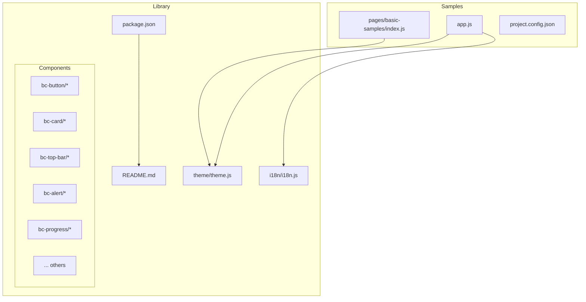
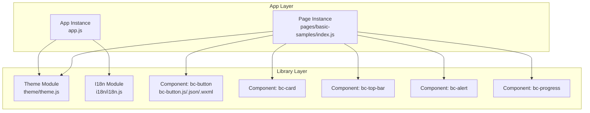
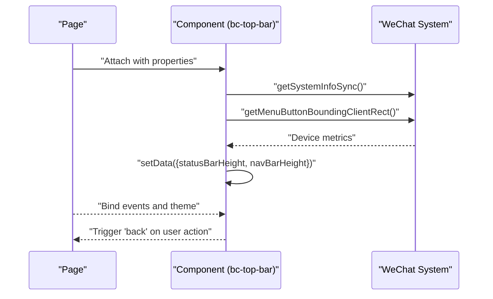
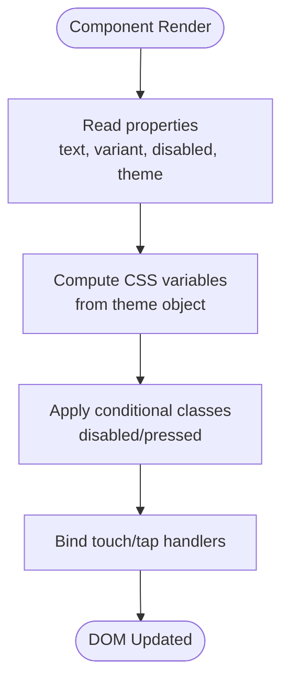
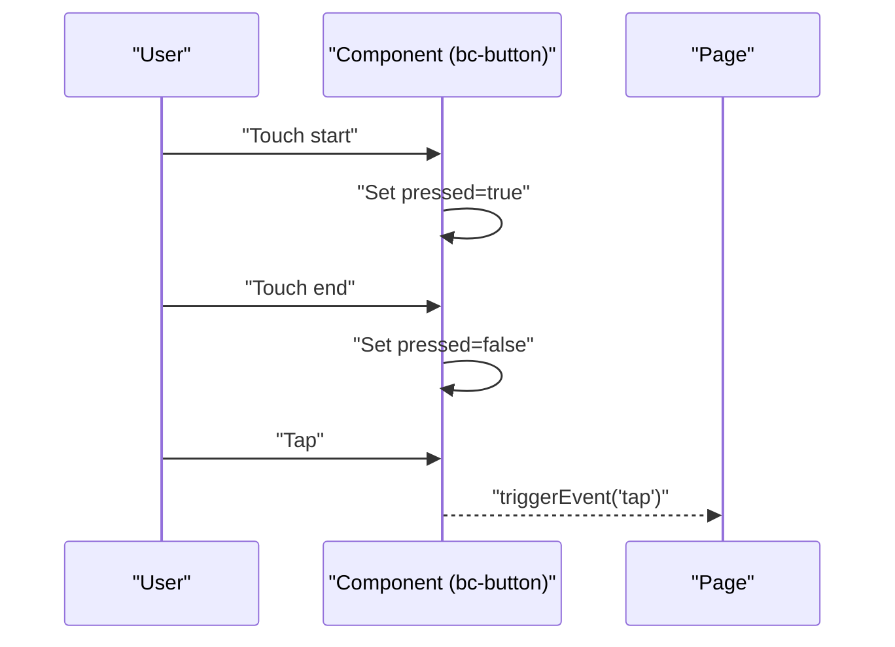
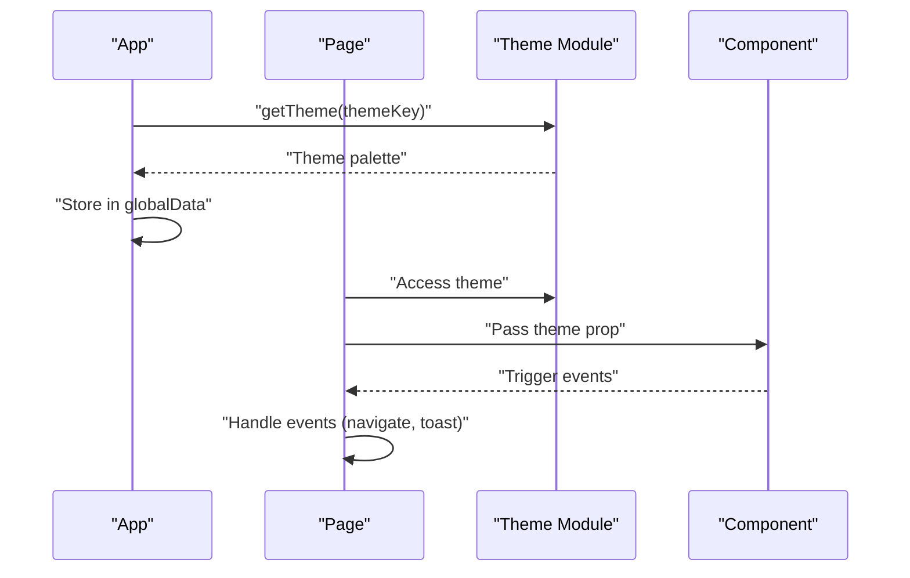
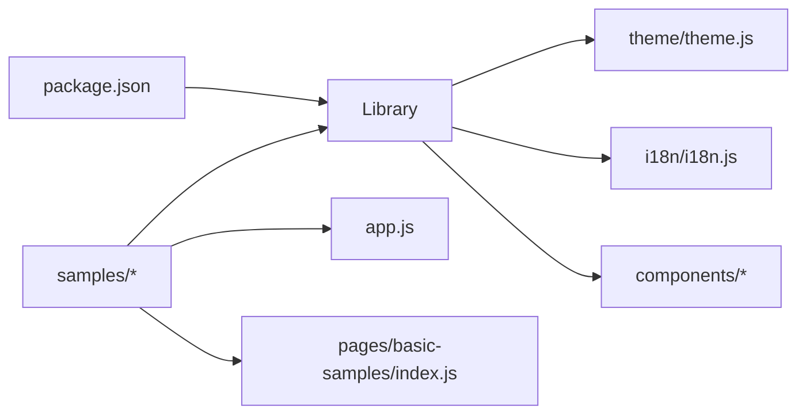

# WeChat Mini Program

<cite>
**Referenced Files in This Document**
- [package.json](file://miniprogram/library/package.json)
- [README.md](file://miniprogram/library/README.md)
- [theme.js](file://miniprogram/library/theme/theme.js)
- [i18n.js](file://miniprogram/library/i18n/i18n.js)
- [bc-button.json](file://miniprogram/library/components/bc-button/bc-button.json)
- [bc-button.js](file://miniprogram/library/components/bc-button/bc-button.js)
- [bc-button.wxml](file://miniprogram/library/components/bc-button/bc-button.wxml)
- [bc-card.js](file://miniprogram/library/components/bc-card/bc-card.js)
- [bc-top-bar.js](file://miniprogram/library/components/bc-top-bar/bc-top-bar.js)
- [index.js](file://miniprogram/samples/pages/basic-samples/index.js)
- [app.js](file://miniprogram/samples/app.js)
- [project.config.json](file://miniprogram/samples/project.config.json)
- [COMPONENT_CONTRACT.md](file://docs/COMPONENT_CONTRACT.md)
- [PLATFORM_STRUCTURE.md](file://docs/PLATFORM_STRUCTURE.md)
- [bc-progress.js](file://miniprogram/library/components/bc-progress/bc-progress.js)
- [bc-alert.js](file://miniprogram/library/components/bc-alert/bc-alert.js)
</cite>

## Table of Contents
1. [Introduction](#introduction)
2. [Project Structure](#project-structure)
3. [Core Components](#core-components)
4. [Architecture Overview](#architecture-overview)
5. [Detailed Component Analysis](#detailed-component-analysis)
6. [Dependency Analysis](#dependency-analysis)
7. [Performance Considerations](#performance-considerations)
8. [Troubleshooting Guide](#troubleshooting-guide)
9. [Conclusion](#conclusion)
10. [Appendices](#appendices)

## Introduction
This document describes the WeChat Mini Program implementation of Planet Components. It explains the component framework architecture, WXML/WXSS structure, and JavaScript logic, along with the component registration system, data binding patterns, event handling mechanisms, theming system, and internationalization support. It also covers setup instructions for Mini Program development tools, project configuration, component publishing, composition patterns, navigation, cross-device compatibility, performance optimization, integration challenges, debugging strategies, and best practices.

## Project Structure
The Mini Program package is organized as a standalone library with components, theme, and internationalization utilities, plus a samples project that demonstrates usage. The library is published as an npm package scoped under @techskillplanet.

**Diagram sources**
- [package.json:1-14](file://miniprogram/library/package.json#L1-L14)
- [README.md:1-25](file://miniprogram/library/README.md#L1-L25)
- [theme.js:1-85](file://miniprogram/library/theme/theme.js#L1-L85)
- [i18n.js:1-32](file://miniprogram/library/i18n/i18n.js#L1-L32)
- [bc-button.js:1-22](file://miniprogram/library/components/bc-button/bc-button.js#L1-L22)
- [bc-card.js:1-6](file://miniprogram/library/components/bc-card/bc-card.js#L1-L6)
- [bc-top-bar.js:1-34](file://miniprogram/library/components/bc-top-bar/bc-top-bar.js#L1-L34)
- [bc-alert.js:1-9](file://miniprogram/library/components/bc-alert/bc-alert.js#L1-L9)
- [bc-progress.js:1-13](file://miniprogram/library/components/bc-progress/bc-progress.js#L1-L13)
- [index.js:1-18](file://miniprogram/samples/pages/basic-samples/index.js#L1-L18)
- [app.js:1-48](file://miniprogram/samples/app.js#L1-L48)
- [project.config.json:1-38](file://miniprogram/samples/project.config.json#L1-L38)

**Section sources**
- [package.json:1-14](file://miniprogram/library/package.json#L1-L14)
- [README.md:1-25](file://miniprogram/library/README.md#L1-L25)
- [COMPONENT_CONTRACT.md:1-68](file://docs/COMPONENT_CONTRACT.md#L1-L68)
- [PLATFORM_STRUCTURE.md:1-51](file://docs/PLATFORM_STRUCTURE.md#L1-L51)

## Core Components
This section outlines the core component architecture and how components are registered and used.

- Component registration system
  - Each component is a folder containing a JavaScript file that registers a WeChat component via the Component() constructor. Properties, data, observers, and methods are defined within the component file. JSON and WXML/WXSS files define component metadata and structure/styles respectively.
  - Example: button component registration and properties/methods are defined in its JS file.
  - Example: top bar component defines properties, lifecycle, and event triggers.

- Data binding patterns
  - Properties are declared with type and default value; internal data holds runtime state.
  - WXML uses double curly braces for interpolation and conditional classes/styles.
  - CSS variables are used to adapt component visuals to the current theme.

- Event handling mechanisms
  - Components trigger custom events (e.g., tap/back) that parent pages can listen to.
  - Touch and tap handlers update local state and propagate events upward.

- Theming integration
  - Components accept a theme object via properties and consume it in WXML to set CSS variables.
  - The library provides multiple themes (e.g., sky, night, mint, sunrise) and a helper to compute theme classes.

- Internationalization integration
  - The library exposes an i18n module with language selection, text lookup, and format helpers.
  - The sample app initializes i18n and exposes translation helpers on the App instance.

**Section sources**
- [bc-button.json:1-5](file://miniprogram/library/components/bc-button/bc-button.json#L1-L5)
- [bc-button.js:1-22](file://miniprogram/library/components/bc-button/bc-button.js#L1-L22)
- [bc-button.wxml:1-12](file://miniprogram/library/components/bc-button/bc-button.wxml#L1-L12)
- [bc-top-bar.js:1-34](file://miniprogram/library/components/bc-top-bar/bc-top-bar.js#L1-L34)
- [theme.js:1-85](file://miniprogram/library/theme/theme.js#L1-L85)
- [i18n.js:1-32](file://miniprogram/library/i18n/i18n.js#L1-L32)
- [app.js:1-48](file://miniprogram/samples/app.js#L1-L48)

## Architecture Overview
The Mini Program architecture follows a clear separation between the library (components, theme, i18n) and the samples project that consumes the library.

**Diagram sources**
- [app.js:1-48](file://miniprogram/samples/app.js#L1-L48)
- [index.js:1-18](file://miniprogram/samples/pages/basic-samples/index.js#L1-L18)
- [theme.js:1-85](file://miniprogram/library/theme/theme.js#L1-L85)
- [i18n.js:1-32](file://miniprogram/library/i18n/i18n.js#L1-L32)
- [bc-button.js:1-22](file://miniprogram/library/components/bc-button/bc-button.js#L1-L22)
- [bc-card.js:1-6](file://miniprogram/library/components/bc-card/bc-card.js#L1-L6)
- [bc-top-bar.js:1-34](file://miniprogram/library/components/bc-top-bar/bc-top-bar.js#L1-L34)
- [bc-alert.js:1-9](file://miniprogram/library/components/bc-alert/bc-alert.js#L1-L9)
- [bc-progress.js:1-13](file://miniprogram/library/components/bc-progress/bc-progress.js#L1-L13)

## Detailed Component Analysis

### Component Registration and Lifecycle
- Registration pattern
  - Each component uses the Component() constructor to declare properties, data, observers, and methods.
  - JSON files enable component mode and declare internal usingComponents (empty in most cases).
- Lifecycle and device metrics
  - The top bar component computes navigation bar height during attached lifecycle using system info and menu button geometry.

**Diagram sources**
- [bc-top-bar.js:12-27](file://miniprogram/library/components/bc-top-bar/bc-top-bar.js#L12-L27)

**Section sources**
- [bc-top-bar.js:1-34](file://miniprogram/library/components/bc-top-bar/bc-top-bar.js#L1-L34)
- [bc-button.json:1-5](file://miniprogram/library/components/bc-button/bc-button.json#L1-L5)

### Data Binding and Theming
- Property-driven rendering
  - Components declare typed properties with defaults; internal data stores transient state (e.g., pressed).
  - WXML binds to properties and computed CSS variables derived from the theme object.
- Theme consumption
  - Components receive a theme object and set CSS variables to adapt colors and surfaces.
  - The theme module exports multiple palettes and a helper to derive theme classes.

**Diagram sources**
- [bc-button.wxml:1-12](file://miniprogram/library/components/bc-button/bc-button.wxml#L1-L12)
- [bc-button.js:8-20](file://miniprogram/library/components/bc-button/bc-button.js#L8-L20)
- [theme.js:76-82](file://miniprogram/library/theme/theme.js#L76-L82)

**Section sources**
- [bc-button.js:1-22](file://miniprogram/library/components/bc-button/bc-button.js#L1-L22)
- [bc-button.wxml:1-12](file://miniprogram/library/components/bc-button/bc-button.wxml#L1-L12)
- [theme.js:1-85](file://miniprogram/library/theme/theme.js#L1-L85)

### Event Handling Patterns
- Touch and tap
  - Button component toggles pressed state on touchstart/touchend and triggers a tap event when enabled.
- Navigation
  - Top bar component triggers a back event; page navigates back on receiving the event.

**Diagram sources**
- [bc-button.js:10-19](file://miniprogram/library/components/bc-button/bc-button.js#L10-L19)

**Section sources**
- [bc-button.js:1-22](file://miniprogram/library/components/bc-button/bc-button.js#L1-L22)
- [bc-top-bar.js:28-32](file://miniprogram/library/components/bc-top-bar/bc-top-bar.js#L28-L32)
- [index.js:14-16](file://miniprogram/samples/pages/basic-samples/index.js#L14-L16)

### Component Composition and Page Integration
- Pages import theme and i18n modules, initialize global theme/language, and pass theme objects to components.
- Pages bind component events to page handlers for navigation and user feedback.

**Diagram sources**
- [app.js:13-27](file://miniprogram/samples/app.js#L13-L27)
- [index.js:4-10](file://miniprogram/samples/pages/basic-samples/index.js#L4-L10)
- [theme.js:76-78](file://miniprogram/library/theme/theme.js#L76-L78)

**Section sources**
- [app.js:1-48](file://miniprogram/samples/app.js#L1-L48)
- [index.js:1-18](file://miniprogram/samples/pages/basic-samples/index.js#L1-L18)
- [README.md:19-25](file://miniprogram/library/README.md#L19-L25)

### Additional Components
- Card component
  - Minimal component with theme property.
- Progress component
  - Uses observers to normalize and round numeric values into percentage bounds.
- Alert component
  - Accepts title, message, variant, and theme.

**Section sources**
- [bc-card.js:1-6](file://miniprogram/library/components/bc-card/bc-card.js#L1-L6)
- [bc-progress.js:1-13](file://miniprogram/library/components/bc-progress/bc-progress.js#L1-L13)
- [bc-alert.js:1-9](file://miniprogram/library/components/bc-alert/bc-alert.js#L1-L9)

## Dependency Analysis
The Mini Program package depends on its own library modules and the WeChat runtime. The samples depend on the library and demonstrate usage patterns.

**Diagram sources**
- [package.json:1-14](file://miniprogram/library/package.json#L1-L14)
- [theme.js:1-85](file://miniprogram/library/theme/theme.js#L1-L85)
- [i18n.js:1-32](file://miniprogram/library/i18n/i18n.js#L1-L32)
- [app.js:1-48](file://miniprogram/samples/app.js#L1-L48)
- [index.js:1-18](file://miniprogram/samples/pages/basic-samples/index.js#L1-L18)

**Section sources**
- [package.json:1-14](file://miniprogram/library/package.json#L1-L14)
- [COMPONENT_CONTRACT.md:26-57](file://docs/COMPONENT_CONTRACT.md#L26-L57)
- [PLATFORM_STRUCTURE.md:32-33](file://docs/PLATFORM_STRUCTURE.md#L32-L33)

## Performance Considerations
- Minification and compilation
  - Project settings enable minification for WXML/WXSS and disable strict mode and worklet enhancements to optimize build size and compatibility.
- CSS variable usage
  - Components rely on CSS variables for theming, reducing duplication and enabling fast theme switching.
- Observer-based normalization
  - Components like progress normalize values efficiently using observers to avoid redundant recalculations.
- Lifecycle-aware measurements
  - Components compute device metrics once during attached lifecycle to avoid repeated expensive calls.

**Section sources**
- [project.config.json:7-31](file://miniprogram/samples/project.config.json#L7-L31)
- [bc-progress.js:6-10](file://miniprogram/library/components/bc-progress/bc-progress.js#L6-L10)
- [bc-top-bar.js:12-27](file://miniprogram/library/components/bc-top-bar/bc-top-bar.js#L12-L27)

## Troubleshooting Guide
- Theme not applied
  - Ensure the theme object is passed down to components and that CSS variables are correctly bound in WXML.
- Events not firing
  - Verify event bindings in WXML match handler names in component JS and that triggerEvent is called with the correct event name.
- Navigation issues
  - Confirm that page handlers for component events (e.g., back) are implemented and that navigation APIs are invoked appropriately.
- Build warnings
  - Review project settings for minification and strict mode flags; adjust according to target environment requirements.

**Section sources**
- [bc-button.wxml:4-8](file://miniprogram/library/components/bc-button/bc-button.wxml#L4-L8)
- [bc-button.js:16-19](file://miniprogram/library/components/bc-button/bc-button.js#L16-L19)
- [index.js:14-16](file://miniprogram/samples/pages/basic-samples/index.js#L14-L16)
- [project.config.json:7-31](file://miniprogram/samples/project.config.json#L7-L31)

## Conclusion
The WeChat Mini Program implementation of Planet Components follows a clean, modular architecture with explicit component registration, robust data binding, and theme/i18n integration. The samples project demonstrates practical usage patterns, while the library remains publishable and reusable across projects. Adhering to the documented component contract and platform structure ensures consistent behavior across platforms.

## Appendices

### Setup Instructions for Mini Program Development Tools
- Install the latest WeChat Mini Program IDE and configure the project root to the samples directory.
- Open the project configuration to review and adjust build settings as needed.
- Use the library package in your project by installing the published package and importing components in pages.

**Section sources**
- [project.config.json:1-38](file://miniprogram/samples/project.config.json#L1-L38)
- [README.md:1-25](file://miniprogram/library/README.md#L1-L25)

### Component Publishing
- Package metadata specifies the library directory and included files.
- Publish the package using the configured package.json and ensure the library directory contains all required component assets.

**Section sources**
- [package.json:1-14](file://miniprogram/library/package.json#L1-L14)
- [README.md:1-25](file://miniprogram/library/README.md#L1-L25)

### Cross-Device Compatibility Considerations
- Device metrics
  - Components compute navigation bar height using system info and menu button geometry to adapt layouts across devices.
- Theming
  - Multiple theme palettes support light/dark modes; CSS variables enable dynamic theme switching without re-rendering components.

**Section sources**
- [bc-top-bar.js:12-27](file://miniprogram/library/components/bc-top-bar/bc-top-bar.js#L12-L27)
- [theme.js:1-85](file://miniprogram/library/theme/theme.js#L1-L85)

### Best Practices
- Keep component folders self-contained with one component per folder.
- Expose only public APIs via barrel/index files in shared modules.
- Compose pages from components and avoid embedding component logic in pages.
- Use observers for derived state calculations and CSS variables for theming.

**Section sources**
- [COMPONENT_CONTRACT.md:26-57](file://docs/COMPONENT_CONTRACT.md#L26-L57)
- [PLATFORM_STRUCTURE.md:5-23](file://docs/PLATFORM_STRUCTURE.md#L5-L23)
- [bc-progress.js:6-10](file://miniprogram/library/components/bc-progress/bc-progress.js#L6-L10)
- [theme.js:76-82](file://miniprogram/library/theme/theme.js#L76-L82)