# iOS SwiftUI

<cite>
**Referenced Files in This Document**
- [Package.swift](file://ios-swiftui/library/Package.swift)
- [BasicControls.swift](file://ios-swiftui/library/Sources/TechSkillPlanetBasicControls/BasicControls.swift)
- [StarPlanetTheme.swift](file://ios-swiftui/library/Sources/TechSkillPlanetBasicControls/StarPlanetTheme.swift)
- [Package.swift](file://ios-swiftui/samples/Package.swift)
- [BasicControlsSampleView.swift](file://ios-swiftui/samples/Sources/BasicControlsSamples/BasicControlsSampleView.swift)
</cite>

## Table of Contents
1. [Introduction](#introduction)
2. [Project Structure](#project-structure)
3. [Core Components](#core-components)
4. [Architecture Overview](#architecture-overview)
5. [Detailed Component Analysis](#detailed-component-analysis)
6. [Dependency Analysis](#dependency-analysis)
7. [Performance Considerations](#performance-considerations)
8. [Troubleshooting Guide](#troubleshooting-guide)
9. [Conclusion](#conclusion)
10. [Appendices](#appendices)

## Introduction
This document describes the iOS SwiftUI implementation of Planet Components within the “ios-swiftui” module. It covers Swift Package Manager configuration, SwiftUI view composition patterns, state management integration, theming via SwiftUI’s EnvironmentValues and custom modifiers, and dynamic theme switching. It also includes setup instructions for Xcode integration and SPM, animation and performance guidance, and best practices for building iOS apps with these components.

## Project Structure
The iOS SwiftUI module is organized into two packages:
- Library package: Defines the component library and theme model.
- Samples package: Demonstrates usage of the components and showcases dynamic theming and navigation.

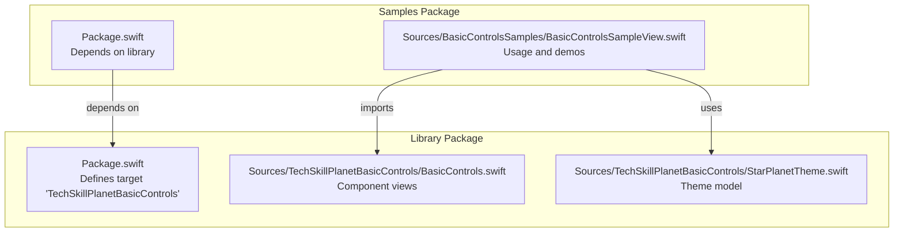

**Diagram sources**
- [Package.swift:1-14](file://ios-swiftui/library/Package.swift#L1-L14)
- [BasicControls.swift:1-642](file://ios-swiftui/library/Sources/TechSkillPlanetBasicControls/BasicControls.swift#L1-L642)
- [StarPlanetTheme.swift:1-43](file://ios-swiftui/library/Sources/TechSkillPlanetBasicControls/StarPlanetTheme.swift#L1-L43)
- [Package.swift:1-23](file://ios-swiftui/samples/Package.swift#L1-L23)
- [BasicControlsSampleView.swift:1-217](file://ios-swiftui/samples/Sources/BasicControlsSamples/BasicControlsSampleView.swift#L1-L217)

**Section sources**
- [Package.swift:1-14](file://ios-swiftui/library/Package.swift#L1-L14)
- [Package.swift:1-23](file://ios-swiftui/samples/Package.swift#L1-L23)

## Core Components
The component library exposes a set of SwiftUI views designed for iOS and macOS. Each view encapsulates layout, typography, and interaction while delegating visual styling to a theme object. Common patterns include:
- Parameterized initializers with defaults for variants, states, and theme selection.
- Body computed properties that render shapes, text, and overlays using theme colors.
- Optional state bindings for interactive components (e.g., inputs, toggles).
- Composition via generic content builders for container-like views.

Representative components include buttons, cards, alerts, badges, chips, inputs, selects, progress bars, navigation bars, bottom tabs, tabs, icon buttons, key-value labels, notifications, text links, sticky footers, PIN inputs, list items, empty states, and toasts.

**Section sources**
- [BasicControls.swift:6-642](file://ios-swiftui/library/Sources/TechSkillPlanetBasicControls/BasicControls.swift#L6-L642)

## Architecture Overview
The architecture centers on a theme-driven design:
- Components receive a StarPlanetTheme instance and derive all colors from it.
- Views are stateless and declarative; state is managed by parent views or app-level stores.
- Navigation and composition are handled by SwiftUI’s built-in navigation and layout primitives.

```mermaid
graph TB
Theme["StarPlanetTheme<br/>Colors and palettes"]
Btn["TspButton"]
Card["TspCard"]
Alert["TspAlert"]
Badge["TspBadge"]
Chip["TspChip"]
Input["TspInput"]
Select["TspSelect"]
Progress["TspProgress"]
TopBar["TspTopBar"]
BottomTab["TspBottomTab"]
Tabs["TspTabs"]
IconButton["TspIconButton"]
KeyValue["TspKeyValueLabel"]
Notify["TspNotification"]
TextLink["TspTextLink"]
Sticky["TspStickyFooter"]
Pin["TspPinInput"]
ListItem["TspListItem"]
Empty["TspEmpty"]
Toast["TspToast"]
Theme --> Btn
Theme --> Card
Theme --> Alert
Theme --> Badge
Theme --> Chip
Theme --> Input
Theme --> Select
Theme --> Progress
Theme --> TopBar
Theme --> BottomTab
Theme --> Tabs
Theme --> IconButton
Theme --> KeyValue
Theme --> Notify
Theme --> TextLink
Theme --> Sticky
Theme --> Pin
Theme --> ListItem
Theme --> Empty
Theme --> Toast
```

**Diagram sources**
- [StarPlanetTheme.swift:3-42](file://ios-swiftui/library/Sources/TechSkillPlanetBasicControls/StarPlanetTheme.swift#L3-L42)
- [BasicControls.swift:6-642](file://ios-swiftui/library/Sources/TechSkillPlanetBasicControls/BasicControls.swift#L6-L642)

## Detailed Component Analysis

### TspButton
- Purpose: Primary, secondary, danger, text, and link variants with disabled state.
- Implementation highlights:
  - Uses a capsule shape for rounded edges and a border overlay for depth.
  - Foreground and background colors derived from theme based on variant.
  - Disabled state reduces opacity.
- Typical usage: Action triggers, form submissions, navigation cues.

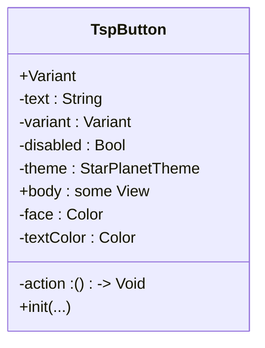

**Diagram sources**
- [BasicControls.swift:6-51](file://ios-swiftui/library/Sources/TechSkillPlanetBasicControls/BasicControls.swift#L6-L51)

**Section sources**
- [BasicControls.swift:6-51](file://ios-swiftui/library/Sources/TechSkillPlanetBasicControls/BasicControls.swift#L6-L51)

### TspCard
- Purpose: Container for grouped content with raised surface and border.
- Implementation highlights:
  - Accepts a content builder to host arbitrary child views.
  - Applies padding, background, stroke, and clipping for consistent visuals.

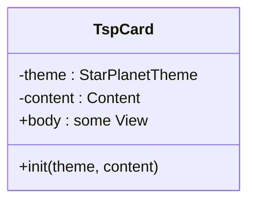

**Diagram sources**
- [BasicControls.swift:53-70](file://ios-swiftui/library/Sources/TechSkillPlanetBasicControls/BasicControls.swift#L53-L70)

**Section sources**
- [BasicControls.swift:53-70](file://ios-swiftui/library/Sources/TechSkillPlanetBasicControls/BasicControls.swift#L53-L70)

### TspAlert
- Purpose: Inline alert with variants for info, success, warning, and error.
- Implementation highlights:
  - Fills and strokes vary per variant using theme colors.
  - Typography and spacing optimized for readability.

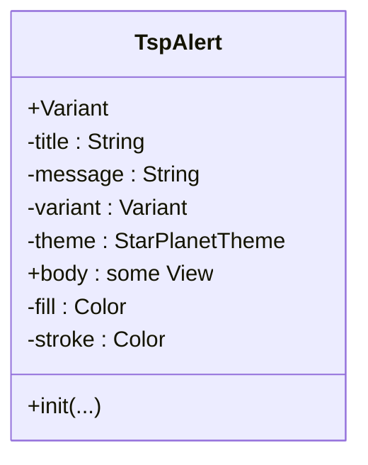

**Diagram sources**
- [BasicControls.swift:72-115](file://ios-swiftui/library/Sources/TechSkillPlanetBasicControls/BasicControls.swift#L72-L115)

**Section sources**
- [BasicControls.swift:72-115](file://ios-swiftui/library/Sources/TechSkillPlanetBasicControls/BasicControls.swift#L72-L115)

### TspAmount
- Purpose: Monetary or numeric display with optional currency symbol placement, cycle suffix, and strikethrough.
- Implementation highlights:
  - Dynamic symbol positioning and optional cycle label.
  - Uses theme text colors for hierarchy.

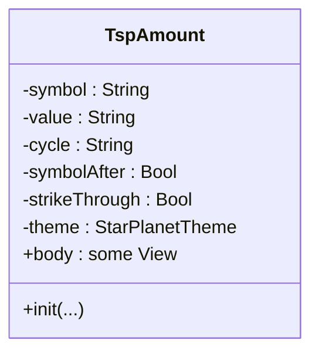

**Diagram sources**
- [BasicControls.swift:117-144](file://ios-swiftui/library/Sources/TechSkillPlanetBasicControls/BasicControls.swift#L117-L144)

**Section sources**
- [BasicControls.swift:117-144](file://ios-swiftui/library/Sources/TechSkillPlanetBasicControls/BasicControls.swift#L117-L144)

### TspStepper
- Purpose: Step indicator with completion and current step visualization.
- Implementation highlights:
  - Enforces a fixed range of steps and renders progress with color-coded segments.

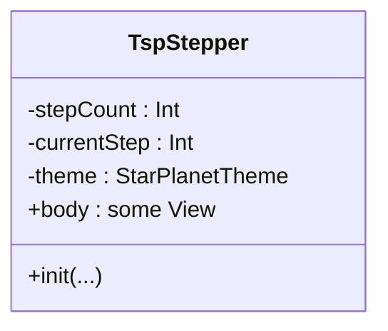

**Diagram sources**
- [BasicControls.swift:146-172](file://ios-swiftui/library/Sources/TechSkillPlanetBasicControls/BasicControls.swift#L146-L172)

**Section sources**
- [BasicControls.swift:146-172](file://ios-swiftui/library/Sources/TechSkillPlanetBasicControls/BasicControls.swift#L146-L172)

### TspBadge
- Purpose: Short status label with semantic variants.
- Implementation highlights:
  - Capsule shape and variant-specific fills.

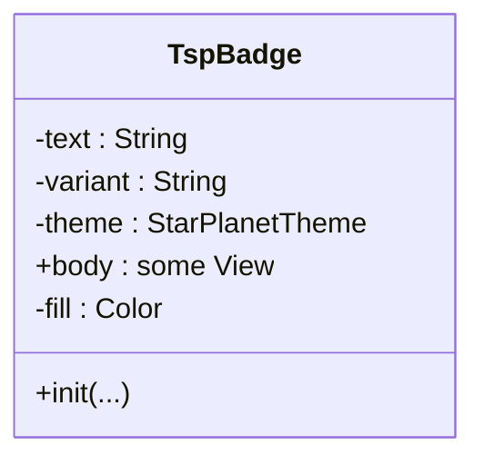

**Diagram sources**
- [BasicControls.swift:174-204](file://ios-swiftui/library/Sources/TechSkillPlanetBasicControls/BasicControls.swift#L174-L204)

**Section sources**
- [BasicControls.swift:174-204](file://ios-swiftui/library/Sources/TechSkillPlanetBasicControls/BasicControls.swift#L174-L204)

### TspChip
- Purpose: Selectable tag with selected and disabled states.
- Implementation highlights:
  - Uses overlay strokes and background fills to indicate selection.

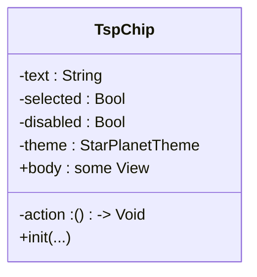

**Diagram sources**
- [BasicControls.swift:206-232](file://ios-swiftui/library/Sources/TechSkillPlanetBasicControls/BasicControls.swift#L206-L232)

**Section sources**
- [BasicControls.swift:206-232](file://ios-swiftui/library/Sources/TechSkillPlanetBasicControls/BasicControls.swift#L206-L232)

### TspInput
- Purpose: Single-line text field with placeholder, variant, and disabled state.
- Implementation highlights:
  - Overlay stroke indicates error or default state.

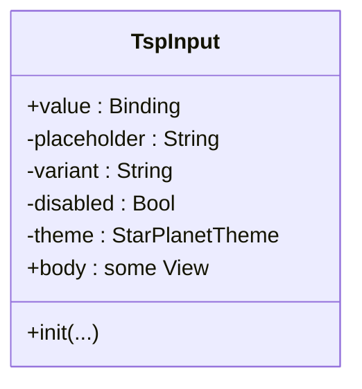

**Diagram sources**
- [BasicControls.swift:234-260](file://ios-swiftui/library/Sources/TechSkillPlanetBasicControls/BasicControls.swift#L234-L260)

**Section sources**
- [BasicControls.swift:234-260](file://ios-swiftui/library/Sources/TechSkillPlanetBasicControls/BasicControls.swift#L234-L260)

### TspSelect
- Purpose: Selection entry point with menu presentation.
- Implementation highlights:
  - Menu-driven options with binding to selected index.

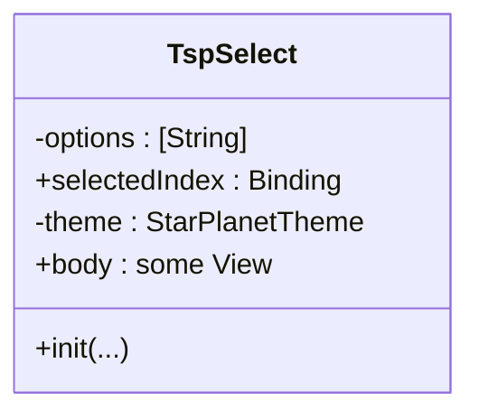

**Diagram sources**
- [BasicControls.swift:262-291](file://ios-swiftui/library/Sources/TechSkillPlanetBasicControls/BasicControls.swift#L262-L291)

**Section sources**
- [BasicControls.swift:262-291](file://ios-swiftui/library/Sources/TechSkillPlanetBasicControls/BasicControls.swift#L262-L291)

### TspProgress
- Purpose: Horizontal progress bar with variant coloring.
- Implementation highlights:
  - GeometryReader-based width calculation and capsule masks.

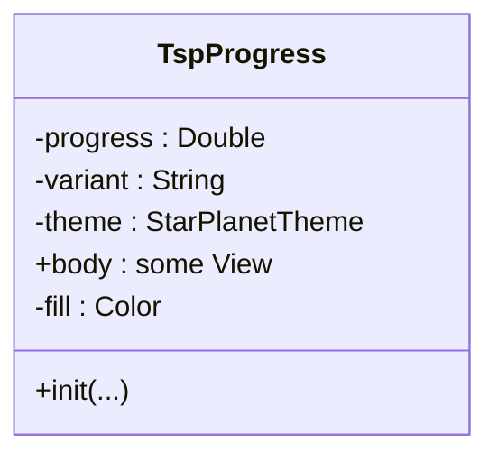

**Diagram sources**
- [BasicControls.swift:293-322](file://ios-swiftui/library/Sources/TechSkillPlanetBasicControls/BasicControls.swift#L293-L322)

**Section sources**
- [BasicControls.swift:293-322](file://ios-swiftui/library/Sources/TechSkillPlanetBasicControls/BasicControls.swift#L293-L322)

### TspTopBar
- Purpose: Top navigation bar with optional back button and safe-area awareness.
- Implementation highlights:
  - Back button visibility controlled by flag; safe area inset computed conditionally.

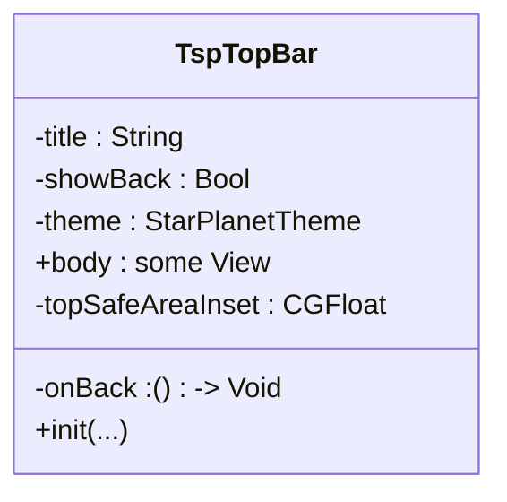

**Diagram sources**
- [BasicControls.swift:324-365](file://ios-swiftui/library/Sources/TechSkillPlanetBasicControls/BasicControls.swift#L324-L365)

**Section sources**
- [BasicControls.swift:324-365](file://ios-swiftui/library/Sources/TechSkillPlanetBasicControls/BasicControls.swift#L324-L365)

### TspBottomTab
- Purpose: Bottom tab bar with selection state and icons/titles.
- Implementation highlights:
  - Identifiable tab items; selection updates via binding.

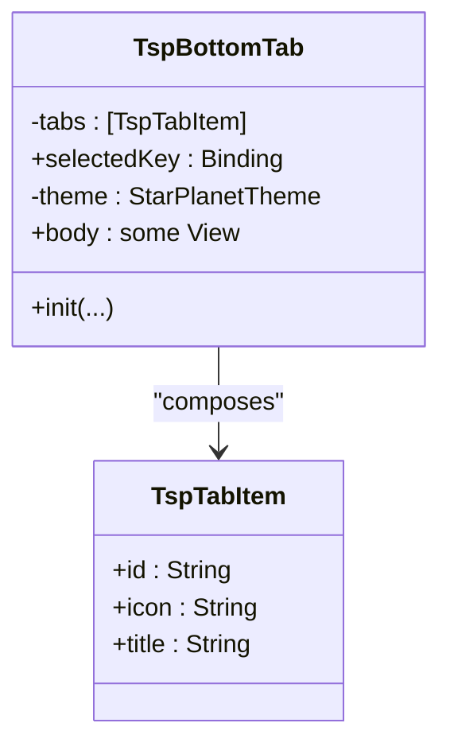

**Diagram sources**
- [BasicControls.swift:367-409](file://ios-swiftui/library/Sources/TechSkillPlanetBasicControls/BasicControls.swift#L367-L409)

**Section sources**
- [BasicControls.swift:367-409](file://ios-swiftui/library/Sources/TechSkillPlanetBasicControls/BasicControls.swift#L367-L409)

### TspTabs
- Purpose: Horizontal segmented tabs for filtering or categorization.
- Implementation highlights:
  - Adaptive grid and selection highlight.

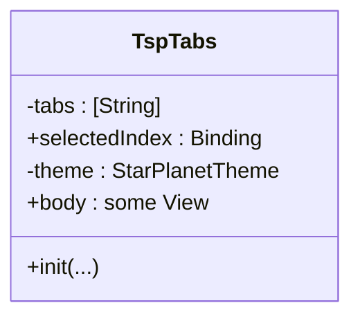

**Diagram sources**
- [BasicControls.swift:411-442](file://ios-swiftui/library/Sources/TechSkillPlanetBasicControls/BasicControls.swift#L411-L442)

**Section sources**
- [BasicControls.swift:411-442](file://ios-swiftui/library/Sources/TechSkillPlanetBasicControls/BasicControls.swift#L411-L442)

### TspIconButton
- Purpose: Icon-only button with selected and disabled states.
- Implementation highlights:
  - Square frame with rounded corners and overlay stroke.

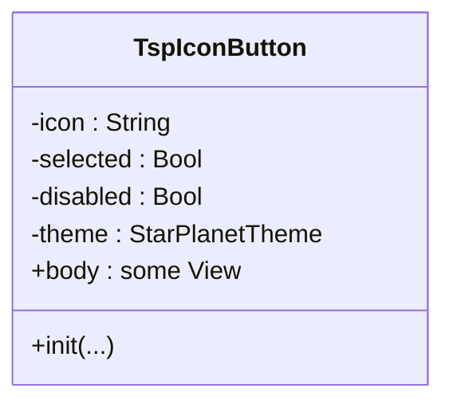

**Diagram sources**
- [BasicControls.swift:444-466](file://ios-swiftui/library/Sources/TechSkillPlanetBasicControls/BasicControls.swift#L444-L466)

**Section sources**
- [BasicControls.swift:444-466](file://ios-swiftui/library/Sources/TechSkillPlanetBasicControls/BasicControls.swift#L444-L466)

### TspKeyValueLabel
- Purpose: Simple key-value pair display.
- Implementation highlights:
  - Leading and trailing text with theme-aware colors.

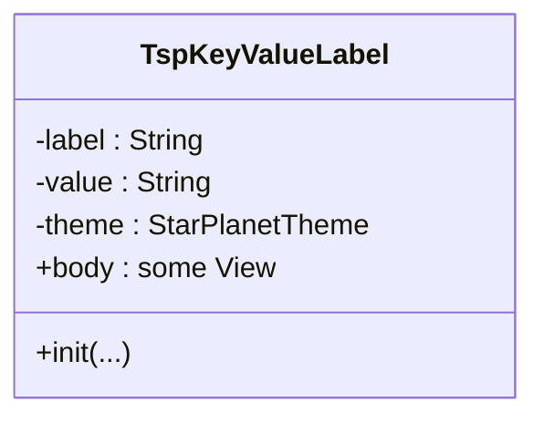

**Diagram sources**
- [BasicControls.swift:468-480](file://ios-swiftui/library/Sources/TechSkillPlanetBasicControls/BasicControls.swift#L468-L480)

**Section sources**
- [BasicControls.swift:468-480](file://ios-swiftui/library/Sources/TechSkillPlanetBasicControls/BasicControls.swift#L468-L480)

### TspNotification
- Purpose: Notification card with alert variant.
- Implementation highlights:
  - Distinct fill and stroke for alert vs. default.

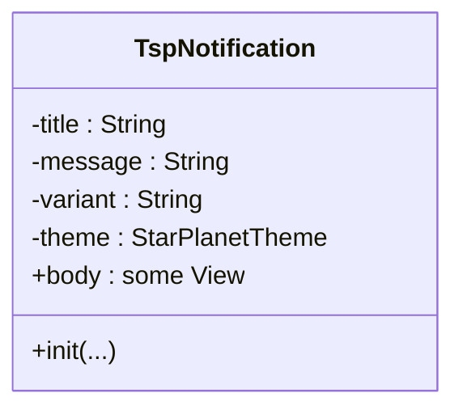

**Diagram sources**
- [BasicControls.swift:482-504](file://ios-swiftui/library/Sources/TechSkillPlanetBasicControls/BasicControls.swift#L482-L504)

**Section sources**
- [BasicControls.swift:482-504](file://ios-swiftui/library/Sources/TechSkillPlanetBasicControls/BasicControls.swift#L482-L504)

### TspTextLink
- Purpose: Bold text link with optional inverse mode.
- Implementation highlights:
  - Theme-aware foreground color.

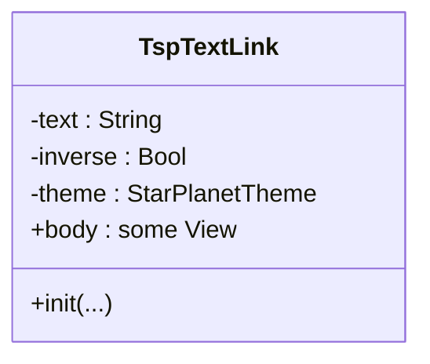

**Diagram sources**
- [BasicControls.swift:506-518](file://ios-swiftui/library/Sources/TechSkillPlanetBasicControls/BasicControls.swift#L506-L518)

**Section sources**
- [BasicControls.swift:506-518](file://ios-swiftui/library/Sources/TechSkillPlanetBasicControls/BasicControls.swift#L506-L518)

### TspStickyFooter
- Purpose: Fixed footer area for primary actions.
- Implementation highlights:
  - Content builder for flexible inner content.

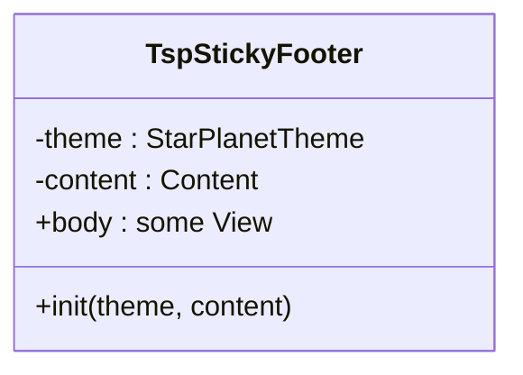

**Diagram sources**
- [BasicControls.swift:520-530](file://ios-swiftui/library/Sources/TechSkillPlanetBasicControls/BasicControls.swift#L520-L530)

**Section sources**
- [BasicControls.swift:520-530](file://ios-swiftui/library/Sources/TechSkillPlanetBasicControls/BasicControls.swift#L520-L530)

### TspPinInput
- Purpose: PIN or password input with secure masking.
- Implementation highlights:
  - Fixed-width cells with borders and optional secure rendering.

```mermaid
classDiagram
class TspPinInput {
-value : String
-cellCount : Int
-secure : Bool
-theme : StarPlanetTheme
+init(...)
+body : some View
}
```

**Diagram sources**
- [BasicControls.swift:532-555](file://ios-swiftui/library/Sources/TechSkillPlanetBasicControls/BasicControls.swift#L532-L555)

**Section sources**
- [BasicControls.swift:532-555](file://ios-swiftui/library/Sources/TechSkillPlanetBasicControls/BasicControls.swift#L532-L555)

### TspListItem
- Purpose: Tapable row with title, optional message, trailing content, selected, and disabled states.
- Implementation highlights:
  - Selection highlight and optional disabled opacity.

```mermaid
classDiagram
class TspListItem {
-title : String
-message : String
-trailing : String
-selected : Bool
-disabled : Bool
-theme : StarPlanetTheme
-action : () -> Void
+init(...)
+body : some View
}
```

**Diagram sources**
- [BasicControls.swift:557-593](file://ios-swiftui/library/Sources/TechSkillPlanetBasicControls/BasicControls.swift#L557-L593)

**Section sources**
- [BasicControls.swift:557-593](file://ios-swiftui/library/Sources/TechSkillPlanetBasicControls/BasicControls.swift#L557-L593)

### TspEmpty
- Purpose: Empty state with illustration, headline, message, and optional action.
- Implementation highlights:
  - Composed with a button for actions.

```mermaid
classDiagram
class TspEmpty {
-title : String
-message : String
-actionText : String
-theme : StarPlanetTheme
+init(...)
+body : some View
}
```

**Diagram sources**
- [BasicControls.swift:595-619](file://ios-swiftui/library/Sources/TechSkillPlanetBasicControls/BasicControls.swift#L595-L619)

**Section sources**
- [BasicControls.swift:595-619](file://ios-swiftui/library/Sources/TechSkillPlanetBasicControls/BasicControls.swift#L595-L619)

### TspToast
- Purpose: Lightweight feedback message with variants.
- Implementation highlights:
  - Capsule shape with variant-specific fill.

```mermaid
classDiagram
class TspToast {
-message : String
-variant : String
-theme : StarPlanetTheme
+init(...)
+body : some View
-fill : Color
}
```

**Diagram sources**
- [BasicControls.swift:621-641](file://ios-swiftui/library/Sources/TechSkillPlanetBasicControls/BasicControls.swift#L621-L641)

**Section sources**
- [BasicControls.swift:621-641](file://ios-swiftui/library/Sources/TechSkillPlanetBasicControls/BasicControls.swift#L621-L641)

## Dependency Analysis
The samples package depends on the library package and imports the component library product. The library package defines a single target that exposes the component views and theme.

```mermaid
graph LR
LibPkg["Library Package<br/>TechSkillPlanetBasicControls"]
SampPkg["Samples Package<br/>BasicControlsSamples"]
SampPkg --> |product dependency| LibPkg
```

**Diagram sources**
- [Package.swift:1-14](file://ios-swiftui/library/Package.swift#L1-L14)
- [Package.swift:1-23](file://ios-swiftui/samples/Package.swift#L1-L23)

**Section sources**
- [Package.swift:1-14](file://ios-swiftui/library/Package.swift#L1-L14)
- [Package.swift:1-23](file://ios-swiftui/samples/Package.swift#L1-L23)

## Performance Considerations
- Prefer immutable state and pass only necessary data into components to minimize recomputation.
- Use lazy layouts (e.g., LazyVGrid) for lists of components to reduce initial load cost.
- Avoid unnecessary view wrapping; keep modifier chains concise and ordered for readability and performance.
- Reuse theme instances to avoid repeated allocations.
- For scrolling content, limit heavy subviews inside containers and leverage clipping and overlays judiciously.

## Troubleshooting Guide
Common integration issues and resolutions:
- Build fails due to minimum deployment targets:
  - Ensure your project’s iOS deployment target meets or exceeds the package’s requirement. The library requires iOS 15+ and macOS 13+.
- Theme not applied:
  - Verify that components receive a StarPlanetTheme instance and that the theme is passed consistently through the view hierarchy.
- Safe area discrepancies on older iOS versions:
  - The TopBar computes safe area insets conditionally; ensure your hosting controller supports modern safe-area APIs.
- Dynamic theme switching not reflected:
  - Wrap views with a state variable that changes the theme passed to components and trigger a re-render by updating the binding.

**Section sources**
- [Package.swift:6-6](file://ios-swiftui/library/Package.swift#L6-L6)
- [BasicControls.swift:356-364](file://ios-swiftui/library/Sources/TechSkillPlanetBasicControls/BasicControls.swift#L356-L364)

## Conclusion
The iOS SwiftUI implementation provides a cohesive set of themed components suitable for building native iOS experiences. By leveraging a central theme model and SwiftUI’s declarative paradigms, developers can compose complex screens quickly while maintaining consistent design and behavior across platforms.

## Appendices

### Setup Instructions: Xcode Integration and SPM
- Add the package:
  - In Xcode, go to File > Add Package Dependencies.
  - Enter the repository URL and select the library product “TechSkillPlanetBasicControls.”
- Configure deployment targets:
  - Set your project’s iOS Deployment Target to 15.0 or later and macOS Deployment Target to 13.0 or later.
- Import and use:
  - Import the module in your SwiftUI views and instantiate components with a StarPlanetTheme.
- Run the sample:
  - Open the samples package in Xcode and run the target to see live previews and theme switching.

**Section sources**
- [Package.swift:6-6](file://ios-swiftui/library/Package.swift#L6-L6)
- [Package.swift:10-12](file://ios-swiftui/samples/Package.swift#L10-L12)

### Theming System: EnvironmentValues and Custom Modifiers
- Theme model:
  - StarPlanetTheme exposes named colors for surfaces, borders, brand accents, statuses, and fills.
- Dynamic theme switching:
  - The sample demonstrates changing themes by updating a state variable and passing the new theme to components.
- Environment injection patterns:
  - While the current implementation passes theme explicitly, you can adopt SwiftUI’s EnvironmentValues pattern by defining a custom key and injecting the theme at the root view, then reading it in descendant components.

```mermaid
flowchart TD
Start(["Theme Switch Trigger"]) --> UpdateState["Update state variable holding selected theme"]
UpdateState --> Rebuild["Rebuild views with new theme instance"]
Rebuild --> ApplyColors["Components apply theme colors in body"]
ApplyColors --> End(["UI Updates Dynamically"])
```

**Diagram sources**
- [BasicControlsSampleView.swift:38-90](file://ios-swiftui/samples/Sources/BasicControlsSamples/BasicControlsSampleView.swift#L38-L90)
- [StarPlanetTheme.swift:3-42](file://ios-swiftui/library/Sources/TechSkillPlanetBasicControls/StarPlanetTheme.swift#L3-L42)

### View Composition Patterns and Modifier Chains
- Composition:
  - Use TspCard to group related controls and TspListItem for navigable rows.
- Modifier chains:
  - Prefer placing opacity and buttonStyle near the root of a component’s body to avoid unintended interactions.
  - Use clipShape and overlay for consistent borders and rounded corners.
- Environment and layout:
  - Combine frame, padding, and alignment modifiers thoughtfully to maintain responsive layouts.

**Section sources**
- [BasicControls.swift:22-34](file://ios-swiftui/library/Sources/TechSkillPlanetBasicControls/BasicControls.swift#L22-L34)
- [BasicControls.swift:62-69](file://ios-swiftui/library/Sources/TechSkillPlanetBasicControls/BasicControls.swift#L62-L69)

### Animation Support and Best Practices
- Animations:
  - Use SwiftUI’s implicit animations for state changes (e.g., toggling selected states) and explicit animations for transitions between themes.
- Best practices:
  - Keep animations subtle and purposeful; avoid animating layout-heavy views frequently.
  - Test animations on devices with lower performance to ensure smoothness.

[No sources needed since this section provides general guidance]