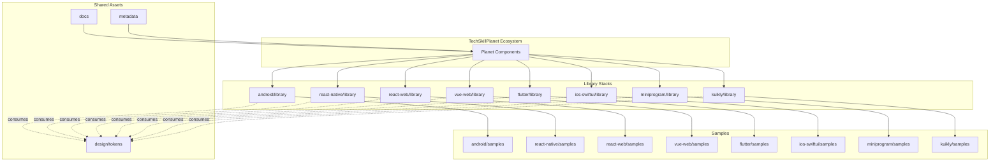
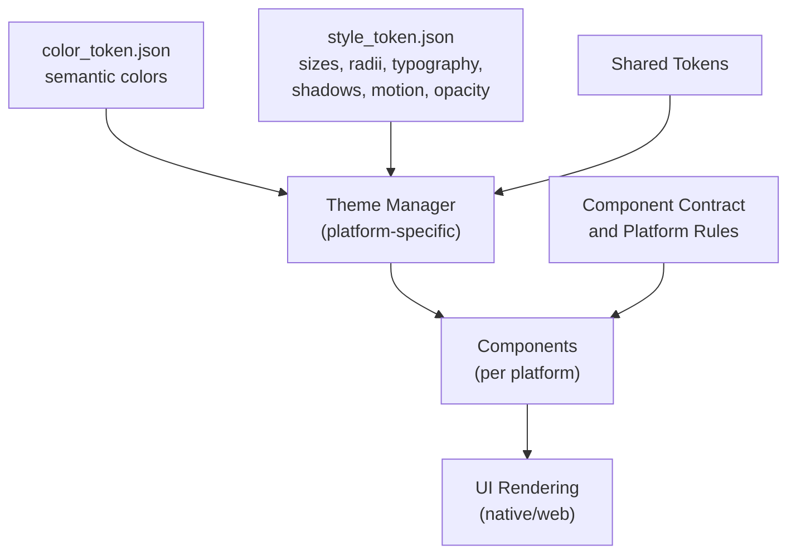
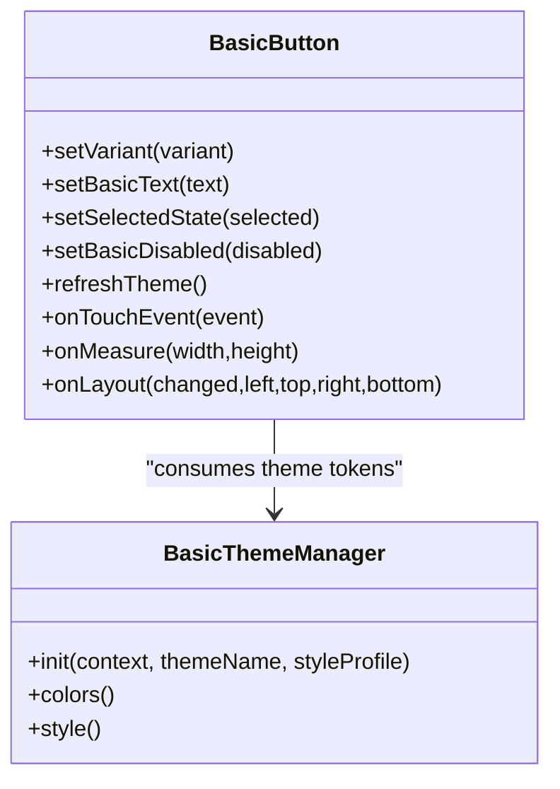
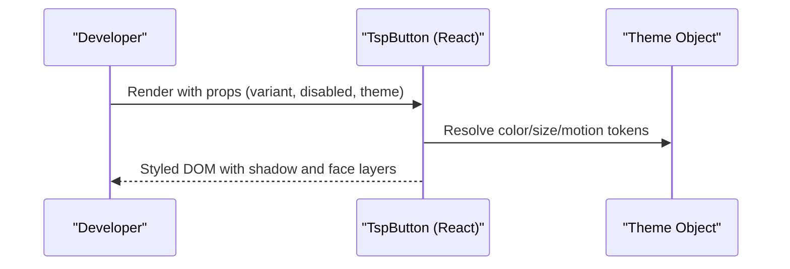
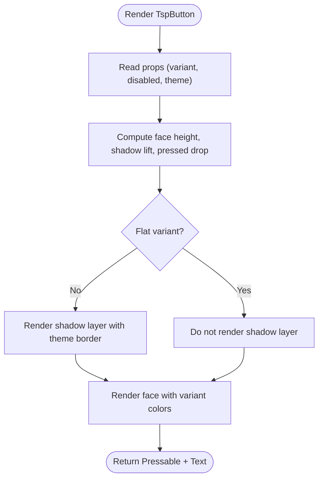
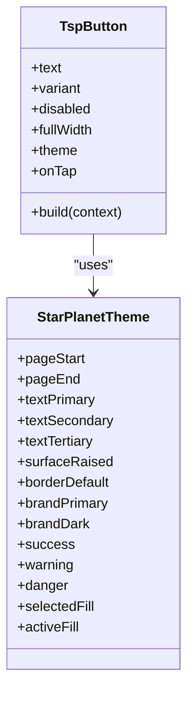
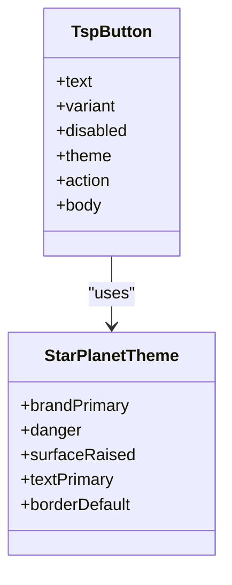
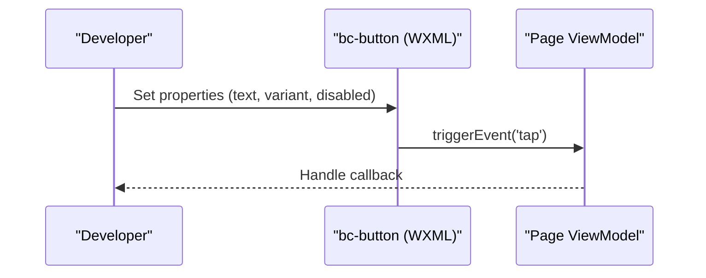
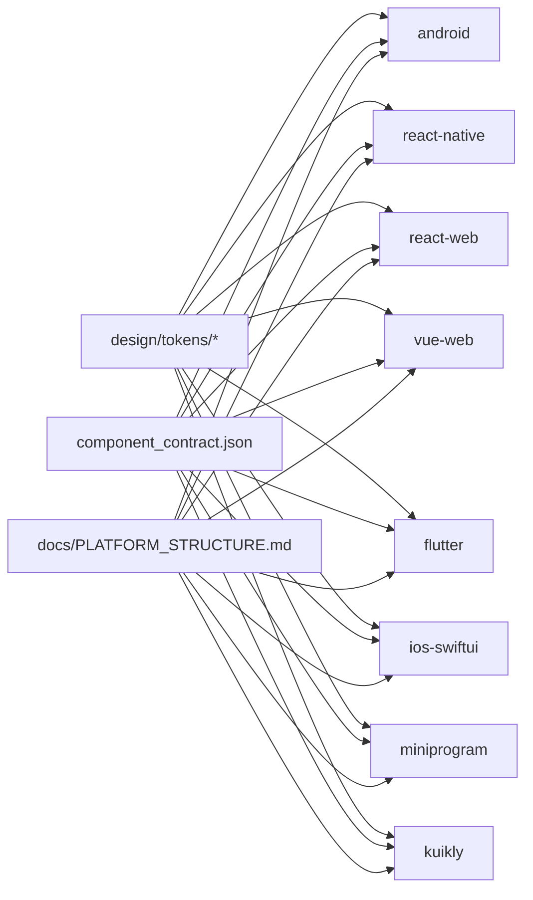

# Project Overview

<cite>
**Referenced Files in This Document**
- [README.md](file://README.md)
- [AGENTS.md](file://AGENTS.md)
- [CONTRIBUTING.md](file://CONTRIBUTING.md)
- [PUBLISHING.md](file://PUBLISHING.md)
- [docs/PLATFORM_STRUCTURE.md](file://docs/PLATFORM_STRUCTURE.md)
- [docs/COMPONENT_CONTRACT.md](file://docs/COMPONENT_CONTRACT.md)
- [component_contract.json](file://component_contract.json)
- [design/tokens/color_token.json](file://design/tokens/color_token.json)
- [design/tokens/style_token.json](file://design/tokens/style_token.json)
- [android/library/src/main/java/com/techskillplanet/basiccontrols/widget/BasicButton.java](file://android/library/src/main/java/com/techskillplanet/basiccontrols/widget/BasicButton.java)
- [android/library/src/main/java/com/techskillplanet/basiccontrols/theme/BasicThemeManager.java](file://android/library/src/main/java/com/techskillplanet/basiccontrols/theme/BasicThemeManager.java)
- [react-web/library/src/components/TspButton.js](file://react-web/library/src/components/TspButton.js)
- [react-native/library/src/starPlanet/components/TspButton.js](file://react-native/library/src/starPlanet/components/TspButton.js)
- [flutter/library/lib/tech_skill_planet_components.dart](file://flutter/library/lib/tech_skill_planet_components.dart)
- [ios-swiftui/library/Sources/TechSkillPlanetBasicControls/BasicControls.swift](file://ios-swiftui/library/Sources/TechSkillPlanetBasicControls/BasicControls.swift)
- [miniprogram/library/components/bc-button/bc-button.js](file://miniprogram/library/components/bc-button/bc-button.js)
</cite>

## Table of Contents
1. [Introduction](#introduction)
2. [Project Structure](#project-structure)
3. [Core Components](#core-components)
4. [Architecture Overview](#architecture-overview)
5. [Detailed Component Analysis](#detailed-component-analysis)
6. [Dependency Analysis](#dependency-analysis)
7. [Performance Considerations](#performance-considerations)
8. [Troubleshooting Guide](#troubleshooting-guide)
9. [Conclusion](#conclusion)
10. [Appendices](#appendices)

## Introduction
Planet Components is a cross-platform design system that delivers a unified UI component library across eight+ platforms. Its purpose is to maintain identical functionality, behavior, and visual semantics while honoring platform-specific conventions. The project is part of the TechSkillPlanet ecosystem and centers on a shared design token system (design tokens, component contracts, and theme management) to ensure consistent experiences across Android View, React Native, React Web, Vue Web, Flutter, iOS SwiftUI, WeChat Mini Program, and Kuikly.

Key goals:
- Cross-platform parity: Same component APIs, variants, and states across stacks.
- Platform conventions: Respect native UI idioms and accessibility guidelines per platform.
- Maintainability: Single source of truth via design tokens and a strict component contract.
- Publishability: Each stack ships as an independent, publishable package.

## Project Structure
The repository is organized by platform stacks, each containing a library (publishable package) and a samples project (runnable demos depending on the local library). Shared design tokens reside under design/tokens, and documentation enforces one-component-per-file and one-page-per-file rules.

**Diagram sources**
- [README.md:10-21](file://README.md#L10-L21)
- [docs/PLATFORM_STRUCTURE.md:35-41](file://docs/PLATFORM_STRUCTURE.md#L35-L41)

**Section sources**
- [README.md:10-21](file://README.md#L10-L21)
- [docs/PLATFORM_STRUCTURE.md:1-51](file://docs/PLATFORM_STRUCTURE.md#L1-L51)

## Core Components
Planet Components defines a canonical set of UI primitives with consistent props and variants across platforms. The component contract specifies:
- Theme name: star_planet
- Core semantic tokens: pageStart, pageEnd, textPrimary, textSecondary, textTertiary, surfaceRaised, borderDefault, brandPrimary, brandDark, success, warning, danger, selectedFill, activeFill
- Component catalog: Button, Card, Alert, Badge, Chip, Input, Select, OptionSheet, Switch, Progress, TopBar, BottomTab, Tabs, Amount, IconButton, KeyValueLabel, Notification, TextLink, Stepper, StickyFooter, PinInput, ListItem, Empty, Toast, Modal, RefreshLayout, LoadingDialog
- Each component exposes a small, consistent API surface: variant, disabled, selected/checked, text/title/message, plus refreshTheme or platform equivalent for runtime theming

Practical example: Button supports primary, default, danger, text, and link variants with consistent props across stacks. See:
- Android View: BasicButton
- React Web: TspButton
- React Native: TspButton
- Flutter: TspButton
- iOS SwiftUI: TspButton
- Mini Program: bc-button

**Section sources**
- [docs/COMPONENT_CONTRACT.md:1-68](file://docs/COMPONENT_CONTRACT.md#L1-L68)
- [component_contract.json:1-159](file://component_contract.json#L1-L159)

## Architecture Overview
Planet Components follows a layered architecture:
- Design tokens layer: color_token.json and style_token.json define semantic color roles and style scales.
- Theme management layer: Each platform resolves tokens into typed theme/runtime objects and applies them during component rendering.
- Component layer: Platform-specific implementations adhere to the component contract and use theme objects for colors, sizes, radii, shadows, and motion.
- Samples layer: Each stack’s samples depend on the local library and demonstrate realistic usage scenarios.

**Diagram sources**
- [design/tokens/color_token.json:1-406](file://design/tokens/color_token.json#L1-L406)
- [design/tokens/style_token.json:1-392](file://design/tokens/style_token.json#L1-L392)
- [docs/COMPONENT_CONTRACT.md:1-68](file://docs/COMPONENT_CONTRACT.md#L1-L68)

## Detailed Component Analysis

### Android View Button
Android View’s BasicButton demonstrates island-style raised buttons with a two-layer composition (shadow layer + label view). It reads attributes from a shared BasicView style family, resolves colors and styles via BasicThemeManager, and applies platform touch handling and motion effects.

**Diagram sources**
- [android/library/src/main/java/com/techskillplanet/basiccontrols/widget/BasicButton.java:30-255](file://android/library/src/main/java/com/techskillplanet/basiccontrols/widget/BasicButton.java#L30-L255)
- [android/library/src/main/java/com/techskillplanet/basiccontrols/theme/BasicThemeManager.java:20-294](file://android/library/src/main/java/com/techskillplanet/basiccontrols/theme/BasicThemeManager.java#L20-L294)

**Section sources**
- [android/library/src/main/java/com/techskillplanet/basiccontrols/widget/BasicButton.java:20-255](file://android/library/src/main/java/com/techskillplanet/basiccontrols/widget/BasicButton.java#L20-L255)
- [android/library/src/main/java/com/techskillplanet/basiccontrols/theme/BasicThemeManager.java:13-124](file://android/library/src/main/java/com/techskillplanet/basiccontrols/theme/BasicThemeManager.java#L13-L124)

### React Web Button
React Web’s TspButton renders a button with island-raised shadow support, variant-driven styling, and theme CSS variable injection. It composes a shadow pseudo-element and a face layer, applying classes and inline styles derived from the theme.

**Diagram sources**
- [react-web/library/src/components/TspButton.js:19-48](file://react-web/library/src/components/TspButton.js#L19-L48)

**Section sources**
- [react-web/library/src/components/TspButton.js:1-48](file://react-web/library/src/components/TspButton.js#L1-L48)

### React Native Button
React Native’s TspButton uses Pressable for gestures, computes shadow lift and pressed drop from theme tokens, and conditionally renders a shadow layer for raised island buttons.

**Diagram sources**
- [react-native/library/src/starPlanet/components/TspButton.js:5-44](file://react-native/library/src/starPlanet/components/TspButton.js#L5-L44)

**Section sources**
- [react-native/library/src/starPlanet/components/TspButton.js:1-44](file://react-native/library/src/starPlanet/components/TspButton.js#L1-L44)

### Flutter Button
Flutter’s TspButton builds a raised island effect using a Stack with a border-default background offset downward and a face-colored container with a capsule clip. It selects face and text colors based on variant and theme.

**Diagram sources**
- [flutter/library/lib/tech_skill_planet_components.dart:3-59](file://flutter/library/lib/tech_skill_planet_components.dart#L3-L59)
- [flutter/library/lib/tech_skill_planet_components.dart:74-123](file://flutter/library/lib/tech_skill_planet_components.dart#L74-L123)

**Section sources**
- [flutter/library/lib/tech_skill_planet_components.dart:1-678](file://flutter/library/lib/tech_skill_planet_components.dart#L1-L678)

### iOS SwiftUI Button
iOS SwiftUI’s TspButton uses a capsule-styled background with a raised shadow layer offset by 5pt and a face overlay. It switches face and text colors by variant and respects disabled state.

**Diagram sources**
- [ios-swiftui/library/Sources/TechSkillPlanetBasicControls/BasicControls.swift:6-51](file://ios-swiftui/library/Sources/TechSkillPlanetBasicControls/BasicControls.swift#L6-L51)

**Section sources**
- [ios-swiftui/library/Sources/TechSkillPlanetBasicControls/BasicControls.swift:1-642](file://ios-swiftui/library/Sources/TechSkillPlanetBasicControls/BasicControls.swift#L1-L642)

### Mini Program Button
WeChat Mini Program’s bc-button component exposes text, variant, disabled, and theme properties, with touch handlers and event emission for tap.

**Diagram sources**
- [miniprogram/library/components/bc-button/bc-button.js:1-22](file://miniprogram/library/components/bc-button/bc-button.js#L1-L22)

**Section sources**
- [miniprogram/library/components/bc-button/bc-button.js:1-22](file://miniprogram/library/components/bc-button/bc-button.js#L1-L22)

## Dependency Analysis
Planet Components enforces:
- Shared tokens: All stacks consume design/tokens/* for color and style semantics.
- Component contract: Consistent props and variants across stacks.
- Platform mapping: One component per file, one page per file, centralized routing.
- Publishing targets: Each library is independently publishable per platform.

**Diagram sources**
- [design/tokens/color_token.json:1-406](file://design/tokens/color_token.json#L1-L406)
- [design/tokens/style_token.json:1-392](file://design/tokens/style_token.json#L1-L392)
- [component_contract.json:1-159](file://component_contract.json#L1-L159)
- [docs/PLATFORM_STRUCTURE.md:24-33](file://docs/PLATFORM_STRUCTURE.md#L24-L33)

**Section sources**
- [AGENTS.md:23-34](file://AGENTS.md#L23-L34)
- [docs/PLATFORM_STRUCTURE.md:24-33](file://docs/PLATFORM_STRUCTURE.md#L24-L33)
- [component_contract.json:1-159](file://component_contract.json#L1-L159)

## Performance Considerations
- Token resolution: Platforms resolve tokens once and cache theme objects to avoid repeated parsing and recomputation.
- Minimal recomposition: Components compute derived metrics (height, shadow lift, pressed drop) from theme tokens at render time.
- Motion and shadows: Use platform-native animations and shadow layers judiciously to balance fidelity and performance.
- Bundle hygiene: Keep barrel/index files minimal and avoid bundling build caches or IDE artifacts.

## Troubleshooting Guide
Common issues and resolutions:
- Theme not initialized: Ensure platform theme manager is initialized with a valid theme name and style profile before rendering components.
- Mismatched variants: Verify component props match the component contract; incorrect variant names can lead to unexpected visuals.
- Disabled state not applied: Confirm disabled prop is passed consistently and theme tokens reflect disabled opacity and colors.
- Shadow visibility: For raised island buttons, ensure the style profile enables button raised shadows and that theme tokens supply the correct shadow color.

**Section sources**
- [android/library/src/main/java/com/techskillplanet/basiccontrols/theme/BasicThemeManager.java:40-82](file://android/library/src/main/java/com/techskillplanet/basiccontrols/theme/BasicThemeManager.java#L40-L82)
- [docs/COMPONENT_CONTRACT.md:26-67](file://docs/COMPONENT_CONTRACT.md#L26-L67)

## Conclusion
Planet Components establishes a scalable, cross-platform design system grounded in shared design tokens and a strict component contract. By centralizing theme management and enforcing consistent APIs, it achieves functional parity across diverse platforms while respecting native conventions. The documented architecture, combined with platform-specific implementations and reusable agent context, provides a robust foundation for contributors and consumers alike.

## Appendices

### Licensing
Planet Components is licensed under the MIT License. Contributions are subject to the repository’s license.

**Section sources**
- [README.md:25-27](file://README.md#L25-L27)

### Reusable Agent Context
The repository includes curated agent skills and engineering rules to streamline development and maintenance:
- High-level repository context and engineering rules
- Cross-platform component library workflow
- Android View Java/XML workflow
- Platform structure rules
- Human-readable and machine-readable component contracts

**Section sources**
- [README.md:29-38](file://README.md#L29-L38)
- [AGENTS.md:1-67](file://AGENTS.md#L1-L67)

### Publishing Targets
Each library is intended for independent publication with the following identities:
- Android View: Maven Central / GitHub Packages
- React Native: npm
- React Web: npm
- Vue Web: npm
- Flutter: pub.dev
- iOS SwiftUI: Swift Package Manager
- WeChat Mini Program: npm / miniprogram package
- Kuikly: Maven / internal Kuikly package

**Section sources**
- [PUBLISHING.md:1-23](file://PUBLISHING.md#L1-L23)