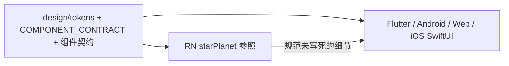

# To-Be — Cross-platform UI parity（含 iOS SwiftUI）

Status: confirmed  
Prerequisites: `03-as-is.md`（confirmed）  
Confirmed at: 2026-08-17（用户确认）  
Maps to: AC-01～AC-07；D-01～D-04；新增 D-05～D-09  

## 1. 目标状态总览

六端（RN / Flutter / Android / React Web / Vue Web / **iOS SwiftUI**）对 `COMPONENT_CONTRACT` 组件集：

- **有则对齐**：与规范 + RN 参照一致  
- **无则补齐**：含 LoadingDialog、RefreshLayout（跟 RN 必选，不分期砍掉）  
- iOS 仅 SwiftUI 对外 API；禁止用系统 `Toggle` / `.alert` 顶替契约组件  

## 2. 关键决策

| ID | 决策 | 对应 |
| --- | --- | --- |
| D-05 | LoadingDialog、RefreshLayout 为契约必选；Flutter / Web / iOS 补齐，行为跟 RN | AC-01 |
| D-06 | iOS sample 禁止系统 Toggle / 系统 alert 演示 Switch/Modal；必须用 `Tsp*` | AC-03/05 |
| D-07 | iOS 拆成一组件一文件；Barrel/模块仅导出公开 API | AC-06 |
| D-08 | Switch 契约增补 iOS 行：`TspSwitch` + SwiftUI 文件路径 | AC-03 |
| D-09 | 已有 iOS 组件按 RN 参照做视觉/交互对齐（不默认「有类型即合格」） | AC-04/05 |

## 3. 目标体验与行为

### 3.1 通用

- 主题：`StarPlanetTheme` / 各端 theme 对象，语义色与 token 一致  
- 状态：default / disabled / selected|checked / loading / error|warning|success（按组件适用）  
- 命名：对外 `Tsp*`（Android 可 `Basic*` 语义等价）

### 3.2 iOS 必补组件（行为摘要，细节跟 RN）

| 组件 | 目标行为 |
| --- | --- |
| TspSwitch | 扁平轨道+滑块；md/sm；loading spinner；无轨内字；无系统 Toggle |
| TspModal | 遮罩 + 面板 + 取消/确认；token 色与圆角；非系统 `.alert` |
| TspOptionSheet | 底部选项表；与 Select 联动打开；取消/点选回调 |
| TspLoadingDialog | 可控 visible；文案；不可误用系统 Progress 弹窗冒充完整契约 |
| TspRefreshLayout | 下拉刷新 / 加载更多语义与 RN 对齐（SwiftUI 可用合适手势/容器表达，对外 props 等价） |
| TspToast | 在现有 View 之上补齐展示宿主与 ~1600ms 自动消失等 RN 行为 |

### 3.3 其它端补齐

- Flutter、React Web、Vue Web：新增 LoadingDialog、RefreshLayout（API 语义跟 RN / 契约）  
- 若实现中发现 RN 与已确认契约冲突：改 RN，不改契约迁就 RN

## 4. 概念架构与所有权

| 层 | 所有者 | 职责 |
| --- | --- | --- |
| Token / 契约文档 | 仓库共享 | 唯一规范 |
| RN starPlanet | RN 栈 | 参照实现；被裁决要求时回改 |
| iOS SwiftUI library | `ios-swiftui/library` | 补齐 + 对齐 + 拆文件 |
| iOS samples | `ios-swiftui/samples` | 契约状态演示，禁用系统顶替 |
| 其它栈 library/samples | 各目录 | 共同缺失补齐 + 已证实偏离回改 |

## 5. 错误与边界

- 平台能力差（字体渲染、安全区）允许；**控件形态差**不允许  
- RefreshLayout 在 SwiftUI 的滚动容器差异：对外仍暴露刷新/加载更多语义，内部实现可选，但 sample 必须可演示  
- 不引入第二套 UIKit 组件 API

## 6. 迁移与发布意图

- iOS：先对齐与补齐，再按 `PUBLISHING.md` 走 SPM/开源发布（本 Spec 不规定发版日）  
- 已发版端（npm / Maven / pub）：破坏性 API 需升版；优先加组件与行为修复，避免无说明删 API  
- Switch 契约文档同步加 iOS 行，状态保持 confirmed

## 7. 实施波次（目标设计顺序，非代码清单）

| 波次 | 内容 | 主要 AC |
| --- | --- | --- |
| **W1** | iOS：拆文件骨架 + `TspSwitch`（契约）+ 改 sample 去掉系统 Toggle | AC-01/03/06 |
| **W2** | iOS：`TspModal`、`TspOptionSheet`（含 Select 联动）+ sample 去掉系统 alert | AC-01/05 |
| **W3** | iOS：`TspToast` 宿主行为、`TspLoadingDialog`、`TspRefreshLayout` | AC-01/05 |
| **W4** | Flutter + React Web + Vue Web：LoadingDialog、RefreshLayout | AC-01 |
| **W5** | iOS 既有组件 vs RN 关键态对照清单并回改；必要时回改其它偏离端 | AC-02/04/05 |
| **W6** | 全端回归：结构检查、各栈测试/build、更新 parity plan | AC-07 |

## 8. 验证意图

- 矩阵：契约组件 × 六端 = 全 ✅  
- Switch：六端满足 `05-switch-contract.md`  
- iOS sample：Switch/Modal 路径零系统顶替  
- 关键组件（Button、Switch、Toast、Modal、Chip）有对照 RN 的记录化结论  
- `swift build` + 已发版栈既有测试通过  

## 9. 相对 As-Is 的映射

| As-Is 痛点 | To-Be 处置 |
| --- | --- |
| iOS 五缺 | W1–W3 补齐 |
| sample 系统 Toggle/alert | D-06 + W1/W2 |
| 巨石文件 | D-07 + W1 |
| Flutter/Web 缺 LoadingDialog/RefreshLayout | D-05 + W4 |
| 已有组件未核验 | W5 |
| plan 文案过时（仍写 RN 系统 Switch） | W6 更新 plan |

## 请确认

请确认本 To-Be（含 D-05～D-09 与 W1–W6）。回复 **「确认」** 或指出要改的决策/波次。确认后 Spec 可收口，再进入 Engineering Plan / 实现。
